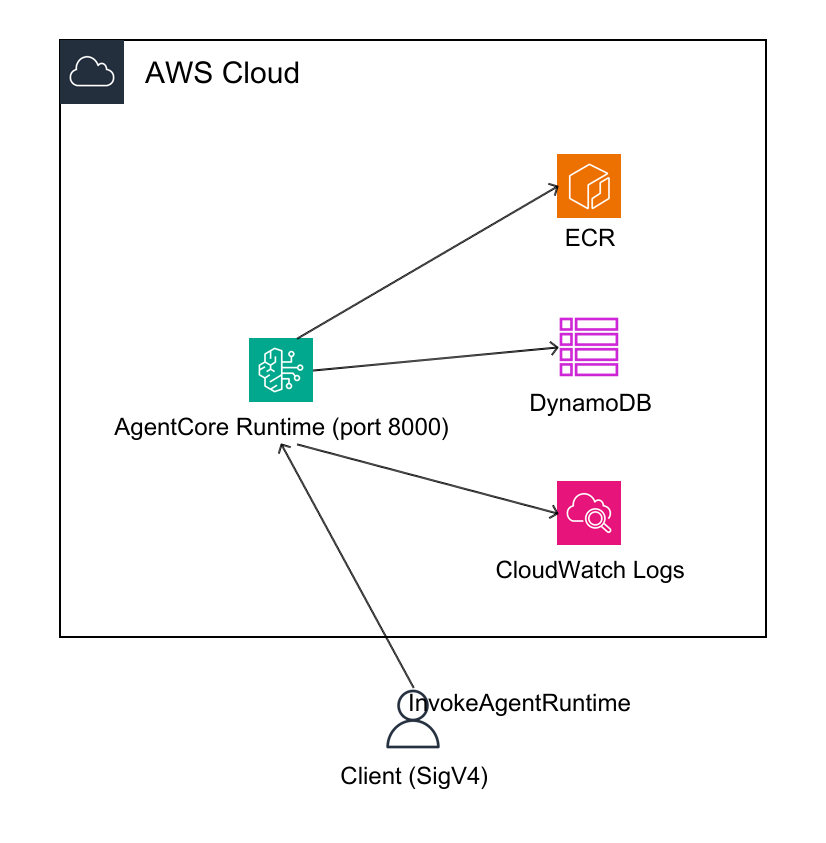
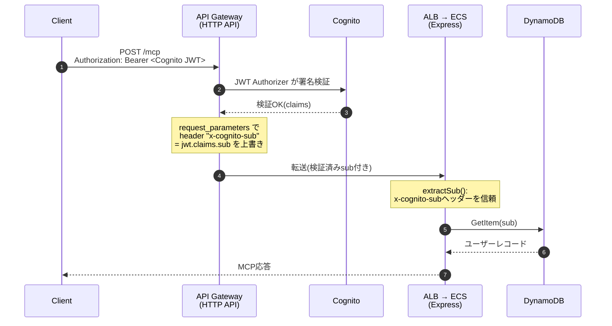
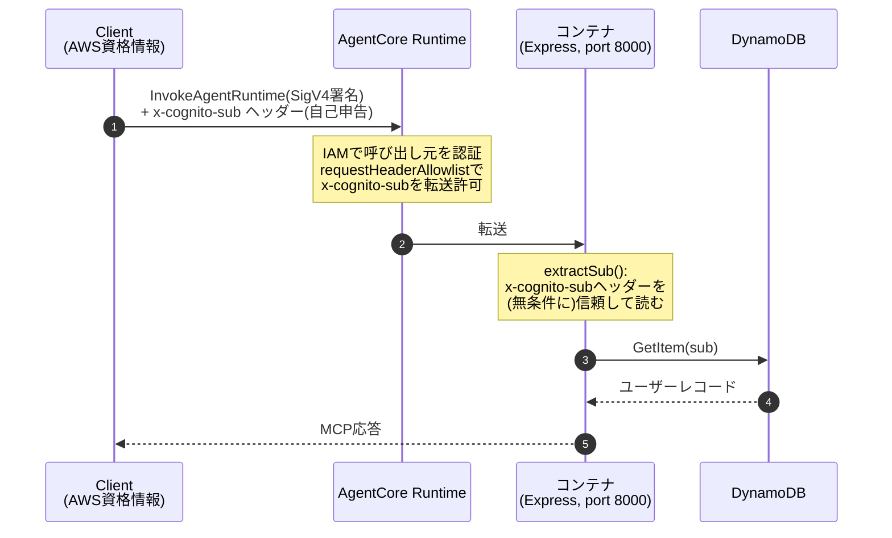

# アーキテクチャ比較: AgentCore Runtime単体 vs API Gateway + ECS

> **この章で分かること**
> quick-mcp-poc の MCP サーバーを実際にホストしてみて分かった、2つの構成の違い。「どちらが優れているか」ではなく「何を選ぶとどんなトレードオフを引き受けることになるか」を、実機検証で得たシーケンス図・構成図・数値で示す。

## 1. 前提: なぜ2パターンだけを比較するのか

「MCP基盤 アーキテクチャ概略」では実装パターンを4つ挙げていた。

| # | 構成 | 本ドキュメントでの扱い |
|---|---|---|
| 1 | AgentCore Gateway → AgentCore Runtime | 未検証(スコープ外) |
| 2 | AgentCore Gateway → ECS | 未検証(スコープ外) |
| **3** | **AgentCore Runtime単体** | **実機検証済み ✅** |
| **4** | **API Gateway → ECS(自前構成)** | **既存本番相当環境で稼働確認済み ✅** |

パターン1・2は「MCPの入口(Gateway)を誰が持つか」という別軸の論点であり、まずは対極にある3・4――「AWSにフルマネージドで任せる」か「自前でネットワークから組む」か――を比較することで、判断に必要な土台を作る。

## 2. 構成図

### 2.1 パターン3: AgentCore Runtime単体

MCPの入口とサーバー本体を AgentCore Runtime 1つが兼ねる。VPC・ALB・NATといったネットワーク部品は一切登場しない。コンテナは ECR から pull され、ログは CloudWatch Logs に、認可情報の参照は DynamoDB に対して直接行われる。

### 2.2 パターン4: API Gateway + ECS(既存構成)

MCPの入口(API Gateway)とサーバー本体(ECS Fargate)が分離しており、間に自前のVPC・ALB・NATインスタンスが挟まる。Cognitoによる認証もAPI Gateway層で完結する。

**読み解きのポイント**: パターン3の図には登場する「箱」が4つしかないのに対し、パターン4は9つ以上ある。この箱の数の差が、そのまま「構築・運用しなければならない対象の数」の差になる。

## 3. シーケンス図

同じ「MCPクライアントが`tools/list`を呼ぶ」という1リクエストを、2つの構成がどう処理するかを比較する。

### 3.1 パターン4: API Gateway + ECS(既存本番構成)

**信頼の起点**: API Gateway が JWT の署名検証を担い、検証済みの `sub` だけをアプリに渡す。**認証はアプリコードに到達する前に完結している。**

### 3.2 パターン3: AgentCore Runtime単体(今回検証した構成)

**信頼の起点**: IAM(SigV4)は「誰が呼び出したか」は保証するが、「どのエンドユーザーか」は保証しない。`x-cognito-sub` は呼び出し側が自己申告する値であり、**今回検証した構成はなりすまし対策が本番同等ではない**(詳細は[4.3 本番採用時の注意](#43-本番採用時の注意)を参照)。

## 4. プロコン比較

| 観点 | パターン3: AgentCore Runtime単体 | パターン4: API Gateway + ECS |
|---|:---:|:---:|
| 初期構築の手間 | ◎ IAMロール1つ+コンテナのみ | △ VPC/ALB/NAT等の設計が必要(ただしTerraformで自動化済み) |
| 運用の手間 | ◎ サーバーレス、AWSが管理 | △ ECSタスクの死活監視、NATインスタンスのOS保守が必要 |
| コールドスタート/レイテンシ | △ リクエスト都度のライフサイクル管理が入る(要実測) | ◎ 常時1タスク起動で安定 |
| 認証の柔軟性・成熟度 | △ Cognito Hosted UI等をそのまま使うには追加設定が必要 | ◎ 本番グレードのOAuthフローが既に稼働 |
| 既存資産の再利用性 | △ 認証まわりは作り直しが必要 | ◎ 既存Terraform資産をそのまま使える |
| コスト特性 | ◎ 実行中のみ課金(詳細は[02-cost-simulation.md](./02-cost-simulation.md)) | △ 常時起動コストが発生 |
| スケーラビリティ | ◎ AWSマネージド(挙動は要検証) | △ Auto Scaling設定が別途必要 |
| VPC内部リソースへのアクセス | △ 今回はPUBLICモード。VPCモードは別途構成が必要 | ◎ 既にVPC内、内部リソース接続が容易 |
| ベンダーロックイン | △ AgentCore Runtime固有のAPI依存 | ◎ 標準的なECS/Fargateで移行性が高い |

### 4.3 本番採用時の注意

今回はスケジュールを優先し「IAM認証 + `x-cognito-sub` の自己申告」という簡略構成で疎通確認のみを行った。**このまま本番展開することは推奨しない。** 本番相当にするには、以下のいずれかが必要になる。

1. **Custom JWT Authorizerの導入**(推奨): AgentCore RuntimeにCognitoの`discoveryUrl`/`audience`/`allowedClients`を設定し、Cognito発行のJWTをAgentCore側で検証する。パターン4と同等の信頼モデルになり、アプリコードの変更もほぼ不要。
2. **AgentCore Gateway経由(パターン1)の検討**: 認証・複数ツールの束ねをGatewayに任せる構成。「MCP基盤 アーキテクチャ概略」ではProsがほぼ相殺されるとの評価があるため、要件次第で判断。

## 5. 結論(たたき台)

- **PoC・低〜中トラフィックの初期展開フェーズ**: パターン3(AgentCore Runtime)が構築・運用・コストのいずれの面でも有利
- **既存の認証資産(Cognito Hosted UI等)をそのまま活かしたい場合、または将来的に大量トラフィックが見込まれる場合**: パターン4、または本番相当の認証を組んだパターン3を再評価

## 6. 未検証の項目(今後の課題)

- パターン3でのレイテンシ実測(コールドスタートの影響)
- パターン3でのスケーラビリティ実測(同時リクエスト負荷試験)
- パターン3でのVPCモード(社内リソースアクセスが必要になった場合)
- パターン1・2(AgentCore Gateway経由)の検証

---

*本ドキュメントの構成図は [`awsdac`](https://github.com/awslabs/diagram-as-code)(YAML仕様、`images/*.yaml`に格納)で生成した。シーケンス図は [Mermaid](https://mermaid.js.org/) 記法で記述しており、GitHub上でそのまま描画される。*
