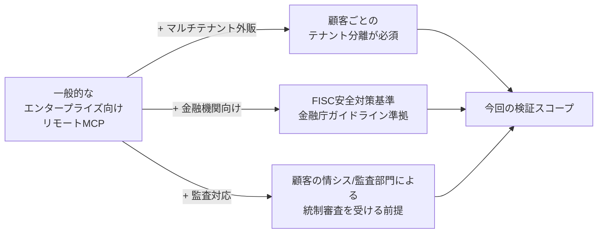
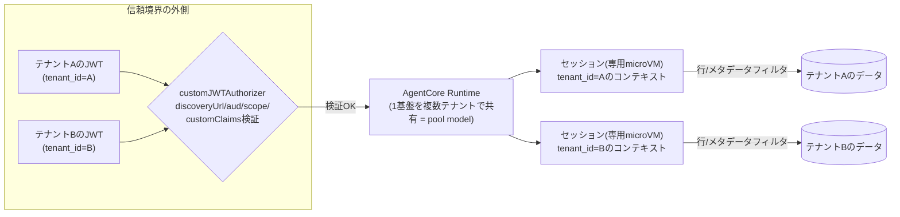
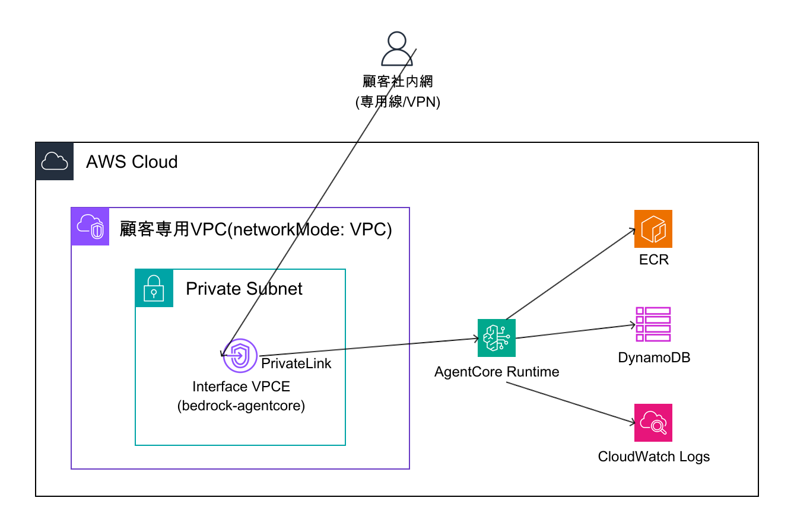
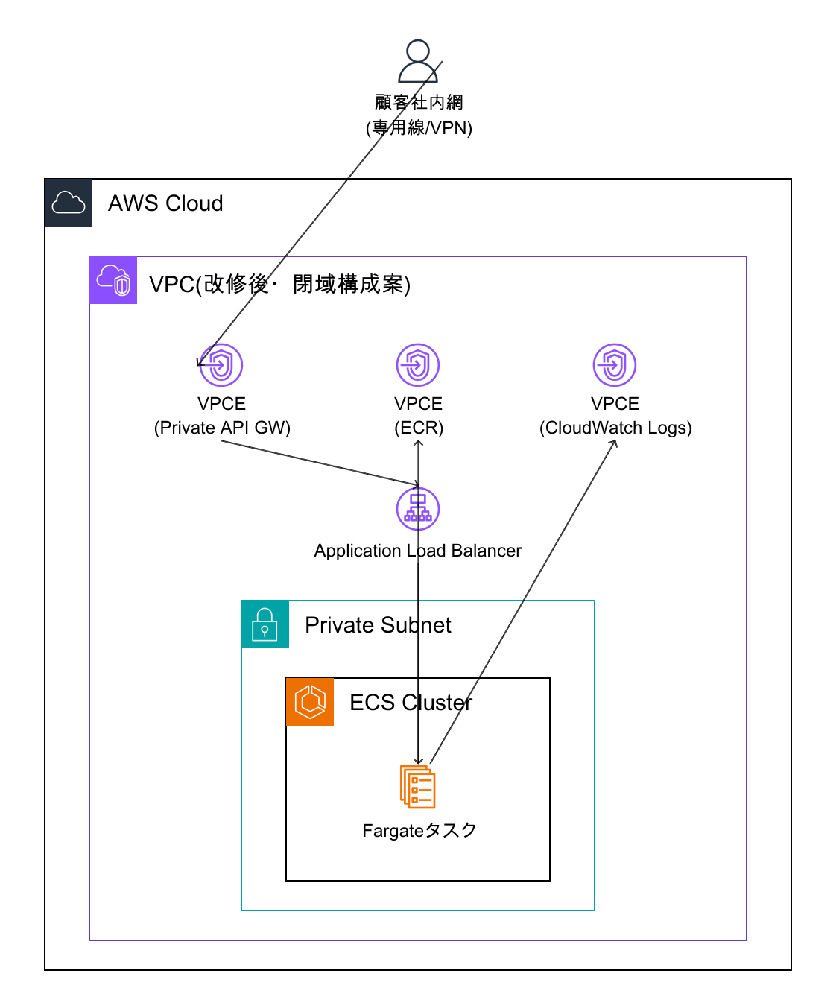
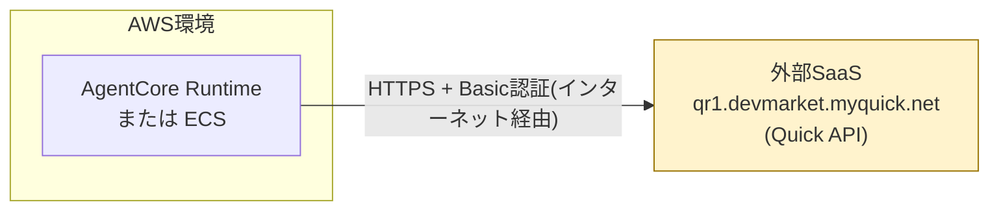
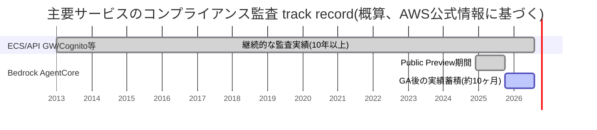
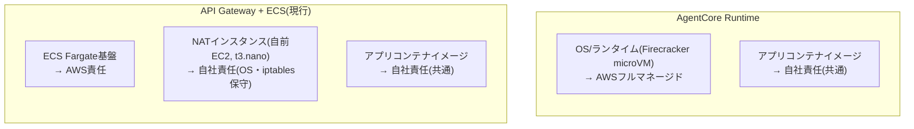
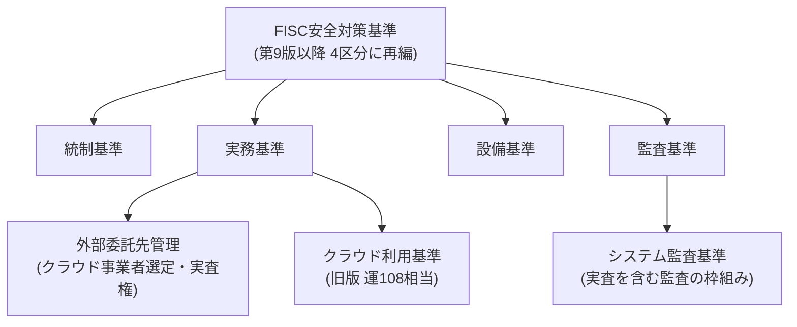

# セキュリティ・コンプライアンス比較検証: 金融グレード有償リモートMCPサービスとして

> **この章で分かること**
> quick-mcp-poc を「金融機関向けに課金制で外販するリモートMCPサービス」と position した場合に、パターン3(AgentCore Runtime単体)とパターン4(API Gateway + ECS)のどちらがセキュリティ・コンプライアンス面で有利かを、実機確認とAWS公式情報の調査に基づいて整理する。[01-internal-architecture-comparison.md](./01-internal-architecture-comparison.md)の一般的なプロコン比較を、金融機関向け要件(マルチテナント、閉域網、監査証跡、コンプライアンス認定)に絞って深掘りする位置づけ。

検証日: 2026-08-17 | 調査方法: 机上調査中心 + playgroundアカウントでの一部実機確認(スキーマ・terraformコードレビュー)

---

## TL;DR

| # | 論点 | 結論 | 現状の対応度 |
|---|---|---|---|
| 1 | マルチテナント分離 | AgentCore Runtimeが標準機能で優位 | ◎ 実現性高い(未検証) |
| 2 | ネットワーク閉域性(PrivateLink) | **デフォルトは両パターンとも未対応だが、AgentCore RuntimeはVPCモード切り替えを実機検証済み** | ◎ 実機検証済み(PrivateLink経由呼び出し自体は次の検証候補) |
| 3 | コンプライアンス認定 | 認定は取得済みだが実績年数はECSに軍配 | ○ 契約前に要再確認 |
| 4 | 外部API依存 | 両パターン共通の制約、完全閉域は不可能 | △ 設計上の制約 |
| 5 | 運用負荷・パッチ責任 | AgentCoreが明確に優位(NAT保守が不要) | ◎ |
| 6 | FISC安全対策基準対応 | 公開情報からの推定にとどまる | ○ 条文レベルは未確定 |
| 7 | WAF導入可否 | AgentCore Runtime自体には直接アタッチ不可だが、CloudFront経由の代替構成を実機検証済み | ◎ 実機検証済み |

**一言でいうと**: 機能面・運用負荷ではAgentCore Runtimeが優位。2026-08-21の実機検証で、ネットワーク閉域性(VPCモード)・WAF導入可否については代替構成の実現性を確認できたが、PrivateLink経由のインバウンド呼び出し自体・コンプライアンス実績年数については依然追加検証・追加実装が必要([10. 未検証・要フォローアップ事項](#10-未検証要フォローアップ事項)を参照)。

---

## 1. 前提: なぜこの検証が必要か

一般的なエンタープライズ向けリモートMCPサーバーであれば[01-internal-architecture-comparison.md](./01-internal-architecture-comparison.md)のプロコン比較(構築の手間・コスト・スケーラビリティ)で十分意思決定できる。しかし今回想定する顧客は金融機関であり、次の3点で難易度が上がる。

そのため、通常の「構築・運用のしやすさ」に加えて、**①マルチテナント分離・認証認可 / ②ネットワーク閉域性 / ③監査ログ・コンプライアンス認定 / ④運用負荷とパッチ責任分界点**の4項目を重点的に検証した(ユーザーとの合意事項)。

## 2. 検証方法

| 方法 | 内容 |
|---|---|
| 机上調査(中心) | AWS公式ドキュメント・AWS公式ブログ・FISC/金融庁公表資料をWeb調査 |
| 実機確認(一部) | playgroundアカウント(883660531246)で既存Runtime(`quickMcpPocVerification-Aoo0d23yyj`)の`get-agent-runtime`出力、`create-agent-runtime`のCLIヘルプ(全設定項目のスキーマ)、CloudTrailイベント履歴を確認(読み取りのみ、新規リソース作成なし) |
| コードレビュー | `terraform/*.tf`を読み、ECS側の実際のネットワーク構成を確認 |

## 3. マルチテナント分離・認証認可

### 3.1 AgentCore Runtimeの設定スキーマ(実機確認済み)

| 設定項目 | スキーマ上の機能 | テナント分離への意味 |
|---|---|---|
| `authorizerConfiguration.customJWTAuthorizer.discoveryUrl` | 任意のOIDC IdP(Cognito等)のOIDC discoveryを指定 | 既存のCognito等をそのまま使える |
| `.allowedAudience` / `.allowedClients` / `.allowedScopes` | JWTのaud/client_id/scopeを検証 | 通常のOAuth境界の検証 |
| **`.customClaims`** | JWT任意クレームをSTRING/STRING_ARRAYでマッチング | **`tenant_id`等のクレームでテナント単位のアクセス制御をRuntime到達前に強制できる** |
| `workloadIdentityDetails` | Runtime作成時に自動生成される永続ID | Inbound/Outbound認証(OBOトークン交換含む)の基盤 |
| `idleRuntimeSessionTimeout` | セッションはFirecracker **microVMで分離**、終了時にメモリ破棄 | セッション間の分離(テナント間分離を自動保証するものではない点に注意) |

> 公式サンプルコードには「署名検証はAgentCore Runtime到達時点で完了済みなのでアプリ側で再検証不要」との明記があり([Authenticate and authorize with Inbound Auth and Outbound Auth](https://docs.aws.amazon.com/bedrock-agentcore/latest/devguide/runtime-oauth.html))、**認証はコンテナに到達する前に完結する設計**(パターン4のAPI Gateway JWT Authorizerと同じ信頼モデル)。

### 3.2 テナント分離の実現イメージ(AWS公式ブログの推奨パターン)

devguide本体の「標準仕様」ではなく、AWS公式ブログ([Building multi-tenant agents with Amazon Bedrock AgentCore](https://aws.amazon.com/blogs/machine-learning/building-multi-tenant-agents-with-amazon-bedrock-agentcore/)、[Shared infrastructure, isolated tenants: Pool model multi-tenancy with Amazon Bedrock AgentCore](https://aws.amazon.com/blogs/machine-learning/shared-infrastructure-isolated-tenants-pool-model-multi-tenancy-with-amazon-bedrock-agentcore/))レベルの推奨である点に留意。

**顧客ごとに個別Runtimeを立てる方式も選択可能**(コスト・アイソレーション要件次第)。

### 3.3 API Gateway + ECS(既存構成)

現行terraform(`apigateway.tf`)では、API Gatewayの`aws_apigatewayv2_authorizer`(JWT型)がCognitoのissuer/audienceを検証し、検証済み`sub`を`x-cognito-sub`ヘッダーとしてECS側に注入する設計。**認証はAPI Gateway層(アプリコード到達前)で完結**しており、信頼モデルはAgentCoreのCustom JWT Authorizerと同等。

ただし現行構成は**単一テナント(quick社)専用のCognito User Pool + DynamoDBテーブル**であり、マルチテナントSaaS化するには作り直しが必要(パターン3のGapと同様、[01-internal-architecture-comparison.md 4.3](./01-internal-architecture-comparison.md#43-本番採用時の注意)参照)。

### 3.4 評価サマリー

| 観点 | AgentCore Runtime | API Gateway + ECS |
|---|:---:|:---:|
| 認証がアプリ到達前に完結する設計 | ◎ 対応(実装は今回未検証・スキーマ確認のみ) | ◎ 実装済み・稼働確認済み |
| テナントクレームでの論理分離 | ◎ `customClaims`で標準サポート | ○ Cognitoのカスタム属性等で自作が必要 |
| テナントごとの物理分離 | ◎ 顧客ごとに別Runtimeを容易に複製可能(IaC化しやすい) | ○ VPC/ECSクラスターごとの複製は工数大 |
| セッション分離の強度 | ◎ microVM単位([AWS公式に明記](https://docs.aws.amazon.com/bedrock-agentcore/latest/devguide/runtime-sessions.html)) | ○ 同一コンテナ内の分離はアプリ実装依存 |

**所見**: マルチテナントの土台としては、`customClaims`とmicroVMセッション分離を持つAgentCore Runtimeが「複数テナントを1基盤に集約しつつ分離する」設計に向いている。ただし両パターンとも**テナント認可ロジック自体はアプリ層で作り込みが必要**であり、「認証(誰か)」と「認可(そのテナントのデータにアクセスできるか)」を混同しないよう注意。

---

## 4. ネットワーク閉域性(PrivateLink等)

金融機関のシステムは、インターネットを経由しない専用線・VPN接続や、VPC内で閉じたPrivateLink接続を求めるケースが多い。**現状はどちらのパターンも未対応**であり、以下は「対応するとしたらどうなるか」の構想図(未検証)。

### 4.1 AgentCore Runtime: VPCモード + PrivateLinkの構想図

- `networkConfiguration.networkMode`は`PUBLIC`または`VPC`。VPCモードでは自社VPC内にENIを配置でき、インバウンド呼び出し(`InvokeAgentRuntime`含むデータ・コントロール両プレーン)は`com.amazonaws.<region>.bedrock-agentcore`の**PrivateLinkインターフェースエンドポイントで公式サポート**([Protecting data using VPC and PrivateLink](https://docs.aws.amazon.com/bedrock-agentcore/latest/devguide/vpc.html)、[VPC interface endpoints](https://docs.aws.amazon.com/bedrock-agentcore/latest/devguide/vpc-interface-endpoints.html)、AWS公式ネットワーキングブログ([Network connectivity patterns for agents deployed on Amazon Bedrock AgentCore Runtime](https://aws.amazon.com/blogs/networking-and-content-delivery/network-connectivity-patterns-for-agents-deployed-on-amazon-bedrock-agentcore-runtime/))にIGW/NATなしの完全閉域構成パターンが明記)
- [Configure Runtime for VPC](https://docs.aws.amazon.com/bedrock-agentcore/latest/devguide/agentcore-vpc.html)によれば、2026年5月5日ロールアウト分から、VPCモードで作成したRuntimeはservice-managed S3 Gatewayすら経由せず、S3アクセスも含め完全に自社VPC設定に従うという記載がAWS CLIのヘルプ上に見られる(既存Runtimeは`requireServiceS3Endpoint=false`で同等化可、要出典再確認)
- [Bedrock AgentCore endpoints and quotas](https://docs.aws.amazon.com/general/latest/gr/bedrock_agentcore.html)によれば、東京リージョン(ap-northeast-1)含む20リージョンで提供、機能制限の明記なし
- **2026-08-21実施: playgroundでVPCモードへの実機切り替えを検証済み**(下記4.1.1)。ただし`com.amazonaws.<region>.bedrock-agentcore`のPrivateLinkインターフェースエンドポイント経由での接続(VPC内部からの完全閉域呼び出し)自体は今回未実施で、次の検証候補として残る

### 4.1.1 VPCモード実機切り替え検証(2026-08-21実施)

playgroundにquick-mcp-poc専用の検証用VPC(`quick-mcp-poc-verification-vpc`, `10.99.0.0/24`)を新規作成し、AgentCore Runtimeの`networkConfiguration.networkMode`を`PUBLIC`→`VPC`に実際に切り替えて検証した(Runtime version 6→7)。

**作成したリソース**:

| リソース | 用途 |
|---|---|
| VPC + private subnet ×2(異なるAZ) | Runtime ENIの配置先 |
| セキュリティグループ(自己参照で443番ポートを許可) | Runtime ENIとVPCエンドポイント間の通信許可 |
| S3 Gateway VPCエンドポイント | サービス管理S3ゲートウェイの代替(無料) |
| DynamoDB Gateway VPCエンドポイント | アプリの認可チェック(`getUser`)がDynamoDBにアクセスするため(無料) |
| ECR API / ECR DKR Interface VPCエンドポイント ×2 | **コンテナイメージのpullに必須**(下記「詰まった点」参照、有料) |

**詰まった点**: `networkMode: VPC`に切り替えた直後、Runtimeが`UPDATING`のまま10分以上進行しなかった。原因は、2026年5月5日ロールアウト以降に作成されたRuntime(本Runtimeもこれに該当)は「service-managed S3 Gatewayを経由せず、S3アクセスを含む全ネットワークアクセスが自社VPC設定に従う」仕様のため、プライベートECRリポジトリからのイメージpull(ECR API呼び出し+S3経由のレイヤーダウンロード)にNAT/IGWまたはECR用VPCエンドポイントが必須だったこと。ECR API/DKRのInterfaceエンドポイントを追加すると数十秒でREADYに遷移した。また、Interfaceエンドポイント作成には事前にVPCの`enableDnsSupport`/`enableDnsHostnames`属性を有効化しておく必要がある(未設定だと`CreateVpcEndpoint`が`InvalidParameter`で失敗する)。

**検証結果**:

1. **インバウンド疎通(`invocations`エンドポイント)への影響: なし**。VPCモードに切り替えた後も、既存の`https://bedrock-agentcore.{region}.amazonaws.com/runtimes/{ARN}/invocations`(パブリックのデータプレーンエンドポイント)への直接呼び出しは、PUBLICモード時と同一のレイテンシ(約6秒)・同一の応答で機能し続けた。**「VPCモードにするとRuntimeに直接呼べなくなる」という誤解は実機で否定された**。PrivateLink経由でしか呼べなくなるわけではなく、VPCモードは主にRuntime自身の**アウトバウンド**経路(VPC内リソースへの到達性)を制御するものであり、インバウンド経路(PrivateLink化するかパブリックのままにするか)は独立して選択できる
2. **アウトバウンド(VPC内リソースへの到達性): 成功**。`tools/call`(`get_quote`)を実行したところ、DynamoDBの認可チェック(`getUser`)はDynamoDB Gatewayエンドポイント経由で正常に完了し、後続の外部QUICK APIシークレット未設定によるエラーまで到達した(PUBLICモード時と同一の失敗内容)。これは**VPCモードのRuntimeが、追加のVPCエンドポイントを用意すればVPC内のDB/リソースに正しくアクセスできることの実証**であり、クライアントからの「VPC内にDB/Appがある場合の通信方法」という問いへの直接的な回答になる

**結論**: クライアントの前提(「AgentCore RuntimeはVPCに配置できない」)は誤りで、VPCモードへの切り替えは実機でも問題なく機能した。ただし「相応のVPCエンドポイント(S3・DynamoDB等のGateway、ECR等のInterface)を追加構築する追加工数が発生する」点は実装コストとして正しく伝える必要がある。今回未実施の項目(PrivateLink経由でのインバウンド呼び出し自体の実機確認)は引き続き要フォローアップ。

### 4.2 API Gateway + ECS: VPCエンドポイント追加の構想図

- terraform確認の結果、**現行構成もPrivateLink/VPCエンドポイントは未構成**。ECSは private subnet 上だが、外部通信(イメージpull、SSM等)は**自前EC2のNATインスタンス(t3.nano)経由でIGWに出る**構成
- 顧客からの閉域接続には、API GatewayをVPCエンドポイント経由のPrivate APIに切り替える改修が必要
- **技術的な注意**: 現行はAPI Gateway **HTTP API(v2)** で構築されている。フロント側をVPC限定(`PRIVATE`エンドポイントタイプ)にする機能は歴史的に **REST API(v1)** 向けの機能であり、HTTP API(v2)のままVPCエンドポイント限定にできるかは**未検証**。REST APIへの移行が必要になる可能性がある

### 4.3 見落としてはいけない制約: 外部APIへの依存

`server/src/tools/quick/client.ts`を確認したところ、本サーバーは金融データ取得のために**外部SaaS(Quick API)へインターネット経由でHTTPSアクセスする実装**になっている。つまり**どちらのホスティングパターンでも、実行環境からのアウトバウンド通信は必須**であり、「完全閉域化」を訴求するには「アウトバウンドは制御された経路で許可、インバウンドのみ完全閉域」という説明が必要になる。

### 4.4 評価サマリー

| 観点 | AgentCore Runtime | API Gateway + ECS(現行) |
|---|:---:|:---:|
| インバウンドのPrivateLink対応 | ○ 公式サポートあり(VPCモード自体は実機切り替え済み。PrivateLink経由呼び出しは**今回は未検証**) | △ 現状不可(REST API化等の改修が必要) |
| アウトバウンド閉域化 | ◎ VPCモード+VPCエンドポイントで制御可能(**実機で検証済み**、DynamoDB Gateway経由のアクセスを確認) | ○ VPC内だがエンドポイント自体は未構成 |
| 外部API(Quick等)への依存 | ― 両パターン共通の制約 | ― 両パターン共通の制約 |
| **現状の閉域対応状況** | △ **未対応(PUBLICモードのまま)** | △ **未対応(VPCエンドポイント未構成)** |

**所見**: **どちらのパターンも「現状のまま」では閉域網要件を満たしていない。** AgentCore Runtime側はVPCモードへの切り替え自体を実機で検証済み(2026-08-21、上記4.1.1)で実現性が高いことを確認したが、PrivateLink経由のインバウンド呼び出しは未検証。ECS側も改修すれば対応できるが、Private API Gateway化・VPCエンドポイント追加という追加のterraform改修が必要。

### 4.5 WAF(Web Application Firewall)導入可否(2026-08-21実施)

金融機関向けサービスでは、SQLインジェクション・XSS等の攻撃パターンをネットワーク層で遮断するWAFの要求が一般的。**AgentCore Runtimeの`invocations`エンドポイントは、ALBやAPI Gatewayのような「WAFをアタッチできる前段リソース」を持たない直接HTTPSエンドポイントであり、AWS WAFv2を直接アタッチすることはできない**。

**検証した代替構成**: playgroundに以下を新規構築し、実機で疎通・防御動作を確認した。

| リソース | 設定 |
|---|---|
| CloudFrontディストリビューション | オリジン=`bedrock-agentcore.ap-northeast-1.amazonaws.com`(カスタムオリジン、HTTPS Only)。キャッシュポリシー=CachingDisabled、オリジンリクエストポリシー=AllViewer(`Authorization`ヘッダー・クエリ文字列をすべてオリジンへ転送するために必須) |
| WAFv2 Web ACL | スコープ`CLOUDFRONT`(us-east-1で作成、AWS仕様上の制約)、マネージドルールグループ`AWSManagedRulesCommonRuleSet`を適用、CloudFrontディストリビューションに関連付け |

**検証結果**:

1. **正常なMCPリクエスト(JSON-RPC `tools/list`)は、CloudFront経由でもRuntimeへ到達し、直接呼び出し時と同一のレスポンス・同等のレイテンシ(約6秒)で成功**(`Authorization: Bearer <JWT>`ヘッダーがCloudFront経由でも正しく転送され、Custom JWT Authorizerの認証を通過することを確認)
2. **悪意のあるパターン(クエリ文字列に``を含むリクエスト)を送信したところ、WAFが実際に検知し403 Forbiddenでブロック**(CloudFrontのデフォルトブロックページが返り、Runtimeには到達しなかった)。これにより、WAFが単に「存在するだけ」ではなく実際にリクエストを検査・遮断していることを実証した

**結論**: **AgentCore Runtime自体にはWAFを直接アタッチできないが、CloudFrontをリバースプロキシとして前段に配置すれば、WAFv2による保護を実現できる**(実機検証済み)。追加コストとして、CloudFrontの転送量課金・WAFv2のWeb ACL/ルール評価課金が発生する。この構成はコンプライアンス訴求(「WAFで保護されている」)に使える一方、CloudFrontという追加コンポーネントが構成に加わる点(可用性・運用対象の増加)は留意事項として伝えるべき。

---

## 5. 監査ログ・トレーサビリティ

| 確認項目 | 状況 |
|---|---|
| 管理系操作のCloudTrail記録 | ◎ 実機確認済み。`GetAgentRuntime`等が`bedrock-agentcore.amazonaws.com`をイベントソースとするCloudTrail管理イベントとして記録される |
| データプレーン呼び出し(`InvokeAgentRuntime`)の記録 | ― **未検証**。S3/Lambda同様、データイベントとして記録するには別途有効化が必要な可能性あり |
| アプリケーションレベルの詳細ログ(誰が何をいつ) | ○ 両パターンともCloudWatch Logs出力に依存。現行ECS構成は90日保持を確認 |
| ログの改ざん防止(長期保存) | △ **両パターンとも未構成**。S3 Object Lock等での長期保存・改ざん防止は別途設計が必要 |

**所見**: FISCが求める水準の「ログの完全性・改ざん防止・保存期間」を満たすには、いずれのパターンでもCloudWatch Logs→S3エクスポート+Object Lock等の追加設計が必要。**ホスティング方式による差は小さい項目**。

---

## 6. コンプライアンス認定(SOC2/ISO27001/PCI-DSS/FedRAMP等)

| 認定/プログラム | AgentCore Runtime | ECS/API GW/Cognito等 |
|---|:---:|:---:|
| SOC 2 | ◎ 対応(2025年10月GA以降) | ◎ 対応(長年) |
| ISO 27001 / 27017 / 27018 / 27701 | ◎ 対応 | ◎ 対応 |
| ISO 22301 / 20000-1 / 9001 | ◎ 対応 | ◎ 対応 |
| HIPAA | ◎ 適格 | ◎ 適格 |
| FedRAMP | ○ Class C | ◎ Moderate/High含む |
| PCI DSS | ○ 2026年に対応拡大(ドキュメント間で時期の記載にばらつきあり) | ◎ 対応(長年) |
| **監査実績年数**(2026年8月時点) | △ 約10か月 | ◎ 数年〜10年以上 |

- Amazon Bedrock AgentCoreは**2025年10月13日にGA**([Amazon Bedrock AgentCore is now generally available](https://aws.amazon.com/about-aws/whats-new/2025/10/amazon-bedrock-agentcore-available))(Preview終了)。2026年8月時点でPreviewではない。その後もAgentCore Harnessが2026年6月にGA化する([AgentCore harness is now generally available](https://aws.amazon.com/about-aws/whats-new/2026/06/amazon-bedrock-agentcore-harness-generally-available/))など機能追加が続いている
- PCI DSS等は、一部ドキュメントで「AWS内部評価完了、次回監査サイクルで第三者監査予定」との記載がある一方、AWS公式「Services in Scope by Compliance Program」PCIページ(2026年7月17日更新)([AWS Services in Scope by Compliance Program - PCI](https://aws.amazon.com/compliance/services-in-scope/PCI/))ではAgentCoreにチェックが付いており、2026年春のPCI対応拡大ブログ([Spring 2026 PCI DSS and PCI 3DS compliance packages for AWS now available](https://aws.amazon.com/blogs/security/spring-2026-pci-dss-and-pci-3ds-compliance-packages-for-aws-now-available/))でも追加が発表済み。**ドキュメント間で時系列の食い違いがあるため、契約直前にAWS Artifactで最新の監査レポート有無を必ず再確認すべき**
- AWS公式の「[Financial Services Security & Compliance](https://aws.amazon.com/financial-services/security-compliance/)」ページには、AgentCoreへの明示的な言及は確認できなかった

**所見**: 主要な認定自体はAgentCoreも取得済み(または取得済みに近い状況)だが、**監査実績の蓄積年数がECS/API Gateway等の枯れたサービス群より浅い**。金融機関の情報システム部門・監査部門によっては「新しいサービスであること」自体をリスクとして評価する可能性があり、顧客説明において正直に伝えるべき論点。

---

## 7. 運用負荷・パッチ責任分界点

| 対象 | AgentCore Runtime | API Gateway + ECS(現行) |
|---|---|---|
| コンテナ実行基盤(OS/ランタイム) | ◎ AWSがフルマネージドでパッチ適用 | ◎ ECS Fargate自体はAWS責任 |
| ネットワーク機器(NAT等) | ― 該当なし | △ **自前EC2 NATインスタンスのOS・iptables保守が自社責任** |
| アプリコンテナイメージの脆弱性対応 | ○ 自社責任 | ○ 自社責任(差なし) |
| ゼロデイ対応の迅速性 | ◎ 自社対応範囲が狭い | ○ NATインスタンスの分だけ自社対応範囲が広い |

**所見**: 現行ECS構成はコスト最適化のためNAT Gatewayではなく**自前EC2のNATインスタンス**を使っており、運用負荷の観点では明確なマイナス材料。AgentCore RuntimeはNATインスタンス相当の要素が存在しないため、この点は**明確にAgentCoreが有利**。ただしECS側もNAT Gatewayに切り替えれば同等にマネージド化できる(コストとのトレードオフ)。

---

## 8. FISC安全対策基準との対応関係(参考)

FISC「金融機関等コンピュータシステムの安全対策基準」は有償頒布物であり、**現行版(第14版)の正確な条文番号は本調査では確認できていない**。以下は公開情報(FISC公表資料・金融庁資料・AWS公式のFISC対応ホワイトペーパー([AWS FISC安全対策基準対応リファレンス(第9版)](https://d1.awsstatic.com/whitepapers/compliance/JP_Whitepapers/AWS_FISC_Guidelines_9thEdition.pdf)))から確認できた範囲の整理であり、**正式な条文番号の裏取りは顧客提出前に別途必要**。

| FISC関連の統制区分(公開情報ベース) | 概要 | 今回の検証との対応 |
|---|---|---|
| 統制基準・実務基準(外部委託先管理) | クラウド事業者選定手続き、契約における監査(実査)権限・責任分界の明確化([FISC有識者検討会報告書](https://www.fisc.or.jp/document/fintech/file/190_0.pdf), 2014年11月) | §6-7 コンプライアンス認定、運用負荷・パッチ責任分界点 |
| 実務基準(クラウド利用基準、旧版では運108相当) | クラウド利用時の安全対策要件 | §3-4 マルチテナント分離・ネットワーク閉域性 |
| 監査基準(FISC「金融機関等のシステム監査基準」) | 実査を含む監査の枠組み | §6 コンプライアンス認定(AWS Artifact監査レポートの扱い) |
| 運用対策基準相当(アクセス制御・ログ管理) | 具体的な条文番号は非公開のため確認できず | §5 監査ログ・トレーサビリティ(一般的なベストプラクティスとして整理) |

金融庁「[金融分野におけるサイバーセキュリティに関するガイドライン(令和6年10月)](https://www.fsa.go.jp/news/r6/sonota/20241004/18.pdf)」(2024年10月)はサードパーティ(クラウド事業者含む)管理を要求しており、FISC基準単体でなく金融庁ガイドラインとの二重の目線が必要な点も付記する。

> **注記**: AWSは「[AWS FISC安全対策基準対応リファレンス(第9版)](https://d1.awsstatic.com/whitepapers/compliance/JP_Whitepapers/AWS_FISC_Guidelines_9thEdition.pdf)」(第9版ベース)を公式に公開しており、これを一次情報として顧客提示資料に引用するのが最も確実(本ドキュメントでは概要整理のみ)。

---

## 9. 総合評価

| 観点 | AgentCore Runtime | API Gateway + ECS(現行) |
|---|:---:|:---:|
| マルチテナント分離の標準機能 | ◎◎◎ (customClaims, microVMセッション分離) | ◎ (自作が必要) |
| ネットワーク閉域性(現状) | △ (デフォルトはPUBLICモード) | △ (VPCエンドポイント未構成) |
| ネットワーク閉域性(対応余地) | ◎◎ (VPCモード切り替えを実機検証済み。PrivateLink経由呼び出しは未検証) | ◎ (改修すれば対応可能。REST API化要検討) |
| WAF導入可否 | ○ (直接アタッチ不可。CloudFront経由の代替構成で実機検証済み) | ◎ (HTTP APIをALB/CloudFront経由にすれば同様に対応可能、ただし現状未構成) |
| 監査ログ・トレーサビリティ | ○ (データイベント記録の要フォローアップは共通) | ○ (同左) |
| コンプライアンス認定の広さ | ◎◎ (主要認定を取得済み) | ◎◎◎ (実績年数が長い) |
| 運用負荷(パッチ責任) | ◎◎◎ (NATインスタンス相当の負担なし) | ◎ (自前NATインスタンスのOS保守が残る) |

**結論(たたき台)**:
- セキュリティ・コンプライアンスの「機能面」では、テナント分離のしやすさ・運用負荷の低さでAgentCore Runtimeに分がある
- ただし**両パターンとも「現状構成のまま」ではネットワーク閉域性(PrivateLink)が未対応**であり、この項目は追加検証・追加実装が必須
- **コンプライアンス認定の実績年数**はAgentCoreの弱みであり、金融機関の審査プロセスによっては減点対象になり得る。誠実に顧客へ伝えるべき
- 外部API(Quick等)への依存は両パターン共通の制約であり、「完全閉域」ではなく「制御されたアウトバウンド経路+閉域インバウンド」という現実的な訴求が妥当

## 10. 未検証・要フォローアップ事項

- [x] AgentCore RuntimeのVPCモード切り替え(2026-08-21実施、上記4.1.1)。**インバウンド(`invocations`エンドポイント)は影響なし、アウトバウンド(DynamoDB経由)は正常動作を確認**
- [ ] `com.amazonaws.<region>.bedrock-agentcore`のPrivateLinkインターフェースエンドポイント経由でのインバウンド呼び出し自体の実機検証(VPC内部からの完全閉域アクセス。playgroundのVPCは構築済みのため次はこの検証が可能)
- [ ] `InvokeAgentRuntime`(データプレーン)がCloudTrailデータイベントとして記録されるかの実機確認
- [ ] ログの改ざん防止・長期保存(S3 Object Lock等)の実装検証(両パターン共通の課題)
- [x] Custom JWT Authorizerの実装・動作確認 → 06番ドキュメント(2026-08-18、Claude Code/Claude.ai経由)、および本日(2026-08-21、汎用MCPクライアントスクリプト経由)の両方で実機の認証フロー疎通を確認済み
- [x] **WAF導入可否**(2026-08-21実施、上記4.5)。AgentCore Runtime自体への直接アタッチは不可だが、**CloudFront+WAFv2の代替構成で実機検証済み**(正常リクエストは通過、悪意あるパターンは403でブロックされることを確認)
- [ ] API Gateway HTTP API(v2)のPrivate化可否(REST API移行の要否)
- [ ] テナントごとのリソースクォータ・レート制限の実装可否比較
- [ ] FISC安全対策基準(現行第14版)の正確な条文番号の裏取り(AWSのFISC対応ホワイトペーパーの最新版取得を推奨)
- [ ] パターン1・2(AgentCore Gateway経由)は今回もスコープ外のまま

---

## 出典一覧

**AgentCore ネットワーク関連**
- [Protecting data using VPC and PrivateLink](https://docs.aws.amazon.com/bedrock-agentcore/latest/devguide/vpc.html)
- [VPC interface endpoints](https://docs.aws.amazon.com/bedrock-agentcore/latest/devguide/vpc-interface-endpoints.html)
- [Configure Runtime for VPC](https://docs.aws.amazon.com/bedrock-agentcore/latest/devguide/agentcore-vpc.html)
- [Bedrock AgentCore endpoints and quotas](https://docs.aws.amazon.com/general/latest/gr/bedrock_agentcore.html)
- [Network connectivity patterns for agents deployed on Amazon Bedrock AgentCore Runtime](https://aws.amazon.com/blogs/networking-and-content-delivery/network-connectivity-patterns-for-agents-deployed-on-amazon-bedrock-agentcore-runtime/)

**AgentCore Identity/マルチテナント関連**
- [Understanding workload identities](https://docs.aws.amazon.com/bedrock-agentcore/latest/devguide/understanding-agent-identities.html)
- [Authenticate and authorize with Inbound Auth and Outbound Auth](https://docs.aws.amazon.com/bedrock-agentcore/latest/devguide/runtime-oauth.html)
- [Use isolated sessions for agents](https://docs.aws.amazon.com/bedrock-agentcore/latest/devguide/runtime-sessions.html)
- [Building multi-tenant agents with Amazon Bedrock AgentCore](https://aws.amazon.com/blogs/machine-learning/building-multi-tenant-agents-with-amazon-bedrock-agentcore/)
- [Shared infrastructure, isolated tenants: Pool model multi-tenancy with Amazon Bedrock AgentCore](https://aws.amazon.com/blogs/machine-learning/shared-infrastructure-isolated-tenants-pool-model-multi-tenancy-with-amazon-bedrock-agentcore/)

**コンプライアンス関連**
- [Compliance validation for Amazon Bedrock AgentCore](https://docs.aws.amazon.com/bedrock-agentcore/latest/devguide/compliance-validation.html)
- [AWS Services in Scope by Compliance Program - PCI](https://aws.amazon.com/compliance/services-in-scope/PCI/)
- [AWS Services in Scope by Compliance Program - FedRAMP](https://aws.amazon.com/compliance/services-in-scope/FedRAMP/)
- [Amazon Bedrock AgentCore is now generally available](https://aws.amazon.com/about-aws/whats-new/2025/10/amazon-bedrock-agentcore-available)
- [AgentCore harness is now generally available](https://aws.amazon.com/about-aws/whats-new/2026/06/amazon-bedrock-agentcore-harness-generally-available/)
- [Spring 2026 PCI DSS and PCI 3DS compliance packages for AWS now available](https://aws.amazon.com/blogs/security/spring-2026-pci-dss-and-pci-3ds-compliance-packages-for-aws-now-available/)
- [AWS Financial Services Security & Compliance](https://aws.amazon.com/financial-services/security-compliance/)

**FISC・金融庁関連**
- [FISC安全対策基準・解説書(第14版)公表](https://www.fisc.or.jp/topics/007222.php)
- [金融機関等コンピュータシステムの安全対策基準について(金融庁資料)](https://www.fsa.go.jp/singi/singi_kinyu/kessai_sg/siryou/20141208/03.pdf)
- [金融機関におけるクラウド利用に関する有識者検討会報告書](https://www.fisc.or.jp/document/fintech/file/190_0.pdf)
- [FISC安全対策基準統合検討資料(金融庁決済WG)](https://www.fsa.go.jp/singi/kessai_kanmin/siryou/20171220/04.pdf)
- [Microsoft「安全対策基準(第9版)」対応状況解説](https://cloudblogs.microsoft.com/industry-blog/ja-jp/financial-services/2018/05/11/fisc_v9/)
- [AWS FISC安全対策基準対応リファレンス(第9版)](https://d1.awsstatic.com/whitepapers/compliance/JP_Whitepapers/AWS_FISC_Guidelines_9thEdition.pdf)
- [金融分野におけるサイバーセキュリティ強化に向けた取組方針Ver3.0](https://www.fsa.go.jp/news/r3/cyber/cyber-policy.pdf)
- [金融分野におけるサイバーセキュリティに関するガイドライン(令和6年10月)](https://www.fsa.go.jp/news/r6/sonota/20241004/18.pdf)

**社内確認(実機・コード)**
- playgroundアカウント`get-agent-runtime` / `create-agent-runtime help` CLI出力(2026-08-17)
- `terraform/vpc.tf`, `apigateway.tf`, `ecs.tf`, `alb.tf`, `cognito.tf`
- `server/src/tools/quick/client.ts`(外部Quick APIへの依存確認)

---

*本ドキュメントの構成図は [`awsdac`](https://github.com/awslabs/diagram-as-code)(YAML仕様、`images/pattern3-vpc-privatelink-target.yaml` / `images/pattern4-vpc-endpoint-target.yaml`)で生成した(いずれも未検証の構想図)。Mermaid図はGitHub上でそのまま描画される。*
