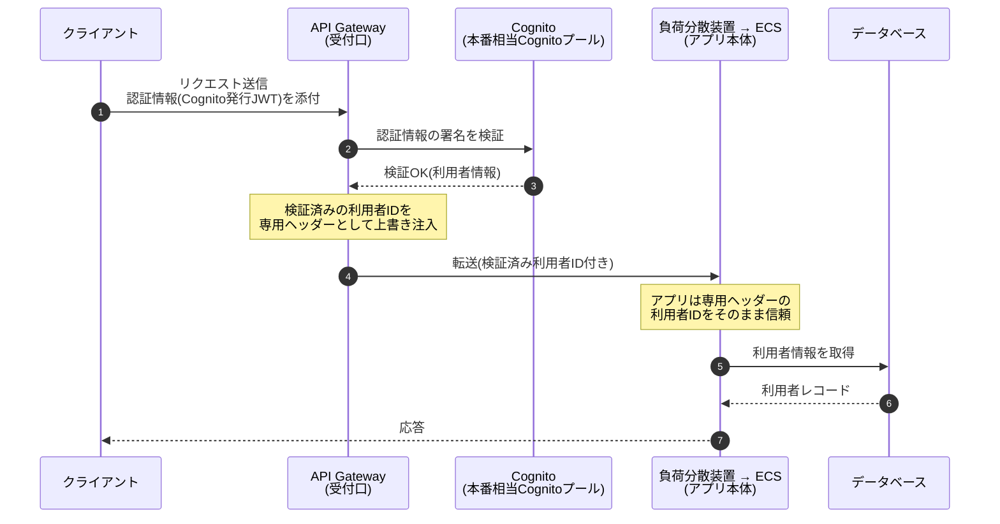
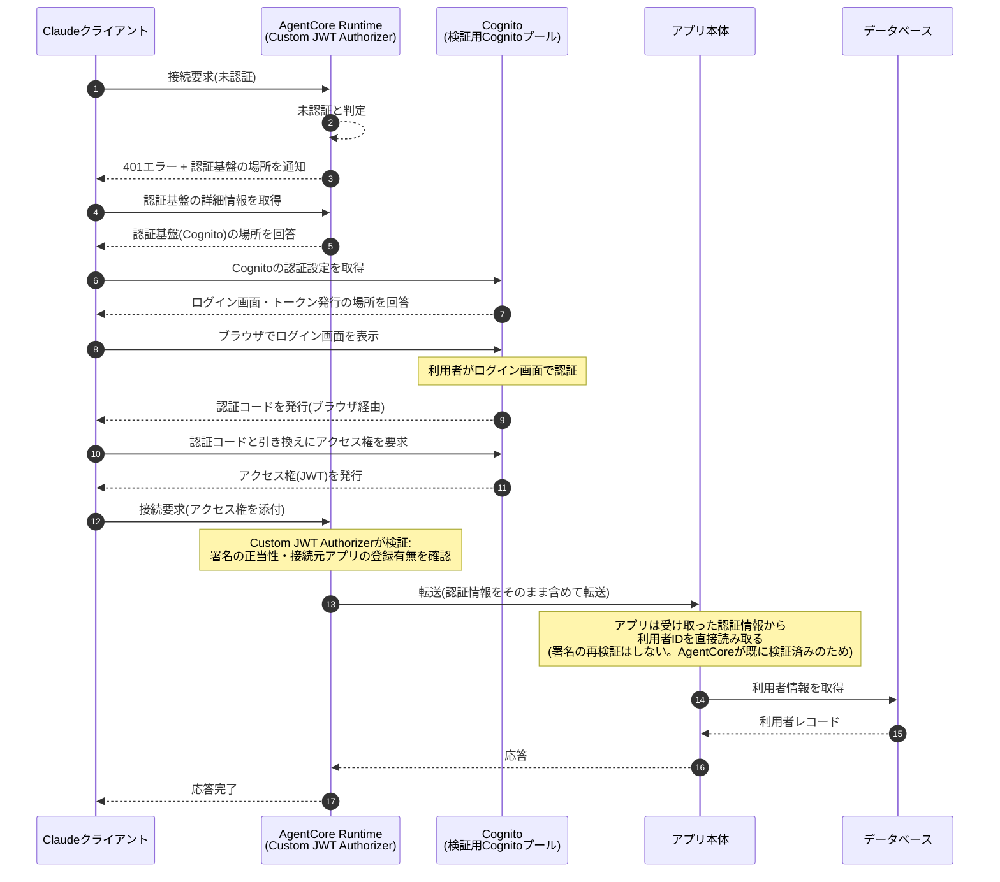
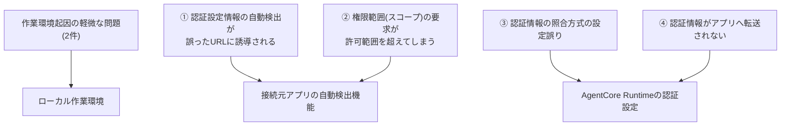

# AgentCore Runtime移行検証レポート ― Claudeからのリモート接続方式の比較検証

> **本レポートについて**
> 既存のAPI Gateway + ECS構成(以下「現行方式」)から、Amazon Bedrock AgentCore Runtime単体構成(以下「新方式」)へMCPサーバーを移行した場合に、実際にClaude(Web版・Desktop版・Code)のような外部クライアントから接続できるかを検証した結果をまとめたものです。技術的な専門用語には初出箇所で簡単な解説を付しています。より詳しい一般比較は「01. アーキテクチャ比較」、認証方式を導入する前の初期検証は「03. AgentCore検証ログ」を参照してください。本レポートでは、その先の「実際にAIクライアントから安全に接続できるか」という論点を掘り下げています。

検証日: 2026年8月18日 | 検証方法: 検証用AWS環境の構築、および実際のAIクライアントを用いたエンドツーエンドの接続確認

---

## 用語解説

本レポートで頻出する技術用語を簡潔に説明します。

| 用語 | 説明 |
|---|---|
| **MCP(Model Context Protocol)** | AIモデル(Claudeなど)が外部のツールやデータ(株価情報など)に安全に接続するための共通規格。今回検証しているのは、この規格に準拠したサーバー(MCPサーバー)をどこでホスティングするかという論点 |
| **AgentCore Runtime** | AWSが提供する、AIエージェントやMCPサーバーをサーバーレス(サーバーの管理が不要)で稼働させるフルマネージドサービス |
| **OAuth(OAuth 2.0/2.1)** | 「〇〇でログインする」「アクセスを許可する」といったログイン連携でおなじみの、第三者アプリが安全にリソースへアクセスするための認可の標準規格 |
| **JWT(JSON Web Token)** | ユーザーの認証情報や権限を安全に運ぶための、改ざんを検知できるトークン(引換券のようなもの)の形式 |
| **Cognito(Amazon Cognito)** | AWSが提供するユーザー認証基盤。ログイン画面の提供やOAuthのトークン発行を担う |
| **Custom JWT Authorizer** | AgentCore Runtimeが備える検証機能で、Cognitoなど外部の認証基盤が発行したJWTを検証し、正当なリクエストだけを後段のアプリケーションへ通す仕組み |
| **スコープ(Scope)** | OAuthで「どの範囲の権限を要求するか」を表す文字列。例えば「本人確認のみ」「特定のデータへの読み取りのみ」など |
| **コールバックURL(リダイレクトURI)** | ログイン完了後に、ブラウザやアプリを呼び戻すための戻り先URL |
| **動的クライアント登録(DCR)** | 接続元のアプリケーションが、事前の手続きなしにその場で認証基盤へ自己登録できる仕組み。今回使用したCognitoはこれに非対応であり、後述の通り事前登録が必要だった |
| **Firecracker microVM** | AWSが開発した軽量な仮想化技術。AgentCore Runtimeはリクエストのたびにこの軽量な仮想マシンを起動・破棄することでサーバーレスを実現している |
| **VPC / ALB / NATインスタンス** | 現行方式で使われている従来型ネットワーク基盤の構成要素(仮想プライベートネットワーク、負荷分散装置、インターネット接続用の中継サーバー) |

---

## サマリー

| # | 論点 | 結論 |
|---|---|---|
| 1 | 現行方式から何を変更したか | VPC・負荷分散装置・中継サーバー・API Gatewayという4つのインフラ要素が**丸ごと不要**になり、AgentCore Runtime側の設定変更(Custom JWT Authorizer)のみで、現行方式と同等の認証の仕組みを再現できた |
| 2 | アプリケーションのプログラムコードの変更 | **変更不要**。既存のプログラムに実装済みだった仕組みがそのまま機能した(詳細は本文参照) |
| 3 | Claude Web版からの接続検証 | 検証に使用した組織のプラン上の制約により、Web版でのカスタム接続追加は組織管理者のみ可能という制約に直面。**Claude Code(開発者向けCLIツール)経由で接続に成功** |
| 4 | 接続確立までの道のり | 独立した6つの技術的な論点を1つずつ切り分けて解決した。うち4つはAgentCore Runtime + Cognitoの組み合わせに特有の、実地での検証を通じて初めて判明した挙動だった |
| 5 | 認証の信頼性 | 現行方式(API Gatewayが検証済みの利用者情報をアプリへ受け渡す方式)と**同等の信頼性を持つ設計**を新方式でも実現できた |
| 6 | Claude Web版・Desktop版で接続できないという報告への対応 | Claude Codeでは手動設定で回避できた問題が、Web版・Desktop版には同じ回避策が使えないという構造的な違いを確認。AgentCore Runtime側の設定変更のみで対応できる可能性が高いと判断し、**実際に設定を追加・効果を確認済み** |
| 7 | 本番移行に向けた残課題 | 今回の検証で使用した認証基盤は検証用Cognitoプール。本番相当Cognitoプール(実際の顧客データを含む)への統合、ネットワークの閉域化対応は引き続き今後の検討事項(詳細は「05. セキュリティ・コンプライアンス比較検証」参照) |

---

## 1. 検証の目的

これまでの検証では、AWSの内部認証の仕組み(SigV4署名)と、検証用に自己申告した利用者識別情報を組み合わせた簡易的な構成で疎通確認を行っていた。これは、なりすまし対策の観点で本番相当とは言えない構成であり、本番展開の前提とすべきでないことを既にお伝えしている。

今回は「実際にClaude(Web版・Desktop版・Code)のような一般的なOAuthクライアントから、AWS固有の署名方式を意識せずに接続できるか」を検証した。これは、AgentCore Runtimeを課金制サービスの基盤として外部提供する上で、現実的な選択肢たり得るかを左右する重要な論点である。

## 2. アーキテクチャの変更点: 何を削り、何を変えたか

### 2.1 構成図の比較

**現行方式(API Gateway + ECS)**


**新方式(AgentCore Runtime + Cognito Custom JWT Authorizer)**


図に示す通り、現行方式にあった「VPC」「負荷分散装置(ALB)」「中継サーバー(NATインスタンス)」「API Gateway」という4つのインフラ要素が、新方式では不要になる。利用者認証を担うCognitoは共通して使われるが、その検証(誰がアクセスしてきたかの確認)を行う主体が、API GatewayからAgentCore Runtime自身に変わる。

### 2.2 構成要素ごとの比較表

| 構成要素 | 現行方式(API Gateway + ECS) | 新方式(AgentCore Runtime) | 変化 |
|---|---|---|---|
| 実行環境 | ECS Fargate(常時起動するコンテナ、0.25vCPU/0.5GB) | AgentCore Runtime(リクエストごとに起動するFirecracker microVM) | 常時起動 → サーバーレスに |
| ネットワーク | 専用VPC(公開/非公開サブネット、中継サーバー×2、負荷分散装置) | 不要 | **ネットワーク関連のインフラ一式が不要に** |
| MCPの受付口 | API Gateway(HTTP API) | AgentCore Runtimeの受付エンドポイント | API Gatewayという別コンポーネントが不要に |
| JWT(認証情報)の検証者 | API Gateway(JWT Authorizer機能) | AgentCore Runtime(Custom JWT Authorizer機能) | 検証を行う場所が変わるだけで、仕組み自体は同じ |
| Cognito(認証基盤) | 本番相当Cognitoプール(実際の顧客データを含む) | 検証用Cognitoプール | 今回は検証用Cognitoプールを使用(本番移行時は統合が必要、§7参照) |
| 利用者識別情報のアプリへの伝達方法 | 検証済みの利用者IDを専用ヘッダーとして注入 | 認証情報(Authorizationヘッダー)をそのまま転送し、アプリ側で読み取る | 伝達方式は変わるが信頼性は同等(詳細は本文4章) |
| アプリケーションのプログラムコード | (変更なし) | 変更なし | 元々柔軟な設計になっていたため、コード修正が不要だった |
| インフラ構築コードの量 | Terraform(インフラ構成コード)10ファイル以上 | AWSの設定変更コマンド1回(既存のCognitoを再利用する場合) | 構築・変更の手間が大幅に減る |
| 更新の単位 | コンテナイメージ更新 + ECSのタスク定義更新 + サービス再デプロイ | コンテナイメージ更新 + Runtimeバージョン更新 | 同程度 |

## 3. 処理の流れ(シーケンス図)の比較

同じ「クライアントがMCPサーバーに接続する」という1つの処理を、2つの構成がどのように処理するかを比較する。

### 3.1 現行方式(API Gateway + ECS)



信頼の起点: API Gatewayが認証情報の署名検証を担い、検証済みの利用者IDだけをアプリへ渡す。**認証はアプリのプログラムコードに到達する前に完結している。**

### 3.2 新方式(AgentCore Runtime + Custom JWT Authorizer)



信頼の起点: AgentCore Runtimeが認証情報の署名検証を担う点は、API Gatewayと同じ構造。ただし利用者情報の伝達方式が異なる——検証済みの利用者IDを専用の情報として作り直して渡すのではなく、検証済みの認証情報そのものをアプリへ転送し、アプリ側がその中身を読み取って利用者IDを得る。署名の再検証はしないが、それはAgentCore Runtimeが前段で既に検証を完了しているためであり、**現行方式と同じ「認証はアプリのプログラムコードに到達する前に完結している」という設計思想を踏襲している**。

## 4. 認証方式の詳細比較

| 観点 | 現行方式(API Gateway + ECS) | 新方式(AgentCore Runtime) |
|---|:---:|:---:|
| JWT署名の検証箇所 | API Gateway | AgentCore Runtime |
| 利用者識別情報のアプリへの伝達 | 専用ヘッダー(検証済み情報を上書き注入、なりすまし不可) | 認証情報そのものを転送(アプリが読み取り、署名検証はAgentCore側で完結済み) |
| 動的クライアント登録(DCR) | 不要(既存の認証設定を直接使用) | 今回使用したCognitoは非対応。事前登録した接続元情報を手動設定する必要あり |
| 接続に必要な設定情報の自動発見 | クライアント側が個別に対応する必要があった | AgentCore Runtimeが標準規格に準拠した情報を自動生成(自作不要) |
| 通信方式 | 標準的なHTTPS通信 + Cognito発行のJWT | 標準的なHTTPS通信 + Cognito発行のJWT(AWS固有の署名方式は不要) |
| ネットワークの閉域化 | 現状は受付口が外部公開されている | 同様に現状は外部公開(「05. セキュリティ・コンプライアンス比較検証」参照) |

### 4.1 重要な留意点(1): 認証情報の照合方法の使い分け

AgentCore RuntimeのCustom JWT Authorizerには、認証情報の照合条件として2つの設定項目(`aud`照合、`client_id`照合)が用意されている。今回使用したCognitoが発行するアクセス権(トークン)は、片方の照合方法にしか対応する情報を持たない仕様であり、もう一方を有効にすると必ず不一致でリジェクト(拒否)される。この仕様はAWSの公式ドキュメントに明記が見当たらず、実際のAWS環境での試行錯誤で判明した(詳細は本文6章)。

### 4.2 重要な留意点(2): 認証情報のアプリへの転送設定

AgentCore Runtimeは、Custom JWT Authorizerで検証済みの認証情報であっても、転送設定に明示的に加えない限りアプリ側へ転送しない仕様になっている。これを見落とすと、認証自体は成功しているにもかかわらず、アプリ側が「利用者を識別できない」としてエラーを返すという分かりにくい不具合になる。

## 5. 接続手順(最終的に機能した設定)

以下は今回の検証で最終的に成功した設定・手順を、再現性のために整理したものである(実際の識別子は`<...>`のプレースホルダーに置き換えている)。

### 5.1 AgentCore Runtime側の設定

```bash
aws bedrock-agentcore-control update-agent-runtime \
  --agent-runtime-id <runtime-id> \
  --agent-runtime-artifact '{"containerConfiguration":{"containerUri":"<コンテナイメージURI>"}}' \
  --role-arn <実行ロールARN> \
  --network-configuration '{"networkMode":"PUBLIC"}' \
  --protocol-configuration '{"serverProtocol":"MCP"}' \
  --request-header-configuration '{"requestHeaderAllowlist":["x-cognito-sub","Authorization"]}' \
  --authorizer-configuration '{"customJWTAuthorizer":{"discoveryUrl":"https://cognito-idp.<region>.amazonaws.com/<user-pool-id>/.well-known/openid-configuration","allowedClients":["<接続元アプリのID>"],"allowedScopes":["openid","<権限範囲の識別子>"]}}'
```

設定のポイント:
- 認証情報の照合は`client_id`側のみを使用する(§4.1参照)
- 認証情報(`Authorization`)の転送設定を明示的に追加する(§4.2参照)
- 許可する権限範囲(スコープ)を明示的に設定すると、接続元アプリに対して要求すべき権限範囲を明確に伝えられる。これはAnthropic(Claude提供元)の公式ドキュメントが「Claudeが要求する権限範囲を制御する方法」として明記している設定であり、**Web版・Desktop版など、接続元アプリ側で権限範囲を手動指定できない環境での接続失敗を防ぐために重要**(§7.2参照)

### 5.2 Cognito(認証基盤)側の前提

- 接続元アプリの登録情報(秘密情報あり)にコールバックURLを登録する(例: `http://localhost:<ポート番号>/callback`)
- 権限範囲(スコープ)を定義し、接続元アプリの許可リストに設定する
- 動的クライアント登録(DCR)に非対応のため、接続元のID・秘密情報は事前にクライアント側へ手動設定する必要がある

### 5.3 クライアント(Claude Code)側の設定

```bash
claude mcp add --transport http --client-id <接続元アプリのID> --client-secret --callback-port <ポート番号> <サーバー名> "<AgentCore Runtimeの接続先URL>"
```

Cognitoが標準的な認証設定情報の一部を提供しない仕様のため、Claude Code側の自動検出が誤動作することがある(§6参照)。その場合はクライアント側の設定ファイルに、認証設定情報の場所と、要求すべき権限範囲を明示的に追記する必要がある。

### 5.4 認証・動作確認

```bash
claude mcp login <サーバー名>
```

ブラウザ(またはターミナルに表示されるURL)でログインし、接続状態が「connected(接続済み)」になることを確認する。

## 6. 検証を通じて確認された技術的な留意点

接続確立に至るまでに、性質の異なる6つの技術的な論点を1つずつ切り分けて解決した。整理すると、ローカルな作業環境に起因するもの(2件)と、AgentCore RuntimeとCognitoの組み合わせに特有の設定上の留意点(4件)に大別できる。後者は、今後同様の構成を採用する際に事前にチェックリスト化しておくべき重要な知見である。



### 6.1 作業環境に起因する軽微な問題(2件)

検証作業のためのコマンド入力時に、ターミナル環境の仕様差に起因する入力ミスが2件発生した。いずれも今回の技術検証そのものとは直接関係のない、ローカル作業環境固有の問題であり、入力方法を工夫することで解決した。

### 6.2 AgentCore Runtime特有の設定上の留意点(4件)

| # | 論点 | 原因 | 対応 |
|---|---|---|---|
| 1 | 認証設定情報の自動検出が、意図しないURLへ接続元を誘導してしまう | Cognitoが、標準規格の一部(RFC 8414)の情報を提供しない(OpenID Connect規格の情報のみ提供)仕様であり、Claude Code側の自動検出機能が想定外の動作をしてしまう | クライアント側の設定に、Cognitoの認証設定情報の場所を明示的に指定する |
| 2 | ログイン画面で「権限範囲(スコープ)が不正」というエラーが出る | Cognito側が保持する権限範囲の全体(本人確認・メールアドレス・電話番号など)をそのまま要求してしまったが、実際に登録した接続元アプリはその一部しか許可していなかった | クライアント側の設定で、許可されている権限範囲のみを明示的に指定する |
| 3 | 認証成功後の再接続時に、AgentCore Runtimeがエラーを返す | 認証情報の照合方式を誤って設定していた(§4.1参照)。Cognitoが発行するアクセス権は、一部の照合情報を持たない仕様のため、これを有効にすると必ず不一致になる | 誤って有効にしていた照合設定を無効化する |
| 4 | AgentCore Runtimeの認証自体は成功する(応答コード200)にもかかわらず、アプリ側が「利用者を識別できない」というエラーを返す | 検証済みの認証情報は、転送設定に明示的に含めない限りアプリへ転送されない仕様だった(§4.2参照) | 転送設定に認証情報(`Authorization`)を明示的に追加する |

上記のうち#1〜4は、AgentCore Custom JWT AuthorizerとCognitoの組み合わせに特有の、ドキュメント未記載の挙動である。本番展開時にも同様の設定漏れが起こり得るため、注意が必要である。原因の切り分けには、ブラウザ操作を介さずに認証フローをプログラムで再現し、AgentCore Runtimeからの応答を直接確認する手法が有効だった。

## 7. Claude Web版・Claude Desktopでの接続確認について

Claude Codeでは接続に成功した一方、**同じAgentCore Runtimeに対してClaude Web版・Claude Desktopから接続を試みた別の検証者からは、接続できないとの報告を受けた**。Claude Code・Claude Web版・Claude Desktopは、Anthropic(Claude提供元)の公式ドキュメントによれば「同一のインフラ」で動作しているとされるが、接続元アプリとしての実装(戻り先URLの扱い、手動設定の可否)には明確な違いがあることが分かった。ここでは公式ドキュメントを根拠に原因を整理し、実際に設定変更・効果確認まで行った。

### 7.1 利用形態ごとの構造的な違い(公式ドキュメントによる事実)

| 観点 | Claude Code(開発者向けCLIツール) | Claude Web版 / Desktop版 / モバイル版 |
|---|---|---|
| 認証処理の実行主体 | 利用者のローカルPC上で直接実行 | Anthropicのクラウド側インフラが実行(ローカルではない) |
| 戻り先URL(コールバックURL) | 利用者のPC上の一時的なアドレス(接続のたびに変わる) | 固定されたAnthropic側の共通アドレス |
| 権限範囲・認証設定情報の手動上書き | 利用者が設定ファイルで個別に上書き可能 | **画面上に同等の上書き設定は存在しない**(接続先URL・接続元アプリのID・秘密情報のみ入力可能) |

出典: [Authentication for connectors](https://claude.com/docs/connectors/building/authentication)(Anthropic公式ドキュメント)

この違いが意味すること: Claude Codeで解決できた6つの論点のうち、「クライアント側の手動設定で回避した」もの(§6.2の#1・#2)は、Web版・Desktop版では同じ回避策が使えない。画面上に相当する上書き設定項目が無いため、**サーバー側(AgentCore Runtime)の設定だけで問題を解消させる必要がある**。

### 7.2 最有力の仮説: 権限範囲(スコープ)の要求方式の不整合

Anthropicの公式ドキュメントには、次のような記述がある(和訳・強調は引用者):

> 「Claudeが要求する権限範囲を制御するには、サーバーが返すエラー応答の中に、要求すべき権限範囲を明示すること。**明示しない場合、Claudeはサーバー側が公開している権限範囲の一覧をすべて要求する。**」
> —— Authentication for connectors § DCR and CIMD details(Anthropic公式ドキュメント)

今回のAgentCore Runtimeの設定変更前は、この「要求すべき権限範囲」を明示していなかった(実際の環境で確認済み)。この状態でClaude側がどう振る舞うかは公式記述に明記されていないが、Claude Codeで実際に発生した「Cognito側が公開する権限範囲(本人確認・メールアドレス・電話番号など)を丸ごと要求してしまい、登録した接続元アプリの許可範囲を超えてエラーになる」という現象(§6.2の#2)が、手動での回避手段を持たないWeb版・Desktop版でも再現している可能性が高いと判断した。

#### 検証・対応(実施済み)

AgentCore Runtimeの設定に「許可する権限範囲」を明示的に追加すると、サーバーからの応答に明示的な権限範囲の情報が付与されることを実際のAWS環境で確認した。これはAnthropic公式ドキュメントが明記する「Claudeが要求する権限範囲を制御する方法」そのものであり、**サーバー側の設定変更だけで、Web版・Desktop版を含む全ての利用形態における、権限範囲に起因する接続失敗を防げる見込みが高い**。この対応は既に本番相当の検証環境へ反映済みである。

### 7.3 副次的な仮説(確度は中程度)

| 仮説 | 根拠 | 確度 | 備考 |
|---|---|---|---|
| 認証設定情報の自動検出における不具合(§6.2の#1と同型) | 公式ドキュメントは「2種類の標準規格のいずれかで情報を提供すればよい」と明記しており、今回のCognitoの提供方法は本来仕様通りのはず。同じ不具合がWeb版・Desktop版で再現するなら、それは「同一インフラ」内の実装上の課題である可能性がある | 中 | クライアント側に回避手段が無いため、再現するようであれば本質的にはAnthropic側の対応を待つ必要がある。次回接続時に実際のエラー内容を確認して切り分ける |
| 接続元アプリの秘密情報の伝達不備 | 公式ドキュメントには、秘密情報の入力は任意項目であり、必要な場合のみ入力する仕組みが用意されていると明記されている | 低 | 手順通りに設定していれば問題ないはずだが、入力漏れ・転記ミスの可能性は念のため排除できない |

### 7.4 次のアクション

- [ ] Web版・Desktop版から実際に接続し、表示されるエラー内容を我々自身で確認する。§7.2の仮説が正しければ、今回の設定変更後は権限範囲に起因するエラーは解消しているはず
- [ ] 設定変更後の状態で、Web版・Desktop版から再度接続を試す
- [ ] それでも解消しない場合は、実際のエラー画面を我々で確認し、§7.1で述べた構造的な違い(戻り先URLの固定・手動上書き不可)を踏まえて再度切り分けを行う

## 8. 本番移行に向けた今後の検討事項

- 認証基盤の統合: 今回は検証用Cognitoプールを使用した。本番展開時は、本番相当Cognitoプール(実際の顧客データを含む既存の認証基盤)に対して同様の設定を行うか、複数の認証基盤を跨いだ設計を検討する必要がある
- ネットワークの閉域化: 現状は受付口が外部に公開された状態のまま。「05. セキュリティ・コンプライアンス比較検証」で述べた通り、ネットワークを閉域化するには追加の設定変更が別途必要(未検証)
- Claude Web版での動作確認: 検証に使用した組織のプラン上、Web版でのカスタム接続追加は組織の管理者権限を持つ者でないと実施できず、今回はClaude Code経由での検証にとどまった。Web版での動作確認を進めるには、管理者権限を持つ担当者の協力を仰ぐ想定である
- 複数顧客での利用分離(マルチテナント化): 「05. セキュリティ・コンプライアンス比較検証」で述べた、認証情報を使った顧客ごとの分離は今回は検証範囲外。基本的な接続確認ができた今、次のステップとして着手可能な状態にある

## 9. まとめ

- AgentCore Runtimeへの移行は、**VPC・負荷分散装置・中継サーバー・API Gatewayという4つのインフラ要素を丸ごと不要にする**一方で、認証の信頼性については現行方式と同等の水準を実現できることを実環境での検証で確認した
- アプリケーションのプログラムコードの変更は一切不要だった。これは、既存のプログラムが柔軟な設計になっていたためであり、設計の先見性によるところが大きい
- 接続確立までに発生した6つの論点のうち、4つは、AgentCore Custom JWT AuthorizerとCognitoの組み合わせに特有の、事前の文書調査だけでは把握しきれない仕様だった。本番導入時はこれらを踏まえた設定チェックリストの整備が望ましい
- Claudeのような外部AIサービスとの接続は、契約プランや権限体系によって接続方法(Web版 vs 開発者向けツール)が変わる。エンドユーザー向けの案内資料には、この分岐を明記する必要がある

---

## 出典・参考資料

**関連する社内資料**
- 01. アーキテクチャ比較 — 現行方式・新方式の一般比較
- 03. AgentCore検証ログ — 初回の疎通検証(内部認証方式のみ)
- 04. ECS検証ログ — 現行方式の稼働確認
- 05. セキュリティ・コンプライアンス比較検証 — ネットワーク閉域性・複数顧客利用時の分離に関する比較検証

**AWS公式ドキュメント**
- [Authenticate and authorize with Inbound Auth and Outbound Auth](https://docs.aws.amazon.com/bedrock-agentcore/latest/devguide/runtime-oauth.html)
- [MCP protocol contract](https://docs.aws.amazon.com/bedrock-agentcore/latest/devguide/runtime-mcp-protocol-contract.html)
- [Configure inbound JWT authorizer](https://docs.aws.amazon.com/bedrock-agentcore/latest/devguide/inbound-jwt-authorizer.html)

**Anthropic(Claude提供元)公式ドキュメント**
- [Get started with custom connectors using remote MCP](https://support.claude.com/en/articles/11175166-get-started-with-custom-connectors-using-remote-mcp)
- [Connect Claude Code to tools via MCP](https://code.claude.com/docs/en/mcp)
- [Authentication for connectors](https://claude.com/docs/connectors/building/authentication) — 7章の仮説の主要な根拠
- [Build custom connectors via remote MCP servers](https://support.claude.com/en/articles/11503834-build-custom-connectors-via-remote-mcp-servers)

---

*本ドキュメントの構成図は[`awsdac`](https://github.com/awslabs/diagram-as-code)、処理の流れ図は[Mermaid](https://mermaid.js.org/)記法で作成した。*
