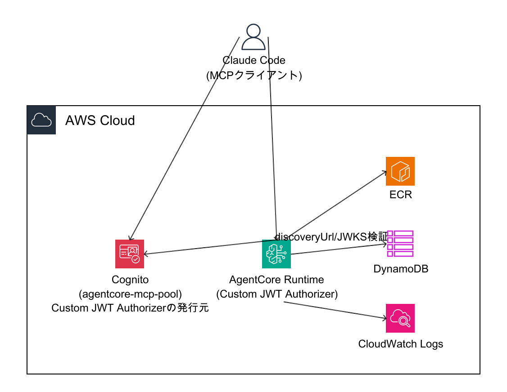
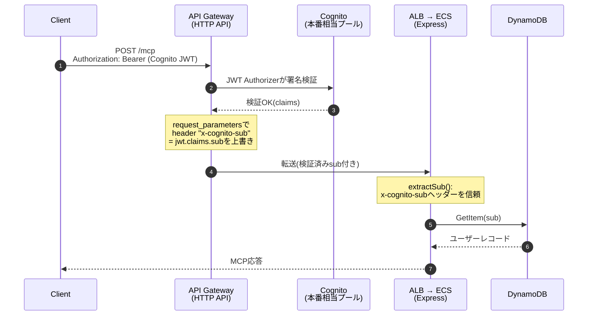
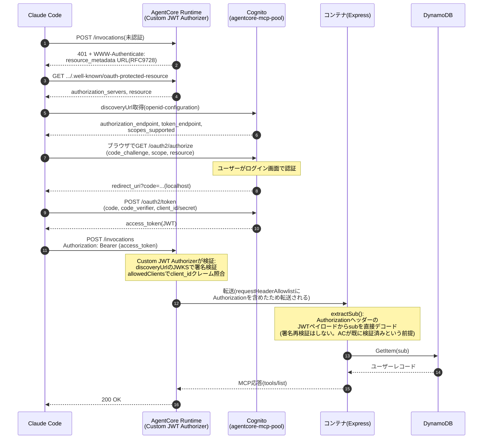
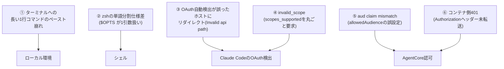

# AgentCore Runtime移行検証: Claude CodeからのリモートMCP接続とECS+API Gatewayとの比較

> **この章で分かること**
> 既存のAPI Gateway + ECS構成(パターン4)から、AgentCore Runtime単体(パターン3)へMCPサーバーを載せ替えた場合に、実際にClaude Codeのような外部MCPクライアントから疎通させるには何をどう変更する必要があったかを、実機検証で得た構成図・シーケンス図・認証フロー・手順として整理する。[01-internal-architecture-comparison.md](./01-internal-architecture-comparison.md)の一般比較、[03-internal-agentcore-runtime-verification.md](./03-internal-agentcore-runtime-verification.md)のIAM/SigV4検証を踏まえ、今回は**OAuth経由での外部クライアント接続**という観点を深掘りする。

検証日: 2026-08-18 | 検証方法: playgroundアカウントでの実機構築・実際のClaude Code CLIからのエンドツーエンド疎通確認

---

## TL;DR

| # | 論点 | 結論 |
|---|---|---|
| 1 | ECS+API Gatewayから何を変更したか | VPC/ALB/NAT/API Gatewayが**丸ごと不要**になり、AgentCore Runtimeの設定変更(Custom JWT Authorizer)のみで同等の認証モデルを再現できた |
| 2 | アプリケーションコードの変更 | **変更なし**。既存コードに実装済みだった「`Authorization`ヘッダーからのJWTデコード」フォールバックがそのまま機能した |
| 3 | Claude.ai Web版からの接続 | 組織がTeam/Enterpriseプランのため、カスタムコネクタの追加はOrganization Ownerのみ可能という制約に直面し未検証。**Claude Code CLI経由(ローカルMCP設定、Owner権限不要)で疎通を確認** |
| 4 | 疎通までの道のり | 独立した6つの問題(ローカル環境・シェル・Cognito・AgentCore認可の3レイヤー)を1つずつ切り分けて解決。うち2つはAgentCore Custom JWT Authorizer特有の、ドキュメント化されていない挙動だった |
| 5 | 認証の信頼モデル | パターン4(API Gatewayが検証済みsubを注入)と**同等の信頼モデル**をパターン3でも実現(01ドキュメントで指摘していた「本番採用時の注意」のギャップが埋まった) |
| 6 | Claude.ai Web版・Desktopで疎通できないという報告 | Claude Codeでは手動でスコープを上書きして回避したが、Web/Desktopには同等の上書き手段がない。Anthropic公式ドキュメントの記述と一致する`allowedScopes`未設定が原因である可能性が高いと判断し、**AgentCore Runtime側に`allowedScopes`を追加して`WWW-Authenticate`に明示的なscopeを持たせる修正を実施・実機で効果を確認済み**(§7) |
| 7 | 本番移行への残課題 | 今回使ったCognitoは検証専用の別インスタンス。本番の`quick-mcp-poc-users`プールへの移行、閉域網対応(05ドキュメント参照)は引き続き未着手 |

---

## 1. 検証の目的

[00-handoff.md](./00-handoff.md)で完了していたのは、boto3 + SigV4署名 + `x-cognito-sub`自己申告ヘッダーという簡略構成での疎通確認(IAM認証のみ、なりすまし対策が本番同等ではない)。これは[01-internal-architecture-comparison.md](./01-internal-architecture-comparison.md)で「本番採用時の注意」として明記した通り、Custom JWT Authorizerを導入しない限り本番展開すべきでない構成だった。

今回は「実際にClaude.ai/Claude CodeのようなMCPクライアントから、AWS SigV4を知らない一般的なOAuthクライアントとして接続できるか」を検証した。これは課金制サービスとして外販する上で、パターン3(AgentCore Runtime)が現実的な選択肢たり得るかを左右する重要な論点である。

## 2. アーキテクチャの変遷: 何を削り、何を変えたか

### 2.1 構成図の比較

**ECS + API Gateway(既存構成、パターン4)**


**AgentCore Runtime + Cognito Custom JWT Authorizer(今回の検証構成)**



見ての通り、パターン4にあった「VPC」「ALB」「NATインスタンス」「API Gateway」という4つの箱が、パターン3では**丸ごと消える**。認証を担っていたCognitoは残るが、検証の実施主体がAPI GatewayからAgentCore Runtime自身に変わる。

### 2.2 コンポーネント単位の差分表

| コンポーネント | ECS + API Gateway | AgentCore Runtime | 変化 |
|---|---|---|---|
| コンピュート | ECS Fargate(常時起動タスク、0.25vCPU/0.5GB) | AgentCore Runtime(リクエスト単位のFirecracker microVM) | 常時起動 → サーバーレスに |
| ネットワーク | 専用VPC(パブリック/プライベートサブネット、NATインスタンス×2、ALB) | 不要(`networkMode: PUBLIC`) | **VPC関連一式が不要に** |
| MCPの入口 | API Gateway(HTTP API) | AgentCore Runtimeの`invocations`エンドポイント | API Gatewayという別コンポーネントが不要に |
| JWT検証の実施者 | API Gateway JWT Authorizer | AgentCore Runtime **Custom JWT Authorizer** | 検証ロジックの実施場所が変わるだけで、モデル自体は同じ |
| Cognito | 本番相当アカウントの`quick-mcp-poc-users`プール(実クライアントデータ41件) | playgroundの`agentcore-mcp-pool`(検証専用の別インスタンス) | **注意: 今回は別インスタンスで検証**(本番移行時は要移行、§7参照) |
| ユーザー識別のアプリへの伝達 | 検証済み`sub`を`x-cognito-sub`ヘッダーとして注入(API Gatewayが上書き) | `Authorization`ヘッダーをそのまま転送、アプリがJWTペイロードをデコード | 伝達方式は変わるが信頼モデルは同等(§4で詳述) |
| アプリケーションコード | (変更なし) | **変更なし** | 元々`Authorization`ヘッダーのフォールバック抽出ロジックが実装済みだった |
| IaCの量 | Terraform 10ファイル以上(vpc.tf, alb.tf, ecs.tf, apigateway.tf, cognito.tf等) | AWS CLIでの`update-agent-runtime`一発(既存Cognitoを再利用する場合) | 構築・変更の手間が大幅に減る |
| デプロイの単位 | Dockerイメージ + ECSタスク定義更新 + サービス再デプロイ | ECRへのイメージpush + `update-agent-runtime`でRuntimeバージョン更新 | 同程度 |

## 3. シーケンス図の比較

### 3.1 ECS + API Gateway(既存)



**信頼の起点**: API Gatewayが署名検証を担い、検証済みの`sub`だけをアプリに渡す。認証はアプリコードに到達する前に完結している。

### 3.2 AgentCore Runtime + Custom JWT Authorizer(今回)



**信頼の起点**: AgentCore Runtimeが署名検証(discoveryUrlのJWKS)を担う点はAPI Gatewayと同じ構造。**ただし伝達方式が異なる**——検証済みの`sub`を専用ヘッダーとして注入するのではなく、検証済みの`Authorization`ヘッダーそのものをアプリへ転送し、アプリ側がJWTペイロードをデコードして`sub`を読む。署名の再検証はしないが、それはAgentCore Runtimeが前段で既に検証を完了しているためであり、パターン4と同じ「認証はアプリコードに到達する前に完結している」設計になっている。

## 4. 認証フローの違い(詳細比較)

| 観点 | ECS + API Gateway | AgentCore Runtime + Custom JWT |
|---|:---:|:---:|
| JWT署名検証の実施箇所 | API Gateway | AgentCore Runtime |
| ユーザー識別のアプリへの伝達 | `x-cognito-sub`ヘッダー(上書き注入、なりすまし不可) | `Authorization`ヘッダー転送(アプリがデコード、署名検証はAC側で完結済み) |
| Dynamic Client Registration(RFC7591) | 不要(Cognito App Clientを直接使用) | **Cognitoは非対応**。事前登録したClient ID/Secretを手動設定する必要あり |
| OAuthメタデータ発見 | クライアント側が個別に対応(API Gateway側でメタデータプロキシを自作していた、[terraform/openapi.yaml](../terraform/openapi.yaml)参照) | AgentCore Runtimeが**RFC9728準拠のメタデータを自動生成**(自作不要) |
| クライアントからの呼び出しプロトコル | 標準HTTPS + Cognito発行JWT | 標準HTTPS + Cognito発行JWT(**SigV4署名は不要**、IAM認証と排他) |
| ネットワークの閉域化 | ALB/VPC内(ただし現状APIGWはパブリック) | 同様に現状はパブリック(`networkMode: PUBLIC`)。05ドキュメント参照 |

### 4.1 ここが重要: `allowedAudience`と`allowedClients`の使い分け

AgentCore RuntimeのCustom JWT Authorizerは、JWTの検証条件として`allowedAudience`(`aud`クレームの照合)と`allowedClients`(`client_id`クレームの照合)を別々に設定できる。**Cognitoのアクセストークンは`aud`クレームを持たず、`client_id`クレームのみを持つ**ため、`allowedAudience`を設定すると必ず不一致でリジェクトされる。Cognitoのアクセストークンで認可する場合は**`allowedClients`のみを設定すること**。この仕様はAWS公式ドキュメントに明記が見当たらず、実機での試行錯誤で判明した(詳細は§6参照)。

### 4.2 ここが重要: `requestHeaderAllowlist`への`Authorization`追加

AgentCore Runtimeは、Custom JWT Authorizerで検証済みの`Authorization`ヘッダーであっても、**`requestHeaderConfiguration.requestHeaderAllowlist`に明示的に含めない限りコンテナへ転送しない**。これを見落とすと、認可自体は通る(HTTP 200)のに、コンテナ内のアプリが「ユーザー識別情報が無い」として401を返すという分かりにくい失敗になる。

## 5. 接続手順(最終的に機能した構成)

以下は今回の検証で最終的に成功した手順。同じ構成を再現する場合の参照用。

### 5.1 AgentCore Runtime側の設定

```bash
aws bedrock-agentcore-control update-agent-runtime \
  --agent-runtime-id <runtime-id> \
  --agent-runtime-artifact '{"containerConfiguration":{"containerUri":"<ECRイメージURI>"}}' \
  --role-arn <実行ロールARN> \
  --network-configuration '{"networkMode":"PUBLIC"}' \
  --protocol-configuration '{"serverProtocol":"MCP"}' \
  --request-header-configuration '{"requestHeaderAllowlist":["x-cognito-sub","Authorization"]}' \
  --authorizer-configuration '{"customJWTAuthorizer":{"discoveryUrl":"https://cognito-idp.<region>.amazonaws.com/<user-pool-id>/.well-known/openid-configuration","allowedClients":["<cognito-app-client-id>"],"allowedScopes":["openid","<resource-server-identifier>/<scope-name>"]}}'
```

ポイント:
- `allowedAudience`は**含めない**(§4.1参照)
- `requestHeaderAllowlist`に**`Authorization`を含める**(§4.2参照)
- `allowedScopes`を設定すると、`WWW-Authenticate`ヘッダーとprotected resource metadataに明示的な`scope`が付与される。Anthropic公式ドキュメントが「Claudeがリクエストするスコープを制御する方法」として明記している設定であり、**Web版・Claude Desktopなどクライアント側でスコープを手動指定できないサーフェスでの接続失敗を防ぐために重要**(§7.2参照)

### 5.2 Cognito側の前提

- App Client(confidential client、Client Secretあり)にCallback URLを登録(MCPクライアントのredirect_uri、例: `http://localhost:<port>/callback`)
- リソースサーバー(例: identifier `mcp`, scope `invoke`)を作成し、App ClientのAllowed OAuth Scopesに`openid`と`<identifier>/<scope>`を設定
- Dynamic Client Registration非対応のため、Client ID/Secretは事前にMCPクライアント側へ手動設定する必要がある

### 5.3 MCPクライアント(Claude Code)側の設定

```bash
claude mcp add --transport http --client-id <client-id> --client-secret --callback-port <port> <server-name> "<AgentCore invocationsのURL>"
```

CognitoがRFC8414の`/.well-known/oauth-authorization-server`を提供しない(`openid-configuration`のみ)場合、Claude CodeのOAuth自動検出が誤動作することがある(§6参照)。その場合は`~/.claude.json`の当該サーバー設定に以下を追記する:

```json
"oauth": {
  "clientId": "<client-id>",
  "callbackPort": <port>,
  "authServerMetadataUrl": "https://cognito-idp.<region>.amazonaws.com/<user-pool-id>/.well-known/openid-configuration",
  "scopes": "openid <identifier>/<scope>"
}
```

`scopes`は、Cognito discoveryの`scopes_supported`(User Pool全体の値、`email`/`phone`等を含みがち)をそのまま使うと、App Clientが許可していないスコープを含んでしまい`invalid_scope`エラーになることがあるため、**App Clientが実際に許可しているスコープのみを明示指定する**こと。

### 5.4 認証・動作確認

```bash
claude mcp login <server-name>
```

ブラウザ(またはターミナルに表示されるURL)でCognitoにログインし、`/mcp`コマンドで`✔ connected`になることを確認する。

## 6. ハマった6つの問題

疎通に至るまでに、独立した6つの問題を1つずつ切り分けて解決した。レイヤーごとに整理する。



| # | 問題 | レイヤー | 原因 | 対応 |
|---|---|---|---|---|
| 1 | 長い1行コマンドがターミナルへのコピペ時に途中で改行され実行が壊れる | ローカル環境 | チャット上のコードブロックの折り返し表示が、コピー時に改行として混入 | 変数に分けて短い行に分割してから最後にまとめて実行 |
| 2 | `claude mcp add $OPTS ...`で`error: unknown option` | シェル(zsh) | zshは未クォートの変数展開でも単語分割しない(bashと異なる仕様) | 配列`OPTS=(...)` + `"${OPTS[@]}"`を使う |
| 3 | ブラウザが`https://bedrock-agentcore.../authorize`という誤ったホストにリダイレクトされ「Invalid api path」 | Claude CodeのOAuth自動検出 | CognitoがRFC8414の`/.well-known/oauth-authorization-server`を提供せず(`openid-configuration`のみ)、自動検出がリソースサーバー自身をフォールバック先にしてしまう | `~/.claude.json`の`oauth.authServerMetadataUrl`にCognitoのdiscovery URLを明示指定 |
| 4 | Cognitoログイン画面で`invalid_request: invalid_scope` | Cognito | `authServerMetadataUrl`設定後、discoveryの`scopes_supported`(`openid, email, phone, profile`)を丸ごとリクエストしたが、App Clientは`openid`と`mcp/invoke`しか許可していなかった | `oauth.scopes`に許可スコープのみを明示指定 |
| 5 | 認証成功後の再接続でAgentCoreが401(`Claim 'aud' value mismatch`) | AgentCore Custom JWT Authorizer | `allowedAudience`を追加したが、Cognitoのアクセストークンは`aud`クレームを持たない仕様のため必ず不一致になる | `allowedAudience`を削除し`allowedClients`のみにする |
| 6 | AgentCoreの認可は通る(200)がコンテナが401(`Missing user identity`) | AgentCore Runtime → コンテナ間 | 検証済み`Authorization`ヘッダーは`requestHeaderAllowlist`に明示しない限り転送されない | allowlistに`Authorization`を追加 |

**問題5・6は、AgentCore Custom JWT AuthorizerとCognitoの組み合わせに特有の、ドキュメントに明記されていない挙動**であり、本番展開時にも同じ罠に注意が必要。原因の切り分けには、Cognitoの認可コード+PKCEフローをスクリプトで再現し(ブラウザ操作なしで)、AgentCoreの生レスポンスを直接確認する手法が有効だった。

## 7. Claude.ai Web版・Claude Desktopでの疎通失敗: 原因の仮説

Claude Codeでは疎通に成功した(Runtime version 5時点)一方、**同じRuntimeに対してClaude.ai Web版・Claude Desktopから接続した別のユーザーは疎通できなかった**との報告を受けた。Claude Code・Claude.ai Web・Claude Desktopは[Anthropic公式ドキュメント](https://claude.com/docs/connectors/building/authentication)によれば「同一のインフラ」で動いているとされるが、**OAuthクライアントとしての実装(コールバックURL、手動設定の可否)には明確な違いがある**。ここでは公式ドキュメントを根拠に、原因を仮説として整理し、実際に検証・修正まで行った。

### 7.1 サーフェスごとの構造的な違い(公式ドキュメントによる事実)

| 観点 | Claude Code | Claude.ai Web / Desktop / mobile / Cowork |
|---|---|---|
| OAuth実行主体 | ユーザーのローカルマシン上でCLIが直接実行 | **Anthropicのクラウドインフラ**が実行(ローカルではない) |
| コールバックURL | `http://localhost:<ephemeral-port>/callback`(RFC8252ループバック、ポートは毎回変わる) | 固定の`https://claude.ai/api/mcp/auth_callback` |
| スコープ・ディスカバリーURLの手動上書き | `~/.claude.json`の`oauth.scopes` / `oauth.authServerMetadataUrl`で**個人が上書き可能** | **UI上に同等の上書き設定は存在しない**(Server URL・Client ID・Client Secretのみ) |

出典: [Authentication for connectors](https://claude.com/docs/connectors/building/authentication) — "Claude Code declares `http://localhost/callback` and `http://127.0.0.1/callback`... For the hosted Claude surfaces (Claude.ai web, Desktop, mobile, and Cowork), register the following redirect URI: `https://claude.ai/api/mcp/auth_callback`"

**含意**: Claude Codeで解決できた6つの問題のうち、**「クライアント側の手動設定で回避した」問題(§6の③④)は、Web/Desktopでは同じ回避策が使えない**。UIに`authServerMetadataUrl`や`scopes`を指定する項目が無いため、サーバー側(AgentCore Runtime)の設定だけで完結させる必要がある。

### 7.2 最有力仮説: スコープネゴシエーションの失敗(`invalid_scope`)

公式ドキュメントに以下の記述がある(強調は引用者):

> "To control which scopes Claude requests, include a `scope` parameter in the `WWW-Authenticate` header on your `401` response. **If you don't, Claude requests the scopes your protected resource metadata advertises in `scopes_supported`.**"
> —— [Authentication for connectors § DCR and CIMD details](https://claude.com/docs/connectors/building/authentication)

今回のRuntime(version 5まで)は、`WWW-Authenticate`ヘッダーに`scope`パラメータを含めておらず、protected resource metadataにも`scopes_supported`フィールドが無かった(実機確認済み)。この状態でClaudeがどう振る舞うかは公式記述に明記されていないが、Claude Codeで実際に発生した「Cognitoのdiscoveryが返す`scopes_supported`(`openid, email, phone, profile`)を丸ごと要求し、App Clientの許可範囲を超えて`invalid_scope`になる」という挙動(§6の④)が、**手動オーバーライドの手段を持たないWeb/Desktopでも再現している可能性が高い**。

#### 検証・修正(実施済み)

AgentCore Runtimeの`authorizerConfiguration.customJWTAuthorizer.allowedScopes`を設定すると、`WWW-Authenticate`ヘッダーとprotected resource metadataに明示的な`scope`が付与されることを実機で確認した:

```bash
# 変更前(version 5): WWW-Authenticateにscopeパラメータなし
WWW-Authenticate: Bearer resource_metadata="https://.../invocations/.well-known/oauth-protected-resource?qualifier=DEFAULT"

# allowedScopesを追加(version 6)後: scopeパラメータが付与される
WWW-Authenticate: Bearer resource_metadata="https://.../invocations/.well-known/oauth-protected-resource?qualifier=DEFAULT", scope="openid mcp/invoke"
```

適用したコマンド:

```bash
aws bedrock-agentcore-control update-agent-runtime \
  --agent-runtime-id <runtime-id> \
  --authorizer-configuration '{"customJWTAuthorizer":{
      "discoveryUrl":"https://cognito-idp.<region>.amazonaws.com/<pool-id>/.well-known/openid-configuration",
      "allowedClients":["<client-id>"],
      "allowedScopes":["openid","mcp/invoke"]
  }}' \
  # ...他のパラメータは既存のまま
```

これは公式ドキュメントが明記する「Claudeがリクエストするスコープを制御する方法」そのものであり、**サーバー側の設定変更だけで、クライアント側(Web/Desktop含む全サーフェス)のスコープ起因の接続失敗を防げる可能性が高い**。Runtimeはversion 6として反映済み。

### 7.3 副次的な仮説(確度は中程度)

| 仮説 | 根拠 | 確度 | 備考 |
|---|---|---|---|
| OAuthディスカバリーのホスト解決バグ(§6の③「Invalid api path」と同型) | 公式ドキュメントは「RFC 8414 authorization server metadata **または** OpenID Connect Discovery 1.0のいずれかを`/.well-known/`で提供すればよい」と明記しており、Cognitoの`openid-configuration`提供は本来仕様通りのはず。同じ不具合がWeb/Desktopで再現するなら、それは「同一インフラ」内の実装バグの可能性がある | 中 | クライアント側に回避手段が無いため、再現するなら本質的にはAnthropic側の対応待ちになる。次回接続時に実際のエラー文言を確認して切り分ける必要がある |
| Client Secretの伝達不備 | 公式ドキュメントには「Custom connectorsでは OAuth Client Secretは任意項目。confidential clientの場合のみ入力する」と明記されており、仕組み自体は想定されている | 低 | 手順通りに入力していれば問題ないはずだが、念のため入力漏れ・コピペミスの可能性は排除できない |

### 7.4 次のアクション

- [ ] Web版・Desktop版から実際に接続し、**表示されるエラーメッセージ**(`invalid_scope`か、`Invalid api path`か、それ以外か)を我々自身で確認する。§7.2の仮説が正しければ、version 6への更新後は`invalid_scope`が解消しているはず
- [ ] Runtimeがversion 6になった状態で、Web版・Desktop版から**再度接続を試す**
- [ ] それでも失敗する場合は、実際のOAuth認可リクエストURL(ブラウザのアドレスバー)とエラー画面を我々で確認し、§7.1の構造的な違い(コールバックURL固定・手動上書き不可)を踏まえて再度切り分ける

## 8. 本番移行に向けた残課題

- **Cognitoインスタンスの統合**: 今回はplaygroundの検証専用Cognito(`agentcore-mcp-pool`)を使用した。本番展開時は、本番相当アカウントの`quick-mcp-poc-users`プール(実クライアントデータを含む)に対して同じCustom JWT Authorizer設定を行うか、複数プールを跨いだ認証設計を検討する必要がある
- **ネットワーク閉域性**: 現状`networkMode: PUBLIC`のまま。[05-internal-security-compliance-verification.md](./05-internal-security-compliance-verification.md)で指摘した通り、閉域網対応にはVPCモード+PrivateLinkへの切り替えが別途必要(未検証)
- **Claude.ai Web版での確認**: 組織がTeam/Enterpriseプランのため、Web版のカスタムコネクタ追加はOrganization Ownerでないと実施できず、今回はClaude Code CLI経由での検証にとどまった。Web版での動作確認にはOwner権限を持つ担当者の協力が必要
- **マルチテナント分離との関係**: [05-internal-security-compliance-verification.md](./05-internal-security-compliance-verification.md)で述べた`customClaims`によるテナント分離は今回未検証。Custom JWT Authorizerの基本疎通が確認できた今、次のステップとして着手可能

## 9. 結論

- AgentCore Runtimeへの移行は、**VPC・ALB・NATインスタンス・API Gatewayという4つのインフラコンポーネントを丸ごと不要にする**一方で、認証の信頼モデル自体はパターン4と同等のものを実現できることを実機で確認した
- アプリケーションコードの変更は一切不要だった。これは、既存コードが「ヘッダーが無ければJWTペイロードから直接読む」という柔軟な設計になっていたためであり、設計の先見性によるところが大きい
- 疎通までに発生した6つの問題のうち、半分はAgentCore Custom JWT AuthorizerとCognitoの組み合わせに特有の、公式ドキュメントに明記されていない挙動だった。本番導入時はこれらを踏まえた設定チェックリストの整備が望ましい
- Claude.aiのようなSaaS型MCPクライアントとの接続は、組織のプラン・権限体系によって接続方法(Web UI vs CLI)が変わる。エンドユーザー向けの案内資料には、この分岐を明記する必要がある

---

## 出典・参照

**社内ドキュメント**
- [00-handoff.md § 9](./00-handoff.md) — 本検証の詳細な作業ログ
- [01-internal-architecture-comparison.md](./01-internal-architecture-comparison.md) — パターン3/4の一般比較、「本番採用時の注意」
- [03-internal-agentcore-runtime-verification.md](./03-internal-agentcore-runtime-verification.md) — IAM/SigV4方式での初回疎通検証
- [04-internal-ecs-apigateway-verification.md](./04-internal-ecs-apigateway-verification.md) — パターン4の稼働確認
- [05-internal-security-compliance-verification.md](./05-internal-security-compliance-verification.md) — ネットワーク閉域性・マルチテナント分離の比較検証

**AWS公式ドキュメント**
- [Authenticate and authorize with Inbound Auth and Outbound Auth](https://docs.aws.amazon.com/bedrock-agentcore/latest/devguide/runtime-oauth.html)
- [MCP protocol contract](https://docs.aws.amazon.com/bedrock-agentcore/latest/devguide/runtime-mcp-protocol-contract.html)
- [Configure inbound JWT authorizer](https://docs.aws.amazon.com/bedrock-agentcore/latest/devguide/inbound-jwt-authorizer.html)

**Anthropic公式ドキュメント**
- [Get started with custom connectors using remote MCP](https://support.claude.com/en/articles/11175166-get-started-with-custom-connectors-using-remote-mcp)
- [Connect Claude Code to tools via MCP](https://code.claude.com/docs/en/mcp)
- [Authentication for connectors](https://claude.com/docs/connectors/building/authentication) — §7の仮説の主要な根拠。コールバックURLの違い、スコープネゴシエーションの仕組み(`WWW-Authenticate`の`scope`パラメータ)、DCR/CIMD/Anthropic-held credentialsの使い分けを明記
- [Build custom connectors via remote MCP servers](https://support.claude.com/en/articles/11503834-build-custom-connectors-via-remote-mcp-servers)

---

*本ドキュメントの構成図は [`awsdac`](https://github.com/awslabs/diagram-as-code)(YAML仕様、`images/pattern3-oauth-architecture.yaml`)で生成した。Mermaid図はGitHub上でそのまま描画される。*
