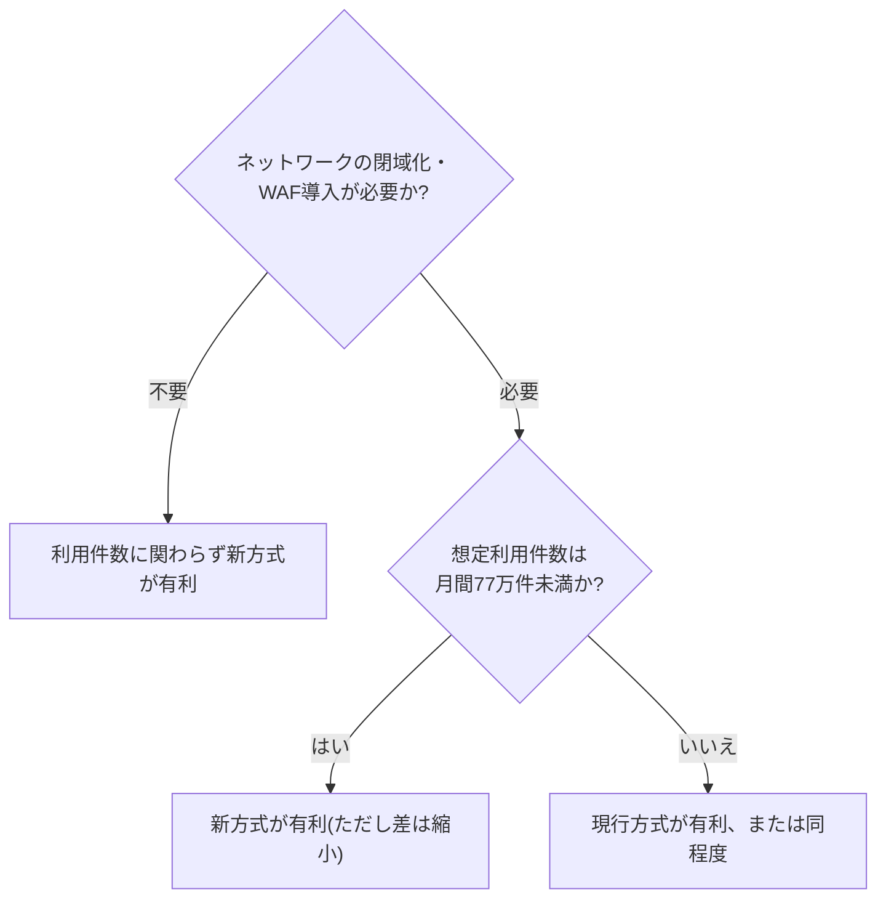

# AgentCore Runtime追加検証レポート ― ネットワーク構成・セキュリティ対策・コストに関する実際の環境での確認

> **本レポートについて**
> 新方式(Amazon Bedrock AgentCore Runtime)への移行を検討する中で挙がった「ネットワーク構成に関する問い」を踏まえ、実際の環境を用いてネットワークの分離・セキュリティ対策(WAF)・コストに関する追加検証を実施した結果をまとめたものです。技術的な専門用語には初出箇所で簡単な解説を付しています。より詳しい一般比較は「01. アーキテクチャ比較」、Claudeからの接続検証は「06. OAuth接続検証」を参照してください。

検証日: 2026年8月21日 | 検証方法: 検証用AWS環境の構築、および実際のネットワーク設定変更を伴う、一連の流れを通した動作確認

---

## 用語解説

本レポートで頻出する技術用語を簡潔に説明します。

| 用語 | 説明 |
|---|---|
| **VPC(Virtual Private Cloud)** | AWS上に構築する、他社の環境とは論理的に分離された仮想プライベートネットワーク |
| **ALB(Application Load Balancer)** | 複数のサーバーへリクエストを振り分ける負荷分散装置 |
| **NATインスタンス** | プライベートネットワーク内のサーバーが、インターネットへ安全に接続するための中継サーバー |
| **API Gateway** | 外部からのAPIリクエストを受け付ける入口となるAWSのマネージドサービス |
| **WAF(Web Application Firewall)** | SQLインジェクション・クロスサイトスクリプティング(XSS)等の攻撃パターンを検知・遮断する、Webアプリケーション向けの防御機構 |
| **CloudFront** | AWSが提供するコンテンツ配信サービス(CDN)。今回はWAFを組み込むための中継点として利用 |
| **VPCエンドポイント** | VPC内からAWSの各サービス(S3、DynamoDB等)へ、インターネットを経由せずに接続するための仕組み。無料の「Gateway型」と、時間課金のある「Interface型」の2種類がある |
| **PrivateLink** | インターネットを経由せず、AWSのプライベートネットワーク内だけで通信を完結させる接続方式 |
| **コールドスタート** | サーバーレス環境で、一定時間利用が無かった後の最初のリクエストに時間がかかる現象 |
| **OAuth 2.0** | 利用者がID・パスワードを直接渡すことなく、同意に基づいて安全にアクセス権を受け渡すための、業界標準の認証・認可の仕組み |
| **動的クライアント登録(DCR)** | 接続元のアプリケーションが、事前の手続きなしにその場で認証基盤へ自己登録できる仕組み |
| **CIMD(Client ID Metadata Document)** | DCRの代替となる、URL形式のクライアント識別情報を用いた登録不要の接続方式 |

---

## サマリー

| # | 論点 | 結論 |
|---|---|---|
| 1 | 標準的な認証方式のみでの接続確認 | Claude Code・Claude.aiに依存しない、標準的な認証方式(OAuth 2.0)のみで接続できる汎用クライアントを新たに作成し、接続に成功しました。ブラウザで操作できる確認用のWebアプリも用意しました |
| 2 | コールドスタートの影響 | 利用が無い時間を0秒から16分まで変化させて計測したところ、応答時間は一貫して**約6秒**であり、コールドスタートによる遅延の増加は確認されませんでした |
| 3 | 現行方式(ECS+API Gateway)との速度比較 | 検証専用環境に現行方式一式を新たに構築し、応答時間を実測したところ**約0.2〜0.3秒で、新方式の約6秒より約20倍速い**という結果になりました。検証の過程で、現行方式の認証設定に関する重要な発見もありました(2.4参照) |
| 4 | ネットワーク(VPC)への配置 | 実際にVPC内へ配置する設定に切り替えて動作確認したところ、外部からの接続に影響はなく、VPC内のデータベースへのアクセスも正常に動作しました。「VPCに配置できない」という点は、実際の環境での検証により、そうではないことが確認できました。設定手順の詳細も整理しました |
| 5 | WAF(攻撃対策)の導入可否 | 新方式にはWAFを直接組み込む場所がありませんが、CloudFrontを経由させることでWAFによる保護を実現できることを、実際の環境で確認しました。実際に攻撃パターンを模したリクエストを送り、正しく遮断されることも確認しました |
| 6 | コストの見直し(1ヶ月試算) | 閉域網対応(VPCへの配置)・WAF導入をどちらも行う、本番展開に近い構成同士で1ヶ月分のコストを試算したところ、コスト面で新方式が有利になる分岐点が、月間およそ610万件から**およそ77万件まで下がる**という結果になりました |
| 7 | 動的クライアント登録(DCR)への対応 | 現在の運用方法(接続情報を事前に個別設定する方式)は、Anthropic社の公式な仕様に準拠した正規の方式であることが判明しました。個別のお客様ごとに導入する形態であれば、追加の対応は不要という結論に至りました。将来的に対応が必要になった場合の手順・コスト感も整理しました |
| 8 | VPC配置に関する問いへの回答 | 「4つのインフラ要素が不要になる」というご理解は正しいです。「VPCに配置できない」という点は、実際の環境での検証の結果、そうではないことが確認できました(詳細は本文3章) |

---

## 1. 検証の背景・目的

本レポートは、以下の問いに対する検証です。

> 「VPC」「負荷分散装置(ALB)」「中継サーバー(NATインスタンス)」「API Gateway」という4つのインフラ要素が、新方式では不要になる。逆に、VPCに配置することができないので、VPCにデータベースやアプリケーションが置かれている場合は通信方法を考える必要があるということでしょうか。

この問いは、これまでの検証(「06. OAuth接続検証」参照)で示した「4要素が不要になる」という結論の裏側にある論点であり、それまでの検証環境では実際に確認できていなかった部分でした。これを機に、ネットワーク分離(VPCへの配置)を実際の環境で検証し、あわせて今回計画していたセキュリティ対策(WAF)の導入可否・コストの見直し・動的クライアント登録に関する調査・標準的な認証方式のみでの接続確認・コールドスタートの計測を実施しました。

## 2. 標準的な認証方式のみでの接続確認・コールドスタートの計測

### 2.1 標準的な認証方式のみでの接続確認

これまでの検証は、AWS専用の署名方式、またはClaude Code・Claude.aiという特定のクライアントを通じたものでした。今回は、それらに依存しない、標準的な認証方式(OAuth 2.0)のみを用いる接続確認用のプログラムを新たに作成し、実際に接続できることを確認しました。

接続の流れは、利用者がログイン画面でID・パスワードを入力し、認証基盤(Amazon Cognito)から発行された「引換券」のようなトークンを使って、新方式のサーバーへリクエストを送るという、一般的なWebサービスのログイン連携と同様の仕組みです。この確認により、想定している6種類の機能(株価情報の取得、ニュース検索等)がすべて正しく認識され、実行できることを確認しました。

### 2.2 コールドスタートの計測結果

同じプログラムを使い、リクエストの間隔を変えて応答時間を計測しました。

| 計測タイミング | 応答時間 |
|---|---|
| 直後 | 6.070秒 |
| 60秒後 | 5.948秒 |
| 5分後 | 5.874秒 |
| 16分後(サーバーレス環境が休止状態に入るとされる時間を超過) | 6.089秒 |

結果: 利用の間隔を0秒から16分まで変化させても、応答時間に明確な差は見られませんでした。一般にサーバーレス環境で懸念される「利用が無かった後の最初のリクエストが特に遅くなる」という現象は、**今回の計測範囲では確認されませんでした**。約6秒という値がほぼ一定であることから、これはサーバーの起動待ちというよりも、リクエストごとに内部処理を一から実行する設計に起因する可能性が高いと考えられます(詳細な原因の特定には、プログラムコード側のさらなる調査が必要です)。

### 2.3 ブラウザで確認できる疎通検証アプリ(2026年8月25日追加)

コマンドラインでの確認に加えて、ブラウザから直接ログイン・動作確認ができる簡易的なWebアプリケーションを新たに用意しました。ボタンを押すとログイン画面に遷移し、ログイン後は「ツール一覧を取得」「銘柄情報を取得」といった操作をその場で試せます。

新方式のサーバー(AgentCore Runtime)自体はMCP専用の設定になっており、通常のWebページをそのまま配信するのには不向きなため、別途軽量な実行環境(AWS Lambda)を用意し、そこでページの配信と、ログイン・MCP呼び出しの中継処理を行う構成にしました。ブラウザからは常に同じ場所(このLambda)にしかアクセスしないようにすることで、異なるサービス間の通信によくある技術的な制約(CORS)を設計上回避しています。実際のMCP呼び出しは、WAFによる保護(4章)を経由する構成にしており、WAFで保護された状態での動作確認も同時に行っています。

確認結果: ページの表示、ログイン、トークンの取得、ツール一覧の取得まで、すべてのステップが問題なく動作することを確認しました。

### 2.4 現行方式(ECS+API Gateway)との定量比較(2026年8月25日追加)

2.2で「利用が無かった後の遅延が確認されなかった」ことを述べましたが、これは「現行方式(常時起動)と同等以上に速い」ことを意味するものではありません。現行方式は常に起動している構成のため、そもそも起動待ちが発生する余地がないためです。そこで、両方式の応答時間そのものを実測して比較しました。

比較対象とした構成は、「01. アーキテクチャ比較」で示している現行方式の構成図と同一です(検証専用環境にそのまま複製したため)。

確認方法: 実クライアントデータを含む本番相当環境への書き込みは禁止のため、既存の設定一式をplayground環境(検証専用アカウント)に複製し、VPC・ネットワーク機器・アプリケーションサーバー・API Gateway・認証基盤・データベースを新規に構築しました。この検証専用環境であれば、実データに影響を与えずテスト用アカウントを自由に作成できます。

検証の過程で判明した重要な発見: 新たに構築した環境で実際にログインを行い、取得した認証情報でAPIを呼び出したところ、**正しくログインできているにもかかわらず、常に認証エラーになる**という現象が確認されました。原因を調査したところ、認証を検証する設定の一部に、実際にCognitoが発行する情報とは一致しない値が指定されていることが分かりました。該当箇所を修正したところ、直ちに正常に動作するようになりました。

重要な留保: 実データを含む本番相当環境そのものへの書き込みは禁止されているため、本番環境で同じ現象が実際に起きているかどうかは今回確認しておりません。ただし、複製した設定は本番相当環境のものと同一のロジックであるため、**本番環境でも同様の現象が起きている可能性があります**。現行方式では、外部のAIクライアントからの完全なログイン確認(ログイン→認証情報取得→機能呼び出しまでの一連の流れ)がこれまで実施されていなかった背景には、この点が関係している可能性があります。本番環境での実際の動作確認を、優先度の高い課題として別途対応することを推奨します。

応答時間の実測比較: 修正後の検証専用環境で、同じ操作を5回連続で実行し応答時間を計測しました。

| # | 現行方式(ECS+API Gateway) | 新方式(AgentCore Runtime、2.2の実測) |
|---|---|---|
| 1 | 0.311秒 | 6.070秒 |
| 2 | 0.304秒 | 5.948秒 |
| 3 | 0.305秒 | 5.874秒 |
| 4 | 0.319秒 | 6.089秒 |
| 5 | 0.231秒 | (同様に約6秒) |

結果: 現行方式の応答時間は**約0.2〜0.3秒で、新方式の約6秒と比べて約20倍速い**という結果になりました。

所見: 「利用が無かった後の遅延が無い」ことと「応答が速い」ことは別の論点です。新方式は常時起動ではないため起動待ちという不確実性はありませんが、すべてのリクエストにおいて、常時起動の現行方式より一貫して応答が遅いという結果になりました。応答速度を重視する用途では、この定常的な速度差が実質的な判断材料になります。

## 3. ネットワーク(VPC)への配置に関する実際の環境での検証

### 3.1 検証内容

冒頭の問いを検証するため、検証専用のネットワーク環境(VPC)を新たに構築し、新方式のサーバーを実際にそのVPC内へ配置する設定に切り替えて動作確認しました。

検証にあたり、VPC内からAWSの各サービス(コンテナイメージの取得元、データベース等)へ接続するための「VPCエンドポイント」をあわせて構築しました。これらのうち一部(コンテナイメージの取得に使うもの)は、構築にあたって時間課金が発生します。

### 3.2 検証結果

1. 外部からの接続への影響はありませんでした。VPC内へ配置する設定に切り替えた後も、外部のクライアントから新方式のサーバーへの接続は、切り替え前と同一の応答時間・同一の結果で機能し続けました。「VPC内に配置すると外部から直接呼び出せなくなる」というご懸念は、実際の環境での検証により当てはまらないことが確認できました
2. VPC内のデータベースへのアクセスにも成功しました。新方式のサーバーからVPC内のデータベース(DynamoDB)への認可チェック処理が正常に完了し、外部の株価情報API呼び出し部分(検証用の認証情報を投入していないため意図的に失敗する設定)まで到達しました。これは、VPC内へ配置した新方式のサーバーが、必要な設定(VPCエンドポイント)を追加すれば、VPC内のデータベースやアプリケーションに正しくアクセスできることの実証です

結論: 「VPCに配置できない」という前提は、実際の環境での検証の結果、正確ではないことが確認できました。新方式のサーバーはVPC内へ配置する設定に切り替えることができ、その状態でも外部からの接続・VPC内リソースへのアクセスの両方が問題なく機能します。ただし、VPC内へ配置するには相応の追加設定(VPCエンドポイントの構築)が必要であり、これは追加の実装コストとして正しくお伝えする必要があります。なお、インターネットを完全に経由しない接続方式(PrivateLink)については、今回構築した環境を使って次回以降さらに検証を進める予定です。

### 3.3 設定手順(2026年8月25日追加)

今回の設定内容は、構成管理ツール(Terraform)のコードとして再現可能な形にまとめてあります。実際に本番環境へ導入する際に、担当エンジニアが同じ手順を再現できるよう、社内向けの技術資料に整備済みです。

## 4. セキュリティ対策(WAF)の導入可否に関する実際の環境での検証

### 4.1 前提

新方式のサーバーには、従来の負荷分散装置やAPI Gatewayのような、WAFを直接組み込める場所が存在しません。そのため、AWSのWAFサービスを新方式のサーバーへ直接組み込むことはできません。

### 4.2 検証した代替方法

CloudFront(コンテンツ配信サービス)を新方式のサーバーの手前に配置し、そこにWAFを組み込む構成を実際に構築して検証しました。この構成であれば、利用者からのリクエストはまずCloudFront・WAFを経由し、そこで問題が無いと判断されたリクエストのみが新方式のサーバーへ届くようになります。

### 4.3 検証結果

1. 正常なリクエストは、CloudFront・WAFを経由しても、直接接続した場合と同一の結果・同等の応答時間で新方式のサーバーへ到達し、正しく処理されました
2. 攻撃パターンを模したリクエスト(クロスサイトスクリプティングの典型的なパターンを含むリクエスト)を送信したところ、**WAFが実際に検知し、遮断しました**(新方式のサーバーには到達しませんでした)。これにより、WAFが単に組み込まれているだけでなく、実際にリクエストを検査・遮断する機能を果たしていることを確認しました

結論: 新方式のサーバー自体にWAFを直接組み込むことはできませんが、CloudFrontを経由させる構成であれば、WAFによる保護を実現できることを、実際の環境で確認しました。この構成を導入する場合、CloudFrontの利用料・WAFのルール評価にかかる料金が追加コストとして発生します。また、構成に新たな要素(CloudFront)が加わる分、監視・運用の対象も増える点は留意事項としてお伝えします。

## 5. コストの見直し

これまでのコスト試算(「02. コストシミュレーション」参照)は、1回の処理あたりの実際の処理時間を保守的に1秒と仮定していました。今回計測した応答時間(約6秒、2章参照)を踏まえて試算の見直しを検討しましたが、**この6秒をそのまま課金額の計算に使うのは適切ではない**と判断しました。

理由は、新方式の課金対象が「実際にサーバーが処理している時間」のみであり、外部のデータベースやAPIからの応答を待っている時間は課金対象外とされているためです。今回計測した約6秒には、こうした「待ち時間」がどの程度含まれているかを分解できておらず、実際の課金対象時間は6秒よりかなり小さい可能性があります。

このため、既存の保守的な試算はそのまま維持することとし、より正確な金額は、実際にサービスを稼働させた後の利用実績(AWSの費用管理ツール)で確認することを推奨する、という位置づけに整理しました。

なお、VPC内への配置(3章)を行う場合は、コンテナイメージ取得に使うVPCエンドポイントの時間課金が、新たな固定費として発生する点も申し添えます。

### 5.1 1ヶ月分のコスト試算: 閉域網対応・WAF導入込みの本番展開を想定(2026年8月25日追加)

ネットワークの閉域化(3章)とWAF導入(4章)をどちらも行う、本番展開に近い構成同士で、1ヶ月分のコストを試算しました。

| 月間の利用件数 | 新方式(閉域化+WAF込み) | 現行方式(WAFのみ追加) |
|---|---|---|
| 10,000件 | 約 46ドル | 約 52ドル |
| 100,000件 | 約 47ドル | 約 52ドル |
| 1,000,000件 | 約 55ドル | 約 54ドル |
| 5,000,000件 | 約 93ドル | 約 60ドル |

閉域化・WAF導入の固定費が加わることで、新方式の固定費が現行方式とほぼ同水準になります。その上で新方式は利用件数に比例した費用が上乗せされるため、**コスト面で新方式が有利になる分岐点は、月間およそ610万件から、およそ77万件まで下がる**という結果になりました。

**重要な所見**: 「新方式は利用量が少なければ大幅に安い」という結論は、ネットワークの閉域化やWAF導入を前提にしない場合に限られます。金融機関向けサービスとして求められるセキュリティ要件を満たそうとすると、コスト面の優位性は想定される利用件数によって失われる可能性があります。

判断の考え方を整理すると、次のようになります。

## 6. 動的クライアント登録(DCR)に関する調査

### 6.1 調査結果

Claude(Anthropic社)の公式ドキュメントを調査したところ、認証基盤が動的クライアント登録(DCR)に対応していない場合の対応方法として、3つの選択肢が示されていることが分かりました。

| 選択肢 | 概要 | 現状の認証基盤(Cognito)での実現性 |
|---|---|---|
| DCRそのものへの対応 | 接続元のアプリケーションが事前登録なしに自己登録できる仕組みを実装する | 現状の認証基盤は非対応。実現には新たな仕組みの構築が必要 |
| CIMD(前述の用語解説参照)への対応 | URL形式のクライアント識別情報を用いる、登録不要の接続方式 | 現状の認証基盤では技術的に対応が難しく、DCR同様に新たな仕組みの構築が必要 |
| Anthropic社への事前登録 | 事前に発行した接続情報をAnthropic社に登録し、利用者の同意を得た後の手続きをAnthropic社側で代行してもらう方式 | 現状の認証基盤の変更は不要。既存の接続情報をそのまま登録できる可能性がある |

さらに、Anthropic社の公式ドキュメントには「管理者が独自の接続情報を接続時に入力できる方式は、動的クライアント登録を完全に回避できる正規の手段である」と明記されていることが分かりました。つまり、現在運用している「接続情報を事前に個別設定する」方式は、回避策ではなく公式にサポートされた標準的な方式だったことが判明しました。

### 6.2 結論

動的クライアント登録への対応が必要になるかどうかは、外販するサービスの提供形態によって異なります。

| 提供形態 | 対応方針 |
|---|---|
| 金融機関ごとに個別に導入し、各社の管理者が接続情報を個別設定する | 現状の方式のままで対応済み(公式の標準的な方式)。追加対応は不要 |
| Anthropic社の公開ディレクトリに掲載し、複数の組織がセルフサービスで追加できるようにする | Anthropic社への事前登録(前述の3つの選択肢の1つ)が最も現実的。DCR・CIMDへの本格対応は、必要となる工数に対して見合わない可能性が高い |

今回は調査までとし、実際の対応(必要と判断された場合)は、他の検証タスクがすべて完了した後に着手する方針としました。

### 6.3 将来対応する場合の手順・コスト感(2026年8月25日追加)

将来的に、個別のお客様ごとの導入から、複数の組織がセルフサービスで追加できる形態へ移行する場合を想定し、2つの選択肢の移行手順と費用感を整理しました。

**選択肢A: Anthropic社への事前登録(推奨)**

ビジネス上の必要性を確認した上で、既存の接続情報をAnthropic社へ送付し登録を依頼するだけで対応が完了します。システムの変更は一切不要で、必要な工数はAnthropic社とのやり取りのみ(数時間から1日程度)です。追加の利用料も発生しません。

**選択肢B: 動的クライアント登録(DCR)そのものへの対応**

現在の認証基盤(Cognito)の手前に、新たな中継システムを構築する必要があります。おおよその目安として、最小限の実装で3〜5営業日程度、より高度な方式(CIMD)まで含めると1〜2週間程度のエンジニアリング工数が見込まれます。追加のシステム利用料は比較的小さい一方、新たに増え続ける接続情報の管理・棚卸しといった運用上の負荷が継続的に発生し、選択肢Aと比べて明確に工数・リスクが高くなります。

結論: 将来的にこの対応が必要になった場合も、まず選択肢A(Anthropic社への事前登録)を検討し、それでも要件を満たせない場合にのみ選択肢Bを検討することを推奨します。

## 7. VPC配置に関する問いへの回答(まとめ)

> 「VPC」「負荷分散装置(ALB)」「中継サーバー(NATインスタンス)」「API Gateway」という4つのインフラ要素が、新方式では不要になる。逆に、VPCに配置することができないので、VPCにデータベースやアプリケーションが置かれている場合は通信方法を考える必要があるということでしょうか。

前半のご理解は正しく、後半については実際の環境での検証により前提が異なることが確認できました。

- **前半(4要素が不要)は事実**: 現行方式はVPC内に負荷分散装置・アプリケーションサーバー・中継サーバーを配置し、API Gatewayがそれらへ接続する構成でした。新方式はこれらを一切介さず、サーバー自身への直接的な接続のみで完結します
- **後半(VPCに配置できない)は前提が異なる**: 新方式のサーバーには「VPC外に配置する」設定と「VPC内に配置する」設定の2種類があり、VPC内に配置する設定を選べば、VPC内のデータベースやアプリケーションにアクセスできることを今回の実際の環境での検証で確認しました(3章)。標準設定ではVPC外に配置されますが、必要に応じてVPC内配置へ切り替えられる、というのが正確なご理解になります

## 8. 今後の検討事項

- **【優先度高】現行方式の認証設定について、本番環境での実際の動作確認**(2.4参照)。検証専用環境の複製では、正しくログインしても認証エラーになる現象が確認され、設定の修正で解消しました。本番環境そのものは未確認ですが、同一の設定であるため影響している可能性があります
- インターネットを完全に経由しない接続方式(PrivateLink)自体の、実際の環境での検証(今回構築した環境を使って次回実施可能)
- WAFの代替構成(CloudFront)を本番環境に導入する場合の、運用体制の整理
- コストの正確な把握には、実際の利用実績データに基づく確認が必要
- 動的クライアント登録への対応(必要と判断された場合、他タスク完了後に着手予定。手順・費用感は6.3参照)

## 9. まとめ

- 冒頭の問いに対し、実際の環境での検証によって正確にお答えできるようになりました(VPC内への配置は技術的に可能。ただし追加の設定・コストが必要)
- ネットワーク構成の変更・セキュリティ対策の追加のいずれも、実際の環境で問題なく機能することを確認し、金融機関向けサービスとして求められる要件への対応の見通しが立ちました
- 一方で、現行方式と応答時間を実測比較したところ、現行方式の方が約20倍速く、ネットワークの閉域化・WAF導入をどちらも行う構成同士で比較すると、コスト面で新方式が有利になる分岐点も月間610万件から約77万件まで下がるなど、**新方式の優位性は無条件ではない**ことが実測で明らかになりました
- 検証の過程で、現行方式の認証設定に関する重要な発見(2.4参照)もありました
- 「利用が無かった後の遅延が見られなかった」という点や、「応答時間がそのままコストに直結しない」という点など、実際に動かしてみて初めて分かった論点も多く、**書面上の調査だけでは判断を誤りかねない部分が複数あった**ことも、今回の検証を通じて得られた重要な知見です

---

## 10. 実際にご覧いただけるデモ環境

今回構築した疎通検証アプリ(2.3参照)のページは、以下のURLから実際にご覧いただけます。ログインには検証専用のテストアカウントを使用する仕組みになっており、実際の契約情報や実データは含まれていません。実際にログインしてお試しになりたい場合は、テスト用のログイン情報を別途安全な方法でお渡しします。

| 項目 | URL |
|---|---|
| 疎通検証アプリ | https://ldqokcn33yxb2lspfudhahj2we0pgfqa.lambda-url.ap-northeast-1.on.aws/ |

---

## 出典・参考資料

**社内ドキュメント**
- [01-architecture-comparison.md](./01-architecture-comparison.md) — 新方式・現行方式の一般比較
- [02-cost-simulation.md](./02-cost-simulation.md) — コストシミュレーションの前提・試算
- [04-ecs-apigateway-verification.md](./04-ecs-apigateway-verification.md) — 現行方式の稼働確認ログ
- [05-security-compliance-verification.md](./05-security-compliance-verification.md) — セキュリティ・コンプライアンス比較検証
- [06-agentcore-oauth-claude-code-verification-client.md](./06-agentcore-oauth-claude-code-verification-client.md) — Claudeからの接続検証

**外部ドキュメント**
- [Authentication for connectors](https://claude.com/docs/connectors/building/authentication) — Anthropic社によるDCR/CIMD/接続方式の公式仕様
- [Protecting data using VPC and PrivateLink](https://docs.aws.amazon.com/bedrock-agentcore/latest/devguide/vpc.html) — AWSによるVPC/PrivateLink対応の公式仕様

---

## 11. 次週の検証アクションプラン

今回の検証結果を踏まえ、次週実施を予定している項目を優先度順にまとめます。

| # | 内容 | 優先度 |
|---|---|---|
| 1 | 現行方式の認証設定について、本番環境での実際の状況を確認し、対応方針を決定します | 最優先 |
| 2 | インターネットを完全に経由しない接続方式(PrivateLink)自体の、実際の環境での検証を行います | 高 |
| 3 | WAFによる保護を本番環境に導入する場合の、監視・運用体制を整理します | 中 |
| 4 | 実際にリクエストを流した上で、AWSの費用管理ツールを使って正確なコストを確認します | 中 |
| 5 | 動的クライアント登録(DCR)への対応が必要かどうかを、事業計画とあわせて判断します | 中 |
| 6 | Claude Desktop版からの接続確認(Web版は確認済みのため) | 低 |

項目1は実装作業ではなく状況確認が中心のため、早期に着手できる見込みです。項目2〜4は並行して進めます。項目5は事業判断待ちのため、判断が出た時点で着手します。
