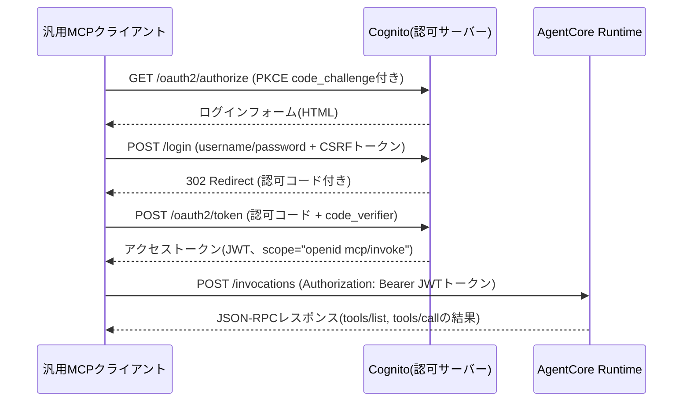
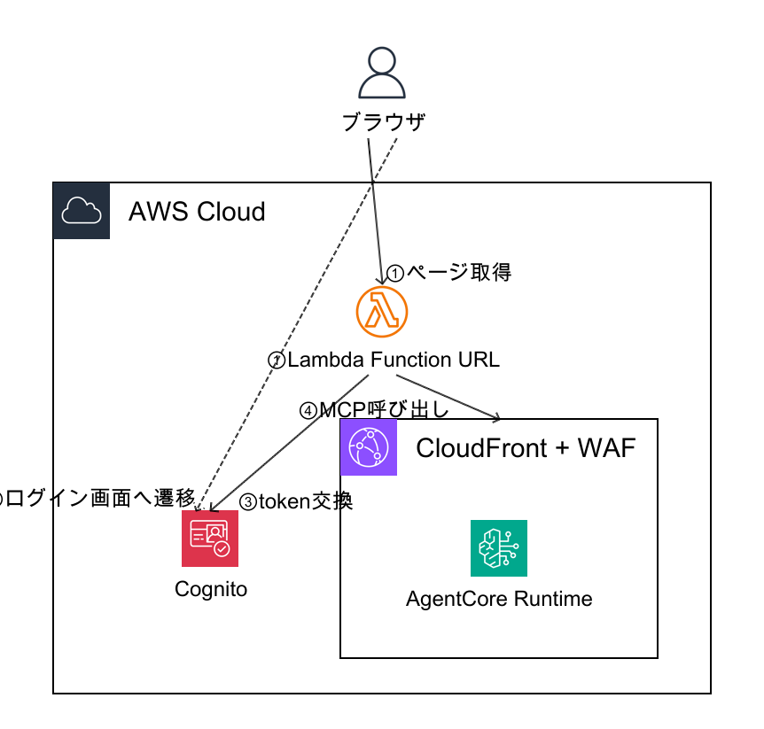
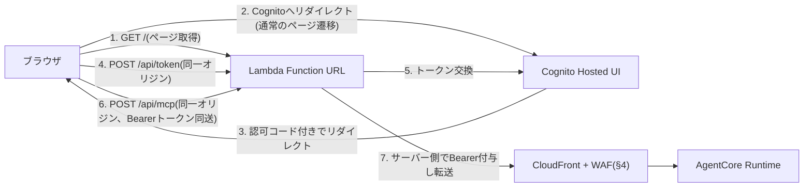
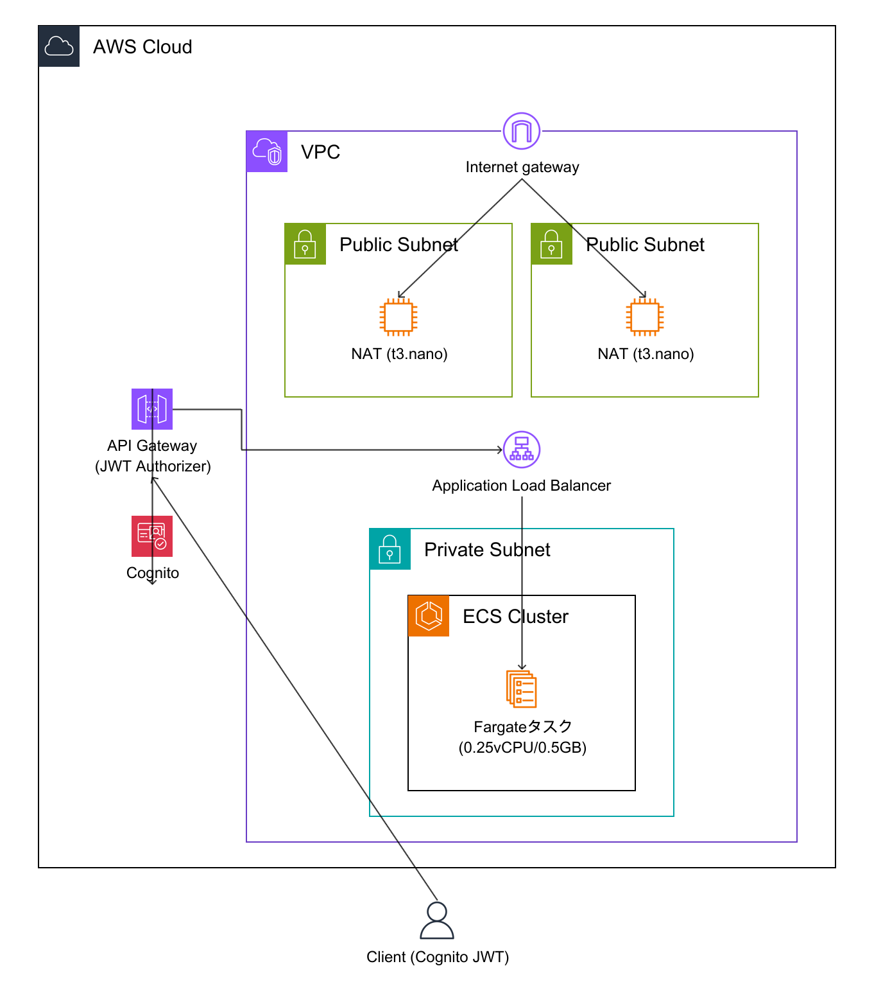
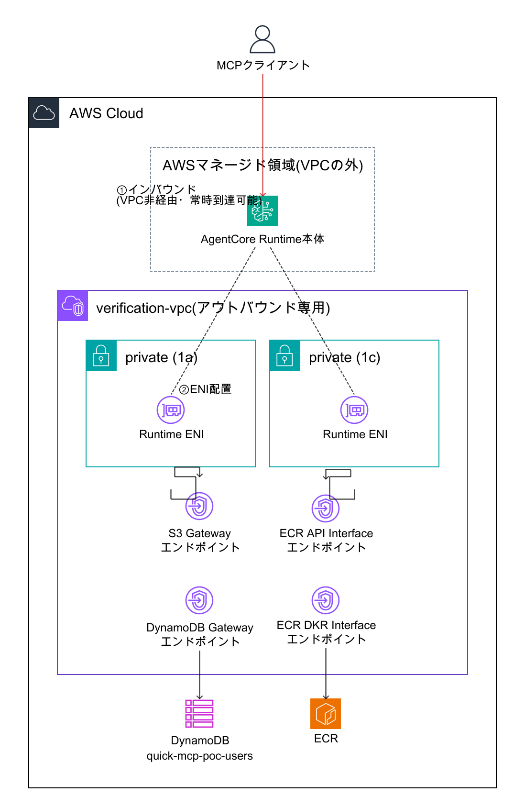
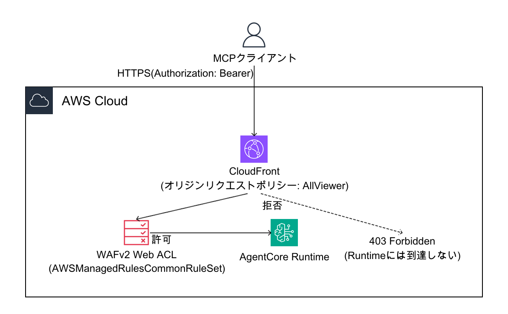
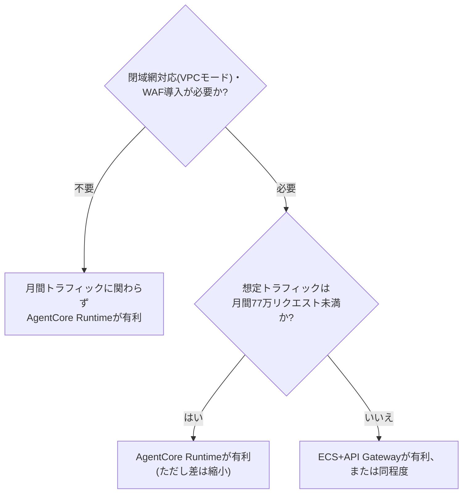

# AgentCore Runtime追加検証: VPCモード・WAF代替構成・コスト再検討・DCR机上調査

> この章で分かること
> 「VPC・ALB・NATインスタンス・API Gatewayが新方式では不要になる一方、AgentCore RuntimeはVPCに配置できないのでは」という問いに対し、実機でAgentCore RuntimeをVPCモードに切り替えて検証した結果、およびWAF導入可否・コスト再検討・DCR(動的クライアント登録)机上調査をまとめる。[03-agentcore-runtime-verification.md](./03-agentcore-runtime-verification.md)の基本疎通検証、[05-security-compliance-verification.md](./05-security-compliance-verification.md)の机上調査を踏まえ、今回は**実機での裏付け**を中心に掘り下げる。

検証日: 2026-08-21 | 検証方法: playgroundアカウントでの実機構築・実際のHTTPS呼び出しによるエンドツーエンド確認

---

## TL;DR

| # | 論点 | 結論 |
|---|---|---|
| 1 | 汎用MCPクライアントからの疎通 | boto3/Claude Code/Claude.aiに依存しない、OAuth 2.0(Authorization Code + PKCE)準拠の素のHTTPSクライアントを新規作成し、疎通に成功。MCPプロトコル層・JWT認証・DynamoDB認可チェックまで正常動作を確認。ブラウザから操作できる疎通検証Webアプリ(Lambda Function URLでホスト)も構築した |
| 2 | コールドスタートの影響 | アイドル0秒〜16分(セッションタイムアウト900秒超え)まで、レイテンシは一貫して約6秒。**コールドスタートによる有意な差は観測できなかった**(意外な発見。§2で詳述) |
| 3 | 既存構成(ECS+API Gateway)との定量比較 | playgroundにECS+API Gateway一式を新規複製し、定常状態の応答時間を実測。**約0.2〜0.3秒で、AgentCore Runtimeの約6秒より約20倍速い**。検証の過程で、本番相当terraformコードのJWT Authorizer`audience`設定に、正当なトークンでも常に401になる潜在的な不具合を発見した(§2.4) |
| 4 | VPCモードへの実機切り替え | 実際に`networkMode: VPC`へ切り替え、インバウンド(`invocations`エンドポイント)への影響なし、DynamoDB等VPC内リソースへのアウトバウンドアクセスも成功。クライアントの「VPCに配置できない」という前提は実機で否定された。設定手順・Terraformコード例も整備した(§3) |
| 5 | WAF導入可否 | AgentCore Runtime自体には直接アタッチ不可(ALB/API Gatewayのような前段リソースが無いため)。CloudFrontをリバースプロキシとして前段に配置する代替構成を実機構築し、正常リクエストの通過・悪意あるリクエストの403ブロックの両方を確認 |
| 6 | コスト再検討(1ヶ月試算) | 閉域網対応(VPCモード)・WAF導入をどちらも行う「本番展開に近い構成」同士で1ヶ月試算した場合、損益分岐点は当初の約610万リクエスト/月から**約77万リクエスト/月まで下がる**(§5) |
| 7 | DCR(動的クライアント登録)対応の要否 | Cognito自体はRFC 7591のDCRに非対応。ただし現状の運用(Client ID/Secretの事前登録・個別設定)は、Anthropic公式ドキュメントが定める「Custom connector」の正規フローそのものであり、個別コネクタとして提供する形態なら追加対応は不要。ディレクトリ掲載への移行手順・コスト試算も整理した(§6.3) |
| 8 | VPC配置に関する問いへの回答 | 「4つのインフラ要素が不要になる」は正しい。「VPCに配置できない」は不正確で、VPCモードを使えばRuntime自体をVPC内に配置できる(§3で実機裏付け) |

---

## 1. 検証の背景・目的

本検証は、次の問いに実機で答えることを目的とする。

> 「VPC」「負荷分散装置(ALB)」「中継サーバー(NATインスタンス)」「API Gateway」という4つのインフラ要素が、新方式では不要になる。逆に、VPCに配置することができないので、VPCにDBやAppが置かれている場合は通信方法を考える必要があるということでしょうか。

この質問は、[06-agentcore-oauth-claude-code-verification.md](./06-agentcore-oauth-claude-code-verification.md)で示した「4要素が不要になる」という結論の裏面を突いており、AgentCore Runtimeが`PUBLIC`モードでしか検証されていなかった当時点では、正確に回答できない状態だった。これを機に、[05-security-compliance-verification.md](./05-security-compliance-verification.md)で机上調査にとどまっていたVPCモードへの実機切り替えと、あわせて今週計画していたWAF導入可否・コスト再検討・DCR机上調査・汎用MCPクライアント疎通・コールドスタート測定を実施した。

## 2. 汎用MCPクライアントからの疎通検証・コールドスタート測定

### 2.1 汎用クライアントの実装

これまでの疎通確認は、boto3 + SigV4署名を使うスクリプト([03-agentcore-runtime-verification.md](./03-agentcore-runtime-verification.md))、またはClaude Code/Claude.aiという特定のMCPクライアント実装([06-agentcore-oauth-claude-code-verification.md](./06-agentcore-oauth-claude-code-verification.md))を通じたものだった。Runtimeが現在Custom JWT Authorizer方式(IAM認証とは排他)であるため、**boto3のSigV4ベースのAPIはもはや使用できない**。

そこで、OAuth 2.0の認可コード + PKCEフローのみでBearerトークンを取得し、素のHTTPSで`invocations`エンドポイントを呼ぶ汎用クライアントスクリプト(`scripts/invoke_agentcore_mcp_jwt.py`)を新規作成した。



`tools/list`は6ツール(`get_quote`, `get_price_history`, `get_intraday_history`, `search_news`, `get_ranking`, `search_stocks`)を正しく取得した。`tools/call`(`get_quote`)はMCPプロトコル層・JWT認証・DynamoDBの認可チェック(`getUser`)まで正常に到達し、最終的に`QUICK_API_USER / QUICK_API_PASS are not set`で失敗した。これはplayground環境に実際のQUICK APIシークレットを投入していないためであり、想定通りの結果(認証・認可レイヤーが正しく機能していることの裏付け)である。

### 2.2 コールドスタート/レイテンシ測定

同スクリプトでアクセストークンを再利用し(`--reuse-token`)、リクエスト間隔を変えて4回計測した。

| タイミング | レイテンシ(応答完了まで) |
|---|---|
| 直後(t=0) | 6.070秒 |
| 60秒後 | 5.948秒 |
| 5分後 | 5.874秒 |
| 16分後(`idleRuntimeSessionTimeout`=900秒を超過) | 6.089秒 |

`curl -w`でDNS/TCP/TLSハンドシェイクの内訳も取得したところ、TLSハンドシェイク完了(`time_appconnect`)は0.1〜0.2秒程度で、最初の応答バイトを受け取るまで(`time_starttransfer`)が約6秒を占めていた。

所見: アイドル時間0秒〜16分(セッションタイムアウト超過後)まで、レイテンシに有意な差は見られなかった。一般に想像される「アイドル後の初回リクエストのみ遅いコールドスタート」という現象は、**今回の計測範囲では観測できなかった**。

### 2.2.1 6秒の内訳(2026-08-26追加)

CloudWatch Logs(`/aws/bedrock-agentcore/runtimes/quickMcpPocVerification-Aoo0d23yyj-DEFAULT`)を確認したところ、**リクエストごとに新しいログストリーム(コンテナ)が作成され、1本あたり`MCP server listening on port 8000`という起動ログが1行だけ記録される**ことを確認した。これは「リクエストごとに新しいコンテナが起動している」ことの直接的な証拠である。

ログストリームの作成時刻から起動完了ログのタイムスタンプまでの差分を約30サンプルで計測したところ、**3.78〜4.07秒(平均約3.9秒)で極めて安定**していた。これにより、6秒の内訳は次のように推定できる。

| 区間 | 時間 | 根拠 |
|---|---|---|
| コンテナ起動〜アプリ起動 | 約3.9秒(約65%) | CloudWatch Logsの実測(上記) |
| TLSハンドシェイク | 約0.1〜0.2秒(2〜3%) | `curl -w`の`time_appconnect`実測(§2.2既出) |
| 残り(JWT検証・DynamoDB認可チェック・MCP処理・応答生成) | 約1.9〜2.0秒(約32%) | 直接計測しておらず、全体から上記2つを引いた残差 |

**アイドル時間によらずレイテンシが一定だった理由がここで説明できる**: そもそも毎回コンテナが新規起動しており、「ウォームな状態」自体が存在しないため、アイドル時間の長さに関わらず常に同じ約3.9秒のコンテナ起動コストが乗る。§2.2で「MCPサーバー実装がリクエストごとに新しいインスタンスを生成している可能性が高い(推測)」としていた点は、コンテナレベルでも同様の現象が起きていることを実機で確認できた。

**コスト面への含意**: コンテナ起動処理はネットワークI/O待機ではなくCPUバウンドな処理(Node.jsランタイムの起動・モジュール読み込み等)である可能性が高く、[02-cost-simulation.md](./02-cost-simulation.md)で述べた「壁時計6秒のうちどれだけがI/O待機(無課金)か」という論点に対しては、**この3.9秒の大部分はアクティブCPU時間として課金対象になっている可能性が高い**ことを示唆する。ただし本Runtimeは複数の検証者が共有するplaygroundアカウント内にあり、AWS Cost Explorer・CloudWatchの請求メトリクスは他の検証(Claude Code等のMCPクライアントによる定期的なバックグラウンド接続を含む)の影響を受けて大きく変動するため、**本Runtime単体の1リクエストあたり実費用を実測から正確に切り出すことはできなかった**。[02-cost-simulation.md](./02-cost-simulation.md)の試算は実測ではなく単価からの逆算に基づく参考値であることを、あらためて明記する。

### 2.3 疎通検証Webアプリのホスティング(2026-08-25追加)

CLIスクリプトに加えて、ブラウザから直接OAuthログイン→MCP呼び出しを確認できる疎通検証用Webアプリを新規に構築・公開した。AgentCore RuntimeはMCPプロトコル専用に設定済みで、ブラウザ向けの静的ページをそのままホストするのには不向きなため、**Lambda Function URL**(認証不要のパブリックURL)でホストし、ページの配信と2つのAPI(トークン交換・MCP呼び出し)を同じLambda内で処理する構成にした。

**構成図**



**処理シーケンス**



`/api/token`・`/api/mcp`をLambda内のサーバーサイド処理として実装し、ブラウザのJavaScriptからは常に同一オリジン(Lambda自身)にしかリクエストしない構成にした。これにより、Cognitoやbedrock-agentcoreエンドポイントへのブラウザ直接fetchで発生しうるCORS(クロスオリジン制約)の懸念を設計上回避している。MCP呼び出し自体は、WAF検証(§4)で構築したCloudFront経由のエンドポイントを利用しており、WAF保護下での疎通も同時に実証している。

**構築手順の概要**:
1. Lambda実行用IAMロールを作成(基本実行ポリシーのみ)
2. Lambda関数(Node.js、HTML配信+`/api/token`+`/api/mcp`)を作成し、Function URL(`AuthType: NONE`)を有効化
3. 取得したFunction URLをリダイレクトURIとして、新規のCognito public App Client(client_id/secret不要、PKCE専用)を作成
4. AgentCore Runtimeの`authorizerConfiguration.allowedClients`に、この新しいclient_idを追加(既存のClaude.ai用client_idは維持)
5. ログイン→トークン交換→`tools/list`/`tools/call`の一連の動作をcurlでサーバー側ロジックとして事前検証した上で、ブラウザでの動作確認に引き渡した

**検証結果**: ページ表示・ログイン・トークン交換・`tools/list`呼び出しの全ステップが成功した(サーバー側の`/api/token`・`/api/mcp`エンドポイントをcurlで直接呼び出し、レスポンスを確認済み)。

### 2.4 既存構成(API Gateway + ECS)との定量比較(2026-08-25追加)

§2.2で「AgentCore Runtimeにはコールドスタートが観測されない」ことを確認したが、これは「既存構成(常時起動)と同等以上に速い」ことを意味しない。ECSはdesiredCount=1の常時起動構成であり、Lambda的な意味でのコールドスタートは原理的に発生しないため、両者を同じ基準(コールドスタートの有無)で比較するのは適切ではない。そこで、定常状態の応答時間そのものを実測して比較した。

比較対象の構成は、既存の[01-architecture-comparison.md](./01-architecture-comparison.md)にあるパターン4の構成図と同一である(playgroundにそのまま複製したため)。



検証方法: 本番相当アカウント(実クライアントデータを含むため書き込み禁止)の代わりに、既存のterraform一式をplaygroundアカウントに複製し、VPC・NAT・ALB・ECS・API Gateway・Cognito・DynamoDBを新規構築した(既存のterraformコードをそのまま流用。差分はテーブル名・Cognitoドメイン名等の命名衝突回避のみ)。playground専用の新規Cognitoプールのため、実クライアントデータに影響を与えずテストユーザーを自由に作成できた。

検証中に判明した重要な発見(本番相当terraformコードの潜在的な不具合): 新規構築した環境で実際にOAuthログイン(`InitiateAuth`)を行い、取得したID Token・Access Tokenの両方でAPI Gatewayを呼び出したところ、**有効な認証済みトークンにもかかわらず常に401 Unauthorizedで拒否された**。原因を調査したところ、`terraform/apigateway.tf`のJWT Authorizer設定が次のようになっていることが分かった。

```hcl
jwt_configuration {
  audience = [aws_cognito_resource_server.mcp.identifier]  # 例: "https://xxxx.execute-api.../mcp"
  issuer   = "https://cognito-idp.ap-northeast-1.amazonaws.com/${aws_cognito_user_pool.main.id}"
}
```

`audience`にCognito resource serverの識別子(URL文字列)を指定しているが、Cognitoが実際に発行するトークンの`aud`(ID Token)または`client_id`(Access Token)は常にApp Client IDであり、このURL文字列とは一致しない。そのため、この設定ではどのような正当なトークンを使っても認可が通らない。playground環境で`audience`を`aws_cognito_user_pool_client.mcp.id`(App Client ID)に修正したところ、直ちに200 OKで成功するようになった。

重要な留保: 本番相当アカウント(`professional_services_quick_poc`)への書き込みは禁止のため、本番環境で実際に同じ現象が起きているかは未確認である。ただし、terraformコードは本番相当アカウントのものをそのまま複製したものであり、ロジックは同一のため、**本番環境でも同様にOAuthログインが機能していない可能性が高い**。[04-ecs-apigateway-verification.md](./04-ecs-apigateway-verification.md)で「完全なエンドツーエンドの疎通確認は実施していない」と明記されていた背景には、この潜在的な不具合が関係している可能性がある。本番環境での実際の動作確認と、必要であれば`terraform/apigateway.tf`の修正を、別途優先度の高いタスクとして扱うことを推奨する。

応答時間の実測比較: 修正版のplayground環境で、`tools/list`を5回連続実行し応答時間を計測した。

| # | ECS+API Gateway | AgentCore Runtime(§2.2の実測) |
|---|---|---|
| 1 | 0.311秒 | 6.070秒 |
| 2 | 0.304秒 | 5.948秒 |
| 3 | 0.305秒 | 5.874秒 |
| 4 | 0.319秒 | 6.089秒 |
| 5 | 0.231秒 | (同様に約6秒) |

結果: ECS+API Gatewayの定常状態の応答時間は**約0.2〜0.3秒で、AgentCore Runtimeの約6秒と比べて約20倍速い**。`tools/call`(`get_quote`、実APIシークレット未設定のため意図的に失敗する経路)でも0.37秒程度であり、同様の傾向だった。

所見: 「コールドスタートが無い」ことと「レスポンスが速い」ことは別の論点である。AgentCore Runtimeは常時起動ではないためコールドスタートという不確実性は無いが、すべてのリクエストが常時起動のECS構成より一貫して遅い(§2.2で述べた、リクエストごとの初期化コストが原因と推測される)。レイテンシに敏感な用途では、この定常状態の応答速度の差が実質的な判断材料になる。

## 3. VPCモード実機切り替え検証

### 3.1 検証用リソースの構築

playgroundにquick-mcp-poc専用の検証用VPCを新規作成し、AgentCore Runtimeの`networkConfiguration.networkMode`を`PUBLIC`から`VPC`へ実際に切り替えた(Runtime version 6 → 7)。他プロジェクトの既存VPC(playgroundは共用アカウントのため多数存在)とは意図的に分離した。



| リソース | 用途 |
|---|---|
| VPC + private subnet ×2(異なるAZ) | Runtime ENIの配置先 |
| セキュリティグループ(自己参照で443番ポートを許可) | Runtime ENIとVPCエンドポイント間の通信許可 |
| S3 Gateway VPCエンドポイント | サービス管理S3ゲートウェイの代替(無料) |
| DynamoDB Gateway VPCエンドポイント | アプリの認可チェック(`getUser`)がDynamoDBにアクセスするため(無料) |
| ECR API / ECR DKR Interface VPCエンドポイント | コンテナイメージのpullに必須(下記3.2参照、時間課金あり) |

### 3.2 詰まった点

| # | 問題 | 原因 | 対応 |
|---|---|---|---|
| 1 | `networkMode: VPC`に切り替えた直後、Runtimeが`UPDATING`のまま10分以上進行しない | 2026年5月5日ロールアウト以降に作成されたRuntime(本Runtimeもこれに該当)は、service-managed S3 Gatewayを経由せず、S3アクセスを含む全ネットワークアクセスが自社VPC設定に従う仕様。プライベートECRリポジトリからのイメージpull(ECR API呼び出し+S3経由のレイヤーダウンロード)に、NAT/IGWまたはECR用VPCエンドポイントが必須だった | ECR API/DKRのInterfaceエンドポイントを追加。追加後、数十秒でREADYに遷移した |
| 2 | Interfaceエンドポイントの作成が`InvalidParameter`で失敗する | InterfaceエンドポイントのプライベートDNS有効化には、VPCの`enableDnsSupport`/`enableDnsHostnames`属性が事前に有効である必要がある | 両属性を有効化してから再実行 |
| 3 | (想定される問題)Interfaceエンドポイント経由の通信がSGでブロックされる | 新規作成したセキュリティグループはデフォルトで全アウトバウンドのみ許可し、インバウンドは一切許可しない。Runtime ENIとエンドポイントENIが同じSGを使う場合、自己参照のインバウンド許可が無いと通信できない | SGに自己参照で443番ポートを許可するルールを追加 |
| 4 | **VPCモード切り替え後、CloudWatch Logsへのログ配信が完全に停止**(2026-08-26発見)。切り替え前(2026-08-21 08:36 UTC以前)の起動ログは記録されているが、切り替え完了(08:37)以降、新しいログストリームが1件も作成されていない | VPCモードでは全ネットワークアクセスが自社VPC設定に従う仕様のため、CloudWatch Logsへの配信にも到達性が必要。`com.amazonaws.<region>.logs`のVPCエンドポイント(またはNAT/IGW経由のインターネット到達性)を用意していなかったため、コンテナからのログ配信が(エラーにもならず)サイレントに失敗していたと考えられる | 未対応。CloudWatch Logs用のInterfaceエンドポイントを追加する必要がある(次週のアクションプランに追加、§11参照) |

### 3.3 検証結果

1. **インバウンド疎通への影響: なし**。VPCモードに切り替えた後も、既存の`https://bedrock-agentcore.{region}.amazonaws.com/runtimes/{ARN}/invocations`(パブリックのデータプレーンエンドポイント)への直接呼び出しは、`PUBLIC`モード時と同一のレイテンシ(約6秒)・同一の応答で機能し続けた。「VPCモードにするとRuntimeに直接呼べなくなる」という誤解は実機で否定された。VPCモードは主にRuntime自身のアウトバウンド経路(VPC内リソースへの到達性)を制御するものであり、インバウンド経路(PrivateLink化するかパブリックのままにするか)は独立して選択できる。
2. **アウトバウンド(VPC内リソースへの到達性): 成功**。`tools/call`(`get_quote`)を実行したところ、DynamoDBの認可チェック(`getUser`)はDynamoDB Gatewayエンドポイント経由で正常に完了し、後続の外部QUICK APIシークレット未設定によるエラーまで到達した(`PUBLIC`モード時と同一の失敗内容)。これはVPCモードのRuntimeが、追加のVPCエンドポイントを用意すればVPC内のDB/リソースに正しくアクセスできることの実証である。

結論: 「AgentCore RuntimeはVPCに配置できない」という前提は不正確で、VPCモードへの切り替えは実機でも問題なく機能した。ただし、相応のVPCエンドポイント(S3・DynamoDB等のGateway、ECR等のInterface)を追加構築する工数・追加コストが発生する点は、実装コストとして正しく伝える必要がある。今回未実施の項目(`com.amazonaws.<region>.bedrock-agentcore`のPrivateLink Interfaceエンドポイント経由でのインバウンド呼び出し自体の実機確認)は、今回作成済みのVPCを使って次に検証可能。

### 3.4 設定方法・Terraformコード例(2026-08-25追加)

上記の実機構築内容をTerraformコードとして書き直したリファレンス実装を`docs/terraform-examples/agentcore-vpc-mode/main.tf`に用意した(`terraform/`本番相当stateには含めていない、参照用)。VPC・サブネット・セキュリティグループ・4種のVPCエンドポイントに加え、AgentCore Runtime本体をVPCモードへ更新する部分は次の2案を示している。

- **案A**: Terraform AWS providerのネイティブリソース(`aws_bedrockagentcore_runtime`、要スキーマ確認)を使う想定のコード。この執筆時点でどこまでカバーしているか未確認のため、コメントアウトした状態で参考掲載
- **案B**: `null_resource` + `local-exec`で、実機検証済みのAWS CLI(`update-agent-runtime`)をラップする方法。案Aが使えない場合のフォールバックとして、実際に動作確認済みの構成そのものを再現できる

適用する場合は、対象アカウントに合わせて`provider`ブロックのregion/profileと各variableの値を調整すること。

## 4. WAF導入可否の実機検証

### 4.1 前提: AgentCore Runtimeへの直接アタッチは不可

AgentCore Runtimeの`invocations`エンドポイントは、ALBやAPI Gatewayのような「WAFをアタッチできる前段リソース」を持たない直接HTTPSエンドポイントである。そのため、AWS WAFv2をAgentCore Runtimeへ直接アタッチすることはできない。

### 4.2 検証した代替構成: CloudFront + WAFv2



| リソース | 設定 |
|---|---|
| CloudFrontディストリビューション | オリジン=`bedrock-agentcore.ap-northeast-1.amazonaws.com`(カスタムオリジン、HTTPS Only)。キャッシュポリシー=CachingDisabled、オリジンリクエストポリシー=**AllViewer**(`Authorization`ヘッダー・クエリ文字列をすべてオリジンへ転送するために必須。デフォルトのキャッシュ最適化ポリシーでは転送されない) |
| WAFv2 Web ACL | スコープ`CLOUDFRONT`。**AWSの仕様上、CloudFrontはグローバルサービスだがWeb ACLの作成自体は`us-east-1`固定**。マネージドルールグループ`AWSManagedRulesCommonRuleSet`を適用し、CloudFrontディストリビューションに関連付け |

### 4.3 検証結果

1. 正常なMCPリクエスト(JSON-RPC `tools/list`)は、CloudFront経由でもRuntimeへ到達し、直接呼び出し時と同一のレスポンス・同等のレイテンシ(約6秒)で成功した。`Authorization: Bearer <JWT>`ヘッダーがCloudFront経由でも正しく転送され、Custom JWT Authorizerの認証を通過することを確認した
2. 悪意のあるパターン(クエリ文字列に`<script>alert(1)</script>`を含むリクエスト)を送信したところ、WAFが実際に検知し**403 Forbiddenでブロック**した(CloudFrontのデフォルトブロックページが返り、Runtimeには到達しなかった)。これにより、WAFが単に「存在するだけ」ではなく実際にリクエストを検査・遮断していることを実証した

結論: AgentCore Runtime自体にはWAFを直接アタッチできないが、CloudFrontをリバースプロキシとして前段に配置すれば、WAFv2による保護を実現できる。追加コストとして、CloudFrontの転送量課金・WAFv2のWeb ACL/ルール評価課金が発生する。またCloudFrontという追加コンポーネントが構成に加わる分、可用性・運用対象は増える。

## 5. コスト再検討

[02-cost-simulation.md](./02-cost-simulation.md)は「1リクエストあたりのアクティブCPU時間を保守的に1秒と仮定」していた。今回の壁時計レイテンシ実測(約6秒、§2.2)を受けて再検討したが、**単純に6秒へ置き換えるのは不適切**と判断した。

- AgentCore Runtimeの課金は「アクティブCPU使用時間」のみで、外部API/DynamoDB/Cognito JWKS取得などの**I/O待機時間は無課金**とされている。壁時計レイテンシ6秒の内訳(CPUバウンド処理 vs I/O待機)を分解できていないため、実際の課金対象時間は6秒より大幅に小さい可能性がある
- AgentCore Runtimeの実際のvCPU/メモリ割り当て量も、API上で確認できる項目が見当たらず未確認

このため、既存の「1リクエスト=1秒」という保守的な試算は変更せず維持し、正確なコストはAWS Cost Explorerでの実測を推奨として明記した。

加えて、VPCモード(§3)にする場合は、S3・DynamoDBのGatewayエンドポイントは無料だが、**ECR用Interfaceエンドポイント(API/DKRの2種)はエンドポイントごと・AZごとに時間課金**が発生する(今回の構成では2エンドポイント×2AZ=4ENI相当)。閉域網対応を訴求する際のコスト試算には、この固定費を追加する必要がある。

### 5.1 1ヶ月コスト試算: 閉域網対応+WAF込みの本番展開想定(2026-08-25追加)

VPCモード(§3)・WAF(§4)をどちらも導入する、金融グレードの本番展開に近い構成同士で1ヶ月のコストを試算した(詳細な単価根拠は[02-cost-simulation.md §「VPCモード・WAFを含めた1ヶ月コスト試算」](./02-cost-simulation.md)を参照)。

| 月間リクエスト数 | AgentCore Runtime(VPCモード+WAF/CloudFront) | ECS+API Gateway(WAFのみ追加) |
|---|---|---|
| 10,000件 | 約 $46 | 約 $52 |
| 100,000件 | 約 $47 | 約 $52 |
| 1,000,000件 | 約 $55 | 約 $54 |
| 5,000,000件 | 約 $93 | 約 $60 |

VPCモード(約$40/月)・WAF(約$6/月)の固定費が乗ることで、AgentCore Runtime側の固定費がECS側とほぼ同水準になる。その上でAgentCore Runtimeは依然リクエスト量に比例した従量費用が乗るため、**損益分岐点は当初の約610万リクエスト/月から、約77万リクエスト/月まで下がる**。

**重要な所見**: 「AgentCore Runtimeは低トラフィックなら圧倒的に安い」という結論は、閉域網対応やWAF導入を前提にしない場合に限られる。金融グレードでの本番展開を見据えてセキュリティ要件を満たそうとすると、コスト面の優位性は想定トラフィック量次第で失われる可能性がある。

以上の判断分岐を整理すると次のようになる。



## 6. DCR(動的クライアント登録)/CIMD机上調査

### 6.1 調査で判明した事実

Anthropic公式ドキュメント([Authentication for connectors](https://claude.com/docs/connectors/building/authentication)、[Lazy authentication](https://claude.com/docs/connectors/building/lazy-authentication))を調査したところ、認可サーバーがDCR(`registration_endpoint`)を持たない場合の代替として、3つの選択肢が提示されている。

| 選択肢 | 概要 | Cognitoでの実現性 |
|---|---|---|
| `registration_endpoint`の実装(真のDCR) | 接続元アプリが事前登録なしにその場で自己登録できる仕組み | Cognitoは非対応。実現にはCognitoの手前にカスタムOAuth Authorization Serverを新規構築する必要がある |
| CIMD(Client ID Metadata Document) | `client_id`自体をURLとし、認可サーバーがそのURLを都度フェッチしてクライアントを識別する仕組み | Cognitoの`/oauth2/authorize`はマネージドで、CIMD特有のロジック(URLフェッチ・self-referential検証)を実装できない。DCR同様、カスタムAuthorization Serverの新規構築が必要 |
| `oauth_anthropic_creds` | 事前登録済みのclient_id/secretをAnthropicに預け、ユーザー同意後のトークン交換をAnthropicが代行する方式 | **Cognito側の変更は一切不要**。既存のApp Client(confidential client)のclient_id/secretをそのまま`mcp-review@anthropic.com`宛に送るだけで済む可能性がある |

さらに重要な発見として、Anthropic公式ドキュメントには「管理者が独自のOAuth Client credentialsを接続時に入力できる(Custom connector)方式は、DCRを完全に回避できる正規の手段」と明記されている。つまり、**現在playgroundで運用している「Claude.aiのAdvanced settingsでClient ID/Secretを手動入力する」方式は、回避策ではなく公式にサポートされた標準フローそのもの**だった。

### 6.2 結論

DCR/CIMD対応が必要になるかどうかは、外販サービスの提供形態に依存する。

| 提供形態 | 対応方針 |
|---|---|
| 金融機関ごとに個別コネクタとして提供(各社の管理者がClient ID/Secretを個別入力) | 現状のCognito構成のままで対応済み(公式のCustom connectorフロー)。追加実装不要 |
| Anthropicの公開ディレクトリに掲載し、複数組織がセルフサービスで追加できるようにする | `oauth_anthropic_creds`(既存Cognito client_id/secretをAnthropicに登録するだけ、コード変更不要)が最有力。真のDCR/CIMD実装(カスタムAuthorization Server新規構築)は工数に対して正当化しにくい |

今回は机上調査までとし、実際のDCR対応アーキテクチャの実装検証は、他タスクがすべて完了した後、新規ブランチを切って着手する方針とした(ユーザー判断)。

### 6.3 現状から移行する場合の手順・コスト試算(2026-08-25追加)

「個別コネクタ提供」から「ディレクトリ掲載(セルフサービス追加)」へ将来的に移行する場合を想定し、2つの選択肢それぞれの移行手順と工数感を整理する。

**選択肢A: `oauth_anthropic_creds`への移行(推奨)**

| 手順 | 内容 |
|---|---|
| 1 | ディレクトリ掲載の要否をビジネス側で確定する |
| 2 | 既存のCognito confidential App Client(またはディレクトリ掲載専用に新規発行するclient)のclient_id/secretを確認する |
| 3 | `mcp-review@anthropic.com`へclient_id/secretを送付し、`oauth_anthropic_creds`としての登録を依頼する |
| 4 | Anthropic側の審査・登録完了を待つ(所要期間は公開情報からは不明、要問い合わせ) |
| 5 | 登録完了後、Cognito側・AgentCore Runtime側の設定変更は不要(既存構成のまま利用可能) |

コスト感: **インフラ・コード変更はゼロ**。工数はAnthropicとのやり取り(問い合わせ・書類対応)のみで、エンジニアリング工数としては数時間〜1日程度。追加のAWS利用料も発生しない。

**選択肢B: 真のDCR/CIMD対応(カスタムOAuth Authorization Serverの新規構築)**

| 手順 | 内容 |
|---|---|
| 1 | Cognitoの手前に立つカスタムOAuthプロキシを設計(Lambda + API Gateway等、本レポート§2.3の疎通検証アプリと同様の構成を拡張するイメージ) |
| 2 | DCRの場合: `POST /register`エンドポイントを実装し、内部で`CreateUserPoolClient`を呼んで動的にCognito App Clientを生成 |
| 3 | CIMDの場合: `/authorize`エンドポイントで`client_id`(URL)を都度フェッチし、self-referential検証・`redirect_uris`検証を実装した上でCognitoへ処理を引き渡す |
| 4 | 認可サーバーメタデータ(discovery document)をプロキシ側で独自に生成・公開するよう変更 |
| 5 | 動的に増え続けるCognito App Client(DCRの場合)のライフサイクル管理(不要become化したクライアントの削除バッチ等)を追加実装 |
| 6 | エンドツーエンドのテスト(複数クライアントの動的登録・認可フロー) |
| 7 | セキュリティレビュー(このプロキシ自体が事実上の認可サーバーになるため、通常のアプリコードより高いセキュリティ基準が必要) |

コスト感(概算、T-shirtサイズの見積り):
- エンジニアリング工数: DCRのみなら3〜5人日程度のMVP実装+テスト。CIMD対応(self-referential検証等がより複雑)まで含めると1〜2週間程度
- 追加AWS利用料: Lambda+API Gatewayのみで、低トラフィックであれば月数百円程度と小さい
- 運用面の追加コスト: 動的に生成されるCognito App Clientの棚卸し・削除運用が新たに必要になり、継続的な運用負荷が発生する
- リスク: 自作の認可サーバーはセキュリティ上の攻撃対象面が広がるため、選択肢Aと比べて明確にリスク・工数が高い

**結論**: ディレクトリ掲載が必要になった時点でも、まず選択肢A(`oauth_anthropic_creds`)を検討し、それでは要件を満たせない場合にのみ選択肢B(カスタムDCR/CIMD対応)を検討するのが工数対効果の観点で妥当。

## 7. VPC配置に関する問いへの回答(まとめ)

> 「VPC」「負荷分散装置(ALB)」「中継サーバー(NATインスタンス)」「API Gateway」という4つのインフラ要素が、新方式では不要になる。逆に、VPCに配置することができないので、VPCにDBやAppが置かれている場合は通信方法を考える必要があるということでしょうか。

**前半は正しく、後半は前提が不正確**、というのが実機検証を踏まえた回答になる。

- 前半(4要素が不要)は事実: 既存のECS+API Gateway構成はVPC内にALB(internal)+ECS Fargate+自前EC2のNATインスタンスを配置し、API Gateway(HTTP API)がVPC Link経由でALBに接続する構成だった。AgentCore Runtimeはこれらを一切介さず、Runtime自身の`invocations`エンドポイントへの直接HTTPS呼び出しのみで完結する
- **後半(VPCに配置できない)は不正確**: AgentCore Runtimeの`networkConfiguration.networkMode`には`PUBLIC`と`VPC`の2種類があり、**VPCモードを選べばRuntime自体をVPC内にENI配置し、VPC内のDB/Appにアクセスできる**ことを本検証で実機確認した(§3)。デフォルトはVPC外(`PUBLIC`)だが、必要に応じてVPCモードへ切り替えられる、というのが正確な理解

## 8. 本番展開に向けた残課題

- **[最優先] 本番相当terraformの`apigateway.tf`のJWT Authorizer`audience`設定の実機確認・修正**(§2.4)。playground複製環境では正当なトークンが常に401で拒否される現象を確認し、`audience`をApp Client IDに修正することで解消した。本番環境そのものは未確認だが、同一ロジックのため影響している可能性が高い
- `com.amazonaws.<region>.bedrock-agentcore`のPrivateLink Interfaceエンドポイント経由での、VPC内部からの完全閉域アクセス自体の実機検証(今回作成済みのVPCで次に実施可能)
- WAF代替構成(CloudFront)を本番導入する場合の、可用性・運用対象増加への対応方針の整理
- コストの正確な把握には、実際のトラフィックに対するAWS Cost Explorerの実測データが必要
- DCR対応アーキテクチャの実装検証(他タスク完了後、新規ブランチで着手予定。選択肢A・Bの工数感は§6.3参照)

## 9. 結論

- 冒頭の問いに対し、実機検証によって正確な回答(VPCモードは技術的に可能、ただし追加のVPCエンドポイント構築が必要)ができるようになった
- AgentCore Runtimeは、VPCモードへの切り替え・WAF代替構成のいずれも実機で問題なく機能することを確認し、金融グレードの外販サービスとして必要とされる要件への対応可能性が高いことが裏付けられた
- 一方で、既存構成(ECS+API Gateway)と定量比較したところ、定常状態の応答時間はECS側が約20倍速く、閉域網・WAF要件を両方満たす構成同士で比較するとコスト面の損益分岐点も約610万リクエスト/月から約77万リクエスト/月まで下がるなど、**AgentCore Runtime側の優位性は無条件ではない**ことが実測で明らかになった
- 検証の過程で、本番相当terraformコードの潜在的な認証不具合(§2.4)という、本タスクのスコープ外ながら重要度の高い発見もあった
- コールドスタートの不在という意外な発見、コスト試算における壁時計レイテンシと課金対象時間の違いなど、実測を通じて初めて分かる論点も多く、**机上調査だけでは判断を誤りかねない領域が複数あった**ことも今回の検証の重要な学びである

---

## 10. 検証環境へのリンク集(2026-08-25追加)

今回の検証で作成したAWSリソースへのリンク。コンソールURLはAWSログイン(playgroundアカウント)が必要。ディープリンクの一部(特にAgentCore Runtime、API Gateway v2)はコンソール仕様変更の影響を受けやすいため、開けない場合はリソース名・IDでコンソール内検索すること。

**公開URL(AWS未ログインでもアクセス可能)**

| リソース | URL |
|---|---|
| 疎通検証Webアプリ | https://ldqokcn33yxb2lspfudhahj2we0pgfqa.lambda-url.ap-northeast-1.on.aws/ |
| CloudFront(WAF検証用エンドポイント) | https://d22imwd0soxmb2.cloudfront.net |
| ECS+API Gateway(playground複製、未認証だと401) | https://2a5r57wfoa.execute-api.ap-northeast-1.amazonaws.com |

**コンソールURL(playgroundアカウントへのログインが必要)**

| リソース | URL |
|---|---|
| VPC(`vpc-0df861e536fad4aab`) | https://ap-northeast-1.console.aws.amazon.com/vpcconsole/home?region=ap-northeast-1#VpcDetails:VpcId=vpc-0df861e536fad4aab |
| VPCエンドポイント一覧 | https://ap-northeast-1.console.aws.amazon.com/vpcconsole/home?region=ap-northeast-1#Endpoints:vpc-id=vpc-0df861e536fad4aab |
| セキュリティグループ | https://ap-northeast-1.console.aws.amazon.com/vpcconsole/home?region=ap-northeast-1#SecurityGroup:groupId=sg-04798ee8dda54dfc3 |
| CloudFrontディストリビューション(`E3IBSB361TGZEQ`) | https://us-east-1.console.aws.amazon.com/cloudfront/v4/home?region=us-east-1#/distributions/E3IBSB361TGZEQ |
| WAFv2 Web ACL(`quick-mcp-poc-verification-webacl`) | https://us-east-1.console.aws.amazon.com/wafv2/homev2/web-acl/quick-mcp-poc-verification-webacl/936c90b8-708f-4672-b8cf-7bc3838fcdfa/overview?region=global |
| Lambda関数(`quick-mcp-poc-web-demo`) | https://ap-northeast-1.console.aws.amazon.com/lambda/home?region=ap-northeast-1#/functions/quick-mcp-poc-web-demo |
| Cognito App Client(疎通検証Webアプリ用、public) | https://ap-northeast-1.console.aws.amazon.com/cognito/v2/idp/user-pools/ap-northeast-1_WSvFtGhlV/app-integration/clients/54cjhrb2bmba52upo8tfem4jlq?region=ap-northeast-1 |
| Cognito App Client(claude-web、既存の汎用クライアント疎通で使用) | https://ap-northeast-1.console.aws.amazon.com/cognito/v2/idp/user-pools/ap-northeast-1_WSvFtGhlV/app-integration/clients/f9b41piv9irn56d49d16i9shc?region=ap-northeast-1 |
| ECSクラスター(`quick-mcp-poc-cluster`、playground複製) | https://ap-northeast-1.console.aws.amazon.com/ecs/v2/clusters/quick-mcp-poc-cluster/services?region=ap-northeast-1 |
| Cognito User Pool(pattern4検証用、`ap-northeast-1_XrU8FcC1w`) | https://ap-northeast-1.console.aws.amazon.com/cognito/v2/idp/user-pools/ap-northeast-1_XrU8FcC1w/users?region=ap-northeast-1 |
| AgentCore Runtime(`quickMcpPocVerification`) | ディープリンクの確度が低いため未掲載。AWSコンソールで「Bedrock AgentCore」を検索→Runtimes→`quickMcpPocVerification`から開くこと |

## 出典・参照

社内ドキュメント
- [00-handoff.md](./00-handoff.md) — 本検証の詳細な作業ログ、playgroundの作成済みリソース一覧
- [02-cost-simulation.md](./02-cost-simulation.md) — コストシミュレーションの前提・試算
- [03-agentcore-runtime-verification.md](./03-agentcore-runtime-verification.md) — 汎用MCPクライアント疎通・コールドスタート測定の詳細
- [04-ecs-apigateway-verification.md](./04-ecs-apigateway-verification.md) — パターン4(ECS+API Gateway)の稼働確認ログ、エンドツーエンド疎通が未実施だった経緯
- [05-security-compliance-verification.md](./05-security-compliance-verification.md) — VPCモード・WAF検証の詳細、セキュリティ・コンプライアンス比較検証
- [docs/terraform-examples/agentcore-vpc-mode/main.tf](./terraform-examples/agentcore-vpc-mode/main.tf) — VPCモード設定のTerraformリファレンス実装
- [06-agentcore-oauth-claude-code-verification.md](./06-agentcore-oauth-claude-code-verification.md) — Claude Code経由のOAuth接続検証

外部ドキュメント
- [Authentication for connectors](https://claude.com/docs/connectors/building/authentication) — DCR/CIMD/`oauth_anthropic_creds`/Custom connectorの仕様
- [Lazy authentication for MCP servers](https://claude.com/docs/connectors/building/lazy-authentication) — CIMDの実装例、401/403レスポンスの仕様
- [Protecting data using VPC and PrivateLink](https://docs.aws.amazon.com/bedrock-agentcore/latest/devguide/vpc.html) — AgentCore RuntimeのVPC/PrivateLink対応
- [Configure Runtime for VPC](https://docs.aws.amazon.com/bedrock-agentcore/latest/devguide/agentcore-vpc.html) — VPCモードの設定・S3 Gatewayロールアウトの詳細

---

## 11. 次週の検証アクションプラン

今回の検証結果を踏まえ、次週実施すべき項目を優先度順に整理する。

| # | タスク | 優先度 | 前提・依存関係 |
|---|---|---|---|
| 1 | 本番相当`terraform/apigateway.tf`のJWT Authorizer`audience`設定について、本番担当者への共有・実機確認 | **最優先** | 本番アカウントへの書き込みは禁止のため、まず本番担当者に状況を共有し、確認・修正の実施方法を合意する必要がある(§2.4) |
| 2 | `com.amazonaws.<region>.bedrock-agentcore`のPrivateLink Interfaceエンドポイントを実際にVPC内へ構築し、VPC内部からの完全閉域アクセスを実機検証 | 高 | 今回作成済みのVPC(`vpc-0df861e536fad4aab`)をそのまま利用可能。VPC内から検証するための踏み台(EC2等)が別途必要 |
| 3 | WAF代替構成(CloudFront)を本番導入する場合の監視・運用体制の整理(アラーム設計、ルール見直しの運用フロー等) | 中 | §4の検証結果をもとに、運用チームと要件をすり合わせる |
| 4 | CloudWatch(`AWS/Bedrock-AgentCore`名前空間、`CPUUsed-vCPUHours`/`MemoryUsed-GBHours`/`Invocations`メトリクス)で本Runtime単体の実billingデータを継続取得し、§5の試算(1リクエスト=1秒の保守的仮定)を実測値で検証。ただし2026-08-26時点で総呼び出し回数が想定より大幅に多い(6,414回)ことが判明しており、この内訳(自分達のテスト分/Claude Code等のバックグラウンド接続分)を切り分けてから実施する必要がある | 中 | 継続的なテストトラフィックの生成が必要(疎通検証Webアプリ・CLIスクリプトが利用可能)。AWS Cost Explorerはplaygroundアカウント全体(他の検証者のAgentCoreエージェント含む)の合算しか取得できず本Runtime単体を分離できないため、CloudWatchの当該メトリクスを使うこと |
| 5 | DCR対応(§6.3選択肢A: `oauth_anthropic_creds`申請)に進むかどうかの意思決定 | 中 | ディレクトリ掲載の事業計画が固まっていることが前提 |
| 6 | VPCモードでのCloudWatch Logs配信停止(§3.2の詰まった点4)の対応。`com.amazonaws.<region>.logs`のInterfaceエンドポイント追加 | 中 | ログが見えない状態が続くと、今後のトラブルシュートに支障が出るため優先度を上げて対応 |
| 7 | リポジトリの初回git commit | 低 | 依然未実施(00-handoff.md §6参照)。DCR対応の新規ブランチ作成(§6.2)の前提でもある |
| 8 | `docs/README.md`のドキュメント一覧のさらなる整備、PDF化パイプラインのスクリプト化(`scripts/render-pdf.sh`等) | 低 | 前回セッション(00-handoff.md §10)からの持ち越し課題 |
| 9 | Claude Desktopでの疎通確認(Web版は確認済みだが未確認のまま) | 低 | テスターの協力が必要(00-handoff.md §9参照) |

**進め方の推奨**: 1(本番バグの共有)は実装作業ではなく関係者への連絡が主なので即日対応可能。2〜4は並行して進められる。5は事業判断待ちのため、判断が出た時点で着手する。
