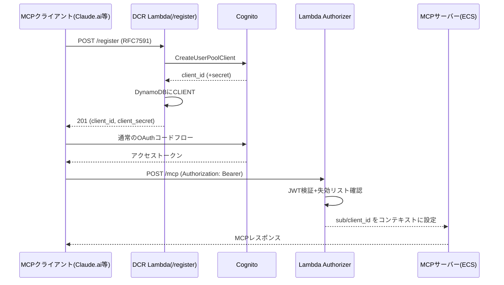

# 今週の追加検証3点+緊急セキュリティ確認: 実装前プラン

> この章で分かること
> [00-handoff.md §12](./00-handoff.md)でスコープ合意した今週の3項目(①DCR実装、②応答時間チューニング、③コストシミュレーター作成)について、実装に入る前に既存コード・既存ドキュメント・AWS公式ドキュメントを調査した結果と、それを踏まえた実装計画をまとめる。調査の過程で、当初の見積もり・仮説を覆す発見が2件、および未検証だが重大なセキュリティ上の懸念が1件見つかったため、あわせて記録する。

作成日: 2026-08-31 | 実施方法: Explore/Planサブエージェントによる既存コード・ドキュメント調査(机上、AWSへの書き込みなし)

---

## TL;DR

| # | 論点 | 結論 |
|---|---|---|
| 1 | 【最優先】x-cognito-subヘッダーのなりすまし懸念 | `server/src/index.ts`の`extractSub()`は`x-cognito-sub`ヘッダーを常にBearerトークンより優先する。ECS経路(`terraform/apigateway.tf`)はAPI Gatewayが`overwrite:`でこのヘッダーを上書き保護しているが、**AgentCore Runtime経路には同等の保護がない**。もしAgentCoreがカスタムヘッダーを素通しするなら、有効なJWTを持つ利用者が他テナントの`sub`を騙れる可能性がある(§1、未検証・要最優先確認) |
| 2 | DCR実装の見積もり | 当初3-5人日と見積もっていたが、現在のJWT Authorizerが動的なclient_idに対応できない構造的制約が判明し、**Lambda Authorizerへの置き換えが必須**。改訂見積もりは7-9人日(§2) |
| 3 | 応答時間チューニングの真因 | AWS公式ドキュメントにより、AgentCore RuntimeはステートレスMCPサーバーでも`Mcp-Session-Id`によるmicroVMスティッキーロイティングに対応済みと判明。**サーバーのステートフル化(大改修)は不要**で、検証スクリプトがこのヘッダーを再送していないことが「毎回コールドスタート」という実測結果の説明として十分。まず安価な検証(Phase 0)から着手する(§3) |
| 4 | コストシミュレーター設計 | 既存の`docs/02-internal-cost-simulation.md`の数値を逆算したところ、ALB LCU・CloudFront平均レスポンスサイズという2つの未記載パラメータ、DynamoDB/Logsコストの非対称計上、損益分岐点の簡略化式という3点が判明。インタラクティブシミュレーターはこれらを踏まえて設計する(§4) |

---

## 1. 【最優先】x-cognito-subヘッダーのなりすまし可能性(未検証)

### 1.1 発見の経緯

②の応答時間チューニングを設計する過程で、既存コードを調査したところ見つかった。`server/src/index.ts`の`extractSub()`は次の実装になっている。

```ts
function extractSub(req: express.Request): string | undefined {
  const header = req.headers["x-cognito-sub"];
  if (typeof header === "string") return header;
  // ...Bearerトークンのpayloadから抽出するフォールバック
}
```

`x-cognito-sub`ヘッダーが**常にBearerトークンより優先**される。ECS経路では`terraform/apigateway.tf`のALB統合で

```hcl
request_parameters = {
  "overwrite:header.x-cognito-sub" = "$context.authorizer.jwt.claims.sub"
}
```

と設定されており、`overwrite:`によってクライアントが送ってきた同名ヘッダーは必ずAPI Gatewayが検証済みの値で上書きされる。**この保護はAgentCore Runtime経路には存在しない**(AgentCore Runtimeは別のAPIエンドポイントであり、この`apigateway.tf`の設定を経由しない)。

### 1.2 リスクの内容

もしAgentCore Runtimeがカスタムヘッダーをコンテナにそのまま素通しする仕様であれば、次の攻撃が成立する可能性がある。

1. 攻撃者(有効な自分のJWTを持つ、正規の利用者)がAgentCore Runtimeの`invocations`エンドポイントを直接HTTPS呼び出しする。
2. `Authorization: Bearer <自分の有効なJWT>`に加えて`x-cognito-sub: <被害者のsub>`ヘッダーを付与する。
3. `extractSub()`が`x-cognito-sub`を優先して読むため、被害者になりすまして`resolveAuthorization()`が呼ばれ、被害者の契約プラン(`services`)でツールを呼び出せてしまう。

金融機関向けのマルチテナントサービスとして展開する上で、これが実際に成立するなら最重要修正事項になる。

### 1.3 検証手順(実施済み、2026-08-31)

1. テストユーザーA(`quick-mcp-poc-verify`)の有効なBearerトークンを取得(`scripts/invoke_agentcore_mcp_jwt.py`、`--spoof-sub`オプションを追加して対応)。
2. `x-cognito-sub: <実在するテストユーザーtesterのsub>`を付与して`tools/list`を呼び出したところ、**成功した**(200)。
3. 判別のため、`x-cognito-sub: <存在しないダミーsub>`を付与して同様に呼び出したところ、**403(`resolveAuthorization`失敗)** が返った。`tools/list`はユーザーによらず同一のツール一覧を返す実装(`registerQuickTools`が`allowedTools`でフィルタしていない)ため、「成功/失敗」でしか判別できないが、正当なJWTを持ちながら存在しないダミーsubで403になったことは、**ヘッダーの値が`sub`として実際に使われていたことの動かぬ証拠**となる。

### 1.4 結果: **脆弱性を確認、修正済み(2026-08-31)**

クロステナントなりすましが実際に成立することを確認した。根本原因はAgentCore Runtimeの`requestHeaderConfiguration.requestHeaderAllowlist`に`x-cognito-sub`が含まれており、クライアントが送った値がそのままコンテナに転送されていたこと(ECS経路のような`overwrite:`保護がAgentCore経路には存在しない)。

**適用した修正**: `update-agent-runtime`で`requestHeaderAllowlist`を`["Authorization"]`のみに変更(Runtime version 9→10)。アプリコード(`server/src/index.ts`)は元々「`x-cognito-sub`が無ければBearerトークンから`sub`を導出する」フォールバックを持っていたため、**コード変更・再デプロイ不要**で修正できた。

**修正後の再検証**: 同じダミーsubスプーフを再実行したところ、403→**200に変化**(ヘッダーが無視され、正しくBearerトークンの`sub`にフォールバックしていることを確認)。通常のbaseline呼び出し(スプーフなし)も引き続き正常動作することを確認済み。

**残タスク(優先度中、今回は未実施)**: `extractSub()`の「署名検証なしでJWTペイロードをbase64デコードするだけ」という実装は残っている。AgentCore Custom JWT Authorizerが検証済みのAuthorizationヘッダーをそのまま転送する前提であれば実害は無いはずだが、防御的多層化として、Cognito JWKSに対する実署名検証(`jose`等、`iss`/`aud`/`exp`/`token_use`を検証)への強化を今後のタスクとして記録する。

**詳細レポート**: 発見の経緯・ECS経路との構造比較図・攻撃シナリオ図・実機での確証手順・修正の技術的根拠は[09-internal-cross-tenant-impersonation-finding.md](./09-internal-cross-tenant-impersonation-finding.md)に図解付きでまとめた。

---

## 2. DCRプロキシ実装計画(選択肢B、改訂見積もり 7-9人日)

[00-handoff.md §11・§12.1](./00-handoff.md)で選択肢B(Cognitoの手前に立つ自作DCR/CIMDプロキシ)を採用する方針が決まっていた。今回、実装可能な粒度まで設計を詰めたところ、当初の3-5人日という見積もりには含まれていなかった構造的な制約が見つかった。

**実装対象について**: 以下の設計・実装はAgentCore Runtime(パターン3)ではなく、`terraform-playground-pattern4`(ECS+API Gateway、パターン4)を対象に行う。AgentCore Runtimeには`/register`を追加できるAPI Gateway相当の層が存在せず、認可方式(`allowedClients`固定リスト)もLambda Authorizerに差し替え不可能なため、現時点の仕様ではDCRを実装できない。詳細は[10-internal-dcr-implementation.md §0](./10-internal-dcr-implementation.md)を参照。

### 2.1 見積もりを変えた発見: JWT Authorizerは動的client_idに対応できない

`terraform/apigateway.tf`の既存Authorizerは次の設定になっている。

```hcl
resource "aws_apigatewayv2_authorizer" "cognito" {
  authorizer_type  = "JWT"
  jwt_configuration {
    audience = [aws_cognito_resource_server.mcp.identifier]
    issuer   = "https://cognito-idp.ap-northeast-1.amazonaws.com/${aws_cognito_user_pool.main.id}"
  }
}
```

JWT型Authorizerは`audience`に**固定の値のリスト**しか設定できない。DCRで新しいクライアントが登録されるたびにこのリストへ追加が必要になるが、それは「Terraform管理下の静的リストに、リクエストのたびにAPIから書き込む」という矛盾した運用になり、同時実行時の競合や個数上限の問題も生じる。**この問題を解消するには、JWT AuthorizerをLambda(REQUEST型)Authorizerに置き換える必要がある**。これにより、Cognitoプールに属する任意のクライアントを受理しつつ、DynamoDBの失効リストで個別クライアントを無効化できるようになる。

なお、これは[00-handoff.md §4](./00-handoff.md)で既に発見されていた「`audience`が実際のトークンの`aud`/`client_id`と一致せず正当なトークンでも401になる」というバグ(`terraform-playground-pattern4`で`audience`を単一App Client IDに変更して解消済み)とは別の問題である。単一クライアントへの修正では解決済みでも、DCRのように**クライアントが動的に増える**ケースには対応できない、という点が今回新たに判明した制約である。

### 2.2 アーキテクチャ

既存のHTTP API(`aws_apigatewayv2_api.main`)に2つの新規Lambdaを追加する。

| Lambda | 役割 |
|---|---|
| `quick-mcp-poc-dcr-register` | `POST /register`(RFC 7591準拠、認証不要) |
| `quick-mcp-poc-jwt-authorizer` | 既存のJWT型Authorizerを置き換えるREQUEST型Lambda Authorizer。JWT検証を自前で行い`sub`/`client_id`を返す |



### 2.3 登録フロー・自動プロビジョニング

`POST /register`が`CreateUserPoolClient`を呼び出し、RFC 7591の`redirect_uris`/`token_endpoint_auth_method`/`grant_types`をCognitoパラメータにマッピングする。付与スコープは`openid,email,profile`+固定の`<resource_server>/invoke`(`terraform/cognito.tf`の`aws_cognito_resource_server.mcp`に`scope`ブロックを新規追加する必要がある)。

`client_credentials`グラントで登録されたクライアントは、DynamoDBに`USER#<client_id>`のサービスアカウントレコードを自動作成する(`cli/src/invite-user.ts`のロールバック付きパターンを踏襲)。これは[00-handoff.md「追加調査 2026-08-26」](./00-handoff.md)で確認済みのM2M接続パターンと同じ考え方である。

**重要な整理**: `authorization_code`クライアントは人間ユーザーが未確定のため`USER#`レコードを作らない。**DCRは「クライアントの登録」であって「ユーザーの認可」ではない**。したがって、DCRを実装しても既存の`invite-user`による手動招待フロー(`allow_admin_create_user_only = true`)は変更不要で、そのまま維持される。

### 2.4 登録ポリシー

MVPでは**完全オープン**(Initial Access Token等でゲートしない)方針とする。Claude.aiのコネクタ追加UIは`registration_endpoint`を匿名で叩くため、ゲートすると自己登録の意味がなくなるためである。悪用対策は次の組み合わせで代替する。

- `redirect_uri`ホストのアローリスト(`claude.ai`/`claude.com`/localhost)
- `/register`ルートのレート制限(API Gatewayのルート単位スロットリング)
- 登録数上限(DynamoDBの`CLIENT#`件数チェック)
- アクセスログ記録

### 2.5 CIMDについて

引き続きMVPスコープ外とする。ただし、DCR用Lambdaが完成すれば、`/authorize`をLambda化してCIMD対応する追加コストは、当初想定の1-2週間ではなく+2-3日程度に下がる見込み(既存の`CreateUserPoolClient`呼び出しロジックを再利用できるため)。ストレッチゴールとして記録する。

### 2.6 主な変更ファイル

- `terraform/apigateway.tf`(Authorizer差し替え、`/register`ルート追加、アクセスログ・スロットリング追加)
- `terraform/cognito.tf`(`invoke`スコープ追加)
- `terraform/openapi.yaml`(`registration_endpoint`等のdiscoveryメタデータ追加)
- 新規`lambda/`ワークスペース(2 Lambda)
- `cli/src/`に`list-clients`/`delete-client`サブコマンド追加(クライアントのライフサイクル管理はMVPでは自動化せず、手動レビュー用CLIのみ用意する)

作業はまず`terraform-playground-pattern4/`で実施する(既に`audience`修正版を保持済み)。本番相当アカウント(620369151795)は書き込み禁止のため対象外。

### 2.7 タスク内訳(合計 約7-9人日)

| # | タスク | 見積もり |
|---|---|---|
| 1 | playgroundベースライン確認+`invoke`スコープ追加 | 1日 |
| 2 | Lambda Authorizer実装・切替 | 1.5日 |
| 3 | Register Lambda実装(バリデーション・ロールバック含む) | 1.5日 |
| 4 | discoveryメタデータ更新 | 0.25日 |
| 5 | 乱用対策(アローリスト・スロットリング・上限) | 0.5日 |
| 6 | CLI管理コマンド(`list-clients`/`delete-client`) | 0.5日 |
| 7 | E2E検証(Claude Code/Claude.ai含む) | 1日 |
| 8 | セキュリティレビュー | 0.5日 |
| 9 | ドキュメント化 | 0.5日 |
| | **合計** | **約7.25-9日** |

### 2.8 実施済み(2026-08-31): タスク1〜6・実機動作確認まで完了

タスク1〜6(playgroundベースライン確認・スコープ追加・Lambda Authorizer実装・Register Lambda実装・discoveryメタデータ・乱用対策の一部・CLI管理コマンド)を実施し、`terraform-playground-pattern4`で以下を実機確認した。

- 既存の静的クライアントによる認証・MCP呼び出しの回帰確認(確認済み)
- DCRによる新規クライアント登録(authorization_code・client_credentials両方、確認済み)
- 登録したclient_credentialsクライアントによるMCP呼び出しのエンドツーエンド成功(自動プロビジョニング含む、確認済み)
- DynamoDBの失効フラグによる個別クライアントの即時アクセス遮断(確認済み)

詳細な実装経緯・詰まりどころ(JWT Authorizerの構造的制約、`-target`部分適用でのIAM権限漏れ、Cognito Managed Login UIの制約)は[10-internal-dcr-implementation.md](./10-internal-dcr-implementation.md)に図解付きでまとめた。

**残タスク**: タスク7(Claude Code/Claude.aiからの実際の自己登録によるE2E確認。Managed Login UI v2がブラウザ操作前提のため簡易スクリプトでは代替できず未実施)、タスク8(セキュリティレビュー、2026-09-02実施・完了)、登録数上限の実装、本番相当`terraform/`への移植(書き込み禁止のため実際のapplyはユーザー判断)。

### 2.9 【最優先・次回検証項目】AgentCore RuntimeでもCognitoのままDCRが成立するかもしれない安価な仮説(2026-09-02追記)

Auth0移行の検討中([11-internal-cognito-to-auth0-migration-estimate.md](./11-internal-cognito-to-auth0-migration-estimate.md))に、次の2点が新たに判明した。いずれも実機未検証だが、Auth0移行(月額$800〜)よりはるかに安く検証できるため、次回セッションで最優先に試すべき項目。

1. **AgentCore Runtimeの`allowedClients`を外し、`allowedScopes`だけで運用できるか**: `CustomJWTAuthorizerConfiguration`は`allowedClients`/`allowedAudience`/`allowedScopes`のいずれか1つを指定すればよい仕様。Cognitoトークンは`aud`を持たないが`scope`は持つため、`allowedScopes: ["mcp/invoke"]`のみで運用できれば、DCRで動的作成したクライアントもRuntime設定変更なしに即座に信頼される可能性がある。検証方法: playgroundのRuntimeで`allowedClients`を外し`allowedScopes`のみの設定に更新し、未登録のCognitoクライアントが発行した(`mcp/invoke`スコープ付きの)トークンで`/invocations`が通るか確認する
2. **pattern4をAPI Gateway REST API(v1)+ネイティブCognitoオーソライザーに置き換えられないか**: REST APIの`COGNITO_USER_POOLS`型オーソライザーは「許可するclient ID」指定が任意で、空にすればプール内の任意のクライアントを信頼する。これが確認できれば、今回自作したLambda Authorizerが不要になる(ただし`/register`をVTLマッピングテンプレートで実装する設計は、Lambdaより保守性で劣るというトレードオフがある)

詳細な経緯は[10-internal-dcr-implementation.md §0.5](./10-internal-dcr-implementation.md)を参照。

---

## 3. 応答時間チューニング計画 — Phase 0のみ実施(推定 約3人日)

### 3.1 見積もり・スコープを変えた発見

AWS公式ドキュメント([MCP protocol contract](https://docs.aws.amazon.com/bedrock-agentcore/latest/devguide/runtime-mcp-protocol-contract.html)、[Use isolated sessions for agents](https://docs.aws.amazon.com/bedrock-agentcore/latest/devguide/runtime-sessions.html))によれば、AgentCore Runtimeは**ステートレスMCPサーバーであっても**`Mcp-Session-Id`ヘッダーによるmicroVMスティッキーロイティングに対応している。プラットフォーム側がこのヘッダーでリクエストを同一microVMにルーティングする仕組みであり、サーバー実装がセッションを状態として保持している必要はない。

一方、現在の検証スクリプト`scripts/invoke_agentcore_mcp_jwt.py`は、レスポンスの`Mcp-Session-Id`ヘッダーを一度も読み取らず、次のリクエストにも再送していない。つまり**「毎回新規コンテナが起動する」という既存の実測結果は、サーバーの設計ではなく検証スクリプトの不備で十分説明がつく**可能性が高い。

この発見を受け、[00-handoff.md §12.2](./00-handoff.md)で想定していた「サーバーをステートフル化する」という大改修(セッションマップ導入、GET/DELETEの本実装)は**今回は実施しない**。まず検証スクリプト側の修正のみで仮説を検証する(Phase 0)。ステートフル化はマルチテナントサービスとしてのセキュリティリスク(セッションIDが他テナントの認可情報を引き継いでしまう等)も伴うため、Phase 0で効果が確認できない限り着手しない。

### 3.2 副次的な発見: 既存の速度比較は非対称だった可能性

[07-internal-vpc-waf-cost-verification.md §2.4](./07-internal-vpc-waf-cost-verification.md)の「AgentCoreはECSの約20倍遅い」という比較は、ECS側は正しくセッションを扱う実装で計測し、AgentCore側は検証スクリプトの不備で毎回コールドスタートさせて計測した、という**非対称な比較だった可能性がある**。Phase 0の結果次第では、この比較自体に注記が必要になる。

### 3.3 実施手順

1. **前提修正(CloudWatch Logsブロッカー解消)**: 検証用VPC(`vpc-0df861e536fad4aab`)に`com.amazonaws.ap-northeast-1.logs`のInterface VPCエンドポイントを追加する(月額 約$20)。追加後、1回呼び出してログストリームが復活することを確認してから後続作業に進む。
2. **検証専用の別Runtime(`quickMcpPocLatencyLab`)を新規作成**し、Claude.ai/Web版デモに使っている既存Runtime(`quickMcpPocVerification-Aoo0d23yyj`)には触れない。
3. `server/src/index.ts`と`server/src/db.ts`に計測ログ(`boot_id`、リクエストごとの`req_seq`、DynamoDB呼び出し時間等)を`LOG_TIMING`環境変数で追加する。**セッション処理ロジック自体は変更しない**。
4. `scripts/invoke_agentcore_mcp_jwt.py`を修正し、`Mcp-Session-Id`を実際にキャプチャ・再送する「treatment」群と、毎回新規セッションで呼ぶ「control」群を実装する。`initialize`ハンドシェイクの追加、JSON-RPCの`-32005`(HTTP 200で返るリトライ可能エラー)のリトライ処理も行う。
5. 遅延条件(0秒/30秒/5分/20分。20分は15分アイドルタイムアウトを超えるポジティブコントロール)×繰り返しで実験し、CloudWatch Logs Insightsで`boot_id`の重複有無とレイテンシを突き合わせる。

### 3.4 成功判定基準(事前登録)

| 結果 | 判定 |
|---|---|
| treatment群の2回目以降で`boot_id`が1つに収束し、中央値レイテンシが概ね1秒以下 | 仮説確認。セッションスティッキーが機能している |
| `boot_id`が毎回変わる、またはレイテンシが下がらない | 仮説棄却。既存のステートレス設計(マルチテナント上は安全側)を維持し、計測ログで判明した内訳(DynamoDB初回呼び出しコスト等)を元にした単体最適化のみ検討する |

### 3.5 追加調査項目(2026-09-02追記): コンテナ起動オーバーヘッド自体を縮められる可能性

セッションID使い回し(§3.1〜3.4)は「2回目以降のリクエスト」を速くする施策で、新規セッションの最初の1回に必ずかかるコンテナ起動コスト(実測で約3.9秒、全体の約65%)には効かない。この初回コストそのものを縮められないかを、AWS公式ドキュメント・re:Post記事の調査で確認したところ、複数の未検証の候補が見つかった。

- **ウォームプールの動作確認**: AgentCore Runtime(コンテナデプロイ)はRuntime作成・更新時に**プリウォームされたVMを10台**用意しており、新規セッションの最初の10件まではサブ秒でコールドスタートする設計になっている。11件目以降は新規VM確保+コンテナダウンロード+起動が必要になる。**これまでの実測(アイドル0秒〜16分まで一貫して約6秒)はこの仕様と整合しない**。逐次実行(1件ずつ間隔を空けて実行)ではなく、同時多重リクエストで検証すればウォームプールの効果が出るのか、切り分けが必要
- **コードデプロイモードとの比較**: コンテナ全体ではなくアプリのソースコードだけをデプロイする「コードデプロイ」モードは、AWS公式によれば**より安定して約2〜3秒**のコールドスタートになるとされる(現状の実測6秒より短い)。本PoCはコンテナデプロイのみ検証済みで、コードデプロイは未検証
- **コンテナイメージの軽量化**: ウォームプールを使い切った後の起動時間は「コンテナサイズに依存する」と明記されている。現状のイメージ(依存パッケージ・ベースイメージ)を軽量化した場合の起動時間への影響は未検証
- **能動的なプリウォーミング**: 定期pingで複数のウォームプールを維持する、というAWS公式(re:Post)の運用パターンがあるが、コスト・運用負荷とのトレードオフのため未検討

これらは§3.1〜3.4のセッションID使い回し検証と並行、または後続で実施できる。次回セッションでの優先順位は、まず(1)同時多重リクエストでウォームプールの効果を確認し、次に(2)コードデプロイモードを試すのが、追加インフラ変更が少なく着手しやすいと考えられる。

---

## 4. インタラクティブなコストシミュレーター設計(推定 3.5〜5時間)

### 4.1 設計時に判明した既存試算の隠れた前提

[02-internal-cost-simulation.md](./02-internal-cost-simulation.md)の既存試算の数値を逆算したところ、次の3点が判明した。

1. **ALB LCU($6.50/月)とCloudFront平均レスポンスサイズ(5KB)という2つの未記載パラメータ**がないと、掲載されている数値(パターン4の約$46、VPC+WAF時の$0.0000094/req等)を再現できない。
2. DynamoDB・CloudWatch Logsのコストが**パターン4にしか計上されておらず**、「両パターン共通」という本文の記述と実際の試算が食い違っている。
3. 既存の損益分岐点(610万件/月・77万件/月)は、パターン4の従量費(API Gateway分)を無視した簡略化式によるもので、真の代数的な交点(約715万件/月・約82万件/月)とは異なる。

インタラクティブシミュレーターは、これらを可視化しつつ、**既存ドキュメントの数値をそのまま再現できることを受け入れテストとする**(§4.4)。

### 4.2 入力・出力

**入力**(スライダー/チェックボックス):
- 月間リクエスト数(対数スライダー、1,000〜2,000万)
- 閉域網(VPCモード)トグル(パターン3のみに費用増)
- WAFトグル(両パターンに適用、パターン3はCloudFront自動追加)
- 折りたたみ式「AgentCoreの課金前提」: CPU秒/セッション秒(メモリ課金用、分離可能)/vCPU/メモリ。実測Duration最大値130.6秒(`00-handoff.md`記載)を当てはめるワンクリックボタン
- 折りたたみ式「単価・構成の詳細」: エンドポイント数・NAT数・ALB LCU・WAFルール数等の単価

**出力**:
- サマリー文(「パターン3が$X安い、逆転点は約Y件/月」)
- パターン3/4の合計コストカード(固定費/従量費の内訳付き)
- サービス別内訳の積み上げバー
- リクエスト数×コストの折れ線グラフ(交点マーカー、既存ドキュメント記載の参考ラインを注記付きで表示)
- 内訳テーブル(数式ホバー表示)
- 変更した前提条件の自動列挙

### 4.3 スコープ外(v1)

DCRプロキシのコスト、レイテンシの可視化、Cost Explorer/Pricing API連携、シナリオ保存/共有機能は含めない。

### 4.4 検証(受け入れテスト)

既存ドキュメントの14個の掲載数値・2つの損益分岐点を計算モジュールが再現することを確認してからUIを実装する。実装時は`dataviz`スキルと`artifact-design`スキルを事前に読み込む。

### 4.5 実施済み(2026-08-31): Artifactとして公開

上記設計に基づき実装し、Artifactとして公開した([AgentCore vs ECS コスト比較](https://claude.ai/code/artifact/8f9d8cfc-aec8-4eb2-8970-6e3e1947f8c3))。ベースライン(vpc=off, waf=off)・VPC+WAF(vpc=on, waf=on, endpointUnits=4)の両条件で、既存ドキュメントの7ケース×2パターン=14個の掲載数値を許容誤差$0.5以内で再現することを、ページ内の「検証」セクション(自己テスト)で確認済み。`dataviz`スキルのパレット検証スクリプトで2系統配色(パターン3=オレンジ/パターン4=青)のCVD安全性を確認し、`artifact-design`スキルに沿ってライト/ダークテーマ両対応のトークン設計を行った。

---

## 5. 実施順序

1. **§1(セキュリティ確認)を最初に実施** — 10分程度、結果次第で即修正
2. §4(コストシミュレーター)はAWSアクセス不要なため並行して進行可能
3. §3(応答時間チューニングPhase 0)— §1の後、CloudWatch Logsブロッカー解消から着手
4. §2(DCR実装)— 最も工数が大きい(7-9人日)ため、他2項目より後、または別ブランチで並行

## 6. 検証方法(実装後)

- §1: 実際にヘッダーなりすましを試し、レスポンスの権限情報が要求元と一致することを確認
- §2: `claude mcp add`を`--client-id`なしで実行し、DCRで自己登録→接続成功することを確認。既存の静的クライアントも引き続き認証できることを回帰確認
- §3: CloudWatch Logs Insightsクエリで`boot_id`の重複数とレイテンシ分布を突き合わせ、事前登録した成功/棄却基準と照合
- §4: シミュレーターの自己テストで既存ドキュメントの14セル+2損益分岐点を再現することを確認
