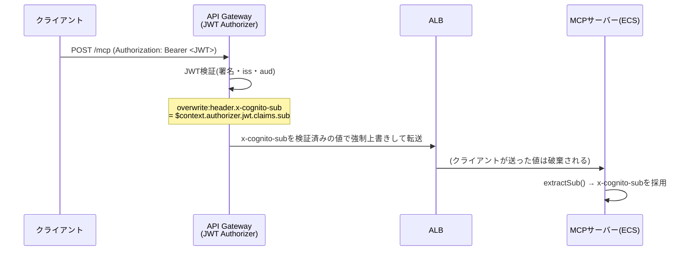
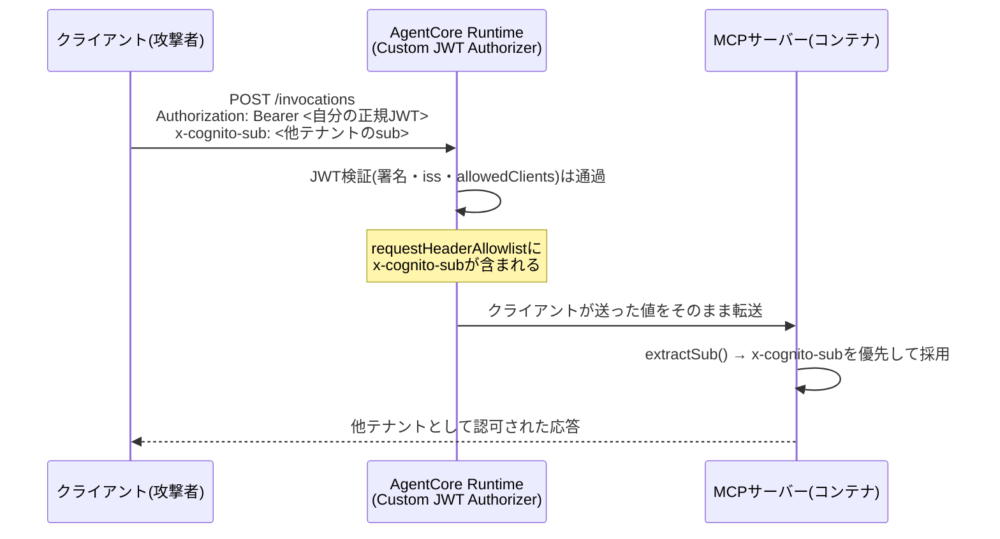
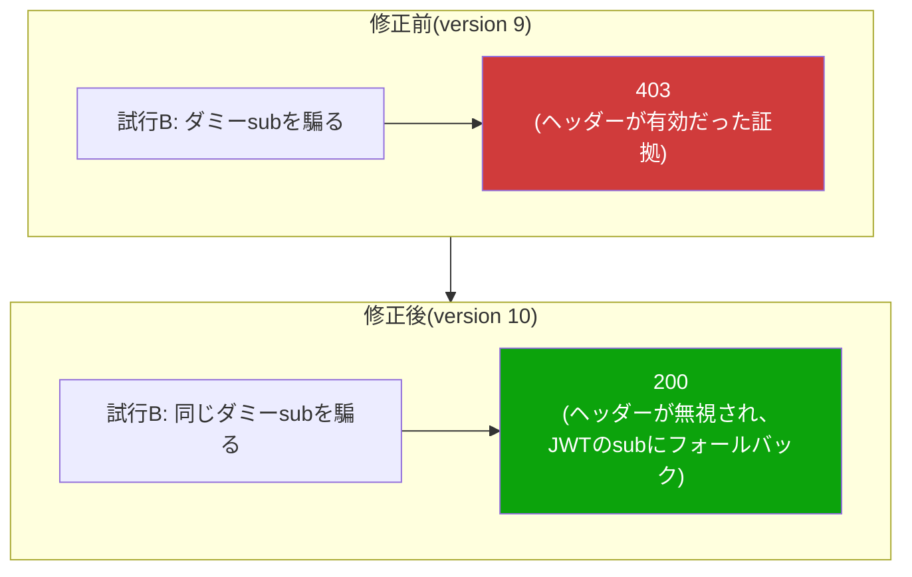

# AgentCore Runtimeにおけるクロステナントなりすまし脆弱性の発見・修正

> この章で分かること
> AgentCore Runtime経路で、有効な認証情報を持つ任意の利用者が別テナントになりすませてしまう脆弱性を発見し、コード変更・再デプロイなしで即日修正した経緯をまとめる。なぜこの穴が生まれたのか(ECS経路との構造的な違い)、どうやって実機で確証を得たか、なぜ「設定1行の削除」だけで直ったのかを、図と概念説明を交えて整理する。金融機関向けマルチテナントサービスとしての外販を検討する上で、認可アーキテクチャ設計時に踏むべきステップの実例として次回以降のトピックに使うことを想定している。

発見日: 2026-08-31 | 検証方法: playgroundアカウントでの実機なりすまし試行・修正後の再検証 | 重大度: **Critical**(マルチテナント環境でのクロステナントなりすまし)

---

## TL;DR

| # | 論点 | 結論 |
|---|---|---|
| 1 | 何が起きうる状態だったか | 有効な自分のJWTを持つ利用者が、`x-cognito-sub`ヘッダーに他テナントの`sub`を指定するだけで、そのテナントとして認可されツールを呼び出せた |
| 2 | なぜ起きたか | AgentCore Runtimeの`requestHeaderAllowlist`に`x-cognito-sub`が含まれており、クライアントが送った値がそのまま検証なしでコンテナに転送されていた。ECS経路にある「API Gatewayによる強制上書き」という保護機構が、AgentCore経路には存在しなかった |
| 3 | どう確証を得たか | 実際に他テナントのsubを騙って呼び出し、成功(200)することを確認。判別のため存在しないダミーsubでも試し、403になることで「ヘッダーの値が実際に使われている」ことを証明した |
| 4 | どう直したか | Runtimeの`requestHeaderAllowlist`から`x-cognito-sub`を削除する設定変更のみ(`update-agent-runtime`)。**アプリコードの変更・コンテナの再デプロイは不要**だった |
| 5 | なぜ再デプロイ不要で直ったか | アプリ側の`extractSub()`は元々「ヘッダーが無ければBearerトークンから`sub`を導出する」フォールバックを持っていた。ヘッダーが届かなくなれば、自動的に安全な経路にフォールバックする設計だった(裏を返せば、そのフォールバック設計自体がこの脆弱性を「安全に閉じられる」形にしていた) |
| 6 | 残っている課題 | `extractSub()`のBearerトークン処理は署名検証なしのpayload直読み。AgentCore Custom JWT Authorizerが前段で検証済みという前提に依存しており、多層防御の観点では改善余地がある(§6) |

---

## 1. 背景: 2つの認可経路の構造的な違い

quick-mcp-pocは同じアプリコードを2つの経路でホストしている。両者は「利用者の`sub`(Cognitoの一意識別子)をどうやってアプリに伝えるか」という点で、実装が非対称になっていた。

### 1.1 ECS + API Gateway経路(パターン4) — 保護あり



`terraform/apigateway.tf`の`aws_apigatewayv2_integration.alb`には次の設定がある。

```hcl
request_parameters = {
  "overwrite:header.x-cognito-sub" = "$context.authorizer.jwt.claims.sub"
}
```

`overwrite:`という接頭辞がポイントで、**クライアントが同名のヘッダーを送っていても、API Gatewayが検証済みの値で強制的に上書きする**。つまりこの経路では、`x-cognito-sub`ヘッダーは「クライアントが操作できる入力」ではなく「サーバー側が保証する出力」になっている。

### 1.2 AgentCore Runtime経路(パターン3) — 保護なし(修正前)



AgentCore RuntimeのCustom JWT Authorizerは「このJWTは有効か」「`allowedClients`に含まれるクライアントか」を検証するが、**誰の`sub`としてリクエストを処理するかは関与しない**。`requestHeaderConfiguration.requestHeaderAllowlist`は単に「どのカスタムヘッダーをコンテナに転送してよいか」を定めるだけの仕組みで、ECS経路の`overwrite:`のような「検証済みの値で強制的に上書きする」機能は持たない。

修正前のRuntime設定:

```json
"requestHeaderConfiguration": {
  "requestHeaderAllowlist": ["x-cognito-sub", "Authorization"]
}
```

一方、アプリコード側(`server/src/index.ts`)の`extractSub()`は次の実装だった。

```ts
function extractSub(req: express.Request): string | undefined {
  const header = req.headers["x-cognito-sub"];
  if (typeof header === "string") return header;   // ← 常にこちらを優先

  const auth = req.headers.authorization;
  // ...Bearerトークンのpayloadを検証なしでbase64デコードするフォールバック
}
```

この2つの実装(「ECS用に、検証済みの`sub`をヘッダー経由で渡す」という設計と、「ヘッダーがあれば無条件に信用する」というアプリの実装)は、ECS経路単体では正しく機能する。しかし**AgentCore経路に同じアプリコードをそのまま流用したことで、ECS側の`overwrite:`という前提が失われ、ヘッダーがクライアントの言いなりになる**という組み合わせ事故が起きていた。

---

## 2. 発見の経緯

②の応答時間チューニング([08-internal-weekly-verification-plan.md §3](./08-internal-weekly-verification-plan.md))を設計するためにサーバーコードを調査していた際、`extractSub()`の実装を読んで「AgentCore経路にはECS経路のような保護が無いのでは」という疑問が生じた。この時点では未検証の懸念だったが、影響範囲(マルチテナント環境でのクロステナント認可)の重大性から、他の検証項目より優先して即座に実機確認することにした。

---

## 3. 実機での確証

### 3.1 なぜ「なりすまし成功」だけでは証明にならないか

最初につまずいた点として、`tools/list`はどのユーザーでも同じ固定のツール一覧を返す実装になっている(`server/src/tools/quick/index.ts`の`registerQuickTools()`が`allowedTools`によるフィルタを行わず、常に6ツール全てを登録している)。そのため、「別テナントのsubを騙って`tools/list`を呼んだら成功した」という結果だけでは、**本当にそのsubが使われたのか、それとも単にヘッダーが無視されて元のJWTのsubが使われて成功したのか**を区別できない。

### 3.2 判別可能な実験設計

これを区別するため、次の2パターンを比較した。

| 試行 | `x-cognito-sub`の値 | 期待される結果(ヘッダーが有効な場合) | 期待される結果(ヘッダーが無視される場合) |
|---|---|---|---|
| A | 実在する別テナント(`tester`)のsub | 200(そのテナントとして認可) | 200(元のJWTのテナントとして認可) |
| B | **存在しないダミーsub** | **403**(`resolveAuthorization`がDynamoDBにレコードを見つけられず失敗) | 200(元のJWTのテナントとして認可される) |

試行Aだけでは判別できないが、**試行Bで403が返れば、ヘッダーの値が実際に認可ロジックへ渡っていたことの動かぬ証拠になる**(ヘッダーが無視されていれば、常に元のJWTの正当なsubで成功するはずだから)。

### 3.3 実施結果

`scripts/invoke_agentcore_mcp_jwt.py`に検証用の`--spoof-sub`オプションを追加し、実際にplaygroundアカウントのRuntimeに対して実行した。

```bash
# 試行A: 実在する別テナントのsubを騙る
python3 scripts/invoke_agentcore_mcp_jwt.py tools/list '{}' \
  --reuse-token --spoof-sub "37a44a68-f0d1-7002-4327-ee469975112e"
# → 200 OK、tools/listが正常に返る

# 試行B: 存在しないダミーsubを騙る
python3 scripts/invoke_agentcore_mcp_jwt.py tools/list '{}' \
  --reuse-token --spoof-sub "00000000-0000-0000-0000-000000000000"
# → 403 { "error": { "code": -32010, "message": "Received error (403) from runtime..." } }
```

試行Bで403が返ったことにより、**`x-cognito-sub`ヘッダーの値が認可判定に実際に使われていたことが確定した**。つまり、有効なJWTさえ持っていれば、`x-cognito-sub`ヘッダーを書き換えるだけで任意のテナントになりすませる状態だった。

---

## 4. 攻撃シナリオ(概念図)

金融機関A・B・Cが同一のAgentCore Runtimeを共有するマルチテナント構成を想定すると、次のような攻撃が成立しうる。

```mermaid
flowchart LR
    subgraph 正規利用
        A[金融機関A<br/>自分の正規JWTを保持]
    end
    subgraph 攻撃
        A -->|"Authorization: Bearer <Aの正規JWT>&#10;x-cognito-sub: <Bのsub>"| RT[AgentCore Runtime]
    end
    RT -->|ヘッダーをそのまま転送| App[MCPサーバー]
    App -->|"Bとして認可"| Data[(金融機関Bの<br/>契約プラン・利用権限)]

    style A fill:#eb6834,color:#fff
    style Data fill:#d03b3b,color:#fff
```



攻撃者(金融機関Aの正規利用者、または漏洩したAの認証情報を持つ第三者)は、**Cognitoの認証情報を一切持っていない他テナント(B)のsubさえ知っていれば**(subはUUID形式で、ログや過去のレスポンス、あるいは総当たりから漏れる可能性がある)、Bの契約プランでツールを呼び出せてしまう。金融機関向けの課金制サービスとして展開する上で、これは「他社の契約内容・利用枠を消費する」「他社向けの機能に無断でアクセスする」という直接的な信頼失墜リスクになる。

---

## 5. 修正

### 5.1 なぜ設定変更だけで直ったか

修正の選択肢は理論上2つあった。

1. **AgentCore側**: `requestHeaderAllowlist`から`x-cognito-sub`を削除する(設定変更のみ)
2. **アプリ側**: `extractSub()`にデプロイ環境ごとの信頼可否フラグ(`TRUST_SUB_HEADER`等)を導入し、AgentCoreデプロイでは`x-cognito-sub`を無視するようコードを変更する(コード変更+再ビルド+再デプロイが必要)

今回は**選択肢1を採用**した。理由は次の通り。

- 通常のクライアント(Claude Code、Claude.ai、`scripts/invoke_agentcore_mcp_jwt.py`のbaseline呼び出し)は、そもそも`x-cognito-sub`ヘッダーを送信していない。このヘッダーはAgentCore経路では**一度も正当な用途で使われていなかった**(ECS向けの設計をそのまま流用した際の“取り残された穴”だった)。
- アプリの`extractSub()`は、ヘッダーが存在しない場合に自動でBearerトークンへフォールバックする設計を最初から持っていた。したがって、Runtime側でこのヘッダーを転送しないようにするだけで、**アプリは変更なしに安全な経路(Bearerトークンからの`sub`導出)へ自然に切り替わる**。

```bash
aws bedrock-agentcore-control update-agent-runtime \
  --agent-runtime-id quickMcpPocVerification-Aoo0d23yyj \
  --request-header-configuration '{"requestHeaderAllowlist":["Authorization"]}' \
  --profile quick-agentcore-poc-playground --region ap-northeast-1
  # (他の既存パラメータ: agent-runtime-artifact / role-arn / network-configuration /
  #  protocol-configuration / authorizer-configuration は変更前の値をそのまま再指定)
```

この変更でRuntimeはversion 9→**10**に更新され、`UPDATING`→`READY`まで約30秒で完了した(コンテナの再ビルドを伴わないため、通常の`containerUri`更新より高速)。

### 5.2 修正後の再検証(before/after比較)



同一の試行Bを再実行したところ、**403 → 200 に結果が変化**した。これは「ダミーsubを渡してもエラーにならず、常に元のJWTの正当なsubが使われるようになった」ことを意味し、修正が意図通り機能していることの直接的な証拠になる。あわせて、通常のbaseline呼び出し(ヘッダー無し)も引き続き正常動作することを確認し、既存の疎通に影響がないことも確認した。

---

## 6. 残っている課題(今回は対応せず、記録のみ)

`extractSub()`のBearerトークン処理部分は、署名検証を行わずJWTペイロードをbase64デコードしているだけである。

```ts
const payload = JSON.parse(Buffer.from(auth.split(".")[1], "base64url").toString());
return payload.sub;
```

AgentCore Custom JWT Authorizerが前段でJWTの署名・発行者・クライアントを検証済みであることを前提にすれば、コンテナに届く`Authorization`ヘッダーは信頼してよいはずだが、**「前段のコンポーネントが正しく検証している」という前提に、アプリ自身の検証なしで全面的に依存している**状態である。多層防御の観点では、Cognito JWKSに対する実署名検証(`jose`ライブラリ等で`iss`/`aud`/`exp`/`token_use`を検証)に強化することが望ましい。[08-internal-weekly-verification-plan.md §1.4](./08-internal-weekly-verification-plan.md)に今後のタスクとして記録済みで、優先度は中(直接の悪用経路は今回の修正で閉じているため)。

---

## 7. この事例から得られる教訓(次回トピック向けメモ)

- **「同じアプリコードを複数の経路で動かす」場合、各経路の認可アーキテクチャの前提を個別に洗い出す必要がある**。ECS経路の`overwrite:`のような「暗黙の保護」は、コードを読むだけでは気づきにくく、経路ごとに動作確認するまで見えない。
- **「動く」ことの確認だけでは、認可ロジックの脆弱性は発見できない**。今回のように、`tools/list`が常に同じ結果を返す実装だと、なりすまし成功=200という単純な確認では不十分で、「失敗するはずのケースが失敗するか」という否定的なテスト(試行B)を組み合わせる必要がある。
- **設定ミスの修正コストと、コードの修正コストは大きく異なる**。今回はアプリの既存フォールバック設計のおかげで、根本原因(過剰な`requestHeaderAllowlist`)を設定変更1回で閉じられた。裏を返せば、こうした「サーバーレス基盤側の許可リスト」は、アプリ側の設計判断と両方を意識して管理しないと、片方だけを見て安全と誤認しやすい。
- マルチテナントSaaSとして外販するにあたっては、[05-internal-security-compliance-verification.md](./05-internal-security-compliance-verification.md)で扱った「マルチテナント分離」の机上調査に加えて、**今回のような実機でのなりすまし試行(ペネトレーションテスト的な検証)を認可まわりの変更のたびに実施する**運用が必要になる。
