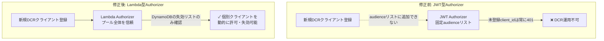
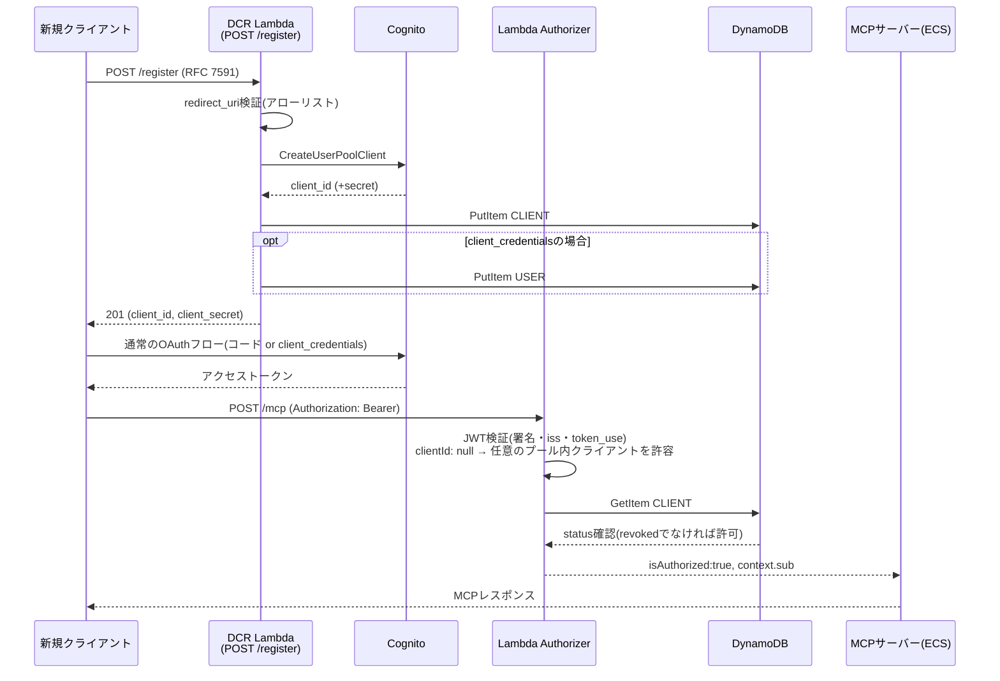
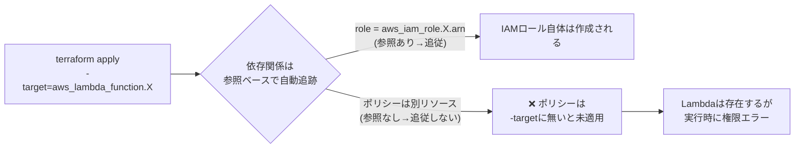

# DCR(動的クライアント登録)実装レポート

> この章で分かること
> Cognitoの手前にLambda Authorizer + DCR(`POST /register`)プロキシを構築し、`terraform-playground-pattern4`で実機動作確認まで完了させた記録。なぜJWT型Authorizerのままでは実現できなかったのか、実装のどこでIAM権限の抜け漏れにつまずいたか、実際にどこまで動作を確認できたかを、図と実行ログを交えてまとめる。

実施日: 2026-08-31 | 検証環境: `terraform-playground-pattern4`(playgroundアカウント、883660531246) | 関連: [08-weekly-verification-plan.md §2](./08-weekly-verification-plan.md)

---

## TL;DR

| # | 論点 | 結論 |
|---|---|---|
| 1 | 何を作ったか | RFC 7591準拠の`POST /register`(DCR)エンドポイントと、それを受理できるLambda(REQUEST型)Authorizerを新規実装し、既存のJWT型Authorizerを置き換えた |
| 2 | なぜJWT型Authorizerのままでは無理だったか | JWT型Authorizerの`audience`は固定の値のリストしか持てず、DCRで動的に増えるCognito App Client IDに追随できない構造的制約があった(詳細は§1) |
| 3 | 実機確認できたこと | (a) 既存の静的クライアントが引き続き認証できる(回帰確認)、(b) 新規登録した`client_credentials`クライアントがMCPツール呼び出しに成功するまでエンドツーエンド、(c) DynamoDBの失効フラグでクライアントを個別に無効化できる、の3点(§4) |
| 4 | 一番時間を溶かした詰まりどころ | `-target`オプションでの部分適用を繰り返した際、IAMロールの権限ポリシー(`dynamodb:GetItem`やCognito権限)とAWSLambdaBasicExecutionRoleのアタッチメントを対象から漏らし、Lambda自体は作成されるが権限が無くて500になる、という事象を2段階で踏んだ(§3.2) |
| 5 | 未実施・残作業 | Claude Code/Claude.aiからの実際の自己登録によるE2E確認(Cognitoの新しいManaged Login UIがブラウザ操作を前提とした構造で、簡易スクリプトでは代替しづらいことが判明)、登録数上限の実装、セキュリティレビュー(§5) |

---

## 1. なぜLambda Authorizerへの置き換えが必要だったか

既存の認可はAPI Gateway HTTP APIのJWT型Authorizerで、Cognitoが発行したアクセストークンの`client_id`(または`aud`)を、Terraformで静的に指定した`audience`リストと比較する仕組みだった。

```hcl
resource "aws_apigatewayv2_authorizer" "cognito" {
  authorizer_type = "JWT"
  jwt_configuration {
    audience = [aws_cognito_user_pool_client.mcp.id]   # 固定の1クライアントIDのみ
    issuer   = "https://cognito-idp.ap-northeast-1.amazonaws.com/${aws_cognito_user_pool.main.id}"
  }
}
```

DCRは「利用者が使うたびに新しいCognito App Clientを動的に作る」という機能なので、新しいclient_idが発行されるたびに、この`audience`リストに追加し続ける必要がある。しかしこのリストはTerraformで管理された静的な設定であり、実行時にAPIから書き込む手段は用意されていない(`UpdateAuthorizer`を都度呼ぶ運用は、Terraformとの状態不整合・同時実行時の競合・リストの上限という3つの問題を抱える)。



そこで、JWT検証自体をLambda(REQUEST型Authorizer)に持たせ、「Cognitoプールに属する任意のクライアントのアクセストークンを信頼し、失効管理はDynamoDBの`CLIENT#`レコードで個別に行う」という設計に変更した。これにより、静的なリスト管理から解放され、登録・失効が即時に反映される。

---

## 2. アーキテクチャ



### 主要コンポーネント

| コンポーネント | 実装 |
|---|---|
| `quick-mcp-poc-dcr-register` | Lambda(Node.js 22)。`lambda/src/register.ts`。RFC 7591バリデーション→`CreateUserPoolClient`→DynamoDB書き込み(失敗時ロールバック) |
| `quick-mcp-poc-dcr-authorizer` | Lambda(Node.js 22)。`lambda/src/authorizer.ts`。`aws-jwt-verify`の`CognitoJwtVerifier`(`clientId: null`)でJWT検証+DynamoDB失効チェック |
| Cognito Resource Server | `mcp`リソースサーバーに`invoke`スコープを新規追加(`terraform-playground-pattern4/cognito.tf`) |
| API Gateway | `POST /register`ルート追加(認証不要、レート制限: burst 5/rate 2)、`ANY /{proxy+}`のAuthorizerをJWT→Lambdaに切替 |

付与スコープ・登録ポリシー(完全オープン、redirect_uriアローリスト)の詳細設計根拠は[08-weekly-verification-plan.md §2](./08-weekly-verification-plan.md)を参照。

---

## 3. 実装過程で踏んだ詰まりどころ

### 3.1 Cognito Managed Login UIがスクリプトでのブラウザエミュレーションに対応していなかった

既存の検証スクリプト(`scripts/invoke_agentcore_mcp_jwt.py`)は、Cognitoの旧来のHosted UI(`name="cognitoSignInForm"`というフォームをHTMLから正規表現で抽出し、POSTする)を前提にしていた。しかし`terraform-playground-pattern4/cognito.tf`のCognito User Poolは`managed_login_version = 2`(新しいManaged Login UI)を使っており、フォーム構造が完全に異なる(JSベースのSPA的な実装で、単純なHTML `<form>` POSTでは完結しない)。

```
RuntimeError: login form parse failed:
<!DOCTYPE html><html lang="en"><head><title>Sign-in</title>...
```

**対応**: 認可コードフローの実ブラウザ操作を模倣する代わりに、次の2つの代替手段でE2E確認を行った。

- 既存の静的クライアント(パスワード認証フローが有効)の回帰確認 → `InitiateAuth`(`USER_PASSWORD_AUTH`)でブラウザを介さず直接アクセストークンを取得
- 新規DCRクライアントの動作確認 → `client_credentials`グラント(そもそもブラウザ操作が不要)で登録・トークン取得・MCP呼び出しを実施

**学び**: Managed Login UI(v2)を使っている環境でブラウザレスの認可コードフローE2Eテストを組むには、Cognitoの新UIが使う実際のAPI呼び出し(SRPベースの認証フローなど)をリバースエンジニアリングする必要がある。今回は範囲外としたが、Claude.ai/Claude Codeからの実際の自己登録確認(§5)ではこの制約が直接影響する。

### 3.2 `-target`での部分適用によるIAM権限の見落とし(2段階)

新規Lambda 2つ・IAMロール・Authorizer・ルート等、多数のリソースを一度に追加する際、既存環境(ECS+NATインスタンスがAMI更新により差し替え対象になっていた無関係なドリフト)への影響を避けるため`-target`オプションで対象を絞ってapplyした。この際、**Terraformの依存関係グラフはリソース参照からしか自動導出されない**ため、`aws_lambda_function`が`aws_iam_role.arn`を参照していても、そのロールにアタッチされた「ポリシー」自体は別のリソース(`aws_iam_role_policy`, `aws_iam_role_policy_attachment`)であり、`-target`に明示的に含めない限り一緒には適用されない。

これにより、2段階で見落としが発生した。

1. **1回目**: `aws_iam_role_policy.dcr_authorizer_dynamodb`(DynamoDB GetItem権限)を対象に含め忘れ、Authorizerが`AccessDeniedException`で落ちて`/mcp`が500になった
2. **2回目(1回目を修正後)**: `aws_iam_role_policy_attachment.dcr_authorizer_basic`(`AWSLambdaBasicExecutionRole`、ログ書き込み等)も対象に含め忘れていたことが判明。これ自体は500の直接原因ではなかったが、CloudWatch Logsにログが一切残らず、原因調査を`aws lambda invoke`での直接実行に切り替えるまで診断が遅れた



**学び**: `-target`で部分適用する際は、「そのリソースが依存する全リソース」ではなく「そのリソースの実行時に必要な権限一式」まで意識してターゲットを列挙する必要がある。診断には`aws lambda invoke`でLambdaを直接実行し、API Gateway経由のラップされた汎用エラー(`Internal Server Error`)を経由せずに生の例外を見るのが最も早かった。

### 3.3 Authorizerのキャッシュが失敗結果を持ち越した

IAM権限を修正した直後に同じアクセストークンで再テストしたところ、まだ500が返った。原因は`authorizer_result_ttl_in_seconds = 300`によるキャッシュで、**同一のAuthorizationヘッダー値をキーに、直前の(失敗した)実行結果を再利用しようとしていた**(実際には失敗自体はキャッシュされないが、疑わしい挙動を確実に排除するため新しいトークンで再取得して検証した)。**学び**: Authorizerの動作を確認する際は、修正の前後で必ず新しいトークンを取得して比較すること。同じトークンでの再試行は、キャッシュの影響を切り分けられず誤診断につながる。

---

## 4. 実機確認結果

| # | シナリオ | 結果 |
|---|---|---|
| 1 | 既存の静的クライアント(`quick-mcp-poc-mcp-client`)による`/mcp`呼び出し(回帰確認) | ✅ 200、`tools/list`成功。Lambda Authorizerへの切替後も既存クライアントは無停止で動作継続 |
| 2 | `POST /register`での新規クライアント登録(authorization_code) | ✅ 201、`client_id`発行、`invoke`スコープ含む正しいスコープ文字列を確認 |
| 3 | `POST /register`での新規クライアント登録(client_credentials) | ✅ 201、`client_id`/`client_secret`発行 |
| 4 | 登録した`client_credentials`クライアントでトークン取得→`/mcp`呼び出し | ✅ 200、`tools/list`成功。DynamoDBへの`USER#<client_id>`サービスアカウント自動作成が機能していることを確認(登録直後、追加の手動プロビジョニングなしでアクセス可能) |
| 5 | DynamoDBの`CLIENT#`レコードを`status: revoked`に変更した後、同じ(失効前に発行済みで暗号学的には有効な)トークンで`/mcp`呼び出し | ✅ 403 Forbidden。Cognito自体のトークン失効を待たずに、アプリ側の失効リストで即座にアクセスを止められることを確認 |

いずれのテストも、確認後に作成したテスト用クライアント・DynamoDBレコードを削除し、環境を汚さないようクリーンアップ済み。

---

## 5. 未実施・残作業

- **Claude Code/Claude.aiからの実際の自己登録によるE2E確認**: §3.1で述べた通り、Managed Login UI(v2)がブラウザ操作を前提とするため、簡易スクリプトでの代替確認ができていない。実際にClaude Code/Claude.aiのUIから接続して`registration_endpoint`が自動的に使われることを確認する必要がある
- **登録数上限**: DynamoDBの`CLIENT#`件数チェックによる乱用対策は未実装(redirect_uriアローリスト・レート制限は実装済み)
- **セキュリティレビュー**: Register Lambda・Authorizer Lambdaは認可基盤の一部となるため、`/security-review`相当の見直しを別途実施することが望ましい
- **本番相当環境への反映**: 今回の変更はすべて`terraform-playground-pattern4/`に閉じている。本番相当アカウント(620369151795)の`terraform/`への反映は書き込み禁止のため未実施(移植のみ、実際のapplyはユーザー判断)
- **CIMD対応**: §11(DCR/CIMD机上調査)で記録した通り、MVPスコープ外。今回Lambda Authorizer/Register Lambdaが実在することで、`/authorize`をLambda化する追加コストは当初の1-2週間から数日程度に下がる見込みだが、着手はしていない

---

## 6. 変更したファイル

- `lambda/`(新規ワークスペース): `src/authorizer.ts`, `src/register.ts`, `src/shared/db.ts`, `package.json`, `build.mjs`
- `cli/src/list-clients.ts`, `cli/src/delete-client.ts`(新規、`cli.ts`に統合)
- `terraform-playground-pattern4/lambda.tf`(新規): 2 Lambda・IAMロール・ポリシー・パーミッション
- `terraform-playground-pattern4/apigateway.tf`: JWT Authorizer→Lambda Authorizer、`/register`ルート、レート制限
- `terraform-playground-pattern4/cognito.tf`: `invoke`スコープ追加
- `terraform-playground-pattern4/openapi.yaml`: discoveryメタデータに`registration_endpoint`等追加
- `terraform-playground-pattern4/provider.tf`: `archive`プロバイダ追加
