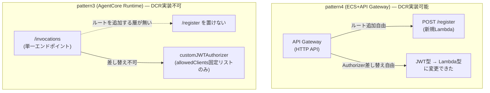
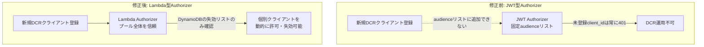
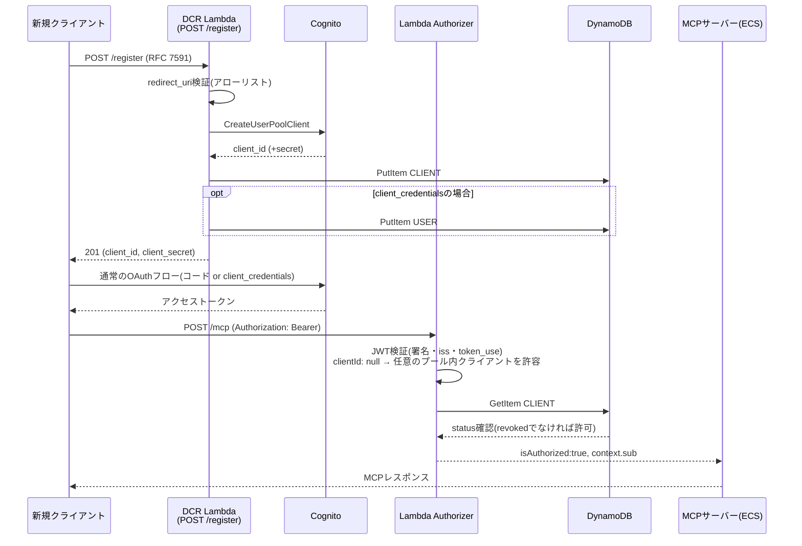
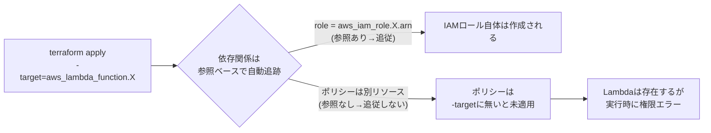

# DCR(動的クライアント登録)実装レポート

> この章で分かること
> Cognitoの手前にLambda Authorizer + DCR(`POST /register`)プロキシを構築し、`terraform-playground-pattern4`で実機動作確認まで完了させた記録。なぜJWT型Authorizerのままでは実現できなかったのか、実装のどこでIAM権限の抜け漏れにつまずいたか、実際にどこまで動作を確認できたかを、図と実行ログを交えてまとめる。

実施日: 2026-08-31 | 検証環境: `terraform-playground-pattern4`(playgroundアカウント、883660531246) | 関連: [08-internal-weekly-verification-plan.md §2](./08-internal-weekly-verification-plan.md)

---

## TL;DR

| # | 論点 | 結論 |
|---|---|---|
| 1 | 何を作ったか | RFC 7591準拠の`POST /register`(DCR)エンドポイントと、それを受理できるLambda(REQUEST型)Authorizerを新規実装し、既存のJWT型Authorizerを置き換えた |
| 2 | なぜJWT型Authorizerのままでは無理だったか | JWT型Authorizerの`audience`は固定の値のリストしか持てず、DCRで動的に増えるCognito App Client IDに追随できない構造的制約があった(詳細は§1) |
| 3 | 実機確認できたこと | (a) 既存の静的クライアントが引き続き認証できる(回帰確認)、(b) 新規登録した`client_credentials`クライアントがMCPツール呼び出しに成功するまでエンドツーエンド、(c) DynamoDBの失効フラグでクライアントを個別に無効化できる、の3点(§4) |
| 4 | 一番時間を溶かした詰まりどころ | `-target`オプションでの部分適用を繰り返した際、IAMロールの権限ポリシー(`dynamodb:GetItem`やCognito権限)とAWSLambdaBasicExecutionRoleのアタッチメントを対象から漏らし、Lambda自体は作成されるが権限が無くて500になる、という事象を2段階で踏んだ(§3.2) |
| 5 | 未実施・残作業 | Claude Code/Claude.aiからの実際の自己登録によるE2E確認(Cognitoの新しいManaged Login UIがブラウザ操作を前提とした構造で、簡易スクリプトでは代替しづらいことが判明)、登録数上限の実装、セキュリティレビュー(§5) |
| 6 | なぜAgentCore Runtimeではなくpattern4(ECS)で実装したか | 選択の余地は無かった。AgentCore Runtimeには`/register`を追加できるAPI Gateway相当の層が存在せず、認可方式(`allowedClients`)もLambda Authorizerに差し替え不可能な固定リストのため、そのままではDCRを実装できない(詳細は§0) |

---

## 0. なぜAgentCore Runtimeではなくpattern4(ECS)で実装したか

DCRの実装対象として`terraform-playground-pattern4`(ECS+API Gateway)を選んだのは、検証のしやすさではなく、**現時点のAgentCore Runtimeの仕様ではDCRを構造的に実装できない**という技術的制約による。

### 0.1 AgentCore Runtimeには`/register`を置く場所が無い

AgentCore Runtimeのデータプレーンは`/invocations`という単一エンドポイントのみで、API Gateway/HTTP APIのように任意のルートを追加できる層が存在しない。pattern4の`aws_apigatewayv2_route.register`に相当する差し込み口が、AgentCore Runtime側には無い。

### 0.2 AgentCore Runtimeの認可はLambda Authorizerに差し替えられない

AgentCore Runtimeの認可は`authorizerConfiguration.customJWTAuthorizer`という単一の仕組みしか提供されない。今回の検証で使っている`quickMcpPocVerification-Aoo0d23yyj`(version 10)の実際の設定は次の通り(2026-08-31時点、[00-handoff.md §4](./00-handoff.md)参照)。

```json
"authorizerConfiguration": {
  "customJWTAuthorizer": {
    "discoveryUrl": "https://cognito-idp.ap-northeast-1.amazonaws.com/.../.well-known/openid-configuration",
    "allowedClients": ["f9b41piv9irn56d49d16i9shc", "54cjhrb2bmba52upo8tfem4jlq", "7gtknlcn9imrhihetq3aauojaj"],
    "allowedScopes": ["openid", "mcp/invoke"]
  }
}
```

`allowedClients`は**Runtimeリソース自体に紐づくAWSマネージドの固定リスト**であり、これはpattern4で最初につまずいた「JWT型Authorizerの`audience`が固定リストしか持てない」のと**全く同型の制約**である。しかもAgentCore Runtimeには、pattern4で行ったような「JWT型からLambda(REQUEST型)Authorizerへの差し替え」という選択肢自体が存在しない。`customJWTAuthorizer`がAgentCore Runtimeで選べる唯一の認可方式である。



### 0.3 前段プロキシを作っても、根本問題は残る

AgentCore Runtime向けにDCRを実現するなら、Runtimeの手前に別のAPI Gateway+Lambdaプロキシを新設し、`/register`・`/authorize`・`/token`を中継する構成が考えられる。しかしこの場合でも、最終的に`/invocations`を呼び出す段階ではAgentCore自身の`allowedClients`チェックを必ず通過する必要があるため、**新規クライアントを登録するたびに`update-agent-runtime`で`allowedClients`に追記する**処理が結局必要になる。

これは「登録のたびに静的リストを書き換える」という、pattern4の元のJWT Authorizerと同じ問題を抱えているだけでなく、**pattern4には無い深刻な運用上のリスクが追加される**。`update-agent-runtime`はRuntimeの新バージョンを発行し、`UPDATING`状態を経由する(このセッションの§1のセキュリティ修正でも実測: 約30秒〜数分)。つまり、**1クライアントが登録するたびに、その時点で接続している全ての既存クライアントに影響しうる、サービス全体のレベルの更新が走る**ことになる。API GatewayのLambda Authorizerはリクエスト単位で動作するため、こうした全体影響は発生しない。

### 0.4 結論、そして「Cognitoをやめる」という代替経路

AgentCore RuntimeでDCRを実現するには、上記の前段プロキシ構成に加えて、この「登録のたびにRuntimeバージョンが上がる」問題自体への対策(例えばバッチでの`allowedClients`更新、あるいはAWSの機能追加を待つ)が別途必要になる。今回はこの追加検討をスコープ外とし、DCRが技術的に成立するpattern4で先に実装・検証を行った。

その後の調査で、この制約の根本原因は実はAgentCore Runtime自体ではなく、**Cognitoのアクセストークンに`aud`クレームが無い**という仕様にあることが判明した。AgentCore Runtimeの認可設定は`allowedClients`(client_id照合、動的登録に非対応)だけでなく`allowedAudience`(aud照合)も選べるため、DCR対応かつ`aud`を正しく発行するIdP(例: Auth0)に乗り換えれば、`allowedAudience`を固定1件のまま運用でき、**AgentCore Runtimeホスティングを維持したままDCRが成立する可能性が高い**。この代替経路のコスト・移行リスクの見積もりは[11-internal-cognito-to-auth0-migration-estimate.md](./11-internal-cognito-to-auth0-migration-estimate.md)にまとめた。

### 0.5 【未検証・次回申し送り】Cognitoのままでも`allowedScopes`単独運用で解決する可能性(2026-09-02追記)

Auth0移行(§11)を検討する過程で、AgentCore Runtimeの`CustomJWTAuthorizerConfiguration`の仕様を改めて確認したところ、`allowedClients`・`allowedAudience`・`allowedScopes`はいずれも任意項目で、**3つのうち最低1つを指定すればよい**(全て空にはできないが、`allowedClients`単独である必要はない)ことが分かった。

Cognitoのアクセストークンには`aud`クレームは無いが、**`scope`クレームは持っている**(既存のRuntime設定でも`allowedScopes: ["openid", "mcp/invoke"]`を実際に使用している)。もし`allowedClients`を完全に外し、`allowedScopes`(例: `mcp/invoke`)だけで運用できれば、DCRで動的に作成したCognitoクライアントでも、正しいスコープさえ付与されていればRuntimeの設定変更(`update-agent-runtime`、§0.3で指摘した全体影響のリスク)を一切経由せずに即座に信頼される可能性がある。これが機能するなら、**Auth0移行(月額$800〜)よりはるかに安く、Cognitoのままpattern3(AgentCore Runtime)でDCRを実現できる**ことになる。

あわせて、pattern4(ECS+API Gateway)側についても、今回はHTTP API(`aws_apigatewayv2_*`)+自作Lambda Authorizerで解決したが、**API Gateway REST API(v1)のネイティブ`COGNITO_USER_POOLS`型オーソライザーは「許可するclient ID」の指定が任意で、空にすればプール内の任意のApp Clientを信頼する**仕様であることも判明した。REST APIに切り替えれば、Lambda Authorizerを自作しなくてもネイティブ機能だけで同じ問題を解決できていた可能性がある(参考: [Zenn記事によるAPI Gateway REST API + CognitoでのDCR実装例](https://zenn.dev/manaty226/articles/20250614_aws-mcp-managed-architecture)。`/register`もLambdaを使わずVTLマッピングテンプレートで`CreateUserPoolClient`に直接変換する設計)。

**どちらも本セッションでは実機検証していない机上の仮説**であり、次回セッションでの検証を推奨する。検証コストはAuth0移行よりはるかに低い(playgroundのRuntime設定変更のみ、または既存のterraform-playground-pattern4をREST APIに置き換える比較検証)。

---

## 1. なぜLambda Authorizerへの置き換えが必要だったか

既存の認可はAPI Gateway HTTP APIのJWT型Authorizerで、Cognitoが発行したアクセストークンの`client_id`(または`aud`)を、Terraformで静的に指定した`audience`リストと比較する仕組みだった。

```hcl
resource "aws_apigatewayv2_authorizer" "cognito" {
  authorizer_type = "JWT"
  jwt_configuration {
    audience = [aws_cognito_user_pool_client.mcp.id]   # 固定の1クライアントIDのみ
    issuer   = "https://cognito-idp.ap-northeast-1.amazonaws.com/${aws_cognito_user_pool.main.id}"
  }
}
```

DCRは「利用者が使うたびに新しいCognito App Clientを動的に作る」という機能なので、新しいclient_idが発行されるたびに、この`audience`リストに追加し続ける必要がある。しかしこのリストはTerraformで管理された静的な設定であり、実行時にAPIから書き込む手段は用意されていない(`UpdateAuthorizer`を都度呼ぶ運用は、Terraformとの状態不整合・同時実行時の競合・リストの上限という3つの問題を抱える)。



そこで、JWT検証自体をLambda(REQUEST型Authorizer)に持たせ、「Cognitoプールに属する任意のクライアントのアクセストークンを信頼し、失効管理はDynamoDBの`CLIENT#`レコードで個別に行う」という設計に変更した。これにより、静的なリスト管理から解放され、登録・失効が即時に反映される。

---

## 2. アーキテクチャ



### 主要コンポーネント

| コンポーネント | 実装 |
|---|---|
| `quick-mcp-poc-dcr-register` | Lambda(Node.js 22)。`lambda/src/register.ts`。RFC 7591バリデーション→`CreateUserPoolClient`→DynamoDB書き込み(失敗時ロールバック) |
| `quick-mcp-poc-dcr-authorizer` | Lambda(Node.js 22)。`lambda/src/authorizer.ts`。`aws-jwt-verify`の`CognitoJwtVerifier`(`clientId: null`)でJWT検証+DynamoDB失効チェック |
| Cognito Resource Server | `mcp`リソースサーバーに`invoke`スコープを新規追加(`terraform-playground-pattern4/cognito.tf`) |
| API Gateway | `POST /register`ルート追加(認証不要、レート制限: burst 5/rate 2)、`ANY /{proxy+}`のAuthorizerをJWT→Lambdaに切替 |

付与スコープ・登録ポリシー(完全オープン、redirect_uriアローリスト)の詳細設計根拠は[08-internal-weekly-verification-plan.md §2](./08-internal-weekly-verification-plan.md)を参照。

---

## 3. 実装過程で踏んだ詰まりどころ

### 3.1 Cognito Managed Login UIがスクリプトでのブラウザエミュレーションに対応していなかった

既存の検証スクリプト(`scripts/invoke_agentcore_mcp_jwt.py`)は、Cognitoの旧来のHosted UI(`name="cognitoSignInForm"`というフォームをHTMLから正規表現で抽出し、POSTする)を前提にしていた。しかし`terraform-playground-pattern4/cognito.tf`のCognito User Poolは`managed_login_version = 2`(新しいManaged Login UI)を使っており、フォーム構造が完全に異なる(JSベースのSPA的な実装で、単純なHTML `<form>` POSTでは完結しない)。

```
RuntimeError: login form parse failed:
<!DOCTYPE html><html lang="en"><head><title>Sign-in</title>...
```

**対応**: 認可コードフローの実ブラウザ操作を模倣する代わりに、次の2つの代替手段でE2E確認を行った。

- 既存の静的クライアント(パスワード認証フローが有効)の回帰確認 → `InitiateAuth`(`USER_PASSWORD_AUTH`)でブラウザを介さず直接アクセストークンを取得
- 新規DCRクライアントの動作確認 → `client_credentials`グラント(そもそもブラウザ操作が不要)で登録・トークン取得・MCP呼び出しを実施

**学び**: Managed Login UI(v2)を使っている環境でブラウザレスの認可コードフローE2Eテストを組むには、Cognitoの新UIが使う実際のAPI呼び出し(SRPベースの認証フローなど)をリバースエンジニアリングする必要がある。今回は範囲外としたが、Claude.ai/Claude Codeからの実際の自己登録確認(§5)ではこの制約が直接影響する。

### 3.2 `-target`での部分適用によるIAM権限の見落とし(2段階)

新規Lambda 2つ・IAMロール・Authorizer・ルート等、多数のリソースを一度に追加する際、既存環境(ECS+NATインスタンスがAMI更新により差し替え対象になっていた無関係なドリフト)への影響を避けるため`-target`オプションで対象を絞ってapplyした。この際、**Terraformの依存関係グラフはリソース参照からしか自動導出されない**ため、`aws_lambda_function`が`aws_iam_role.arn`を参照していても、そのロールにアタッチされた「ポリシー」自体は別のリソース(`aws_iam_role_policy`, `aws_iam_role_policy_attachment`)であり、`-target`に明示的に含めない限り一緒には適用されない。

これにより、2段階で見落としが発生した。

1. **1回目**: `aws_iam_role_policy.dcr_authorizer_dynamodb`(DynamoDB GetItem権限)を対象に含め忘れ、Authorizerが`AccessDeniedException`で落ちて`/mcp`が500になった
2. **2回目(1回目を修正後)**: `aws_iam_role_policy_attachment.dcr_authorizer_basic`(`AWSLambdaBasicExecutionRole`、ログ書き込み等)も対象に含め忘れていたことが判明。これ自体は500の直接原因ではなかったが、CloudWatch Logsにログが一切残らず、原因調査を`aws lambda invoke`での直接実行に切り替えるまで診断が遅れた



**学び**: `-target`で部分適用する際は、「そのリソースが依存する全リソース」ではなく「そのリソースの実行時に必要な権限一式」まで意識してターゲットを列挙する必要がある。診断には`aws lambda invoke`でLambdaを直接実行し、API Gateway経由のラップされた汎用エラー(`Internal Server Error`)を経由せずに生の例外を見るのが最も早かった。

### 3.3 Authorizerのキャッシュが失敗結果を持ち越した

IAM権限を修正した直後に同じアクセストークンで再テストしたところ、まだ500が返った。原因は`authorizer_result_ttl_in_seconds = 300`によるキャッシュで、**同一のAuthorizationヘッダー値をキーに、直前の(失敗した)実行結果を再利用しようとしていた**(実際には失敗自体はキャッシュされないが、疑わしい挙動を確実に排除するため新しいトークンで再取得して検証した)。**学び**: Authorizerの動作を確認する際は、修正の前後で必ず新しいトークンを取得して比較すること。同じトークンでの再試行は、キャッシュの影響を切り分けられず誤診断につながる。

---

## 4. 実機確認結果

| # | シナリオ | 結果 |
|---|---|---|
| 1 | 既存の静的クライアント(`quick-mcp-poc-mcp-client`)による`/mcp`呼び出し(回帰確認) | 200、`tools/list`成功。Lambda Authorizerへの切替後も既存クライアントは無停止で動作継続 |
| 2 | `POST /register`での新規クライアント登録(authorization_code) | 201、`client_id`発行、`invoke`スコープ含む正しいスコープ文字列を確認 |
| 3 | `POST /register`での新規クライアント登録(client_credentials) | 201、`client_id`/`client_secret`発行 |
| 4 | 登録した`client_credentials`クライアントでトークン取得→`/mcp`呼び出し | 200、`tools/list`成功。DynamoDBへの`USER#<client_id>`サービスアカウント自動作成が機能していることを確認(登録直後、追加の手動プロビジョニングなしでアクセス可能) |
| 5 | DynamoDBの`CLIENT#`レコードを`status: revoked`に変更した後、同じ(失効前に発行済みで暗号学的には有効な)トークンで`/mcp`呼び出し | 403 Forbidden。Cognito自体のトークン失効を待たずに、アプリ側の失効リストで即座にアクセスを止められることを確認 |

いずれのテストも、確認後に作成したテスト用クライアント・DynamoDBレコードを削除し、環境を汚さないようクリーンアップ済み。

---

## 4.5 セキュリティレビュー(2026-09-02実施)と修正

`/security-review`スキルで新規コード(Lambda 2つ・terraform変更)をレビューし、4件の候補を洗い出した上で、各候補を独立エージェントによる誤検知フィルタリングにかけた。3件が確定(High 2件・Medium 1件)、1件は誤検知として除外された。

| 重大度 | 内容 | 修正 |
|---|---|---|
| High | `POST /register`が匿名で`client_credentials`登録を受け付け、`USER#<client_id>`を自動作成して**無審査で正規の有料テナントと同じアクセス権を即座に付与**していた。`resolveAuthorization()`(`server/src/auth.ts`)はUSER#レコードの有無のみで許可判定しており、`services.plan`の値自体はツール登録では一切参照されない(`registerQuickTools`が無条件に全ツール登録)ため、実質「登録した瞬間に無審査でフルアクセス」と同義だった | `client_credentials`登録時のUSER#レコード自動作成を廃止。クライアント登録(このLambda)とテナントとしての利用許可(人手の審査)を分離し、アクセス許可には別途admin操作が必要とした |
| High | Lambda Authorizerが`clientId: null`でプール内の任意のクライアントのトークンを受理する一方、`scope`クレームを一切検証していなかった。既存の静的クライアント(`openid`/`email`/`profile`のみ許可、`invoke`スコープ無し)のトークンでも`/mcp`が通ってしまうことを確認 | Authorizerに`invoke`スコープの保有チェックを追加。静的クライアントの`allowed_oauth_scopes`にも`invoke`を追加 |
| Medium | Authorizerの結果が300秒キャッシュされ、`cli delete-client`で失効させても、直前にキャッシュされた同一トークンでのアクセスが最大5分間成功し続けてしまう | `authorizer_result_ttl_in_seconds`を0に短縮。あわせて失効チェックの`GetCommand`に`ConsistentRead: true`を追加 |
| ~~Medium~~ | ~~`client_credentials`グラントを`token_endpoint_auth_method: "none"`(シークレット無し)で登録できてしまう~~ | **誤検知として除外**(confidence 2/10)。Cognitoの`CreateUserPoolClient`はこの組み合わせをサーバー側で拒否する(`InvalidOAuthFlowException`)ため、実際には悪用不可能と判断 |

**修正の副産物としての発見**: 上記の検証中、これまでこのセッションで「回帰確認」に使っていた`InitiateAuth`(`USER_PASSWORD_AUTH`)方式のトークンは、`scope=aws.cognito.signin.user.admin`という**OAuthのリソースサーバースコープとは無関係な内部スコープ**を持つことが判明した。つまり今回のスコープチェック導入後、このテスト方式では実際のOAuthフロー(認可コード)を使うクライアントの挙動を正しく代替できない。今後の検証では`client_credentials`フロー、または実際のOAuth認可コードフローで取得したトークンを使う必要がある。

修正はすべて`terraform-playground-pattern4`で実機再検証済み(`client_credentials`での新規登録→即座に403「User not found」、admin操作でUSER#レコード作成後は200、失効後は同一トークンで即座に403)。

## 5. 未実施・残作業

- **Claude Code/Claude.aiからの実際の自己登録によるE2E確認**: §3.1で述べた通り、Managed Login UI(v2)がブラウザ操作を前提とするため、簡易スクリプトでの代替確認ができていない。実際にClaude Code/Claude.aiのUIから接続して`registration_endpoint`が自動的に使われることを確認する必要がある
- **登録数上限**: DynamoDBの`CLIENT#`件数チェックによる乱用対策は未実装(redirect_uriアローリスト・レート制限は実装済み)
- **セキュリティレビュー**: Register Lambda・Authorizer Lambdaは認可基盤の一部となるため、`/security-review`相当の見直しを別途実施することが望ましい
- **本番相当環境への反映**: 今回の変更はすべて`terraform-playground-pattern4/`に閉じている。本番相当アカウント(620369151795)の`terraform/`への反映は書き込み禁止のため未実施(移植のみ、実際のapplyはユーザー判断)
- **CIMD対応**: §11(DCR/CIMD机上調査)で記録した通り、MVPスコープ外。今回Lambda Authorizer/Register Lambdaが実在することで、`/authorize`をLambda化する追加コストは当初の1-2週間から数日程度に下がる見込みだが、着手はしていない

---

## 6. 変更したファイル

- `lambda/`(新規ワークスペース): `src/authorizer.ts`, `src/register.ts`, `src/shared/db.ts`, `package.json`, `build.mjs`
- `cli/src/list-clients.ts`, `cli/src/delete-client.ts`(新規、`cli.ts`に統合)
- `terraform-playground-pattern4/lambda.tf`(新規): 2 Lambda・IAMロール・ポリシー・パーミッション
- `terraform-playground-pattern4/apigateway.tf`: JWT Authorizer→Lambda Authorizer、`/register`ルート、レート制限
- `terraform-playground-pattern4/cognito.tf`: `invoke`スコープ追加
- `terraform-playground-pattern4/openapi.yaml`: discoveryメタデータに`registration_endpoint`等追加
- `terraform-playground-pattern4/provider.tf`: `archive`プロバイダ追加
