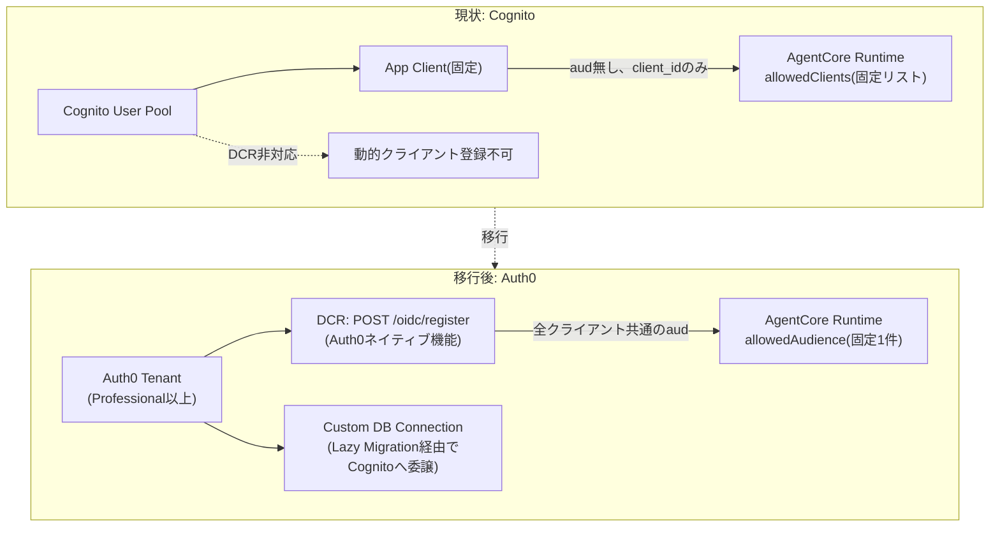
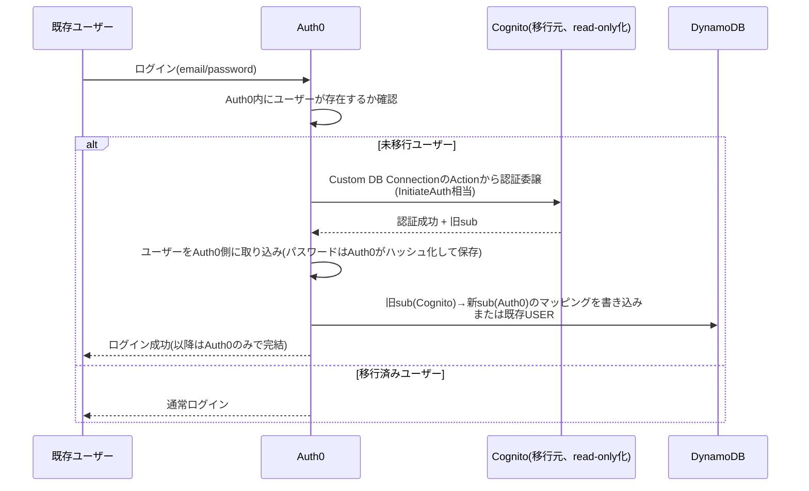

# Cognito→Auth0移行の見積もり(DCR対応・AgentCore Runtimeホスティング維持のための検討)

> この章で分かること
> [10-internal-dcr-implementation.md §0](./10-internal-dcr-implementation.md)で判明した「AgentCore RuntimeでDCRが構造的に無理なのはCognitoが`aud`クレームを発行しない仕様のせいであり、DCR対応IdP(Auth0等)に乗り換えれば`allowedAudience`固定運用でRuntimeホスティングのままDCRが成立する可能性がある」という仮説について、実際に切り替える場合のコスト・アーキテクチャ変更・移行リスクを机上で見積もる。

作成日: 2026-08-31 | 検証方法: 机上調査(Web検索によるAuth0公式ドキュメント・料金・移行ガイドの確認。実機検証は未実施)

---

## TL;DR

| # | 論点 | 結論 |
|---|---|---|
| 1 | 技術的に成立するか | 成立する見込みが高い。Auth0はDCR(RFC 7591)にネイティブ対応し、アクセストークンに`aud`クレームを正しく発行するため、AgentCore Runtimeの`allowedAudience`を固定1件のまま運用でき、`allowedClients`の動的更新問題そのものが発生しなくなる |
| 2 | エンジニアリング工数 | 見積もり **約7〜10人日**(§4)。今回Cognito向けに実装したDCR机上プロキシ(Lambda Authorizer + Register Lambda)は不要になり、その分は削減されるが、ユーザー移行・IDマッピング・テストツール書き換えが新たに発生する |
| 3 | 【重要】追加の月額コスト | AuthのDCR機能は**Professionalプラン以上が必須**(B2Bなら最低 **$800/月**〜、1,000 MAUまで)。現状のCognitoは同規模(実クライアント41ユーザー)ではほぼ無償のため、**月額$800〜1,000超の新規恒常コストが発生する**(§3) |
| 4 | 【要注意】スケール時のコスト崖 | B2B Professionalプランはエンタープライズ SSO接続を5件までしか含まない。金融機関を6社目以降に外販する場合、Enterpriseプラン(**月額$10,000超**、要問い合わせ)への移行が必要になる可能性が高い(§3.2) |
| 5 | 【要確認】データレジデンシー・コンプライアンス | Auth0(Okta社)は米国企業のSaaSで、テナントリージョンは米国・EU・豪州が中心。日本国内リージョンの提供有無は要確認。FISC安全対策基準を意識する金融機関向けサービスとして、認証基盤(利用者の認証情報)を国外SaaSに置くことの妥当性は、エンジニアリング検討とは別に法務・コンプライアンス部門での検討が必要(§5) |
| 6 | 本番41ユーザーの移行リスク | Auth0公式が推奨する「Lazy Migration(初回ログイン時に旧システムへ認証委譲しつつ移行)」方式を使えば強制ログアウト・パスワード再設定は不要。ただしDynamoDBの`USER#<cognito-sub>`キー方式をAuth0の`sub`形式にどう対応させるかの設計が必要(§4.4) |

---

## 1. 背景

前回のやり取りで、AgentCore Runtimeが`allowedClients`(client_id照合、固定リストのみ)しか使えない理由を調べたところ、根本原因は**AgentCore Runtime側の制約ではなく、Cognitoのアクセストークンに`aud`クレームが無い**という仕様にあることが分かった([00-handoff.md §9 問題5](./00-handoff.md)で以前から既知)。

AgentCore Runtimeの`CustomJWTAuthorizerConfiguration`は`allowedAudience`(`aud`クレーム照合)と`allowedClients`(`client_id`クレーム照合)を独立に設定できる。DCR対応IdPが「全ての動的登録クライアントに対して同一の`aud`(=保護対象APIの識別子)を含むトークンを発行する」設計であれば、**Runtime側は`allowedAudience`を固定1件にしたまま、クライアントが何百登録されても設定変更が一切不要**になる。AWS公式ドキュメントも、Cognitoではなく「DCR対応IdP(Auth0等)を使う」ことを示唆している([Configure inbound JWT authorizer](https://docs.aws.amazon.com/bedrock-agentcore/latest/devguide/inbound-jwt-authorizer.html))。

本ドキュメントは、この「Auth0に乗り換える」という選択肢を実際に取った場合のコストを見積もる。

---

## 2. アーキテクチャ変更の全体像

### 主な変更点

| コンポーネント | 現状(Cognito) | 移行後(Auth0) |
|---|---|---|
| ユーザーストア | Cognito User Pool | Auth0 Database Connection(初期はLazy Migration経由でCognitoに認証委譲) |
| DCR | 非対応(今回`POST /register`を自前実装) | Auth0ネイティブ(`POST /oidc/register`)。**自前実装したLambda(`lambda/src/register.ts`)は不要になり削除できる** |
| AgentCore Runtime Authorizer | `allowedClients`(固定リスト、動的登録に非対応) | `allowedAudience`(固定1件、DCRと両立) |
| JWT検証(`lambda/src/authorizer.ts`) | `aws-jwt-verify`の`CognitoJwtVerifier` | `aws-jwt-verify`の汎用`JwtVerifier`(Auth0のJWKSエンドポイントを指定。ライブラリ自体は継続利用可) |
| 失効管理 | DynamoDBの`CLIENT#`レコード(今回実装) | 同様の仕組みを維持可能。Auth0側でもアプリケーション(クライアント)の無効化は可能だが、即時性を求めるなら引き続きDynamoDBの失効リストを併用するのが無難 |
| CLI管理(`cli/src/*.ts`) | `@aws-sdk/client-cognito-identity-provider` | `auth0`(公式Node SDK)のManagement API呼び出しに置き換え |
| Terraform | `aws_cognito_*`リソース一式 | `auth0/auth0`プロバイダの`auth0_resource_server`, `auth0_client`, `auth0_connection`等 |

---

## 3. 追加コスト

### 3.1 Auth0サブスクリプション

DCR機能は**Professionalプラン以上でのみ有効化可能**(ダッシュボードのフラグ、または`PATCH /api/v2/tenants/settings`で明示的に有効化する必要があり、デフォルトは無効)。

| プラン区分 | 最低月額 | MAU上限 | DCR対応 |
|---|---|---|---|
| Free | $0 | 25,000 | 非対応 |
| Essentials (B2C) | $35 | 500 | 非対応 |
| Essentials (B2B) | $150 | 500 | 非対応 |
| **Professional (B2C)** | **$240** | 1,000 | 対応 |
| **Professional (B2B)** | **$800** | 1,000 | 対応 |
| Enterprise | 要問い合わせ(目安$10,000+) | 応相談 | 対応 |

「金融機関を複数テナントとして外販する」という本サービスの性質上、B2B区分が実態に近い。**最低でも月額$800(≈12万円/月)が新規発生**する。現状のCognitoは実クライアント41ユーザーの規模ではほぼ無償(Cognitoの無料枠は月間アクティブユーザー50,000人まで無料)であるため、この差額はまるごと新規コストとなる。

### 3.2 スケール時の注意: エンタープライズSSO接続数の上限

B2B Professionalプランは**エンタープライズSSO接続を5件まで**しか含まない。「金融機関ごとに個別のSSO/IdP連携」を求められるケースが6社目以降に発生した時点で、Enterpriseプラン(要問い合わせ、目安月額$10,000超)への移行が必要になる可能性が高い。**外販先が数社を超える計画であれば、この崖をコスト試算に織り込む必要がある**。

### 3.3 既存のコストシミュレーターへの影響

このコストは[コストシミュレーター(Artifact)](https://claude.ai/code/artifact/8f9d8cfc-aec8-4eb2-8970-6e3e1947f8c3)や[02-internal-cost-simulation.md](./02-internal-cost-simulation.md)には未反映(いずれもCognitoを前提とした試算)。DCRを本格採用する場合は、月額$800〜のAuth0サブスクリプションを固定費に追加する形でモデルを更新する必要がある。

---

## 4. エンジニアリング工数見積もり(合計 約7〜10人日)

| # | タスク | 見積もり | 備考 |
|---|---|---|---|
| 1 | Auth0テナント構築・DCR有効化・Resource Server定義・Terraform化(`auth0/auth0`プロバイダ導入) | 1〜1.5日 | プランはB2B Professional以上を選択 |
| 2 | AgentCore Runtime / API Gatewayの認可設定切替(discoveryUrl・allowedAudienceへの変更、allowedClients廃止) | 0.5日 | 設定変更のみ。今回`update-agent-runtime`の挙動は実測済み |
| 3 | `lambda/src/authorizer.ts`の`CognitoJwtVerifier`→汎用`JwtVerifier`への切替 | 0.25日 | ライブラリ(`aws-jwt-verify`)は継続利用可能 |
| 4 | **`lambda/src/register.ts`(自前DCR実装)の削除** | -(工数減) | Auth0がDCRをネイティブ提供するため不要になる。今回のCognito向け実装(§2.3相当)がまるごと不要になる |
| 5 | `cli/src/*.ts`のAuth0 Management API SDKへの置き換え(`invite-user`/`list-users`/`delete-user`/`update-services`) | 1〜1.5日 | `list-clients`/`delete-client`はAuth0側の管理画面/APIで代替可能なため簡素化できる |
| 6 | Lazy Migration実装(Auth0 Custom Database Connection + Actions、Cognitoへの認証委譲スクリプト) | 1.5〜2日 | Rules/HooksはEOL予定のためActionsで実装。§4.4参照 |
| 7 | DynamoDB `USER#`キーのID対応関係設計・実装 | 1日 | §4.4参照。本番41ユーザーへの影響が最も大きい箇所 |
| 8 | 検証スクリプト書き換え(`scripts/invoke_agentcore_mcp_jwt.py`等、Auth0 Universal Loginへの対応) | 0.5〜1日 | Auth0のログインページの方がCognito Managed Login v2より標準的なOAuthフローに近く、スクリプト化しやすい見込み(未検証) |
| 9 | E2E再検証(pattern3・pattern4双方、DCR自己登録含む) | 1日 | 今回未達成だったClaude Code/Claude.aiからの実際の自己登録確認もここで再挑戦できる |
| | **合計** | **約7〜9.75日** | |

### 4.4 本番41ユーザーの移行方式(最重要・最高リスク箇所)

Auth0公式が推奨する**Lazy Migration(自動移行)**方式を採用する。

- ユーザーはパスワード再設定・強制ログアウト不要(初回ログイン時に透過的に移行)
- **課題**: DynamoDBは`PK: USER#<cognito-sub>`で全レコードを管理している(`server/src/db.ts`, `cli/src/invite-user.ts`)。Auth0移行後の`sub`はCognitoのUUIDとは異なる形式(例: `auth0|...`)になるため、移行時にDynamoDBレコードを複製またはキー変更する処理をAuth0 Actionの中に組み込む必要がある。**この設計・実装が今回の見積もりの中で最も本番影響が大きく、慎重なテストが必要な箇所**
- 移行期間中はCognitoプールを読み取り専用のまま維持し、全ユーザーの移行完了を確認してから廃止する(移行完了の判定・タイムアウトしたユーザーへの案内含め、運用設計も別途必要)

---

## 5. エンジニアリング外の検討事項(要 法務・コンプライアンス確認)

- **データレジデンシー**: Auth0(Okta社)のテナントリージョンは主に米国・EU・豪州。日本国内リージョンの提供有無・提供予定は本調査では未確認。FISC安全対策基準を意識する金融機関向けサービスとして、認証情報(パスワードハッシュ、メールアドレス等のPII)を国外SaaSに保持することの可否は、[05-internal-security-compliance-verification.md](./05-internal-security-compliance-verification.md)の文脈で改めて評価が必要
- **契約・DPA**: Okta/Auth0とのデータ処理契約(DPA)、SOC2/ISO27001等の認証取得状況の確認
- **ベンダーロックイン**: Cognito(AWSアカウント内で完結)からAuth0(サードパーティSaaS)への移行は、認証基盤を自社AWSアカウントの管理境界の外に置くという、アーキテクチャ上のトレードオフを伴う

---

## 6. 結論・意思決定に必要な情報

技術的には「Cognito→Auth0(またはDCR対応かつ`aud`クレームを正しく発行する他のIdP)への切り替え」がAgentCore Runtimeホスティングを維持したままDCRを実現する現実的な経路である可能性が高い。ただし判断には以下がそろって初めて意思決定できる。

1. **月額$800〜(将来的に$10,000超もありうる)の新規コストを許容できるか**(§3)
2. **データレジデンシー・コンプライアンス上の懸念がクリアできるか**(§5、法務確認が必要)
3. **本番41ユーザーの移行リスクを許容できるか**(§4.4)

これらがクリアできない場合の代替案は、[08-internal-weekly-verification-plan.md §2.5](./08-internal-weekly-verification-plan.md)で触れた「選択肢A: `oauth_anthropic_creds`」(個別コネクタとして展開し、DCR自体を不要にする)、または現状のCognito+自前DCR実装(今回`terraform-playground-pattern4`で構築したもの)をECS+API Gateway経路限定で採用し、AgentCore Runtimeは非DCRの静的クライアント運用に留める、という切り分けである。

**【2026-09-02追記・次回優先確認】より安価な代替仮説**: 本ドキュメントの検討中に、Auth0移行より遥かに安く済む可能性のある仮説が新たに見つかった。AgentCore Runtimeの認可設定は`allowedClients`を完全に外し、Cognitoトークンが持つ`scope`クレームのみ(`allowedScopes`)で運用できる可能性がある。これが機能すれば、Cognitoを維持したままDCRがpattern3(AgentCore Runtime)でも成立し、本ドキュメントの月額$800〜という追加コスト自体が不要になる。**Auth0移行の実施判断は、この仮説をplaygroundで実機検証してから行うことを強く推奨する**(詳細は[10-internal-dcr-implementation.md §0.5](./10-internal-dcr-implementation.md))。

Sources:
- [Configure inbound JWT authorizer](https://docs.aws.amazon.com/bedrock-agentcore/latest/devguide/inbound-jwt-authorizer.html)
- [Dynamic Client Registration - Auth0 Docs](https://auth0.com/docs/get-started/applications/dynamic-client-registration)
- [Migrate Users from Amazon Web Services - Auth0 Docs](https://auth0.com/docs/manage-users/user-migration/migrate-users-from-amazon-web-services)
- [How to Migrate Users to Auth0: A Technical Guide](https://auth0.com/blog/how-to-migrate-users-to-auth0-a-technical-guide/)
- [AWS Cognito to Auth0: 225K-User Migration](https://sublimecoding.com/blog/aws-cognito-to-auth0-migration-without-forcing-logout)
- [Securing Amazon Bedrock AgentCore with Auth0 for AI Agents](https://auth0.com/blog/securing-amazon-bedrock-agentcore-agents-auth0-for-ai-agents/)
