# 今週の追加検証レポート: x-cognito-subヘッダー処理の修正・DCR実装・コスト検討・関連机上調査

> この章で分かること
> 今週実施したDCR(動的クライアント登録)の実装、AgentCore Runtime経路における`x-cognito-sub`ヘッダー処理の修正、ホスティングコストの内訳整理、Cognito→Auth0移行の机上見積もり、MCPプロトコルv2移行の影響調査についてまとめる。

検証日: 2026-08-31〜2026-09-02 | 検証方法: playgroundアカウント(883660531246)、`terraform-playground-pattern4`での実機構築・実際のHTTPS呼び出しによるエンドツーエンド確認、および机上調査(公式ドキュメントの確認)

---

## TL;DR

| # | 論点 | 結論 |
|---|---|---|
| 1 | x-cognito-subヘッダー処理の修正 | AgentCore Runtime経路で、`x-cognito-sub`ヘッダーの値によって認可対象のテナントが変わってしまう挙動を実機で確認した。原因はRuntimeの設定にあり、コード変更・再デプロイ不要でRuntimeの設定変更のみで是正し、再検証済み(§1) |
| 2 | DCR(動的クライアント登録)実装 | Cognitoの手前にLambda Authorizer + `POST /register`(RFC 7591準拠)を実装し、`terraform-playground-pattern4`で登録・認可・失効までエンドツーエンドの実機動作を確認した(§2) |
| 3 | DCR認可まわりの継続検証 | 実装直後に初期チェックを行い、識別した改善点への初期対応は完了した。今後も認可まわりの変更のたびに同様の確認を継続する(§3) |
| 4 | ホスティングコストの内訳 | パターン3(AgentCore Runtime)・パターン4(API Gateway+ECS)それぞれの課金モデルと内訳を整理した。パターン4はトラフィック量に関わらずほぼ固定費、パターン3はほぼ従量費という性質の違いがあり、閉域網・WAF要件の有無で損益分岐点が大きく変わる(§4) |
| 5 | Cognito→Auth0移行の検討 | DCR実装の過程で判明した「AgentCore RuntimeでDCRができないのはCognitoが`aud`クレームを発行しない仕様のため」という根本原因を踏まえ、Auth0等のDCR対応IdPへの移行という代替経路を机上で見積もった。技術的には成立する見込みだが、月額800ドル以上の新規コストとデータレジデンシー面の確認事項が残る(§5) |
| 6 | MCPプロトコルv2(2026-07-28)の影響調査 | Step1以降で採用予定のプロトコルバージョンについて、対応SDKへのアップグレードが既存クライアントとの互換性にどう影響するかを調査した。実在する仕様改訂であり、新SDKは旧クライアントとの両対応をデフォルトで提供する設計。**訂正**: 調査当初「現状ベータ版のため時期尚早」としたが、v2は仕様と同時に既にGA済みと判明した(§6) |
| 7 | 応答時間の参考情報 | チューニング作業自体は今週未着手。現時点で分かっているパターン3・4の応答時間差とその内訳、今後6秒を短縮できる可能性を参考情報として整理した(§7) |

---

## 1. x-cognito-subヘッダー処理の修正

### 1.1 背景: 2つの認可経路の構造的な違い

quick-mcp-pocは同じアプリコードをECS+API Gateway経路とAgentCore Runtime経路の2つでホストしている。両者は「利用者の`sub`(Cognitoの一意識別子)をどうやってアプリに伝えるか」という点で、実装が非対称になっていた。

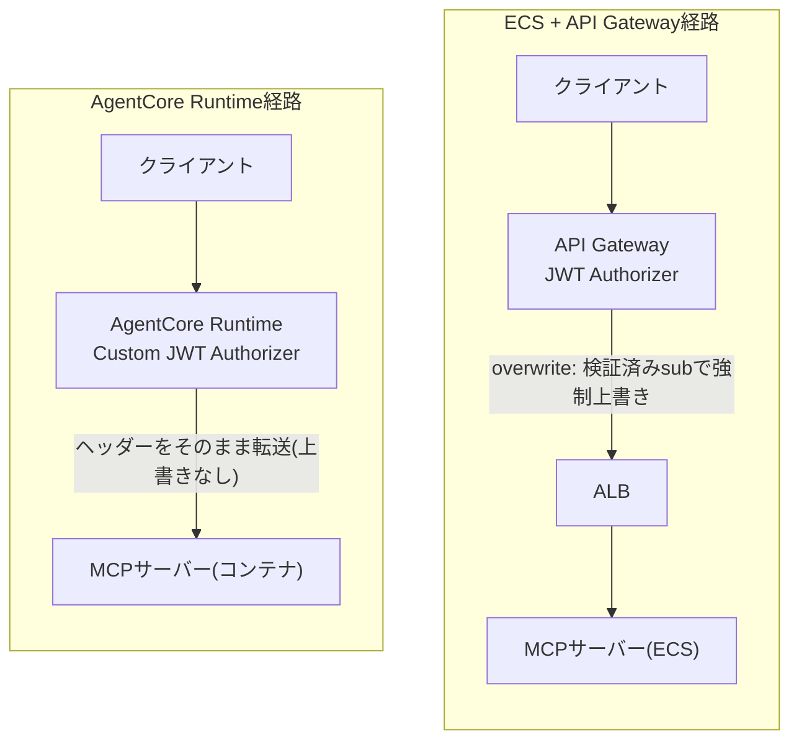

**図の解説**: 両経路とも入口でJWTの正当性は検証している。違いは「検証済みの`sub`をどうアプリに渡すか」にある。ECS経路はAPI Gatewayが`x-cognito-sub`ヘッダーを検証済みの値で強制的に上書きしてから転送するため、クライアントがこのヘッダーを送っても意味が無い。AgentCore Runtime経路にはこの上書き機構が無く、クライアントが送ったヘッダーの値がそのままコンテナに届く。アプリコードは両経路で共通のため、この非対称性により、ヘッダーの値がそのままアプリの認可判定に使われてしまう状態になっていた。

### 1.2 ECS経路(保護あり)の詳細

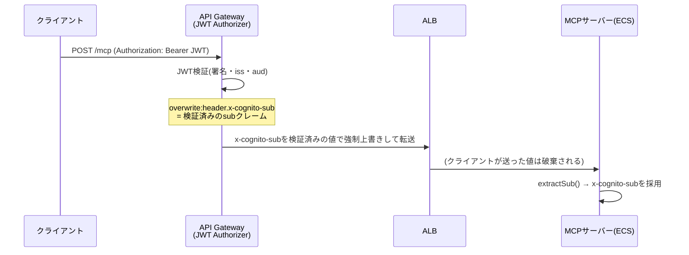

**図の解説**: ポイントは「overwrite:」という指定である。API Gatewayの統合設定でこの接頭辞を付けると、クライアントが同名のヘッダーを送っていても、検証済みの値で必ず上書きされる。つまりこの経路では、`x-cognito-sub`ヘッダーは「クライアントが操作できる入力」ではなく「サーバー側が保証する出力」になっている。

### 1.3 AgentCore Runtime経路(修正前)の詳細

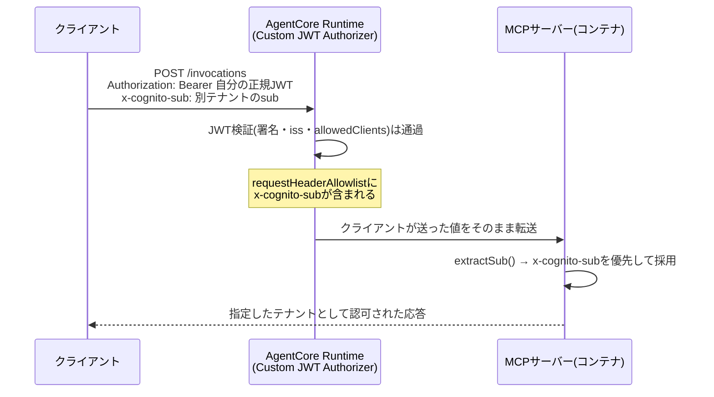

**図の解説**: AgentCore RuntimeのCustom JWT Authorizerは「このJWTは有効か」「許可されたクライアントか」を検証するが、誰の`sub`としてリクエストを処理するかには関与しない。`requestHeaderAllowlist`は単に「どのヘッダーをコンテナに転送してよいか」を定めるだけの設定で、値を検証済みのものに置き換える機能は持たない。そのため、有効なJWTを持つ状態でヘッダーの値を変えると、意図しないテナントとして認可されてしまう挙動になっていた。

### 1.4 実機での確証方法

`tools/list`はどのユーザーでも同じ固定のツール一覧を返す実装のため、レスポンスの成否だけでは判別できない。そこで次の2パターンを比較した。

| 試行 | `x-cognito-sub`の値 | ヘッダーが有効な場合 | ヘッダーが無視される場合 |
|---|---|---|---|
| A | 実在する別テナントのsub | 200(そのテナントとして認可) | 200(元のJWTのテナントとして認可) |
| B | 存在しないダミーsub | 403(認可処理がDynamoDBにレコードを見つけられず失敗) | 200(元のJWTのテナントとして認可) |

試行Bで403が返れば、ヘッダーの値が実際に認可ロジックへ渡っていた動かぬ証拠になる。実際にplaygroundのAgentCore Runtimeで検証したところ、試行Aは200、試行Bは403となり、`x-cognito-sub`ヘッダーの値が認可判定に実際に使われていたことが確定した。

### 1.5 想定されるリスク

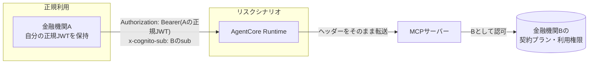

**図の解説**: 金融機関A・B・Cが同一のAgentCore Runtimeを共有するマルチテナント構成を想定した図。本来アクセス権限を持たない第三者(金融機関Aの利用者、または漏洩したAの認証情報を持つ者)が、Cognitoの認証情報を一切持っていない他テナント(B)のsubさえ知っていれば、Bの契約プランでツールを呼び出せてしまう構図になっていた。金融機関向けの課金制サービスとして展開する上で、他社の契約内容・利用枠に影響しうるという点で見過ごせないリスクだった。

### 1.6 修正内容

修正の選択肢は理論上2つあった。(1)AgentCore Runtime側の設定変更のみで`x-cognito-sub`をヘッダー転送対象から外す。(2)アプリ側にデプロイ環境ごとの信頼可否フラグを追加し、コードを変更する。

選択肢(1)を採用した。通常のクライアントはそもそも`x-cognito-sub`ヘッダーを送信しておらず、このヘッダーはAgentCore経路では一度も正当な用途で使われていなかった。アプリの`extractSub()`は、ヘッダーが存在しない場合に自動でBearerトークンへフォールバックする設計を最初から持っていたため、Runtime側でこのヘッダーを転送しないようにするだけで、アプリは変更なしに安全な経路へ自然に切り替わる。この変更でRuntimeは新しいバージョンに更新され、約30秒でUPDATING状態からREADYに戻った。

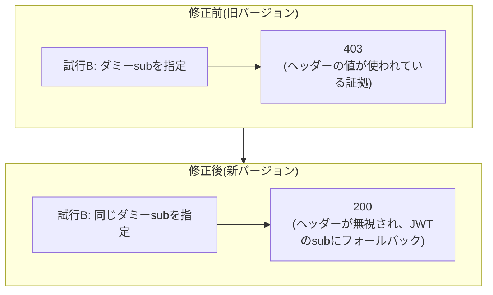

**図の解説**: 修正前後で同一の試行Bを実行した結果を比較した図。修正前は403(ヘッダーの値が使われている証拠)、修正後は200(ヘッダーが無視され、正しくBearerトークンのsubにフォールバックする)に変化した。この結果の変化そのものが、修正が意図通り機能していることの直接的な証拠になる。通常のbaseline呼び出し(ヘッダー無し)も引き続き正常動作することを確認済み。

残タスクとして、`extractSub()`のBearerトークン処理は署名検証を行わずJWTペイロードをbase64デコードしているだけであり、AgentCore Custom JWT Authorizerが前段で検証済みという前提に全面的に依存している。多層防御の観点では、Cognito JWKSに対する実署名検証への強化が望ましい(優先度は中、直接の懸念経路は今回の修正で解消しているため)。

---

## 2. DCR(動的クライアント登録)の実装

### 2.1 なぜLambda Authorizerへの置き換えが必要だったか

既存の認可はAPI Gateway HTTP APIのJWT型Authorizerで、Cognitoが発行したアクセストークンの`client_id`を、Terraformで静的に指定した`audience`リストと比較する仕組みだった。DCRは利用者が使うたびに新しいCognito App Clientを動的に作る機能なので、新しいclient_idが発行されるたびにこの`audience`リストに追加し続ける必要があるが、このリストは静的な設定であり、実行時にAPIから書き込む手段は用意されていない。

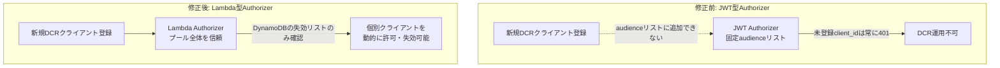

**図の解説**: JWT型Authorizerは「登録済みの固定リストと一致するか」しか判定できないため、DCRのように後から増えるクライアントに対応できない。Lambda型Authorizerに置き換えることで、「Cognitoプールに属するクライアントであれば一旦信頼し、失効リストに載っていれば拒否する」という、ブロックリスト方式に判定ロジックを転換した。これにより静的リストの書き換えが不要になり、登録・失効が即時に反映されるようになった。

### 2.2 なぜAgentCore Runtimeではなくpattern4(ECS)で実装したか

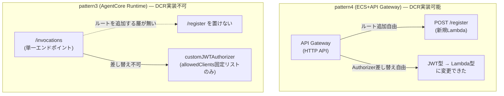

**図の解説**: AgentCore Runtimeのデータプレーンは`/invocations`という単一エンドポイントのみで、API Gatewayのように任意のルートを追加できる層が存在しない。加えて、認可方式も`customJWTAuthorizer`という単一の仕組みしか提供されず、これはRuntimeリソース自体に紐づく固定リスト(`allowedClients`)である。ECS+API Gateway側で行った「JWT型→Lambda型への差し替え」に相当する選択肢が、AgentCore Runtimeには存在しない。

前段にAPI Gateway+Lambdaのプロキシを新設する構成も考えられるが、その場合でも最終的に`/invocations`を呼び出す段階ではAgentCore自身の`allowedClients`チェックを必ず通過する必要があるため、新規クライアントを登録するたびに設定変更APIで`allowedClients`に追記する処理が結局必要になる。この設定変更はRuntimeの新バージョンを発行しUPDATING状態を経由する(§1で実測した通り約30秒)ため、1クライアントが登録するたびに、その時点で接続している全ての既存クライアントに影響しうるサービス全体レベルの更新が走ることになる。API GatewayのLambda Authorizerはリクエスト単位で動作するため、こうした全体影響は発生しない。

今回はこの追加検討をスコープ外とし、DCRが技術的に成立するECS+API Gateway経路で先に実装・検証を行った。この制約の根本原因が実はAgentCore Runtime自体ではなくCognitoの仕様にあるという点は§5で扱う。

### 2.3 実装したアーキテクチャ

**全体構成図**

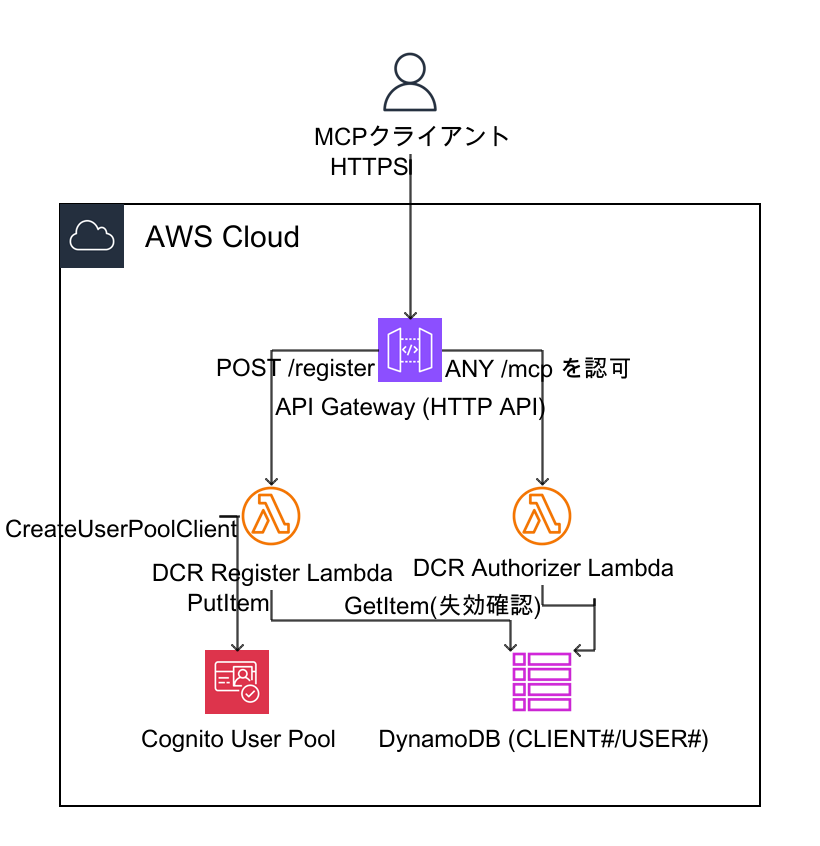

**図の解説**: 既存のAPI Gatewayに2つのLambda(DCR Register Lambda、DCR Authorizer Lambda)を追加した。DCR Register Lambdaは`POST /register`を受けてCognitoに新しいApp Clientを作成し(`CreateUserPoolClient`)、DynamoDBに管理用レコード(`CLIENT#<client_id>`)を書き込む。DCR Authorizer Lambdaは`/mcp`宛の全リクエストの認可を担い、JWTの検証に加えてDynamoDBの失効状態を都度確認する。この構成は既存のALB・ECS(パターン4の既存バックエンド)の手前に位置し、認可を通過したリクエストのみが既存のMCPサーバーに到達する(ALB・ECS部分は既存構成のため本図では省略)。

**処理の流れ**

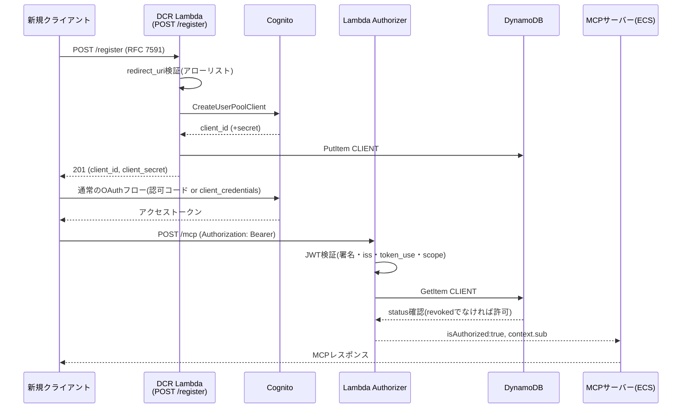

**図の解説**: 登録(`/register`)と実際の利用(`/mcp`)は完全に別のタイミングで動く2つのフローである。登録時にCognitoへ新しいApp Clientを作成し、DynamoDBに管理用のレコードを書き込む。利用時は、そのクライアントが発行したトークンをLambda Authorizerが検証し、DynamoDBの状態(有効/失効)を都度確認してからアプリに転送する。この「登録」と「利用可否判定」が分離された設計により、あとから個別のクライアントだけを失効させることができる(登録時に自動でアプリの利用許可まで与えてしまっていた点は、§3で扱う初期チェックで見直した)。

主要コンポーネントは次の通り。

| コンポーネント | 実装 |
|---|---|
| DCR Register Lambda | RFC 7591バリデーション→`CreateUserPoolClient`→DynamoDB書き込み(失敗時ロールバック) |
| DCR Authorizer Lambda | JWT検証(署名・発行者・トークン種別・スコープ)+ DynamoDB失効チェック |
| Cognito Resource Server | リソースサーバーに`invoke`スコープを新規追加 |
| API Gateway | `POST /register`ルート追加(認証不要、レート制限あり)、既存ルートのAuthorizerをJWT型→Lambda型に切替 |

### 2.4 実機確認結果

| # | シナリオ | 結果 |
|---|---|---|
| 1 | 既存の静的クライアントによる`/mcp`呼び出し(回帰確認) | 200、`tools/list`成功。Lambda Authorizerへの切替後も既存クライアントは無停止で動作継続 |
| 2 | `POST /register`での新規クライアント登録(authorization_code) | 201、`client_id`発行、`invoke`スコープを含む正しいスコープ文字列を確認 |
| 3 | `POST /register`での新規クライアント登録(client_credentials) | 201、`client_id`/`client_secret`発行 |
| 4 | 登録した`client_credentials`クライアントでトークン取得後の`/mcp`呼び出し | 200、`tools/list`成功 |
| 5 | DynamoDBの`CLIENT#`レコードを失効状態に変更した後、同じ(失効前に発行済みで暗号学的には有効な)トークンで`/mcp`呼び出し | 403。Cognito自体のトークン失効を待たずに、アプリ側の失効リストで即座にアクセスを止められることを確認 |

実装の過程では、Cognitoの新しいManaged Login UI(v2)がブラウザ操作を前提とした構造で、既存の検証スクリプトが使えないことが判明した。代わりに、既存の静的クライアントの回帰確認には`InitiateAuth`(ブラウザ不要)を、DCRの動作確認には`client_credentials`グラント(そもそもブラウザ操作が不要)を用いてエンドツーエンドの確認を行った。

もう一点、Terraformの`-target`オプションで多数の新規リソースを部分適用した際、IAMロールにアタッチされる権限ポリシーを対象から2段階にわたって漏らし、Lambda自体は作成されるが権限が無くて500エラーになる、という事象を経験した。Terraformの依存関係グラフはリソース参照からしか自動導出されないため、Lambda関数が実行時に必要とする権限一式を意識して`-target`を列挙する必要がある。

---

## 3. DCRの認可まわりで今後も継続的に検証していく項目

DCRは実装したばかりの新しい仕組みであるため、通常のレビュー手法(候補の洗い出し→誤検知フィルタリング→対応)を用いて初期チェックを実施した。認可まわりの変更を行う際は、今後もこの手順を継続していく方針である。

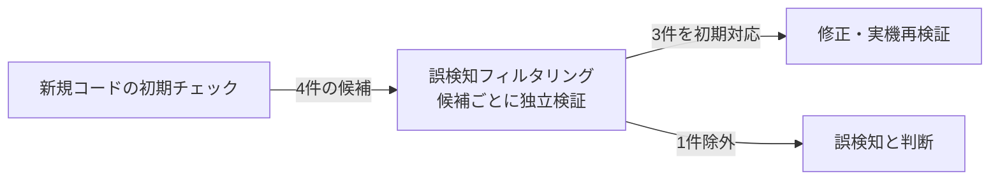

**図の解説**: チェックで洗い出した候補をそのまま結論とするのではなく、候補ごとに「実際に成立する挙動か」を独立して検証する工程を挟んでいる。これにより、4件のうち1件(Cognito自体がその設定の組み合わせを拒否するため実際には成立しない懸念)を対象外とし、残り3件について初期対応を行った。

今回の初期チェックで識別し、既に初期対応まで完了している項目、および今後も運用の中で継続的に見ていく論点は次の通り。

| 項目 | 内容 | 現在の状況 |
|---|---|---|
| クライアント登録時のアクセス権限 | 登録直後に自動でアプリの利用権限まで付与される設計だと、審査を経ずに正規利用と同等のアクセスが発生しうる | 初期対応として自動付与を廃止し、クライアント登録と利用許可(人手の審査)を分離。利用許可には別途admin操作が必要な運用に変更済み。証券会社等への外販を想定した恒常的な登録審査フローの設計は今後の検討項目 |
| 認可時のスコープ確認 | Authorizerがトークンの用途(スコープ)を確認していないと、想定外の用途のトークンでも認可されうる | 初期対応としてスコープ確認を追加済み。スコープ設計自体(用途ごとの粒度分けなど)は今後の検討項目 |
| 認可結果のキャッシュと失効の反映速度 | キャッシュ時間の設定次第で、失効操作の反映に時間差が生じうる | 初期対応としてキャッシュ時間を短縮済み。運用上求められる失効の即時性要件を踏まえた再検討は今後の課題 |
| (参考)登録時の認証方式の組み合わせ | シークレット無しでの登録可否を確認 | Cognito側で防止されていることを確認済み。追加対応は不要と判断 |

初期対応はすべて`terraform-playground-pattern4`で実機再検証済み。`client_credentials`での新規登録直後に`/mcp`を呼ぶと403(User not found)になり、管理者が利用許可レコードを作成すると200になり、その後クライアントを失効させると同一トークンで即座に403に変わることを確認した。今後もDCR関連のコード・設定変更を行うたびに、同様の確認を継続していく。

---

## 4. ホスティングコストの内訳

パターン3(AgentCore Runtime)とパターン4(API Gateway+ECS)は、課金モデルの性質そのものが異なる。パターン4は「常時起動しているリソースに対する固定費」が中心で、パターン3は「実際に使った分だけの従量費」が中心という違いがある。

### 4.1 パターン4(API Gateway + ECS)の課金モデル

| サービス | 単価 | 性質 |
|---|---|---|
| ECS(Fargate) vCPU | $0.0506 / vCPU時間 | 常時起動(0.25 vCPU) |
| ECS(Fargate) メモリ | $0.00553 / GB時間 | 常時起動(0.5 GB) |
| ALB | $0.0243/時間(固定)+ LCU使用料 | 常時起動 |
| NATインスタンス(t3.nano)× 2 | 約$0.0068/時間 × 2台 | 常時起動 |
| API Gateway(HTTP API) | 約$1 / 100万リクエスト | 従量 |

720時間/月(常時稼働)で計算すると、ECS(vCPU+メモリ)が約$11、ALBが約$24、NATインスタンス2台が約$10で、**リクエスト数に関わらず月額約$46が"起動しているだけ"で発生するベースコスト**になる。API Gatewayの従量費はこのPoC規模では数ドル以下にとどまる。

### 4.2 パターン3(AgentCore Runtime)の課金モデル

| サービス | 単価 | 性質 |
|---|---|---|
| vCPU | $0.0895 / vCPU時間 | 実使用時間ベース、秒単位課金 |
| メモリ | $0.00945 / GB時間 | セッション時間ベース、128MB下限 |

パターン3には常時起動の固定費が存在せず、リクエストが無ければ課金も発生しない。1リクエストあたり0.25vCPU/0.5GBを1秒間使用すると仮定すると、1リクエストあたりの従量費は約$0.0000075(0.75円弱)になる。**低〜中トラフィックであれば、パターン4の固定費約$46と比べて圧倒的に安い**。

### 4.3 損益分岐点

| 条件 | 損益分岐点(月間リクエスト数) |
|---|---|
| 閉域網(VPCモード)・WAF要件が無い場合 | 約610万リクエスト/月 |
| 閉域網(VPCモード)・WAFの両方を要件とする場合 | 約77万リクエスト/月 |

閉域網・WAF要件が無ければ、パターン3は月間610万リクエスト程度までパターン4より安い。しかし金融グレードの本番展開を見据えて閉域網対応(VPCモード)とWAF導入を両方行う場合、パターン3側にもVPCエンドポイント(約$40/月)とWAF(約$6/月)の固定費が新たに乗るため、パターン3の固定費がパターン4の固定費(約$46)に近づき、**損益分岐点が約77万リクエスト/月まで大幅に下がる**。想定トラフィック量次第では、閉域網・WAF要件を満たした状態でのコスト優位性はパターン3側に無いか、むしろパターン4が有利になる可能性がある。

### 4.4 閉域網・WAF対応時の追加費用

| 追加項目 | 単価 | 対象 |
|---|---|---|
| VPCエンドポイント(Interface型、ECR API/DKRの2種×2AZ) | $0.014/時間/AZ | パターン3をVPCモードにする場合 |
| WAFv2 Web ACL(固定費) | $5/月 + ルール1本あたり約$1/月 | 両パターン共通(WAF導入時) |
| WAFv2(リクエスト従量) | 約$0.60/100万リクエスト | 両パターン共通(WAF導入時) |
| CloudFront(パターン3のWAF代替構成に必須) | 約$0.75/100万リクエスト + 約$0.11/GB | パターン3をWAF対応にする場合 |

パターン3(AgentCore Runtime)はWAFを直接アタッチできないため、CloudFront経由の代替構成が前提となり、CloudFrontの費用も追加で乗る。パターン4(API Gateway+ECS)は既にVPC内にあり、WAFをAPI Gatewayへ直接アタッチできるためCloudFrontは不要。

### 4.5 留意点

- 上記はリクエスト数に基づく概算であり、ALB/NATインスタンスのデータ転送量課金は含んでいない
- パターン3のvCPU/メモリ使用量(1秒・0.25vCPU/0.5GB)は仮定値であり、実測ではDurationの最大値が130.6秒に達したケースも確認されている(実際の課金対象時間は今回のレイテンシ実測値とは別物)
- 単価は`ap-northeast-1`のAWS公開料金表に基づく概算(2026年8月時点)であり、正式な予算確定前にはAWS Pricing Calculatorでの再検証を推奨する

---

## 5. Cognito→Auth0移行の検討

DCR実装(§2)の過程で、AgentCore RuntimeでDCRができない根本原因が、実はAgentCore Runtime自体の制約ではなく、Cognitoのアクセストークンに`aud`クレームが無いという仕様にあることが判明した。

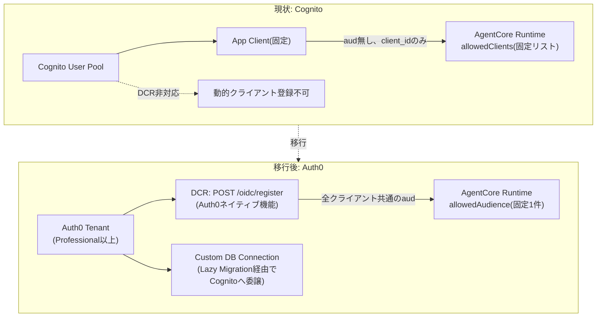

**図の解説**: AgentCore Runtimeの認可設定は`allowedAudience`(`aud`クレーム照合)と`allowedClients`(`client_id`クレーム照合)を独立に設定できる。DCR対応IdPが全ての動的登録クライアントに対して同一の`aud`(保護対象APIの識別子)を含むトークンを発行する設計であれば、Runtime側は`allowedAudience`を固定1件にしたまま、クライアントが何百登録されても設定変更が一切不要になる。この構図がCognitoでは成立しない(`aud`クレームが無いため`client_id`照合に頼らざるを得ない)一方、Auth0のようなDCR対応IdPでは成立する見込みがある。

### 5.1 追加コスト

| プラン区分 | 最低月額 | MAU上限 | DCR対応 |
|---|---|---|---|
| Free | $0 | 25,000 | 非対応 |
| Essentials (B2C) | $35 | 500 | 非対応 |
| Essentials (B2B) | $150 | 500 | 非対応 |
| Professional (B2C) | $240 | 1,000 | 対応 |
| Professional (B2B) | $800 | 1,000 | 対応 |
| Enterprise | 要問い合わせ(目安$10,000+) | 応相談 | 対応 |

DCR機能はProfessionalプラン以上でのみ有効化可能で、デフォルトは無効。金融機関を複数テナントとして外販する性質上、B2B区分が実態に近く、**最低でも月額800ドルが新規発生**する。現状のCognitoは実クライアント41ユーザーの規模ではほぼ無償のため、この差額はまるごと新規コストとなる。加えて、B2B Professionalプランはエンタープライズ SSO接続を5件までしか含まず、6社目以降はEnterpriseプラン(目安月額1万ドル超)への移行が必要になる可能性が高い。

### 5.2 本番ユーザーの移行方式

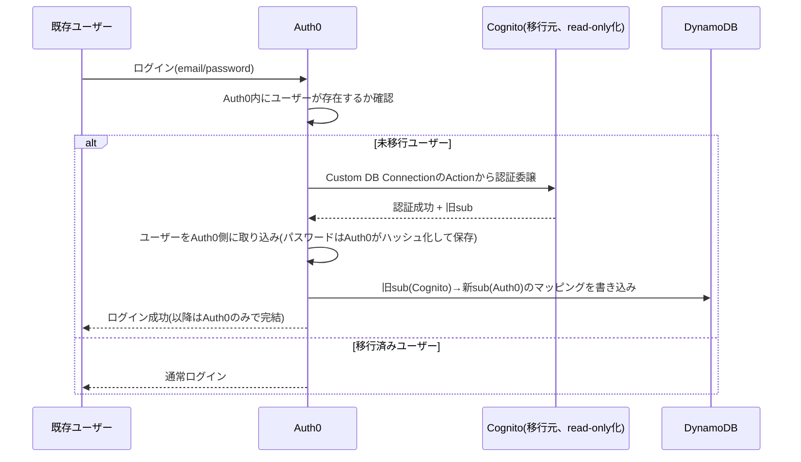

**図の解説**: Auth0公式が推奨するLazy Migration(自動移行)方式。ユーザーはパスワード再設定・強制ログアウトを一切必要とせず、初回ログイン時に透過的にCognitoからAuth0へ移行される。ただし、DynamoDBが`USER#<cognito-sub>`という形式でレコードを管理しているため、移行後の`sub`(Auth0形式)への対応関係を設計・実装する処理を、この移行フローの中に組み込む必要がある。

### 5.3 見積もりまとめ

- エンジニアリング工数: 約7〜10人日
- 追加コスト: 月額800ドル以上(§5.1)、データレジデンシー(Auth0は米国企業のSaaSで、日本国内リージョンの提供有無は本調査では未確認)は法務・コンプライアンス部門での確認が必要
- 技術的には成立する見込みが高いが、コスト・データレジデンシー・移行リスクの3点が揃って初めて意思決定できる状態であり、今回は机上見積もりに留めている

---

## 6. MCPプロトコルバージョンv2(2026-07-28)移行の影響調査

新規開発(Step1以降)でMCPプロトコルバージョン「2026-07-28」を採用する方針を受け、対応SDKへのアップグレードが既存クライアントとの互換性にどう影響するかを調査した。

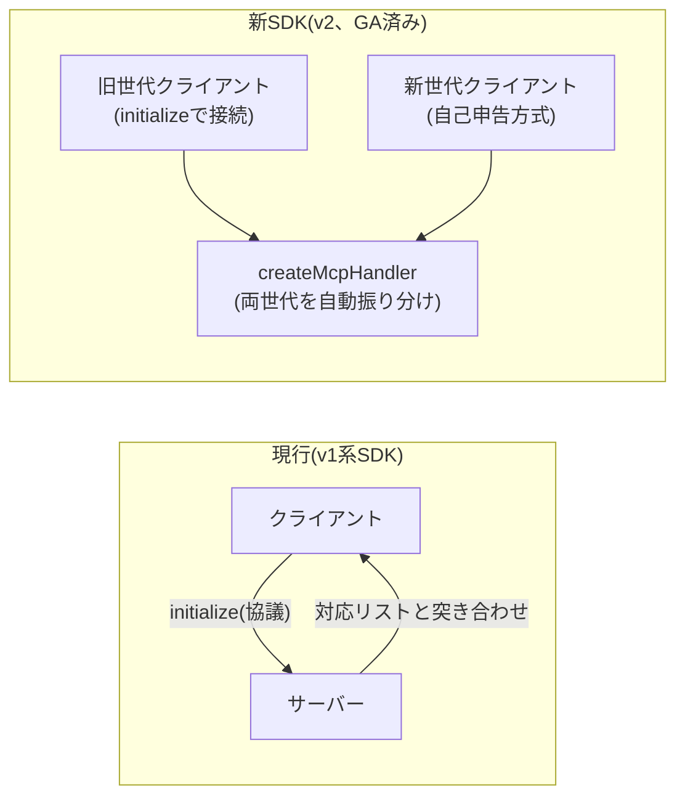

**図の解説**: 現行のv1系SDKは`initialize`リクエストでクライアントとサーバーがプロトコルバージョンを協議する方式で、この仕組み自体はマイナーバージョンアップ(対応リストの追加)には対応済み。一方、v2(2026-07-28)は`initialize`ハンドシェイクそのものを廃止し、各リクエストが自己申告する方式に変わる。これは配線レベルの破壊的変更のため、新SDKでは`createMcpHandler`という新しいサーバー実装が、旧世代・新世代のクライアントを同一エンドポイントで自動的に振り分けて処理する設計になっている。

「2026-07-28」は実在する正式なMCP仕様のリビジョンで、公式サイト・公式ブログで「プロトコル発表以来最大の改訂」と位置付けられている。本リポジトリのSDKは1つ前の`2025-11-25`が最新対応バージョンで、v2への移行はパッケージ自体が分割されるメジャーバージョンアップになる。主な変更点は、`initialize`/`initialized`ハンドシェイクの廃止、`Mcp-Session-Id`ヘッダーのプロトコルコアからの除外、Multi Round-Trip Requestsによるelicitation/sampling置き換えなどである。

「SDKをバージョンアップすることでMCPクライアント側のバージョンによらず利用できるようにしたい」という意図については、v2対応の新SDKがこれをデフォルトの設計方針として持っていることを確認した。ただし、これは単純なバージョンアップで自動的に得られるものではなく、新しいAPIの書き方への移行が前提になる。

**訂正(2026-09-02同日)**: 本レポート作成当初は「v2対応の公式TypeScript SDKは現時点でベータ版、GAを待ってから移行すべき」としていたが、その後の追加確認で**v2は仕様(2026-07-28)と同時に既に正式リリース(GA)済み**であることが判明した。パッケージは`@modelcontextprotocol/sdk`から`@modelcontextprotocol/server`・`@modelcontextprotocol/client`に分割されてGAしており、v1系はGA後最低6か月間(2027年1月頃まで)バグ修正・セキュリティ修正を受け続ける設計。AgentCore Runtime側も既に対応済みのため、**「GAを待つ」という前提は崩れており、移行はいつでも計画に着手できる段階にある**。ただし移行自体が非自明な書き換えプロジェクトであることは変わらないため、着手時期は本番展開の優先度と合わせて判断する。

---

## 7. 応答時間について(参考情報、チューニング作業自体は今週未着手)

応答時間チューニングの実作業(セッションID使い回しの実機検証)は今週着手できなかったが、現時点で分かっているパターン3・4の応答時間差、その内訳、今後の改善可能性を参考情報として整理する。

### 7.1 現時点で分かっている応答時間の差

| 経路 | 応答時間(定常状態) |
|---|---|
| パターン4(ECS+API Gateway) | 約0.2〜0.3秒 |
| パターン3(AgentCore Runtime) | 約6秒(アイドル時間の長短に関わらずほぼ一定) |

パターン3の約6秒は、アイドル0秒〜16分(セッションタイムアウトを超える時間)まで一貫して観測されており、単純なコールドスタートの有無だけでは説明がつかない、安定した値である。

### 7.2 6秒の内訳

CloudWatch Logsを調査した結果、**リクエストごとに新しいコンテナが起動している**ことを確認しており、6秒の内訳はおおよそ次の通り。

| 内訳 | 時間 | 比率 |
|---|---|---|
| コンテナ起動 | 約3.9秒 | 約65% |
| TLSハンドシェイク | 約0.1〜0.2秒 | 約2〜3% |
| アプリ処理(JWT検証・DynamoDB参照・MCPプロトコル処理等) | 約1.9〜2.0秒 | 約32% |

コンテナ起動コストが全体の約3分の2を占めており、ここを削減できるかどうかが応答時間短縮の鍵になる。

### 7.3 今後、6秒を短縮できる可能性

AWS公式ドキュメントによれば、AgentCore RuntimeはステートレスなMCPサーバーであっても、`Mcp-Session-Id`ヘッダーによってリクエストを同一のマイクロVM(コンテナ)にルーティングする仕組み(セッションスティッキー)に対応している。これまでの検証で使用してきたスクリプトは、このヘッダーを一度も再送しておらず、毎回新しいセッションとして扱われていた可能性が高い。つまり、**今回観測された「毎回6秒」という結果は、AgentCore Runtime自体の限界ではなく、検証方法(スクリプトがセッションIDを使い回していなかったこと)に起因する可能性がある**。

この仮説が正しければ、次のような改善が見込める。

- クライアントが`Mcp-Session-Id`を正しく再送する場合、2回目以降のリクエストは同一コンテナで処理され、コンテナ起動コスト(約3.9秒)を回避できる可能性がある
- MCPプロトコルの仕様上、準拠したクライアント(Claude.ai、Claude Code等)は`initialize`応答で受け取ったセッションIDを自動的に次回リクエストで再送する設計になっているため、**実運用中のクライアントは、今回計測したような「毎回6秒」という体験をしていない可能性がある**
- 一方、1つのセッション内で最初の1回(新規セッション確立時)は、引き続き約6秒(またはコンテナ起動分)を要すると見込まれ、単発のリクエストしか行わない用途では改善効果が薄いと考えられる

ただし、この仮説はまだ実機で検証していない。検証には、(1)VPCモードにしてから機能しなくなっているCloudWatch Logsへのログ配信の復旧、(2)検証スクリプト側でのセッションID再送対応、(3)実際に同一セッションを使い回した場合とそうでない場合の比較測定、が必要になる。これらの手順は整理済みのため、次回セッションで着手する。

### 7.4 コンテナ起動オーバーヘッド自体を縮められる可能性(次回検証項目、2026-09-02追記)

§7.3のセッションID使い回しは「2回目以降のリクエスト」を速くする施策であり、新規セッションの最初の1回に必ずかかるコンテナ起動コスト(約3.9秒、全体の約65%)そのものには効かない。この初回コストを縮められないか、AWS公式ドキュメント・re:Post記事を調査したところ、複数の未検証の候補が見つかった。

- **ウォームプールの動作確認**: AgentCore Runtime(コンテナデプロイ)はRuntime作成・更新時に**プリウォームされたVMを10台**用意しており、新規セッションの最初の10件まではサブ秒でコールドスタートする設計になっている。11件目以降は新規VM確保・コンテナダウンロード・起動が必要になる。**今回の実測(アイドル0秒〜16分まで一貫して約6秒)はこの仕様と整合しない**。これまでの検証が1件ずつ間隔を空けた逐次実行だったため、「10件の同時セッション」という発動条件に合致していなかった可能性がある。同時多重リクエストで再検証する必要がある
- **コードデプロイモードとの比較**: コンテナ全体ではなくアプリのソースコードだけをデプロイする「コードデプロイ」モードは、AWS公式によれば**より安定して約2〜3秒**のコールドスタートになるとされ、現状の実測6秒より短い。本PoCはコンテナデプロイのみ検証済みで、コードデプロイは未検証
- **コンテナイメージの軽量化**: ウォームプールを使い切った後の起動時間は「コンテナサイズに依存する」と明記されており、現状のイメージを軽量化した場合の効果は未検証
- **能動的なプリウォーミング**: 定期pingで複数のウォームプールを維持する、というAWS公式(re:Post)の運用パターンもあるが、コスト・運用負荷とのトレードオフがあり未検討

これらを踏まえると、**「コンテナ起動の約4秒は原理的に必ずかかる」と結論づけるのは時期尚早**である。次回セッションでは、(1)同時多重リクエストでウォームプールの効果を確認し、(2)コードデプロイモードを試す、という順で優先的に検証する。この結果次第で、AgentCore Runtimeホスティングの応答時間面での採用可否の判断材料が変わりうる。
