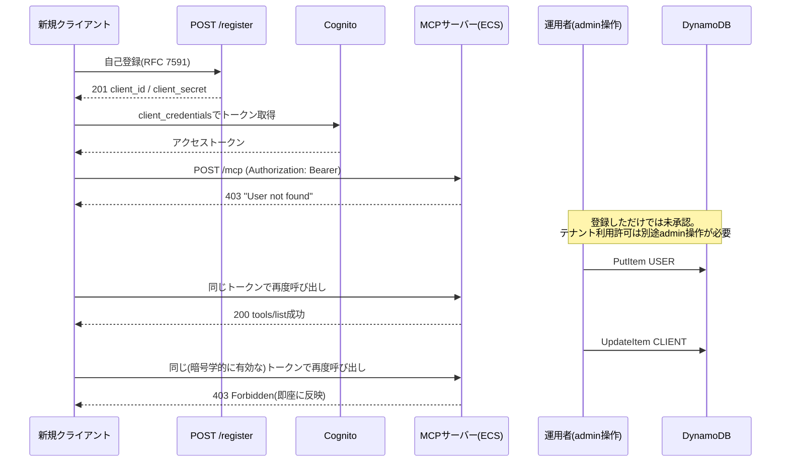
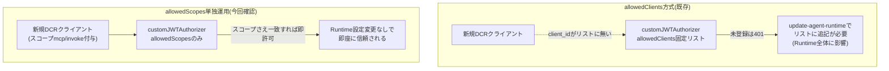

# ECS(WAF・DCR)アーキテクチャを本番採用する場合の課題点整理

> この章で分かること
> DCR(動的クライアント登録)とWAFを実際に動かしてデモし、そこで見えた「本番アーキとして導入する場合の課題点」を整理する。あわせて、[10-internal-dcr-implementation.md §0.5](./10-internal-dcr-implementation.md)で未検証のまま残っていた2つの安価な代替仮説(AgentCore Runtime側の`allowedScopes`単独運用、ECS側のREST APIネイティブ`COGNITO_USER_POOLS`オーソライザー)を実機で初めて検証し、いずれも成立することを確認した。

作成日: 2026-09-03 | 検証方法: 実機検証(playgroundアカウント883660531246、`terraform-playground-pattern4`の既存環境および使い捨てリソースを使用)。本番アカウント(620369151795)には一切書き込みなし。

---

## TL;DR

| # | 論点 | 結論 |
|---|---|---|
| 1 | DCRの自己登録→アクセス→失効はエンドツーエンドで動くか | **動く**。既存の`terraform-playground-pattern4`環境で自己登録・admin承認・呼び出し成功・失効・即時遮断の一連の流れを再実演し確認した |
| 2 | AgentCore Runtime単体(pattern3)で、Auth0移行なしにCognitoのままDCRを実現できるか | **できる(実機で新規確認)**。`allowedClients`を使わず`allowedScopes`のみで運用すれば、動的に作成したCognitoクライアントを`update-agent-runtime`を経由せず即座に信頼できる |
| 3 | ECS(pattern4)で自作Lambda Authorizerを使わずにDCRを実現できるか | **スコープ判定だけなら可能(実機で新規確認)**。ただしDynamoDBによる個別クライアントの即時失効機能は失われるため、失効管理の設計次第でLambda Authorizerが引き続き必要になる |
| 4 | WAF代替構成(CloudFront+WAFv2)は実際に機能しているか | **機能している**が、現状のルールセットは汎用の`AWSManagedRulesCommonRuleSet`のみで、SQLインジェクション特化のルールセットが無く、単純なSQLiパターンが素通りすることを確認した |
| 5 | 本番導入に向けて残る課題は何か | 本番`terraform/`のJWT Authorizer `audience`バグ(修正パッチ提示済み、未適用)、DCR実装の本番環境への移植、Claude Code/Claude.aiからの実際の自己登録E2E確認、DCR登録数上限、WAF運用体制の設計、の5点が未解決(詳細は§5) |

---

## 1. DCRの自己登録→アクセス→失効フロー(実演)

既存の[10-internal-dcr-implementation.md](./10-internal-dcr-implementation.md)で実装済みの`terraform-playground-pattern4`環境をそのまま使い、クライアント視点・admin視点の両方を通しで実演した。

### 図の解説

自己登録(`POST /register`)は無審査で誰でも呼べるが、それだけではアクセス権は付与されない。[10-internal-dcr-implementation.md §4.5](./10-internal-dcr-implementation.md)のセキュリティレビューで「登録=即座にフルアクセス」という脆弱性を修正した結果、この設計になっている。実際に登録直後のトークンで呼び出すと`403 "User not found"`が返り、admin操作(DynamoDBへの`USER#`レコード追加)を経て初めて成功する。この一連の流れを今回すべて実機で再現し、最後にDynamoDBの`CLIENT#`レコードを`revoked`に更新すると、同じトークンでも即座に(認可結果キャッシュのTTLが0秒に設定されているため)アクセスが遮断されることを確認した。テストで作成したCognitoクライアント・DynamoDBレコードはすべて削除済みで、環境を汚していない。

---

## 2. AgentCore Runtime側「allowedScopes単独運用」でのDCR成立可能性(新規検証)

[10-internal-dcr-implementation.md §0](./10-internal-dcr-implementation.md)で述べた通り、AgentCore Runtimeには`/register`を置く層が無く、認可も`customJWTAuthorizer`という単一の仕組みしか持たない。しかし同じ設定の中で`allowedClients`(固定リスト)ではなく`allowedScopes`だけで運用すれば、動的なクライアント追加のたびに`update-agent-runtime`を呼ぶ必要が無くなるのではないか、という仮説が[10-internal-dcr-implementation.md §0.5](./10-internal-dcr-implementation.md)で未検証のまま残っていた。今回、実機で初めて検証した。

### 図の解説

検証専用の使い捨てRuntime(`quickMcpPocDcrScopeTest`、検証後削除済み)を新規作成し、`authorizerConfiguration.customJWTAuthorizer`に`allowedClients`を一切設定せず`allowedScopes: ["mcp/invoke"]`のみを設定した。既存のCognitoプール(`ap-northeast-1_WSvFtGhlV`)に、DCRで動的に作られるクライアントを模した新規App Client(client_credentials、スコープ`mcp/invoke`のみ)を作り、**このclient_idはRuntimeのどの設定にも一切登録しないまま**トークンを取得して`/invocations`を呼び出した。

結果は**HTTP 200**で、AgentCore層の認可を通過した(その後にアプリ層で403が返るが、これはDynamoDBに該当ユーザーが未登録という別レイヤーの話で、認可レイヤーの通過自体には影響しない)。対照実験として、`mcp/invoke`を持たない無関係なスコープ(`other-api/noop`)のトークンで同じRuntimeを呼び出すと、**HTTP 401**が直接返り、`WWW-Authenticate: Bearer ... scope="mcp/invoke"`ヘッダー、JSON-RPCエラー`-32001 Authorization denied`が確認できた。これにより、認可判定が確かにスコープの有無で行われていることが裏付けられた。

**結論**: `allowedClients`を使わず`allowedScopes`のみでAgentCore Runtimeを運用すれば、Cognitoのままでも([11-internal-cognito-to-auth0-migration-estimate.md](./11-internal-cognito-to-auth0-migration-estimate.md)で検討したAuth0移行(月額$800〜)を経ずに)DCRが成立する。最大のメリットは、[10-internal-dcr-implementation.md §0.3](./10-internal-dcr-implementation.md)で指摘した「クライアント登録のたびに`update-agent-runtime`が走り、その時点で接続している全ての既存クライアントに影響しうる」というリスクを完全に回避できる点である。ただし、個別クライアントの失効は`allowedScopes`の仕組みでは実現できない(スコープを剥奪するにはCognito側でクライアントを削除するしかなく、DynamoDBのような柔軟な失効リストは持てない)ため、失効運用の設計は別途必要になる。

---

## 3. ECS側「REST API(v1)ネイティブCOGNITO_USER_POOLSオーソライザー」でのDCR成立可能性(新規検証)

[10-internal-dcr-implementation.md §0.5](./10-internal-dcr-implementation.md)のもう一つの仮説として、API Gateway REST API(v1)の`COGNITO_USER_POOLS`型オーソライザーは「許可するclient ID」の指定が任意で、空にすればプール内の任意のApp Clientを信頼する仕様であることが挙げられていた。もし実際にそうなら、`terraform-playground-pattern4`で自作したLambda Authorizerを使わずに済んでいた可能性がある。

既存の`terraform-playground-pattern4`環境には一切触れず、スタンドアロンの使い捨てREST API(検証後削除済み)を新規作成し、pattern4と同じCognitoプール(`ap-northeast-1_XrU8FcC1w`)に対して`COGNITO_USER_POOLS`型オーソライザーを設定した。client ID許可リストは指定していない(このオーソライザーにはそもそもそのオプションが無い)。`AuthorizationScopes`にはpattern4のresource server scope(`.../mcp/invoke`)のみを指定した。

pattern4のAPI Gateway設定にはまったく登録されていない新規Cognitoクライアント(client_credentials、`mcp/invoke`スコープ)を作成し、そのトークンでMOCKバックエンドのテストエンドポイントを呼び出したところ、**HTTP 200で成功**した。対照実験として、トークン無しの呼び出しは401、無関係なスコープのトークンでの呼び出しも401で拒否されることを確認した。

**結論**: 仮説通り、REST API(v1)のネイティブ`COGNITO_USER_POOLS`オーソライザーに切り替えれば、自作のLambda Authorizerが担っていた「JWT検証+スコープチェック」の部分は不要にできる。ただし、[10-internal-dcr-implementation.md](./10-internal-dcr-implementation.md)の既存Lambda Authorizerが持っていた「DynamoDBの`CLIENT#`失効フラグによる個別クライアントの即時失効」機能は、ネイティブオーソライザーだけでは実現できない(スコープの有無しか判定できず、個別クライアント単位の失効という概念自体が無い)。個別失効を維持したい場合は、Lambda Authorizerを残すか、失効時にCognito側で`DeleteUserPoolClient`を都度呼ぶ運用に切り替える(この場合も登録用Lambdaは引き続き必要)という設計判断が必要になる。

---

## 4. WAF代替構成(CloudFront+WAFv2)の再検証と新規発見

[05-internal-security-compliance-verification.md §4.5](./05-internal-security-compliance-verification.md)で構築済みのCloudFront(`d22imwd0soxmb2.cloudfront.net`)+WAFv2構成を使い、正常リクエストの通過と悪意あるパターンのブロックを再確認した。

- 正常リクエスト: 404(WAFを通過してオリジンまで到達したことを示す、AgentCore/ALBからの応答)
- 既知の悪意パターン(``をクエリ文字列に含むXSS攻撃): 403でブロック(CloudFrontの標準ブロックページ、オリジンには到達しない)

ここまでは既存の検証結果([05-internal-security-compliance-verification.md](./05-internal-security-compliance-verification.md))の再現であり、想定通りだった。今回新たに、実際にアタッチされているマネージドルールグループを`aws wafv2 get-web-acl`で確認したところ、**`AWSManagedRulesCommonRuleSet`のみ**が設定されており、SQLインジェクションに特化した`AWSManagedRulesSQLiRuleSet`は付いていないことが判明した。

これを踏まえ、単純なSQLインジェクションパターン(`?id=1' OR '1'='1`)を実際に送信したところ、**WAFにブロックされず素通りし**、オリジンからの応答(404)がそのまま返った。CommonRuleSetはXSSやローカルファイルインクルージョン等の汎用的な攻撃パターンをある程度カバーするが、SQLi特化のシグネチャは含まれていないため、この結果自体は仕様通りである。

**結論**: 金融機関向けサービスとして「WAFで保護されている」と訴求する場合、現状の`AWSManagedRulesCommonRuleSet`単体では不十分であり、少なくとも`AWSManagedRulesSQLiRuleSet`・`AWSManagedRulesKnownBadInputsRuleSet`の追加と、レート制限ルールの追加が本番導入時の課題として残る。

---

## 5. 未解決・本番導入に向けて残る課題

以下は今回実機検証できなかった、または対応が完了していない項目である。本番アカウント(620369151795)は書き込み禁止のため、実機での修正確認はplayground複製環境でのみ実施している。

| # | 課題 | 現状 | 対応方針 | 優先度 |
|---|---|---|---|---|
| 1 | 本番`terraform/apigateway.tf`のJWT Authorizer `audience`バグ | playground複製で再現・修正確認済み([07-internal-vpc-waf-cost-verification.md §2.4](./07-internal-vpc-waf-cost-verification.md))。今回のセッションで本番相当コードへの修正パッチを`fix/production-audience-config-proposal`ブランチとして用意し、`terraform validate`まで確認済み。本番へは未適用 | 本番担当者へのレビュー依頼・適用が最優先(正当なトークンでも常に401になる実害があるため) | 最高 |
| 2 | DCR実装の本番`terraform/`への移植 | `terraform-playground-pattern4/`にのみ存在。本番相当`terraform/`への移植は未実施 | 移植コスト見積もり(Lambda 2つ・IAMロール・API Gatewayルート変更一式)を継続検討 | 高 |
| 3 | Claude Code/Claude.aiからの実際の自己登録によるDCR E2E確認 | 未実施。Cognito Managed Login UI v2がブラウザ操作前提のため簡易スクリプトで代替できない([10-internal-dcr-implementation.md §5](./10-internal-dcr-implementation.md)) | 実際のクライアントUIからの接続確認、またはUIの内部API呼び出しのリバースエンジニアリング | 中 |
| 4 | DCR登録数の上限 | 未実装(redirect_uriアローリスト・レート制限は実装済み) | DynamoDBの`CLIENT#`件数チェックによる乱用対策の実装 | 中 |
| 5 | WAF代替構成の運用体制 | 監視・アラーム設計、ルール見直しフローが未検討 | CloudWatchアラーム設計、SQLiRuleSet等の追加ルール導入、定期レビュー体制の整備 | 中 |
