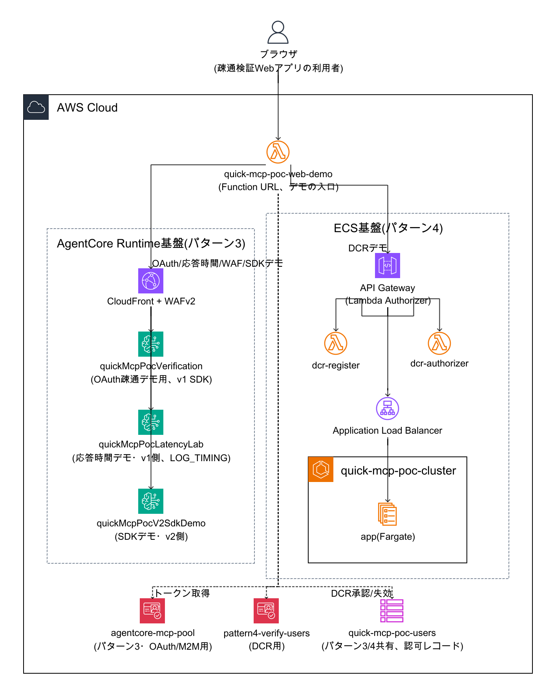

# quick-mcp-poc 環境・AWSリソースの整理

> この章で分かること
> これまで複数セッションにわたる検証で、AgentCore Runtime・ECS・Lambda等のAWSリソースが積み重なり、どれがどの検証・デモ用かが分かりにくくなっていた。本ドキュメントは2026-09-08時点でplaygroundアカウントに実在するリソースを実機で棚卸しし、特に疎通検証Webアプリ(`web-demo`)の各デモセクションがどのリソースを呼んでいるかを整理する。

作成日: 2026-09-08 | 検証方法: 実機確認(playgroundアカウント883660531246、AWS CLIでの棚卸し)

---

## TL;DR

| # | 論点 | 結論 |
|---|---|---|
| 1 | AgentCore Runtime(パターン3)はいくつあるか | **3つ**。用途が明確に分かれている: `quickMcpPocVerification`(最初期からのデモ用、v1 SDK)、`quickMcpPocLatencyLab`(応答時間チューニング検証用、v1 SDK+計装ログ)、`quickMcpPocV2SdkDemo`(MCPプロトコルv2 SDKデモ用) |
| 2 | ECS(パターン4)はいくつあるか | **1系統のみ**(`quick-mcp-poc-cluster`/`app`)。`terraform-playground-pattern4/`で管理されており、本番相当の`terraform/`(書き込み禁止)とは別物 |
| 3 | Lambda関数はいくつあるか | **3つ**: `quick-mcp-poc-web-demo`(デモ画面本体)、`quick-mcp-poc-dcr-register`・`quick-mcp-poc-dcr-authorizer`(パターン4のDCR実装) |
| 4 | 疎通検証Webアプリの各デモはどのリソースを呼んでいるか | 応答時間デモは`quickMcpPocLatencyLab`、SDKデモは`quickMcpPocLatencyLab`(v1側)と`quickMcpPocV2SdkDemo`(v2側)の両方、DCRデモはパターン4のAPI Gateway、WAFデモはCloudFront+WAFv2に直接、既存のOAuth疎通確認は`quickMcpPocVerification`(詳細は§2) |
| 5 | 共有アカウント内に無関係なリソースはあるか | ある。playgroundアカウントは他プロジェクトとも共用されており、`trocco`・`mcplatency_latencymcp`等のAgentCore Runtimeや`pii-detection`等のECSクラスターが見えるが、いずれもquick-mcp-pocとは無関係(§5) |

---

## 1. 全体構成図

**図の解説**: 疎通検証Webアプリ(`quick-mcp-poc-web-demo`、Lambda Function URL)がすべてのデモの入口になっている。左側のパターン3(AgentCore Runtime基盤)には3つのRuntimeが並列に存在し、CloudFront+WAFv2を共有している。右側のパターン4(ECS基盤)は1系統のみで、API Gateway配下にDCR用の2つのLambda(登録・認可)とALB経由のECSサービスがある。下段のCognito 2プール・DynamoDB 1テーブル(実質)はパターン3・4の両方から参照される共有リソースで、点線はWebアプリからの直接アクセス(トークン取得、DCR承認/失効の管理操作)を表す。

---

## 2. デモ画面(web-demo)の各セクションと裏側の対応

| デモセクション | 呼び出すリソース | 補足 |
|---|---|---|
| 疎通確認(OAuth PKCE、既存) | `quickMcpPocVerification` Runtime(CloudFront経由) | 最初期からのデモ用Runtime。Claude.ai/Claude Codeからの実機疎通も確認済み |
| 応答時間デモ | `quickMcpPocLatencyLab` Runtime(CloudFront経由) | ベースライン確立→同一セッションID再送→新規セッションの順に呼び出す。m2mクライアント(`quick-mcp-poc-m2m-test`)のclient_credentialsトークンを使用し、ログイン不要 |
| DCRデモ | パターン4のAPI Gateway(`POST /register`、`POST /mcp`) | 承認・失効はLambda(`quick-mcp-poc-web-demo`)が`quick-mcp-poc-users`テーブルに直接書き込む管理者操作。実行後、作成したCognitoクライアント・DynamoDBレコードを自動的にクリーンアップする |
| WAFデモ | CloudFront+WAFv2(`d22imwd0soxmb2.cloudfront.net`)に直接リクエスト | 正常リクエストはオリジン(AgentCore Runtime)まで到達し404が返ることがあるが、これはWAFを通過したことの確認が目的で、実際のMCP呼び出しではない |
| MCPプロトコルv2 SDKデモ | `quickMcpPocLatencyLab`(v1側)と`quickMcpPocV2SdkDemo`(v2側)の両方 | classic形式(従来のinitializeハンドシェイク)・modern形式(`_meta`エンベロープ)の2種類のリクエストを両Runtimeに送り、結果を比較する |

---

## 3. AWSリソース一覧

### 3.1 AgentCore Runtime(パターン3側、3つ)

| Name | Id | Status | Version | Network | Image | 環境変数 | 用途 |
|---|---|---|---|---|---|---|---|
| quickMcpPocVerification | quickMcpPocVerification-Aoo0d23yyj | READY | 10 | VPC | `quick-mcp-poc-agentcore-verification:verification-1` | なし | 最初期から使っているデモ用Runtime。web-demoのOAuthログインデモが呼ぶ本体。v1 SDK |
| quickMcpPocLatencyLab | quickMcpPocLatencyLab-uC4Wd7EOWj | READY | 1 | VPC | `quick-mcp-poc-agentcore-verification:latency-lab-1` | `LOG_TIMING=1` | 応答時間チューニング検証(セッションID再利用実験)専用。web-demoの応答時間デモ・SDKデモの「v1側」としても流用。v1 SDK+計装ログ |
| quickMcpPocV2SdkDemo | quickMcpPocV2SdkDemo-lxkNuS7moU | READY | 1 | PUBLIC | `quick-mcp-poc-agentcore-verification:v2-sdk-demo-1` | なし | MCPプロトコルv2 SDKデモ専用。`feature/mcp-protocol-v2-spike`ブランチの`server/`をビルドしたイメージ。web-demoのSDKデモの「v2側」 |

3つとも同じCognitoプール(`agentcore-mcp-pool`、`ap-northeast-1_WSvFtGhlV`)のCustom JWT Authorizerを使い、`allowedClients`に同じ3クライアント(`claude-web`, `quick-mcp-poc-web-demo`, `quick-mcp-poc-m2m-test`)を許可、`allowedScopes`は`["openid","mcp/invoke"]`。

### 3.2 ECS(パターン4側、1系統)

- クラスター: `quick-mcp-poc-cluster`、サービス: `app`(タスク定義`quick-mcp-poc-pattern4-verify-app:1`)。`terraform-playground-pattern4/`で管理
- 本番相当の`terraform/`(620369151795向け、書き込み禁止)とは別物。本番相当`terraform/`には現時点でDCR実装が未移植
- API Gateway(HTTP API、`2a5r57wfoa.execute-api.ap-northeast-1.amazonaws.com`)。認可はLambda Authorizer(`dcr-authorizer`)、DCR登録はLambda(`dcr-register`)が担う。元はJWT型Authorizerだったが2026-08-31にLambda型に置き換え済み

### 3.3 Lambda関数(3つ)

| 関数名 | Runtime | 用途 | ソースの場所 |
|---|---|---|---|
| quick-mcp-poc-web-demo | nodejs20.x | 疎通検証Webアプリ本体(Function URL)。今回リポジトリに初めてコミットした | `web-demo/index.mjs` |
| quick-mcp-poc-dcr-register | nodejs22.x | DCR自己登録(`POST /register`)処理 | `lambda/src/register.ts` |
| quick-mcp-poc-dcr-authorizer | nodejs22.x | パターン4 API GatewayのLambda Authorizer | `lambda/src/authorizer.ts` |

### 3.4 Cognito User Pool(2つ)

| Pool名 | Id | 用途 |
|---|---|---|
| agentcore-mcp-pool | ap-northeast-1_WSvFtGhlV | パターン3(AgentCore Runtime)側のOAuth/M2M認証。quick-mcp-poc開始前の別セッションで構築されていたものを発見・再利用したもの |
| quick-mcp-poc-pattern4-verify-users | ap-northeast-1_XrU8FcC1w | パターン4(ECS)側、DCR実装用 |

### 3.5 DynamoDBテーブル(2つ、実質稼働は1つ)

| テーブル名 | 用途 |
|---|---|
| quick-mcp-poc-users | パターン3・パターン4共通で参照する認可レコード(`USER#`, `CLIENT#`)。実質稼働しているのはこちらのみ |
| quick-mcp-poc-pattern4-verify-users | `terraform-playground-pattern4`作成時に用意されたが、実際には上記`quick-mcp-poc-users`を共用しているため未使用 |

### 3.6 ネットワーク・WAF

- CloudFront + WAFv2: Distribution `E3IBSB361TGZEQ`(`d22imwd0soxmb2.cloudfront.net`)、オリジンは`bedrock-agentcore.ap-northeast-1.amazonaws.com`。パターン3側の3 Runtimeすべてがこの1つのCloudFrontを共有している(呼び出しURLのパスにRuntime ARNを含める形式のため、CloudFront自体はどのRuntimeにも依存しない)
- 検証用VPC(`vpc-0df861e536fad4aab`)にVPCエンドポイント5つ: Gateway型(`s3`, `dynamodb`、時間課金なし)とInterface型(`ecr.api`, `ecr.dkr`, `logs`)

---

## 4. 参考: 関連ドキュメント

各リソースの詳細な検証経緯・実装判断は以下を参照。

- 全体の引き継ぎ状況: [00-handoff.md](./00-handoff.md)(セッションをまたいだ最新の状況はこのファイルの末尾セクションを参照)
- MCPプロトコルv2 SDKの実機検証結果: [12-internal-mcp-protocol-v2-upgrade-impact.md §7](./12-internal-mcp-protocol-v2-upgrade-impact.md)
- 応答時間チューニング・ECS本番化課題・今週の週次レポートは、本ブランチ(`feature/web-demo-verification-panels`)には未マージの`latency-tuning/session-id-reuse`ブランチにドキュメント(15番・16番)として存在する。mainマージ後にリンクを追記する
- web-demoアプリ自体の詳細(機能一覧・環境変数・デプロイ手順): [web-demo/README.md](../web-demo/README.md)

---

## 5. 共有アカウント内の無関係なリソースへの注意

playgroundアカウント(883660531246)は他プロジェクトとも共有されている。`list-agent-runtimes`や`list-clusters`を実行すると以下が見つかるが、**いずれもquick-mcp-pocとは無関係であり、触れないこと**。

- AgentCore Runtime: `trocco`、`mcplatency_latencymcp`、`k_bedrock_agentcore`、`harness_otameshi_MyHarness`、`connector_builder_for_endpoint`、`authentication_agent`
- ECSクラスター: `pii-detection`、`kizna-poc-cluster`、`bsc-ryota-oi`、`dify-webapp-cluster`、`newrelic-attr-lab`、`fargate-privatelink`、`default`

特に`mcplatency_latencymcp`は名称がquick-mcp-pocの検証内容(応答時間・latency)と紛らわしいが、作成日時(2026-07-17、quick-mcp-poc開始前)・ECRリポジトリ名・IAMロール名がいずれも別プロジェクトのものであり、無関係と判断済み。
