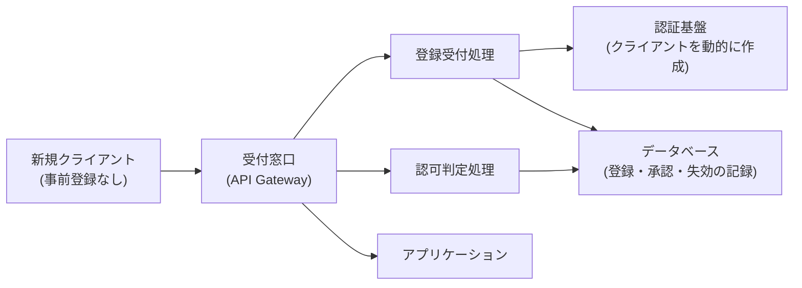
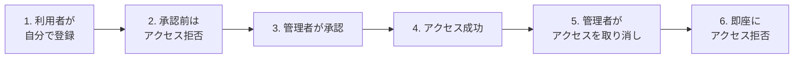
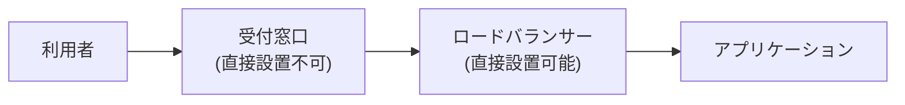
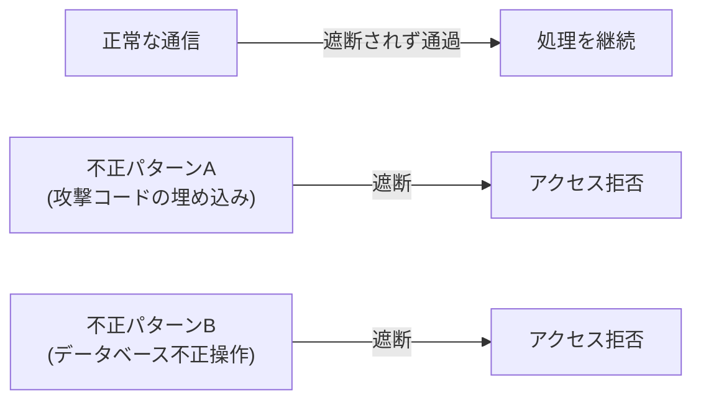
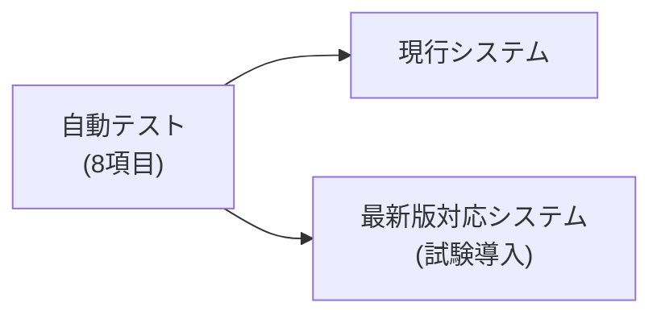
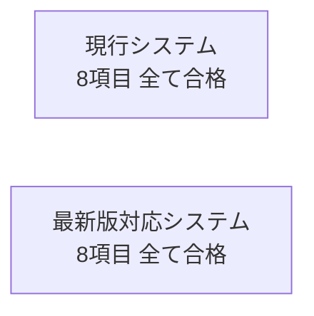

# 今週の検証レポート(2026-09-03〜09-08実施・クライアント向け)

> この章で分かること
> 本番採用の方向性である現行アーキテクチャ(ECS+API Gateway)で、利用者管理(DCR)と不正アクセス防御(WAF)に実際に対応できることを検証した結果をまとめる。特にWAFについては、AIアシスタント向け通信(MCP)特有の形式に対しても防御が機能するかを今回新たに検証した。あわせて、最新プロトコルへの対応状況も確認した。各検証で実際に使った構成・前提条件を図で示し、検証内容が目で見て分かる形にまとめる。専門用語の解説を交えて記載する。

作成日: 2026-09-08

---

## 用語解説

| 用語 | 説明 |
|---|---|
| ECS + API Gateway | 現行の本番相当環境で使われているホスティング方式。本番採用の方向性として固まっている |
| AgentCore Runtime | AWSが提供するAIエージェント向けの別のホスティング基盤。今回の技術選定では採用に至らず、参考検証にとどまった |
| DCR(動的クライアント登録) | AIアシスタントのようなクライアントアプリケーションが、人手を介さず自動的に接続情報(認証情報)を発行してもらえる仕組み。標準規格として定められている |
| WAF(Web Application Firewall) | Webサーバーへの通信を検査し、不正な攻撃パターンを検知・遮断する防御機構 |
| MCP(Model Context Protocol) | AIアシスタントと外部システムを接続するための標準プロトコル。本サービスが採用している |
| SDK | MCPを実装するための開発キット。今回、最新版(v2)への対応状況を検証した |

---

## TL;DR

| # | 項目 | 結論 |
|---|---|---|
| 1 | 現行方式(ECS+API Gateway)での利用者管理(DCR)対応 | 利用者の自己登録から承認、アクセス取り消しまでの一連の流れを実機で確認した(先週確立、今週デモとして再確認)。あわせて、現状の実装をより簡素化できる可能性のある方式も先週確認済み |
| 2 | 現行方式(ECS+API Gateway)での不正アクセス防御(WAF)対応(今週新規検証) | 現行の接続経路にはWAFを直接設置できない箇所があることが判明したが、経路を1つ手前に変えることで設置可能であることを確認した。あわせて、AIアシスタント向け通信の形式に埋め込まれた不正パターンも正しく検知・遮断できることを実機で確認した |
| 3 | 最新プロトコル(SDK)への対応確認 | 現行方式で最新プロトコルへの対応を検証し、基本機能テスト(8項目)全項目で問題がないことを確認した。あわせて、旧版と新版でエラーの伝え方に違いがあることを発見した |
| 4 | 検証結果を確認できるデモ画面 | 上記の検証結果を、実際に画面上で確認できるデモを用意した(§4) |

---

## 1. 現行方式(ECS+API Gateway)での利用者管理(DCR)対応

本番での採用方針は、現行のホスティング方式(ECS+API Gateway)をベースに、利用者管理(DCR)と不正アクセス防御(WAF)への対応を追加する方向で固まっている。

### 1.1 利用者管理(DCR)とは何か、なぜ必要か

DCRは、AIアシスタントのようなクライアントアプリケーションが、接続先のサービスに対して**人手を介さず自動的に**自分自身を登録し、その場で接続情報(認証情報)を受け取れるようにする仕組みで、業界標準規格として定められている。

通常は、接続するアプリケーションごとに、事前に管理画面等で手動登録し、認証情報を個別に発行しておく必要がある。自社で管理する少数のアプリケーションだけが接続する場合は問題にならないが、外販サービスとして不特定多数の金融機関・多様なAIアシスタントからの接続を受け付ける場合、管理者が事前にすべての組み合わせを手動登録しておくことは現実的ではない。DCRは「初めて接続するクライアントに、その場で接続情報を発行する」というこの課題を解決する仕組みである。

現行の認証基盤はこの仕組みを標準では備えていないため、本プロジェクトでは独自の仕組みを追加で実装し、DCRに対応させている。

### 1.2 前提・構成

現行のホスティング環境(ECS+API Gateway)に、利用者管理のための仕組みを追加した構成で検証した。認証基盤・データベースは既存の稼働環境をそのまま使用し、新たに追加したのは登録受付・認可判定を行う2つの処理のみである。

**図の解説**: 新規クライアントは、事前登録なしに受付窓口を通じて自己登録するだけで、認証基盤上に接続情報が動的に作成される。実際にサービスを呼び出す際は別の処理が認可判定を担当し、データベースの記録(承認済みか・失効していないか)を確認する。

### 1.3 一連の流れの確認

利用者が自分で接続情報を登録し、管理者の承認を経てアクセス可能になり、アクセスを取り消すと即座に利用できなくなる、という一連の流れを実機で確認した。

**図の解説**: 登録は誰でもできるが、それだけではアクセスできない。管理者による承認を経て初めて利用可能になり、取り消し操作の後は即座にアクセスできなくなる。

この「登録」と「承認」は、あえて別の仕組みとして分離している。DCRの仕組み自体は「誰でも自己登録できる」ことが本質であり、登録処理そのものに利用審査の意味は含まれない。しかし外販する金融グレードサービスとして、登録しただけで即座にフルアクセスを許可するのは望ましくないため、登録(接続情報の発行)と実際の利用許可(テナントとしての人手による審査)を意図的に分ける設計にしている。この一連の流れを現行のホスティング方式で実機確認し(先週確認済みの内容)、今週は画面上で確認できるデモとして整備した。

### 1.4 実装を簡素化できる可能性

現状の実装は、認可の判定処理を独自に追加したプログラムで行っている。AWSが標準で提供する仕組みに置き換えることで、この独自プログラムを削減できる可能性があることを先週確認した。ただし、利用者ごとに個別にアクセスを即座に取り消す機能は、標準の仕組みだけでは実現できないため、両立させる設計を追加で検討する必要がある。

---

## 2. 現行方式(ECS+API Gateway)での不正アクセス防御(WAF)対応(今週新規検証)

### 2.1 背景

これまでの不正アクセス防御の検証は、比較検討した別のホスティング方式(AgentCore Runtime)向けの代替構成でのみ実施しており、**本番採用方針である現行方式(ECS+API Gateway)に対して防御機能を検証したことは一度も無かった**。今週、この抜けを解消した。

### 2.2 前提・構成

現行のホスティング環境(ECS+API Gateway)に、防御機能(WAF)を追加した構成で検証した。防御機能はAWSの標準サービスであり、アプリケーション側のプログラム変更は不要(設定のみ)である。検証は一時的な設定で実施し、検証後に元の状態へ戻し済みで、現行の稼働環境への影響は残っていない。

**図の解説**: 入口となる受付窓口には防御機能を直接設置できないことが判明したため、その後段にあるロードバランサーに設置する構成で検証した。

### 2.3 発見: 防御機能の設置箇所に制約がある

現行の接続経路(API Gateway)には、防御機能(WAF)を直接設置できないことが判明した。ただし、その1つ手前の経路(ロードバランサー)には直接設置できることを確認した(§2.2の図)。この構成上の制約は、本番導入時の設計に反映する必要がある。

### 2.4 検証: AIアシスタント向け通信(MCP)特有の形式でも防御できるか

MCPは、一般的なWebサイトへのアクセスとは異なり、通信内容の大部分が「本文(リクエストボディ)」に含まれる形式を採る。この形式に埋め込まれた不正パターンも正しく検知・遮断できるかを実機で検証した。

**図の解説**: 正常な通信は通過する一方、AIアシスタント向け通信の本文に埋め込んだ2種類の不正パターンはいずれも正しく検知・遮断された。先週の検証(別のホスティング方式向け)で発見していた防御ルールの不足(データベース不正操作への対応漏れ)についても、必要なルールを追加することで解消することを確認した。

**結論**: 本番採用方針である現行方式でも、AIアシスタント向け通信の内容を検査した上での不正アクセス防御が実現可能であることを実機で確認した。ただし、防御機能の設置箇所(§2.3)については設計上の考慮が必要である。

---

## 3. 最新プロトコル(SDK)への対応確認

### 3.1 前提・構成

現行のホスティング環境と同じ基盤の中に、最新プロトコルへの対応を試験的に組み込んだ検証専用の仕組みを別途用意し、現行システムと並行稼働させて比較検証した。現行の稼働システムには一切変更を加えていない。

**図の解説**: 同じ基盤上で現行システムと試験導入システムを並行稼働させ、同じ自動テストを両方に実行することで、対応前後の挙動を直接比較できる構成にした。

### 3.2 検証内容

基本機能を網羅的に確認する自動テスト(8項目、認証・接続確立・機能一覧取得・エラー処理など)を実行した。

**図の解説**: 現行方式に最新プロトコル対応を組み込んだ試験実装で、基本機能テストが全項目合格した。なお、別のホスティング方式(AgentCore Runtime)でも参考として同様の検証を行ったが、今回の技術選定では現行方式(ECS+API Gateway)を採用する方針のため、そちらの結果は割愛する。

### 3.3 新たな発見

検証の過程で、現行システムと最新版対応システムとで、エラーの伝え方に違いがあることを発見した。存在しない機能を呼び出した際、現行システムは「処理は受け付けたが結果がエラーだった」という形で伝えるのに対し、最新版対応システムは「リクエスト自体が不正だった」という形で伝える。

将来的に最新版へ移行する際は、この違いを踏まえて、接続する側(クライアントアプリケーション)のエラー処理を両方の形式に対応させる必要がある。今後の対応事項として記録した。

---

## 4. 検証結果を確認できるデモ画面

上記の検証結果を報告書だけでなく実際に画面上でも確認できるよう、ボタン1つで実際のシステムにリクエストを送り、どんな応答が返ってくるかをその場で確認できるデモ画面を用意した。応答時間・利用者管理・不正アクセス防御・最新プロトコル対応の4項目について、ログイン不要で操作できる。なお、不正アクセス防御のデモ画面は、今回新たに検証した構成(§2)ではなく、比較検討時に使っていた構成を参照している。デモ画面側の更新は今後の対応事項に含める。

---

## 5. 今後の対応事項

- 不正アクセス防御(WAF)の設置箇所・ルール構成の正式決定(§2)
- 利用者管理(DCR)の実装方式(§1.4の簡素化案を採用するかどうか)の決定
- 最新プロトコルへの正式移行時期の判断
- エラーの伝え方の違い(§3.3)を踏まえたクライアント側の実装方針の検討
- デモ画面の不正アクセス防御パネルを、今回検証した構成に合わせて更新
- デモ画面のログイン用認証情報の共有方法の整理
