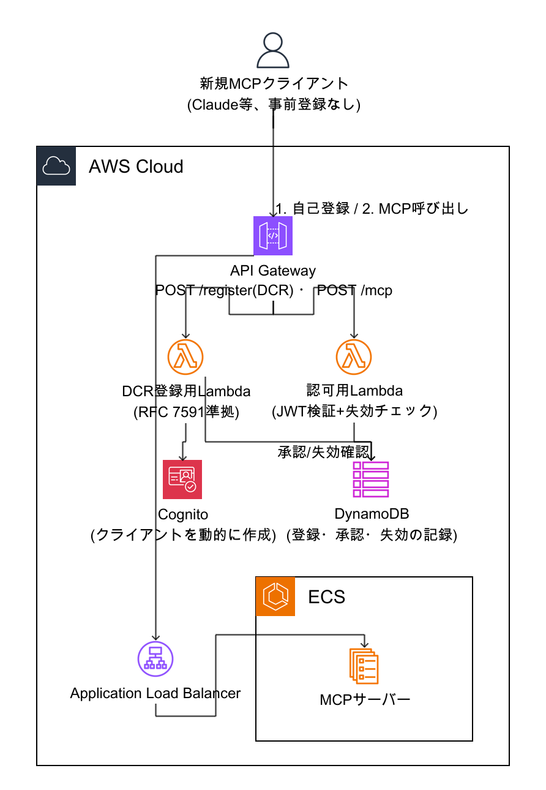
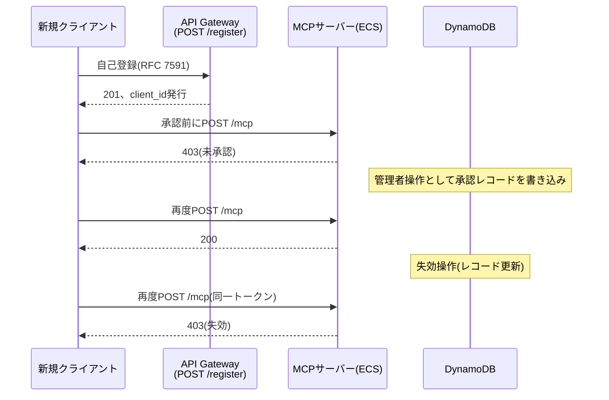
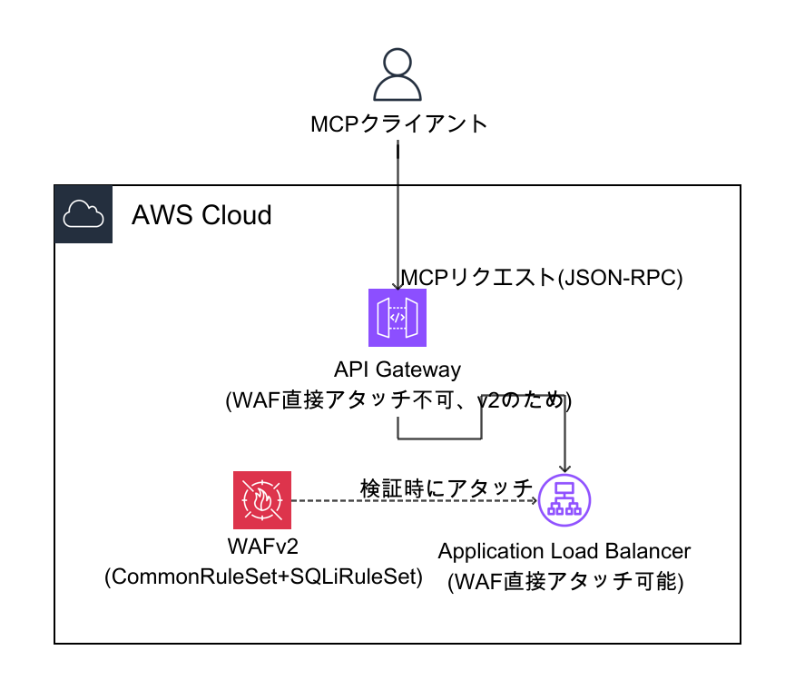
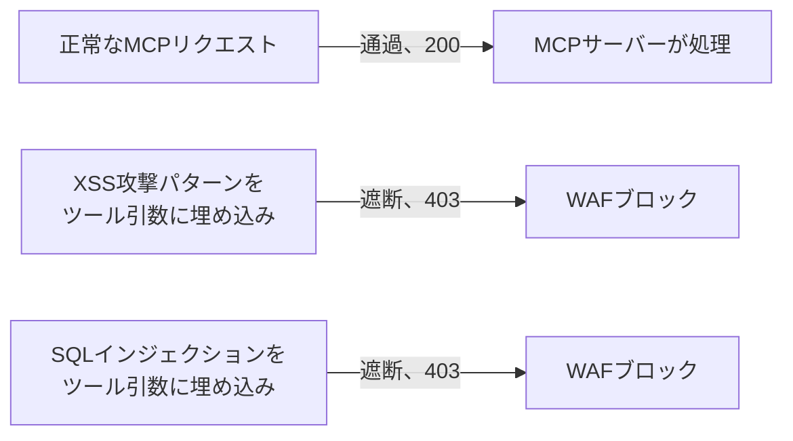
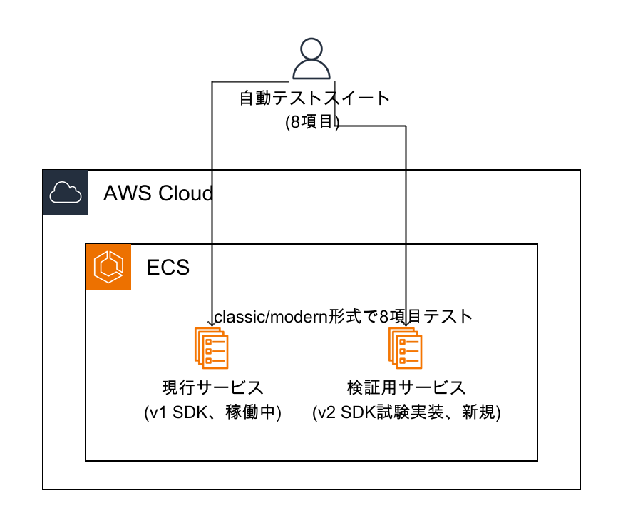

# 今週の検証レポート: ECS(API Gateway)アーキテクチャでのDCR・WAF対応検証とMCPプロトコルv2 SDK確認(2026-09-03〜09-08)

> この章で分かること
> 本番採用の方向性が固まったECS(API Gateway)アーキテクチャで、DCR(動的クライアント登録)・WAFに実際に対応できることを実機で確認する。特にWAFは、これまでAgentCore Runtime向けの代替構成でしか検証しておらず、採用方針であるECS側では今回初めて検証した。あわせて、MCPプロトコルv2 SDKへの対応状況をECS側を中心に検証し、AgentCore Runtime側は技術選定時の参考情報として補足する。各検証で実際に使ったインフラ構成・前提条件を図で示し、検証結果を目で見て分かる形にまとめる。

作成日: 2026-09-08 | 検証方法: 実機検証(playgroundアカウント883660531246)。本番相当アカウント(620369151795)への書き込みなし。

---

## TL;DR

| # | 論点 | 結論 |
|---|---|---|
| 1 | ECS(API Gateway)でのDCR対応 | 自己登録→未承認→admin承認→成功→失効→即時遮断という一連のフローを実機で確認済み(先週確立、今週デモとして再確認)。ECS側でAPI Gateway REST API(v1)のネイティブ`COGNITO_USER_POOLS`オーソライザーに切り替えれば自作Lambda Authorizerを削減できる可能性も先週実機検証済み(§1) |
| 2 | ECS(API Gateway)でのWAF対応(今週新規検証) | **API Gateway HTTP API(v2)にはWAFを直接アタッチできない**ことが判明。前段のALBに直接アタッチすれば、MCPのJSON-RPCリクエストボディ内の攻撃パターン(XSS・SQLインジェクション)を正しく検査・遮断できることを実機確認した(§2) |
| 3 | MCPプロトコルv2 SDKへの対応確認 | ECS側に新規デプロイして検証し、MCP基本機能テストスイート(8項目)で全項目合格を確認した。書き換えの影響範囲も実装ファイル単位で整理した。**AgentCore Runtime側は今回の技術選定でホスティング方式として不採用となったため、参考情報としてのみ補足する**(§3) |
| 4 | 検証結果を確認できるデモツール | 疎通検証Webアプリに、応答時間・DCR・WAF・SDK対応の4項目についてどんな応答が返ってくるかをその場で確認できるデモパネルを追加した。本レポートの主眼ではなく、検証結果を見せるための補助ツールという位置づけ(§4) |
| 5 | 来週へのアクションプラン | WAFのALBアタッチ方針決定、DCR実装の本番`terraform/`への移植要否、MCPプロトコルv2移行の本格着手判断が主要項目(§5) |

---

## 1. ECS(API Gateway)アーキテクチャでのDCR対応

本番採用の方向性は、AgentCore Runtimeへの全面移行ではなく、**現行のECS(API Gateway)アーキテクチャをベースに、DCR(動的クライアント登録)とWAF対応を追加する**方針で固まっている。

### 1.1 DCRとは何か、なぜ必要か

DCR(Dynamic Client Registration、動的クライアント登録)は、RFC 7591で標準化された仕組みで、OAuthクライアント(本サービスの文脈ではClaude.aiやClaude CodeのようなMCPクライアント)が、接続先のサーバーに対して**人手を介さず自動的に**自分自身をOAuthクライアントとして登録し、その場でclient_id・client_secretを受け取れるようにするものである。

通常のOAuthでは、クライアントごとに事前に開発者コンソール等でOAuthアプリを手動作成し、client_id・client_secretを個別に払い出しておく必要がある。接続元が少数(自社管理下のアプリのみ)であれば問題にならないが、外販サービスとして不特定多数の金融機関・多様なAIアシスタントクライアントからの接続を受け付ける場合、管理者が事前にすべての組み合わせを手動登録しておくことは現実的ではない。DCRは「初めて接続するクライアントに、その場で接続情報を発行する」というこの課題を解決する。

Cognitoはこの仕組み(RFC 7591の`registration_endpoint`)をネイティブにサポートしていない。そのため本プロジェクトでは、API Gatewayの`POST /register`ルートの先に独自のLambda(DCR登録用)を実装し、その内部でCognitoのクライアント作成APIを呼び出すことでDCRを実現している。

### 1.2 前提・インフラ構成

- 検証環境: playgroundアカウントの`terraform-playground-pattern4`(ECS+API Gateway、本番相当環境の複製)
- 前提として、Cognito User Pool・DynamoDBテーブル(利用者ごとの認可レコード管理)は既存の稼働環境としてすでに構築済み
- 今回新たに構築したのはDCR専用の2つのLambda(登録用・認可用)で、既存のJWT型オーソライザーを置き換える形で導入済み(先週実施)

**図の解説**: 新規クライアントは、事前登録なしにAPI Gatewayの`POST /register`を叩くだけでCognito上にOAuthクライアントが動的に作成される(DCR登録用Lambdaが仲介)。実際にMCPサーバーを呼び出す`POST /mcp`は別のLambda(認可用)が担当し、JWTの検証に加えてDynamoDBの記録(承認済みか・失効していないか)を確認する。DCRの登録処理自体と、実際にMCPサーバーへアクセスできる経路(API Gateway→ALB→ECS)は、Lambda・DynamoDBを介してのみ間接的につながっている。

### 1.3 実際の登録〜利用〜失効の流れ

利用者の自己登録から、admin承認を経てアクセス可能になり、失効すると即座にアクセスできなくなる、という一連のフローをECS環境(API Gateway経由)で実演確認した。

**図の解説**: 自己登録は無審査で誰でも呼べるが、それだけではアクセス権は付与されない。admin操作(DynamoDBへのレコード追加)を経て初めてアクセス可能になり、失効操作後は暗号学的に有効なトークンであっても即座にアクセスが遮断される。

**DCRの仕様と、本サービス独自の認可レイヤーの違い**: DCR(§1.1)自体は「誰でも自己登録できる」ことが本質であり、登録処理そのものに利用審査の概念は含まれない。しかし外販する金融グレードサービスとして、登録しただけで即座にフルアクセスを許可するのは望ましくない。そのため本プロジェクトでは、**DCR(接続情報の発行)と、実際の利用許可(テナントとしての人手による審査)を意図的に分離**し、上図のadmin承認ステップを挟む設計にしている。これはDCRの標準仕様ではなく、本サービス固有の業務要件として追加した認可レイヤーである(以前のセッションのセキュリティレビューで、登録直後に無審査でフルアクセスを許可してしまう不具合を発見・修正した経緯がある)。今週はこのフローを疎通検証Webアプリのデモパネル(§4)として可視化した。

### 1.4 DCRの実装をより軽量化できる可能性(先週実機検証済み)

現状のECS(API Gateway)実装は、認可判定を自作のLambda Authorizerに任せている。先週、API Gateway REST API(v1)のネイティブ`COGNITO_USER_POOLS`型オーソライザーに切り替えれば、この自作Lambda Authorizerを削減できる可能性があることを実機検証した。ネイティブオーソライザーは「許可するクライアントID」の指定が任意で、空にすればプール内の任意のクライアントを信頼する仕様のため、動的に追加されるDCRクライアントをそのまま認可できる。

ただし、現状のLambda Authorizerが担っている「個別クライアントの即時失効」機能は、ネイティブオーソライザーだけでは実現できない(スコープの有無しか判定できないため)。個別失効を維持する場合は、Lambda Authorizerを引き続き使うか、失効時にクライアント自体を削除する運用に切り替えるかの設計判断が必要になる。

---

## 2. ECS(API Gateway)アーキテクチャでのWAF対応(今週新規検証)

### 2.1 背景: これまでの検証はAgentCore Runtime向けの代替構成だった

WAFの検証はこれまで、AgentCore Runtime自体にはWAFを直接アタッチできないという制約への対処として、CloudFront+WAFv2をRuntimeの前段に配置する代替構成で実施していた。この構成はAgentCore Runtime固有の回避策であり、**本番採用方針であるECS(API Gateway)アーキテクチャに対してWAFを検証したことはこれまで一度も無かった**。今週、この抜けを解消した。

### 2.2 前提・インフラ構成

- 検証環境: §1と同じ`terraform-playground-pattern4`(ECS+API Gateway)
- WAFv2はAWSの標準機能であり、アプリケーションコードの変更は不要(設定のみで有効化できる)
- 検証用に一時的なWeb ACLを作成し、検証後にアタッチ解除・削除まで実施済み。既存の稼働環境への恒久的な変更は残していない

**図の解説**: API Gateway(HTTP API、v2)にはWAFを直接アタッチできないため、後段のApplication Load Balancer(ALB、ECSへの接続を仲介)に直接アタッチする構成で検証した。マネージドルールグループは、先週のRuntime向け検証で使っていた`AWSManagedRulesCommonRuleSet`に加え、当時不足していた`AWSManagedRulesSQLiRuleSet`も今回追加している。

### 2.3 発見: API Gateway HTTP API(v2)にはWAFを直接アタッチできない

現行のECSアーキテクチャが使っているAPI Gateway(HTTP API、v2)に対してWAFv2 Web ACLを直接アタッチしようと試みたところ、リソースタイプとして受け付けられないことが判明した。WAFv2がネイティブに対応するAPI Gatewayのリソースタイプは**REST API(v1)のみ**で、HTTP API(v2)は対象外である。一方、API Gatewayの後段にあるALBには、WAFv2を直接アタッチできることを確認した(§2.2の図)。

### 2.4 検証: MCPのJSON-RPCリクエストボディ内の攻撃パターンを検査・遮断できるか

ALBに`AWSManagedRulesCommonRuleSet`と`AWSManagedRulesSQLiRuleSet`の2つのマネージドルールグループを設定したWAFv2 Web ACLを検証用に作成し、実際に認可済みのMCPクライアントから、`tools/call`のJSON-RPCリクエストボディ内(ツールの引数)に攻撃パターンを埋め込んだリクエストを送信した。

**図の解説**: 正常なMCPリクエストは通過して200が返る一方、JSON-RPCボディの引数フィールドに埋め込んだXSS・SQLインジェクション攻撃パターンはいずれも403でブロックされた。CloudWatchメトリクスでも同時刻に2件のブロックが記録されており、WAFが実際にリクエストボディの内容まで検査していることを裏付けている。先週Runtime向け構成で発見した「SQLインジェクション特化ルールの不足」も、`AWSManagedRulesSQLiRuleSet`を追加することで解消することを確認した。

**結論**: MCPプロトコル(JSON-RPC over HTTP POST)のトラフィックは、クエリ文字列ではなくリクエストボディに主要な情報が載る形式だが、WAFのマネージドルールグループはボディの内容も正しく検査対象にしており、ECS(API Gateway+ALB)アーキテクチャでMCP用のWAF対応は実現可能である。ただし、API Gateway自体ではなくALBへのアタッチが必要という制約は、構成図・運用手順に反映する必要がある。

---

## 3. MCPプロトコルv2 SDKへの対応確認

### 3.1 位置づけ

MCPプロトコルには2026-07-28版(v2)があり、旧世代クライアント(`initialize`ハンドシェイクを使う)とは別に、ハンドシェイクを省略して自己申告形式で通信する新世代クライアントが今後登場してくる。この対応状況は、ホスティング方式の選定とは独立した検証項目として実施した。

**なお、AgentCore Runtimeは今回の技術選定でホスティング方式として不採用となっている。** 本節でRuntime側の結果にも触れるが、これは技術選定の過程で得られた参考情報であり、本番採用方針である**ECS側の結果が本題**である。

### 3.2 前提・インフラ構成

- 検証環境: §1・§2と同じECSクラスター内に、現行稼働中のv1 SDKサービスとは別に、検証専用のv2 SDK試験実装サービスを新規作成した
- 既存の稼働中サービス(v1 SDK)には一切変更を加えていない

**図の解説**: 同一のECSクラスター内で、現行サービス(v1 SDK)と検証用サービス(v2 SDK試験実装)を並行稼働させ、同じ自動テストスイートを両方に実行することで、書き換え前後の挙動を直接比較できる構成にした。

### 3.3 現行コードからの書き換え影響範囲

v1 SDK(`@modelcontextprotocol/sdk`)からv2 SDK(`@modelcontextprotocol/server`)への書き換えは、`server/src/index.ts`に局所化されており、ツール実装本体(6ツール)・認可ロジックは無改修で動く。

| 変更対象 | v1(現行) | v2(書き換え後) |
|---|---|---|
| import元 | `@modelcontextprotocol/sdk/server/mcp.js`等 | `@modelcontextprotocol/server` |
| サーバー生成 | `new McpServer(...)`を1回だけ生成 | リクエストごとにファクトリ関数内で生成 |
| トランスポート層 | `StreamableHTTPServerTransport`を手組み、`server.connect`・`transport.handleRequest`を個別に呼び出し | `createMcpHandler(factory)`をExpressアダプタ(`toNodeHandler`)でラップ |
| GET/DELETE `/mcp`の応答 | 固定レスポンスを個別実装 | v2ハンドラが自動的に同等の405を返すため実装不要 |
| 認可(`extractSub`・DynamoDB参照) | Expressミドルウェアとして実装 | 同じミドルウェアパターンをそのまま流用可能 |
| ツール定義(6ツール) | `registerTool`にプレーンオブジェクト(`ZodRawShape`)形式でスキーマを渡す | 同じ記法が非推奨(`@deprecated`)ながら後方互換オーバーロードとして機能、無改修で動作 |

変更が`index.ts`に閉じている理由は、v2 SDKがv1時代の構成要素(`McpServer`・Zod v4によるスキーマ定義)をほぼそのまま流用できる設計になっているため。ツールファイル単位の書き換えは不要だった。

### 3.4 テスト内容

MCP基本機能を体系的に確認する自動テストスイートを新規作成し、ECS環境にデプロイした現行実装(v1 SDK)・v2試験実装の両方に対して実行した。

| # | テスト項目 | 確認内容 |
|---|---|---|
| 1 | 未認証リクエストの拒否 | `Authorization`ヘッダーなしで401/403が返るか |
| 2 | `initialize`ハンドシェイク | `protocolVersion`・`serverInfo.name`が正しく返るか |
| 3 | `tools/list`のスキーマ完全性 | 想定6ツールがすべて存在し、各ツールに`inputSchema`があるか |
| 4 | 不正な引数での`tools/call` | バリデーションエラーが構造化されて返るか |
| 5 | 未知のツール名での`tools/call` | エラーとして扱われるか |
| 6 | 未知のメソッド | JSON-RPCエラー(`-32601`相当)が返るか |
| 7 | `ping` | 正常に応答するか |
| 8 | v2形式(`_meta`エンベロープ)リクエスト | v1実装は拒否・v2実装は受理という想定通りの挙動になっているか |

ECS上のv1実装・v2試験実装いずれも、**8項目すべて合格**した。

### 3.5 新規発見: v1/v2でエラー応答の形が異なる

項目5(未知のツール名での`tools/call`)で、SDKバージョン間の挙動差を発見した。

- **v1 SDK**: `result.isError: true`(ツール呼び出し自体は受理し、実行結果としてエラーを返す)
- **v2 SDK**: トップレベルのJSON-RPCエラー(`code: -32602`、リクエスト自体の不正としてのエラー)

クライアント側の実装がエラーハンドリングを`result.isError`のみで判定している場合、v2移行後にこのケースを見逃す可能性があるため、v2 SDKを採用する際はクライアント側のエラーハンドリング実装を両方の形に対応させる必要がある。

### 3.6 参考: AgentCore Runtime側の技術選定時の検証結果

技術選定の過程で、AgentCore Runtime側でも同様の検証(v1/v2 SDK、classic/modern形式のリクエスト)を実施し、同じ8項目すべてに合格したこと、v1はmodern形式のリクエストを拒否する一方v2は受理することを確認していた。§3.5のエラー応答形式の違いも、ホスティング方式に関わらず共通する挙動だった。ホスティング方式としては不採用のため詳細は割愛するが、v2 SDKへの移行自体はホスティング方式に依存しない見込みであることの裏付けにはなっている。

---

## 4. 検証結果を確認できるデモツール(補足)

上記の検証結果を、報告書だけでなく実際に画面上で確認できるよう、疎通検証Webアプリに4つのデモパネル(応答時間・DCR・WAF・SDK対応)を追加した。いずれもボタン1つで実際のシステムにリクエストを送り、どんな応答が返ってくるかをその場で確認できる、検証結果を見せるための補助ツールという位置づけである。今週の検証の主眼はあくまで§1・§2のECS(API Gateway)アーキテクチャでのDCR・WAF対応確認とMCPプロトコルv2対応確認であり、本ツールはその結果を分かりやすく提示する手段にすぎない。

なお、デモパネルのうち応答時間の改善(セッションID再利用によるコンテナ再利用の効果)はAgentCore Runtime固有の挙動であり、ECS(API Gateway)アーキテクチャには該当しない。この点も§3同様、技術選定時の参考情報としての位置づけとなる。WAFデモパネルは§2で新規検証したALB直接アタッチ構成ではなく、既存のCloudFront経由(Runtime向け)構成を参照している点に注意。デモパネル側の構成更新は来週のアクションプランに含める。

---

## 5. 来週へのアクションプラン

| # | アクション | 担当・確認事項 |
|---|---|---|
| 1 | WAFのALBアタッチ方針を正式に決定する(§2) | REST API(v1)への切り替えとALBアタッチのどちらを採用するか。`AWSManagedRulesSQLiRuleSet`の恒久導入も含めて設計する |
| 2 | DCR実装(Lambda Authorizer方式、またはREST APIネイティブオーソライザー方式)の本番`terraform/`への移植要否・移植コストを判断する | §1の結果を踏まえ、どちらの方式を採用するか決定した上で移植を計画する |
| 3 | MCPプロトコルv2移行の本格着手可否を判断する | ECS側での検証結果(§3.3〜3.5)を踏まえ、Step1での採用可否・時期を判断 |
| 4 | v1/v2のエラー応答形式の違い(§3.5)をクライアント実装方針に反映する | `result.isError`のみに依存しないエラーハンドリング設計を検討 |
| 5 | 疎通検証Webアプリのデモパネル(§4)を、今週判明したALBアタッチ構成に合わせて更新する | WAFデモパネルの参照先をCloudFront経由からALB経由へ切り替えるかを検討 |
| 6 | デモツール(§4)のログイン用認証情報の共有方法を整理する | パスワードの共有経路、再発行の頻度・トリガーを決めておく |
