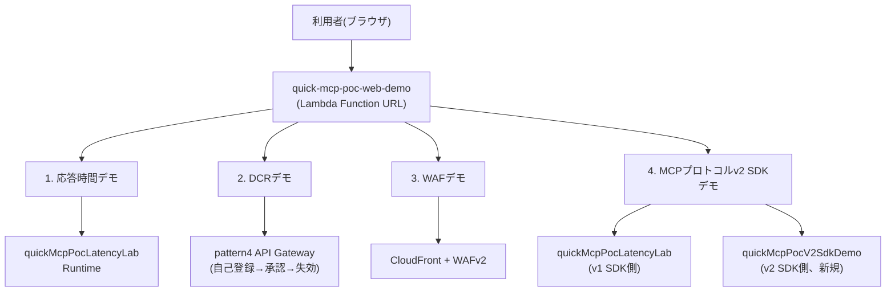
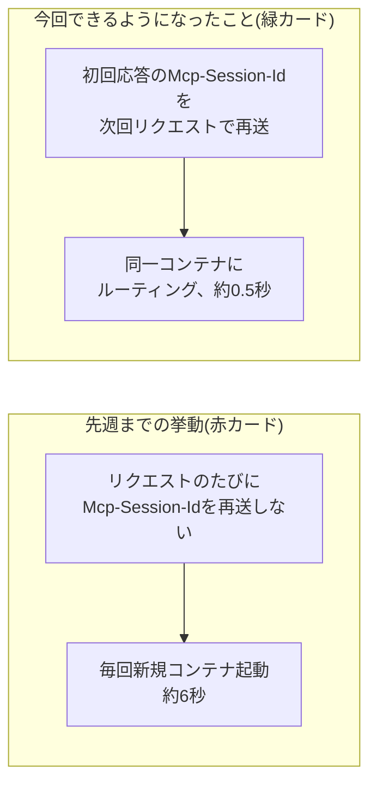
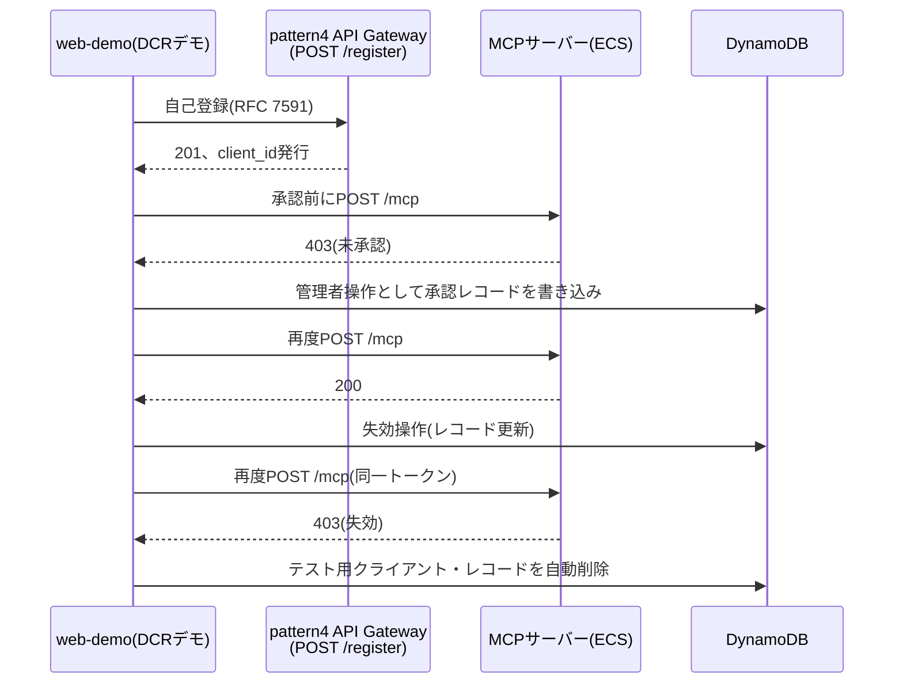
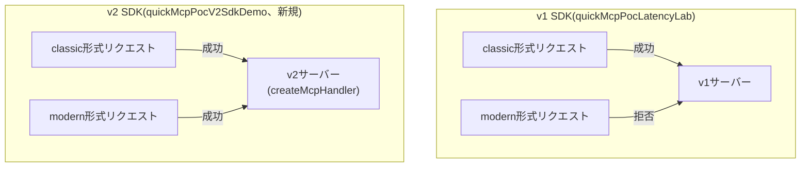
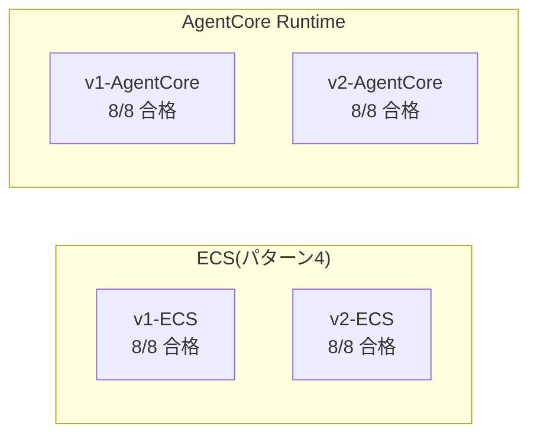

# 今週の検証レポート: 疎通検証Webアプリのライブデモ拡充とAWSリソース整理(2026-09-03〜09-08)

> この章で分かること
> 今週実施した、疎通検証Webアプリ(`web-demo`)への4つのライブデモパネル追加、クライアント向けデモログイン認証情報の再発行、複数セッションにわたり積み重なったAWSリソースの棚卸しドキュメント作成、MCPプロトコルv2のECS/AgentCore Runtime両方での検証とMCP基本機能テストスイートの新規作成についてまとめる。

作成日: 2026-09-08 | 検証方法: 実機検証(playgroundアカウント883660531246、`feature/web-demo-verification-panels`ブランチ(§1〜3)・`feature/mcp-protocol-v2-spike`ブランチ(§4)での実装・デプロイ・実リクエスト)。本番相当アカウント(620369151795)への書き込みなし。

---

## TL;DR

| # | 論点 | 結論 |
|---|---|---|
| 1 | 疎通検証Webアプリへのライブデモパネル追加 | 応答時間・DCR・WAF・MCPプロトコルv2 SDKの4セクションを`quick-mcp-poc-web-demo`(Lambda Function URL)に追加した。いずれもログイン不要でボタン1つから実際のplaygroundリソースへライブでリクエストを送る方式。実装当初、v2 SDKサーバーのSSE形式レスポンスをJSONとして誤解釈するバグを作り込んだが、実機での確認により発覚・修正した(§1) |
| 2 | クライアント向けデモログイン認証情報の発行 | 既存のテストユーザー`quick-mcp-poc-verify`(Cognitoプール`ap-northeast-1_WSvFtGhlV`)のパスワードを再発行し、ログイン→MCP呼び出しの成功をエンドツーエンドで確認した。新規ユーザーは作成していない(§2) |
| 3 | 環境・AWSリソース整理ドキュメントの新規作成 | `docs/17-environment-resource-map.md`を新規作成し、AgentCore Runtime 3つ・ECS 1系統・Lambda 3つ等を実機棚卸しした。web-demoの各デモセクションが呼ぶリソースの対応表、構成図(awsdac)、共有playgroundアカウント内の無関係リソースへの注意喚起を含む(§3) |
| 4 | MCPプロトコルv2のECS/AgentCore Runtime両方での検証とテストスイート拡充 | ECS側にもv2 SDKを新規デプロイし、MCP基本機能テストスイート(8項目)を4環境(v1/v2 × ECS/AgentCore Runtime)に自動実行、**32/32件合格**。未知のツール名へのエラー応答形式がv1/v2で異なる(SDKバージョン起因、ホスティング方式非依存)という新規発見あり(§4) |
| 5 | 来週へのアクションプラン | `feature/web-demo-verification-panels`・`feature/mcp-protocol-v2-spike`両ブランチのmainマージ判断、前週から持ち越しの4件の意思決定確認、v1/v2のエラー応答形式差のクライアント実装への反映が主要項目(§5) |

---

## 1. 疎通検証Webアプリへのライブデモパネル追加

### 1.1 背景と全体像

ユーザーから「今回検証した内容を実機で確認できるデモ画面がほしい」との依頼を受け、`feature/web-demo-verification-panels`ブランチで、既存の疎通検証Webアプリ(`quick-mcp-poc-web-demo`、Lambda Function URL)に4つの新規デモセクションを追加した。いずれもログイン不要、ボタン1つで実際にplaygroundアカウントのAWSリソースへライブでリクエストを送る方式である。

このLambdaのソースコードはこれまでリポジトリに一切コミットされておらず、デプロイ済みのzipにのみ存在していた。今回`aws lambda get-function`で取得・復元し、`web-demo/index.mjs`として初めてコミットした(以後はリポジトリが正)。詳細な機能一覧・環境変数・デプロイ手順は[web-demo/README.md](../web-demo/README.md)を参照。

**図の解説**: 4つのデモはすべて同じLambda(`quick-mcp-poc-web-demo`)を入口としつつ、それぞれ異なるバックエンドリソースを呼び分けている。応答時間デモとSDKデモのv1側は既存の`quickMcpPocLatencyLab` Runtimeを共用し、SDKデモのv2側だけが今回新規にデプロイした`quickMcpPocV2SdkDemo` Runtimeを呼ぶ。各リソースの詳細な対応関係・識別子は[17-environment-resource-map.md §2](./17-environment-resource-map.md)にまとめてある。

### 1.2 応答時間デモ

**先週までの検証**: AgentCore Runtimeは毎回のリクエストで新しいコンテナを起動するため約6秒かかっていたところ、レスポンスヘッダーの`Mcp-Session-Id`を次回リクエストで再送すると同じコンテナが再利用され高速化するという仮説を、検証専用Runtime`quickMcpPocLatencyLab`で実機検証した。0秒・30秒・5分・20分の4チェックポイントで計測した結果、30秒後まではセッション再利用の効果が持続する(約6秒→約0.5〜0.6秒、約10倍の高速化)一方、5分後には効果が失われ(CloudWatch Logsの`boot_id`計装で新規コンテナへの切り替わりを確認)、設定上の`idleRuntimeSessionTimeout`(15分)よりも実際のコンテナ保持時間はずっと短いという結論を得た(詳細は[16-weekly-verification-report-week3.md §1](./16-weekly-verification-report-week3.md))。

**今週の検証**: この実機検証結果を、誰でもその場で再現・確認できるライブデモとして可視化した。ボタン1つで、セッションID再送なしのベースライン呼び出し(赤カード「先週までの挙動」)とセッションID再送ありの呼び出し(緑カード「今回できるようになったこと」)を連続実行し、実測値をその場で並べて表示する。既存の`quickMcpPocLatencyLab` Runtimeをそのまま呼び出しており、新規のAWSリソース作成は不要だった。

**図の解説**: 同じ`quickMcpPocLatencyLab` Runtimeに対して、`Mcp-Session-Id`ヘッダーを再送するかどうかだけを変数にして2通りのリクエストを送り、応答時間の差をその場で実測する。左右比較はボタン1つで両方のケースを連続実行し、結果をカード形式で並べて表示する構成。

### 1.3 DCRデモ

**先週までの検証**: DCR(動的クライアント登録)の自己登録→admin承認→失効という一連のフロー自体は、それ以前のセッション(2026-08-31、[10-dcr-implementation.md](./10-dcr-implementation.md))でpattern4(ECS)環境にLambda Authorizer+Register Lambdaとして実装済みだった。先週([15-ecs-production-readiness-gaps.md](./15-ecs-production-readiness-gaps.md))はこれを実機で再実演したのに加え、2つの新しい安価な代替仮説を実機検証した: (a) AgentCore Runtime側で`allowedClients`を使わず`allowedScopes`のみで運用すればCognitoのままDCRが成立する(Auth0移行(月額$800〜)が不要になる)、(b) ECS側でもAPI Gateway REST API(v1)のネイティブ`COGNITO_USER_POOLS`オーソライザーを使えば自作Lambda Authorizerが不要になる可能性がある。いずれも実機で成立を確認した。

**今週の検証**: 先週実機確認したpattern4環境での一連のフロー(自己登録→未承認403→承認→200→失効→403)を、誰でも見られるライブデモとして可視化した。あわせて、静的な左右比較カードとして「先週までの認識: Lambda Authorizerへの置き換えが必須」対「今回判明したこと: `allowedScopes`のみで成立」という認識の変化も並べて提示している。以下のシーケンス図は、実演される一連のやり取りを示す。

**図の解説**: 自己登録→未承認403→承認→200→失効→403という一連の流れをワンボタンで実演する。承認・失効の管理者操作は`quick-mcp-poc-web-demo`のLambda実行ロールに追加したインラインポリシー(`quick-mcp-poc-users`テーブル限定の`dynamodb:PutItem/UpdateItem/DeleteItem/GetItem`、pattern4プール限定の`cognito-idp:DeleteUserPoolClient`)で行っており、実演後は作成したテスト用Cognitoクライアント・DynamoDBレコードを自動的にクリーンアップする。

### 1.4 WAFデモ

**先週までの検証**: AgentCore Runtime自体にはWAFを直接アタッチできないため、CloudFront+WAFv2をリバースプロキシとして前段に配置する代替構成を、それ以前のセッション(2026-08-21、[05-security-compliance-verification.md §4.5](./05-security-compliance-verification.md))で実機構築し、正常リクエストの通過・XSS攻撃パターンの403ブロックを確認していた。先週([15-ecs-production-readiness-gaps.md §4](./15-ecs-production-readiness-gaps.md))はこれを再検証した上で、実際にアタッチされているマネージドルールグループを確認したところ`AWSManagedRulesCommonRuleSet`のみで、SQLインジェクション特化の`AWSManagedRulesSQLiRuleSet`が付いておらず、単純なSQLiパターン(`?id=1' OR '1'='1`)が素通りするという課題を新規に発見した。

**今週の検証**: 正常リクエスト・XSSパターン・SQLiパターンの3種類を、CloudFront+WAFv2ディストリビューション(`d22imwd0soxmb2.cloudfront.net`)に直接送り、通過/遮断の結果をその場で実測表示するライブデモとして可視化した。正常リクエストがオリジン(AgentCore Runtime)まで到達して404が返ることがあるが、これはWAFを通過したことの確認が目的であり、実際のMCP呼び出しではない。SQLiパターンが遮断されずに通過する様子もそのまま表示されるため、[15-ecs-production-readiness-gaps.md §4](./15-ecs-production-readiness-gaps.md)で発見した課題を対外的にも実演できる。

### 1.5 MCPプロトコルv2 SDKデモ

**先週までの検証**: MCPプロトコルv2(2026-07-28)への移行影響は、それ以前のセッション(2026-08-31〜09-02)で机上調査し、SDKバージョンアップの互換性・AgentCore Runtimeへの影響を[12-mcp-protocol-v2-upgrade-impact.md](./12-mcp-protocol-v2-upgrade-impact.md)にまとめていた。先週(09-03)、実際にv2 SDKへの書き換えをスパイクブランチ(`feature/mcp-protocol-v2-spike`)で実装し、ローカル環境(LocalStack)で旧世代クライアント形式・新世代クライアント形式の両方が動作することを確認した。

**今週の検証(前半、09-06〜08)**: v2スパイクサーバーをAgentCore Runtime実機(検証専用Runtime`quickMcpPocV2SdkDemo`を新規デプロイ)に載せ、現行デプロイ(v1 SDK、`quickMcpPocLatencyLab`)と並べて、classic形式(従来のinitializeハンドシェイクを使う旧世代クライアント相当)・modern形式(v2の`_meta`エンベロープを使う新世代クライアント相当)のリクエストを送り、結果を比較するライブデモとして可視化した。

**図の解説**: v1サーバーはclassic形式のみを受理しmodern形式を拒否するのに対し、v2サーバーは両形式とも受理する。これは[12-mcp-protocol-v2-upgrade-impact.md §7](./12-mcp-protocol-v2-upgrade-impact.md)で調査した「新SDKは旧世代・新世代のクライアントを自動的に振り分ける設計」という机上の調査結果を、実際にplaygroundの2つのRuntimeに対するライブリクエストで裏付けたものである。

**実装時に発見・修正したバグ**: 初回実装では、v2サーバーのレガシーフォールバック応答がSSE形式(`event: message\ndata: {...}`)で返ってくる場合があることを見落としており、これをそのまま`JSON.parse`しようとして失敗し、「v2サーバーはclassic形式に失敗する」という誤った結果を表示していた。実機で確認して初めて発覚し、レスポンス判定処理を`data: `行を抽出してからパースするよう修正した。今回の教訓として、「見える化」を求められた際は机上の想定で実装を始めず、先に実機で正確な挙動差を確認してから設計する方が手戻りが少ないことを再確認した。

**今週の検証(後半)**: このAgentCore Runtime限定の比較だけでは「ECS側は未検証」という抜けが残っていたため、ECS側にもv2 SDKを実機デプロイし、MCP基本機能の自動テストスイートを新規作成して4環境すべてを横断的に検証した。詳細は§4を参照。

---

## 2. クライアント向けデモログイン認証情報の発行

クライアントに疎通検証Webアプリの既存機能(OAuth PKCEログイン→MCP呼び出し)を実際に試してもらえるよう、既存のテストユーザー`quick-mcp-poc-verify`(Cognitoユーザープール`agentcore-mcp-pool`、`ap-northeast-1_WSvFtGhlV`)のパスワードを再発行した。新規ユーザーは作成せず、既存ユーザーを再利用する方針とした。

再発行後、実際にこのユーザーでログイン→AgentCore Runtimeへの`tools/list`・`tools/call`呼び出しが成功することをエンドツーエンドで確認した。今回追加した4つのライブデモパネル(§1)とあわせて、既存のOAuth疎通確認デモも含めた全機能を実機で確認済みの状態になっている。

---

## 3. 環境・AWSリソース整理ドキュメントの新規作成

複数セッションにわたる検証の積み重ねで、AgentCore Runtime・ECS・Lambda等のAWSリソースが増え、どれがどの検証・デモ用かが分かりにくくなっていた。この状態を解消するため、`docs/17-environment-resource-map.md`を新規作成し、2026-09-08時点でplaygroundアカウントに実在するリソースを実機で棚卸しした。

| リソース種別 | 数 | 内容 |
|---|---|---|
| AgentCore Runtime(パターン3) | 3 | `quickMcpPocVerification`(最初期からのデモ用)、`quickMcpPocLatencyLab`(応答時間チューニング検証用)、`quickMcpPocV2SdkDemo`(MCPプロトコルv2 SDKデモ用、今回新規) |
| ECS(パターン4) | 1系統 | `quick-mcp-poc-cluster`/`app`。`terraform-playground-pattern4/`で管理、本番相当`terraform/`とは別物 |
| Lambda | 3 | `quick-mcp-poc-web-demo`(デモ画面本体)、`quick-mcp-poc-dcr-register`・`quick-mcp-poc-dcr-authorizer`(パターン4のDCR実装) |
| Cognitoユーザープール | 2 | `agentcore-mcp-pool`(パターン3側)、`quick-mcp-poc-pattern4-verify-users`(パターン4側) |
| DynamoDBテーブル | 2(実質稼働1) | `quick-mcp-poc-users`が両パターン共通で実質稼働。`quick-mcp-poc-pattern4-verify-users`(上表のCognitoユーザープールと同名だが別リソース、terraformの命名がたまたま一致している)は未使用 |

[17-environment-resource-map.md](./17-environment-resource-map.md)には、awsdacによる全体構成図(`docs/images/web-demo-architecture.png`)と、疎通検証Webアプリの各デモセクションがどのリソースを呼んでいるかの対応表(本レポート§1の各デモに対応)を掲載している。

あわせて、playgroundアカウント(883660531246)は他プロジェクトとも共用されており、`list-agent-runtimes`・`list-clusters`を実行すると`trocco`・`mcplatency_latencymcp`・`pii-detection`等のquick-mcp-pocとは無関係なリソースが見えることへの注意喚起も記載した。特に`mcplatency_latencymcp`は名称が本プロジェクトの検証内容(応答時間・latency)と紛らわしいが、作成日時・ECRリポジトリ名・IAMロール名がいずれも別プロジェクトのものであり、無関係と判断済みであることを明記している。

---

## 4. MCPプロトコルv2のECS/AgentCore Runtime両方での検証とテストスイート拡充

### 4.1 背景

§1.5のSDKデモはAgentCore Runtime側のみの比較で、**ECS(パターン4)側ではMCPプロトコルv2 SDKを一度も検証していなかった**。あわせて、これまでのv2検証は`curl`での単発確認が中心で、MCP基本機能(認可・初期化・ツール一覧・エラーハンドリング等)を体系的にカバーしたテストにはなっていなかった。この2点を解消した。

### 4.2 ECS側へのv2 SDKデプロイ

`feature/mcp-protocol-v2-spike`ブランチの`server/`をamd64向けにビルドし、パターン4環境に検証専用サービス`quick-mcp-poc-v2-sdk-demo`(Fargate、タスク定義`quick-mcp-poc-v2-sdk-demo:1`)を新規作成した。既存のDCRデモ用サービス(`app`)には一切触れていない。直接検証用に、ポート3000を実行者の自宅グローバルIPのみへ限定したセキュリティグループを作成し、パブリックIPを付与している(API Gatewayを経由しない、コンテナへの直接アクセス)。

### 4.3 MCP機能テストスイート

`scripts/mcp_functional_tests.py`を新規作成した。以下の8項目を、v1-ECS(パターン4、API Gateway経由)・v2-ECS(`quick-mcp-poc-v2-sdk-demo`、直接)・v1-AgentCore(`quickMcpPocLatencyLab`)・v2-AgentCore(`quickMcpPocV2SdkDemo`)の4環境すべてに対して自動実行する。

| # | テスト項目 | 確認内容 |
|---|---|---|
| 1 | 未認証リクエストの拒否 | `Authorization`ヘッダーなしで401/403が返るか |
| 2 | `initialize`ハンドシェイク | `protocolVersion`・`serverInfo.name`が正しく返るか |
| 3 | `tools/list`のスキーマ完全性 | 想定6ツール(`get_quote`等)がすべて存在し、各ツールに`inputSchema`があるか |
| 4 | 不正な引数での`tools/call` | バリデーションエラーが構造化されて返るか |
| 5 | 未知のツール名での`tools/call` | エラーとして扱われるか(結果の形はSDK間で差があってもよい) |
| 6 | 未知のメソッド | JSON-RPCエラー(`-32601`相当)が返るか |
| 7 | `ping` | 正常に応答するか |
| 8 | v2形式(`_meta`エンベロープ)リクエスト | v1サーバーは拒否・v2サーバーは受理という想定通りの挙動になっているか |

### 4.4 テスト結果

初回実行時、v2-ECSのみ全項目がタイムアウトで失敗した。原因は検証環境側の単純な要因で、実行者のグローバルIPが検証中に変化し、IP制限したセキュリティグループのルールが古いIPのままだったことによる接続不可だった(アプリケーション側の問題ではない)。セキュリティグループのルールを現在のIPに更新したところ、再実行で**4環境×8項目=32件すべて合格**した。

**図の解説**: ホスティング方式(ECS/AgentCore Runtime)とSDKバージョン(v1/v2)の組み合わせ4通りすべてで、MCP基本機能テストが全項目合格した。これにより、v2 SDKへの移行が特定のホスティング方式に依存する問題ではないこと、既存のDCR・WAF・応答時間チューニングの検証成果(パターン4・パターン3双方)がv2移行後も引き続き有効である見込みが高いことを、机上ではなく実機で確認できた。

### 4.5 v1/v2のエラー応答形式の違い

項目5(未知のツール名での`tools/call`)で、SDKバージョン間の挙動差を発見した。

- **v1 SDK**: `result.isError: true`(ツール呼び出し自体は受理し、実行結果としてエラーを返す)
- **v2 SDK**: トップレベルのJSON-RPCエラー(`code: -32602`、リクエスト自体が不正というエラー)

この違いはECS・AgentCore Runtimeいずれのホスティング方式でも同一だった(SDKバージョンに起因する挙動で、ホスティング方式には依存しない)。クライアント側の実装がエラーハンドリングを`result.isError`のみで判定している場合、v2移行後にこのケースを見逃す可能性があるため、Step1でv2 SDKを採用する際はクライアント側のエラーハンドリング実装を両方の形に対応させる必要がある。

詳細は[12-mcp-protocol-v2-upgrade-impact.md §7.5](./12-mcp-protocol-v2-upgrade-impact.md)にまとめた。

---

## 5. 来週へのアクションプラン

| # | アクション | 担当・確認事項 |
|---|---|---|
| 1 | `feature/web-demo-verification-panels`・`feature/mcp-protocol-v2-spike`ブランチのmainマージ可否を判断する | マージ後、`docs/15`〜`docs/18`・`web-demo/`・`scripts/mcp_functional_tests.py`・関連画像がmain上で参照可能になり、本レポートおよび`docs/17`内の相互参照リンクが解消される |
| 2 | `docs/README.md`目次への`docs/15`〜`docs/18`の追加、および本レポートの正式な番号確定 | 複数の未マージブランチ(`latency-tuning/session-id-reuse`、`feature/web-demo-verification-panels`、`feature/mcp-protocol-v2-spike`)がそれぞれ15〜18番を採番済みのため、マージ順序とあわせてメインセッションが最終確認する |
| 3 | 前週から持ち越しの4件の意思決定状況を確認する | 本番`audience`バグ修正パッチの適用可否、DCR実装の本番`terraform/`への移植要否、`allowedScopes`単独運用への切り替え可否、MCPプロトコルv2移行の本格着手可否(いずれも[16-weekly-verification-report-week3.md §4](./16-weekly-verification-report-week3.md)) |
| 4 | クライアント向けデモログイン認証情報(§2)の共有方法・有効期限運用を検討する | パスワードの共有経路、再発行の頻度・トリガーを決めておく |
| 5 | v2 SDKデモ用リソース(`quickMcpPocV2SdkDemo` Runtime、`quick-mcp-poc-v2-sdk-demo` ECSサービス)のネットワーク設定を見直す | いずれもPUBLICネットワーク・直接アクセス用の緩めのSG(ECS側は自宅IPのみに制限済み)で構築したデモ専用リソース。デモ専用の位置づけを維持するか、VPCモードに揃えるかを判断する |
| 6 | v1/v2のエラー応答形式の違い(§4.5)をStep1のクライアント実装方針に反映する | `result.isError`のみに依存しないエラーハンドリング設計を検討 |
