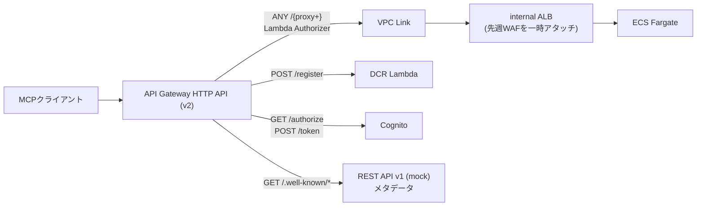
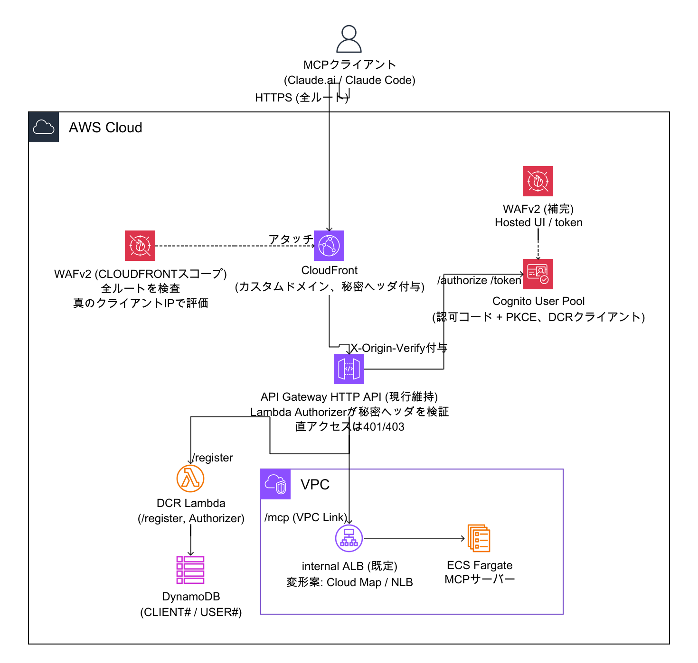
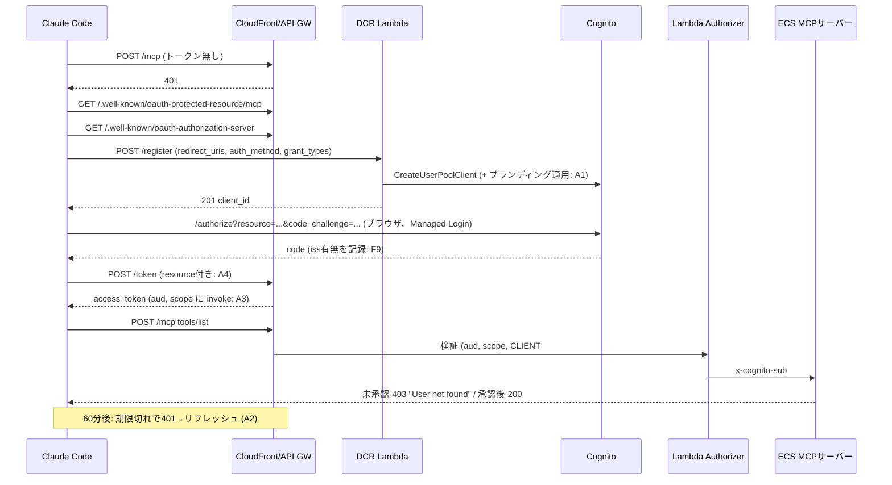

# 今週の検証プラン(Week 5): ECS構成におけるWAF・DCRの本番運用化

> この章で分かること
> [00-handoff.md §16.10](./00-handoff.md)で指示された今週の検証方針(WAF深掘り、DCR準拠性検証、両者のチェックリスト化、商用MCP運用調査)について、実装に入る前に既存コード・既存ドキュメント・公式仕様を調査した結果と、それを踏まえた実施計画をまとめる。調査の過程で、先週の結論を一部修正すべき発見(ALBアタッチ時のクライアントIP集約)、DCRの相互運用性を壊しうる未発見の欠陥候補(Managed Loginブランディング未適用、期限切れトークンの403応答、`invoke`スコープの未広告)、および従来の前提を覆す事実(CognitoのRFC 8707対応)が見つかったため、あわせて記録する。

作成日: 2026-09-10 | 実施方法: Explore/Planサブエージェントによる既存コード・ドキュメント・公式仕様(RFC、MCP仕様、Anthropicコネクタ仕様、AWS公式ドキュメント)の調査(机上、AWSへの書き込みなし)

**大前提**: 本番アーキテクチャはECS + API Gateway(pattern4)に確定しており([00-handoff.md §16.1](./00-handoff.md))、**AgentCore Runtimeの検証・考察は今後行わない**。本プランのすべての項目はECS構成のみを対象とする。§4で参照するAgentCore Gateway等の周辺サービスは、DCR・WAF設計のベストプラクティスの参考事例として扱うものであり、ホスティング方式の再検討ではない。

---

## TL;DR

| # | 論点 | 結論 |
|---|---|---|
| 1 | WAFの恒久的な配置 | 先週のALBアタッチ方式は`/register`・`/token`・`/authorize`・`/.well-known`を守れず、さらにWAFが見る送信元IPがVPC Link ENIに集約されIP系ルールが機能しない疑いがある(要実機確認)。**主案はCloudFront + WAF(CLOUDFRONTスコープ)を現行HTTP APIの前段に置く構成**とし、execute-api直アクセスは秘密ヘッダ検証で閉じる。ALBを使わない変形(Cloud Map直結 / NLB)を同じスパイクで比較する(§1) |
| 2 | API GatewayへのWAF直接アタッチ | HTTP API(v2)には不可、REST API(v1)なら可能。ただしREST APIのプライベート統合はNLBのみ対応のため**REST移行はALB撤去を必然的に伴う**。REST移行は全ルート保護・テナント別スロットリング(Usage Plan)・`WWW-Authenticate`付与(Gateway Responses)を同時に解くが工数5〜7日。今週は時間制限1.5日のスパイクで採否を判断する(§1.3) |
| 3 | DCRのRFC 7591準拠性 | 現状は「RFC 7591の形をしたLambda簡易実装」。RFC 7592未実装、`scopes_supported`に必須の`invoke`スコープが無い、RTローテーション未設定、audience未検証、`CLIENT#`欠落時に許可するAuthorizer、期限切れトークンが403(Claudeは401でしかリフレッシュしない)、DCRクライアントにManaged Loginブランディングが適用されない疑い、など相互運用性・セキュリティ双方に修正が必要。**Claude Code / Claude.aiからの自己登録E2Eは一度も検証されていない**(§2) |
| 4 | 前提を覆す事実 | CognitoはRFC 8707(`resource`パラメータ)に対応済みで、認可コードフローのアクセストークンに`aud`が付く。「Cognitoトークンに`aud`が無いのでaudience検証不可」というdocs/10以来の前提は崩れ、MCP仕様MUSTのaudience検証が実装可能。本番のJWT Authorizer `audience`設定の扱いも再考が必要(§2.1 F1、§2.5) |
| 5 | チェックリスト化 | WAF・DCR・運用を同一スキーマ(要件 / 根拠 / 検証方法 / 状態 / 証跡)で[20-production-readiness-checklist.md](./20-production-readiness-checklist.md)に固定IDで登録し、自動テストの結果IDと1対1で対応させる。terraform変更時・月次・MCP新版時に再評価する(§3) |
| 6 | 今週の進め方 | 合計見積約18人日で1週間に収まらないため、「主案(d)の実機成立」「REST採否の判断」「DCRのinterop-breaking解消とE2E成立」を必達とし、恒久運用(ログ保全・監視)とRFC 7592は翌週へ送る(§5) |

---

## 0. 調査で判明した現状

### 0.1 WAF

[18-weekly-verification-report-week4.md §2](./18-weekly-verification-report-week4.md)で実施済みなのは「一時Web ACL(`AWSManagedRulesCommonRuleSet` + `AWSManagedRulesSQLiRuleSet`)をinternal ALBにアタッチし、`tools/call`のJSON-RPCボディに埋めたXSS・SQLiが403になること」のみ。Web ACLは削除済みで、`terraform/`・`terraform-playground-pattern4/`ともWAFリソースは存在しない。

**図の解説**: 現行pattern4の経路。ALBを通るのは`/mcp`だけであり、DCR登録・トークン・認可・メタデータの4経路はLambda、Cognito、別のREST APIへ直行する。ALBにWAFをアタッチしても、これら未認証で到達できる経路は一切保護されない。`/.well-known`用にREST API(v1)がすでに1本稼働している点は、REST API化案の下地になる。

その他の現状: `default_route_settings`なし、API Gateway / ALBのアクセスログなし、`/register`のみburst 5 / rate 2のスロットル(全呼び出し元で共有、IP単位ではない)。`AWSManagedRulesKnownBadInputsRuleSet`・レートベースルール・ボット対策・監視 / アラーム・ログ保全([05-security-compliance-verification.md §5](./05-security-compliance-verification.md)が求めるS3 + Object Lock)はすべて未着手。

### 0.2 DCR

実装は`lambda/src/register.ts`・`lambda/src/authorizer.ts`・`terraform-playground-pattern4/openapi.yaml`に閉じており、本番`terraform/`は今もJWT Authorizerで`/register`ルートを持たない。[10-dcr-implementation.md](./10-dcr-implementation.md)で確認済みなのは`client_credentials`経路のみで、Claude Code / Claude.aiからの実際の自己登録は未検証。詳細な準拠性ギャップは§2.2以降に記載する。

---

## 1. WAF対応の深掘り(API Gateway直接アタッチ・ALB非依存経路を含む)

### 1.1 見積もり・スコープを変える発見

| # | 発見 | 影響 |
|---|---|---|
| D1 | REST API(v1)移行はALB撤去を必然的に伴う。REST APIのプライベート統合(VPC Link v1)はNLBのみ対応([API Gateway: Set up API Gateway private integrations](https://docs.aws.amazon.com/apigateway/latest/developerguide/set-up-private-integration.html)) | 「API GatewayにWAFを直接アタッチする」検討と「ALBを使わない」検討は同一の検証で答えられる |
| D2 | ALBにアタッチしたWAFが評価する送信元IPは、VPC Link ENIのプライベートIPに集約される可能性が高い。IPベースのレート制限・Geo・IPレピュテーションが無効化されるか、正規クライアント全断を起こす(要実機確認) | 先週の「ALBアタッチで十分」という結論は恒久設計としては不十分。WAF配置の本命はAPI Gatewayステージ(REST)またはCloudFrontになる |
| D3 | MCPクライアント(Claude.ai / Claude Code)はクラウド発信の機械クライアント。`AWSManagedRulesBotControlRuleSet`、`AnonymousIpList`の`HostingProviderIPList`、日本限定のGeo制限は正規クライアントを遮断する | これらはCount運用+ラベル観測から開始する。Anthropicの公開エグレスIPレンジの有無は要確認 |
| D4 | CommonRuleSetの`SizeRestrictions_BODY`(8KB超)・`GenericRFI_BODY`(ボディ内URL)・SQLiルールは、長文・URL・SQL風語句を含む正当なツール引数で誤検知しうる。WAFのボディ検査上限はCloudFront / REST API 16KB既定、ALBは8KB(要確認)([AWS WAF: Body inspection size limit](https://docs.aws.amazon.com/waf/latest/developerguide/web-acl-setting-body-inspection-limit.html)) | 「正常系コーパス」をハーネスに組み込み誤検知率を判定基準に入れる。`oversize_handling`とサーバー側`express.json`(100KB)の整合を設計する |
| D5 | API GatewayのURLはDCRの`issuer`・各エンドポイントそのもの。REST移行(execute-api ID変更)もCloudFront前置(ドメイン変更)も、登録済みDCRクライアントを全無効化する | どの案でもカスタムドメイン(ACM)を先に導入しissuerを固定する(+0.5〜1日、本番では必須) |
| D6 | REST APIのみ、Lambda Authorizerが返す`usageIdentifierKey`とUsage Planでクライアント単位のスロットリング / クォータをネイティブに実現できる([API Gateway: Output from an Amazon API Gateway Lambda authorizer](https://docs.aws.amazon.com/apigateway/latest/developerguide/api-gateway-lambda-authorizer-output.html))。リソースポリシー・PRIVATEエンドポイント(閉域網)もREST限定 | 未設計だった「テナント別レート制限」「閉域網」はREST採用でしか解けない。CloudFront主案ではWAFレートベース(`Authorization`ヘッダ集約キー)で代替する |
| D7 | 現行HTTP APIも既にレスポンスをバッファしており(SSEは非ストリーミング)、REST移行で悪化するのは統合タイムアウト30秒→29秒程度 | 「29秒超の`tools/call`が実運用に存在するか」「SSE本文の処理」を検証項目に事前登録する |
| D8 | REST移行時、`authorizer.ts`はIAMポリシー形式出力への書き換えが必要。`integration.request.header.x-cognito-sub`マッピングがクライアント送信の同名ヘッダを上書きするかは要確認([09-cross-tenant-impersonation-finding.md](./09-cross-tenant-impersonation-finding.md)の修正の退行リスク)。`server/src/index.ts`の`extractSub()`にJWT未検証デコードのフォールバックが残っている | なりすましヘッダ送信テストを必須化する。フォールバック削除はDCRチェックリスト(AUTHZ-03)へ |
| D9 | `/authorize`はリダイレクト後にブラウザがCognitoドメインへ直接通信するため、API Gateway前段のWAFでは守れない | Cognito User Pool自体へのWAF([Cognito: Associate an AWS WAF web ACL with a user pool](https://docs.aws.amazon.com/cognito/latest/developerguide/user-pool-waf.html))をどの案でも補完として導入する |
| D10 | `.well-known`用の別REST API(mock統合)は本体REST APIに統合できる | REST採用時はコンポーネントが減り、WAF・ログ・ドメインが単一ステージで完結する |

### 1.2 アーキテクチャ選択肢の比較

| 案 | 構成 | WAF保護範囲 | 未保護経路 | Authorizer互換 | SSE / タイムアウト | コスト増分(月、〜100万req) | 移行工数 | 主なリスク |
|---|---|---|---|---|---|---|---|---|
| 参考: 現行 + ALB WAF | HTTP API → VPC Link → ALB(WAF) → ECS | `/mcp`のみ | `/register` `/token` `/authorize` `/.well-known` | 変更なし | 変更なし | WAF約$6〜10 | 0.5日 | D2(IP系ルール無効疑い)、無認証経路が無防備 |
| (a) REST API v1 + WAF(stage) + VPC Link v1 → NLB → ECS | 全ルートを単一REST APIに統合 | 全ルート、真のクライアントIP | Cognito Hosted UI直アクセス(Cognito WAFで補完) | Lambda Authorizer継続可(IAMポリシー出力へ書換)。Usage Planでクライアント単位制限 | バッファは現行同等、29秒 | API従量+$2.5〜3、NLB≒ALB、WAF約$6〜10 | 5〜7日 | terraform記述量増、Authorizer退行(D8)、issuer変更(D5) |
| (b) HTTP API + VPC Link → Cloud Map(LB無し) + CloudFront + WAF | ALB / NLBを撤去 | CloudFrontで全ルート | execute-api直アクセスのバイパス(HTTP APIはリソースポリシー非対応) | 変更なし+秘密ヘッダ検証追加 | 現行同等 | CloudFront約$1+転送、WAF、LB費−約$24 | 4〜5日 | Cloud Mapはヘルスチェック / ドレイニング無し(デプロイ時の疎通懸念、要確認)、us-east-1運用追加、閉域網不可 |
| (c) HTTP API + VPC Link → NLB | ALB→NLB置換のみ | 無し(HTTP API・NLBとも非対応) | 全経路 | 変更なし | 変更なし | ±0 | 1日 | 単独では無意味。比較のため列挙、不採用 |
| **(d) CloudFront + WAF + 現行HTTP API(主案)** | 前段にCloudFront。ALB維持を既定とし、(b)(c)の変形を同スパイクで比較 | CloudFrontで全ルート、真のクライアントIP | (b)と同じバイパス問題(秘密ヘッダで閉じる) | 変更なし+秘密ヘッダ検証 | 現行同等 | CloudFront約$1+転送、WAF約$6〜10 | 3〜4日 | 最小変更だがテナント別制限・閉域網・リソースポリシーは不可、バイパス対策が秘密ヘッダ依存 |
| 補完: Cognito User Pool WAF | Web ACLをUser Poolへ関連付け | Hosted UI、`/oauth2/token`、Cognito API | なし | 影響なし | 影響なし | $5+ルール$1〜 | 0.5日 | `/token`はAPI Gateway経由でIPが集約(D9) |

### 1.3 採用方針(2026-09-10、ユーザー決定)

**主案は(d) CloudFront + WAF(CLOUDFRONTスコープ)を現行HTTP APIの前段に置く構成。補完としてCognito User Pool WAFを導入する。REST API v1(案a)は今週中に採否を判断するための時間制限付きスパイクとして扱い、本命の構築対象にはしない。**

**図の解説**: MCPクライアントからの全ルートがCloudFrontを経由し、CLOUDFRONTスコープのWAFが真のクライアントIPとJSON-RPCボディを検査する。CloudFrontはオリジン(現行HTTP API)に秘密ヘッダ(`X-Origin-Verify`)を付与し、API Gateway側のLambda Authorizerがこれを検証することでexecute-apiへの直アクセスを閉じる。`/authorize`はCognito Hosted UIへリダイレクトされブラウザがCognitoと直接通信するため、Cognito User Pool自体にも補完のWAFを関連付ける。バックエンドはinternal ALB経由を既定とし、Cloud Map直結またはNLBへの置き換えを同一スパイクで比較する。

主案(d)の設計上の必須要素:

- **バイパス対策**: CloudFrontがオリジンへ付与する秘密ヘッダ(Secrets Manager管理・ローテーション)を、`/mcp`は既存Lambda Authorizer内で、`/register`・`/token`・`/authorize`・`/.well-known`は新設のREQUEST型Lambda Authorizer(ヘッダ検証のみ、TTLあり)で検証する。HTTP APIはリソースポリシー非対応のため、これが唯一の手段。
- **ALB非依存の変形(ユーザー要望)**: オリジン配下を「HTTP API → VPC Link → Cloud Map(ECSサービスディスカバリ、LB無し)」または「→ NLB」へ置き換える案(b)(c)を同じスパイクで比較する。Cloud Map案はLBのヘルスチェック・接続ドレイニングが無く、デプロイ中に停止中タスクへルーティングされる懸念があるため、ecspressoのデプロイと組み合わせた挙動確認を判定項目(S11)に含める。実測で優位でなければALBを維持する。
- **IP系ルール**: CloudFront WAFは真のクライアントIPで評価できるためD2の問題は解消する。WAF Web ACLはus-east-1に置く必要があり、運用対象リージョンが1つ増える。
- **`WWW-Authenticate`の付与**: HTTP APIでは不可だが、CloudFront Functions(viewer response)で401応答にヘッダを付与できる可能性がある(要確認、判定項目S12。DCRトラック§2.4-aと共有)。
- **失うもの(明記)**: テナント別スロットリング(Usage Plan)、リソースポリシー、PRIVATEエンドポイント(閉域網)はREST API限定。テナント別レート制限はWAFレートベース(`Authorization`ヘッダ集約キー)で代替する。

REST APIスパイク(時間制限1.5日)で判定すること: WAFをステージへ直接アタッチし全ルートでBlockできること、Gateway Responsesで`WWW-Authenticate`を返せること、Usage Plan + `usageIdentifierKey`でクライアント単位の429が出ること、`integration.request.header.x-cognito-sub`マッピングでなりすましヘッダを上書きできること(S4)、29秒タイムアウトの影響(S5)。結果を§1.2の比較表に実測値として記入し、「本番でRESTへ移行する価値があるか」を週次レポートで結論づける。

### 1.4 攻撃パターンカタログ(ハーネス`scripts/waf_attack_tests.py`のデータ定義)

注入方法の凡例: B = `tools/call`の`params.arguments`、U = URIパス、Q = クエリ文字列、H = ヘッダ、M = HTTPメソッド、R = リクエスト頻度。

| ID | カテゴリ | 注入 | 対応ルール | WAF有効時の期待 | 誤検知リスクと確認方法 |
|---|---|---|---|---|---|
| A01 | XSS(実証済み) | B | CommonRuleSet `CrossSiteScripting_BODY` | 403 | 低 |
| A02 | SQLi(実証済み) | B | SQLiRuleSet | 403 | 銘柄名・検索語のSQL風語句をコーパスで確認。必要なら感度LOW |
| A03 | Log4j / JNDI | B、H、Q | KnownBadInputsRuleSet `Log4JRCE_*` | 403 | 低 |
| A04 | Javaデシリアライズ | B | KnownBadInputsRuleSet `JavaDeserializationRCE_BODY` | 403 | 低 |
| A05 | パストラバーサル(URI) | U | CommonRuleSet `GenericLFI_URIPATH`、LinuxRuleSet `LFI_URIPATH` | 403 | 低 |
| A06 | LFI(ボディ) | B | CommonRuleSet `GenericLFI_BODY` | 403 | 低 |
| A07 | SSRF(EC2メタデータ) | B | CommonRuleSet `EC2MetaDataSSRF_BODY` | 403 | 低 |
| A08 | RFI / 外部URL | B | CommonRuleSet `GenericRFI_BODY` | 403 | URLを含む引数は正当にあり得る。誤検知ならcountへ |
| A09 | Host異常 | H | KnownBadInputsRuleSet `Host_localhost_HEADER` | 403 | 低 |
| A10 | 禁止メソッド | M | KnownBadInputsRuleSet `PROPFIND_METHOD` + カスタム許可メソッド | 403 | 低 |
| A11 | UA無し / 悪性UA | H | CommonRuleSet `NoUserAgent_HEADER`、`UserAgent_BadBots_HEADER` | 403 | MCPクライアントの実UAを要確認。Countで開始 |
| A12 | 巨大ボディ(8〜16KB) | B | CommonRuleSet `SizeRestrictions_BODY` | 403 | 長文引数で誤検知。countにし、カスタム64KB超Blockへ |
| A13 | 検査上限超(100KB〜) | B | `oversize_handling` + カスタムsize_constraint | 403 | サーバー100KBとの整合 |
| A14 | 不正JSON | 生ボディ | `json_body`の`invalid_fallback_behavior` | 400(サーバー) | WAFがMATCHにフォールバックしないこと |
| A15 | JSON-RPCバッチ | 生ボディ | サーバー(バッチ非対応) + 任意カスタム | 400 / 403 | 低 |
| A16 | フラッディング | R | レートベース(IP)、レートベース(`Authorization`キー) | 403 | 閾値は正規ピークの数倍。テストは専用低閾値ルール |
| A17 | `/register`乱用 | R | route throttling + レートベース(scope-down `/register`) | 429 / 403 | 低 |
| A18 | `/token`ブルートフォース | R | レートベース(scope-down `/token`) + Cognito WAF | 403 | D9のIP集約 |
| A19 | Geo | 自IPで対検証 | `geo_match`(Count) | 設定どおり | US発信の正規クライアント。日本限定は不可 |
| A20 | IPレピュテーション / 匿名IP | 自IPをIP Setで代替 | `AmazonIpReputationList`、`AnonymousIpList` | 403 | `HostingProviderIPList`はCount必須 |
| A21 | ボット制御 | ハーネスのラベル観測 | BotControlRuleSet(有償) | Countのみ | 原則不採用。`/authorize`限定の将来検討 |
| A22 | ヘッダ異常 | H | カスタム`Content-Type`必須等 | 403 | 既存クライアントの実送信値を要確認 |
| A23 | プロトコルバージョン悪用 | H | サーバー400 + 任意カスタム | 400 / 403 | 新版時にルール更新 |
| A24 | `x-cognito-sub`なりすまし(D8) | H | API Gatewayマッピング + Authorizer | 200だがsubはAuthorizer由来 | REST移行時の必須退行テスト |
| A25 | 正常系コーパス(誤検知判定) | 6ツール × {通常、長文4KB / 12KB、URL、SQL風、記号、日本語} | 全ルール | 全件200 | 誤検知したルールはcount / scope-downで例外化し例外台帳へ |

### 1.5 恒久設計の骨子

- **ルール構成(優先度順)**: 管理IP許可 → 許可メソッド外Block → `POST /mcp`は`application/json`必須 → ボディ64KB超Block(CommonRuleSetの`SizeRestrictions_BODY`はcount) → レートベース(IP) → レートベース(`Authorization`キー、`/mcp`) → レートベース(`/register`・`/token`低閾値) → IPReputation → AnonymousIP(`HostingProviderIPList`は恒久Count) → KnownBadInputs → CommonRuleSet → SQLi → Linux / Unix → Geo(Count)。Bot Controlは不採用。Cognito User Pool用Web ACLはCommonRuleSet + KnownBadInputs + レートベース + IPReputation。
- **ログ**: WAF → CloudWatch Logs `aws-waf-logs-*`(90日、ECS / Lambdaと揃える)+ Firehose → S3(Object Lock、保持期間はFISC要件を要確認)。`Authorization`は`redacted_fields`で秘匿。API Gatewayアクセスログ・ECS / Lambdaログも同じS3経路へ送り、[05-security-compliance-verification.md §5](./05-security-compliance-verification.md)の「ログの改ざん防止・長期保存は未構成」を解消する。
- **監視**: `BlockedRequests` / `CountedRequests` / 比率急変 / API Gateway 4XX・5XXのアラーム、SNS通知。ダッシュボード(ルール別、上位`clientIp`、`terminatingRuleId`)。
- **運用**: 全ルールCountで2週間観測 → 誤検知ゼロのルールから順にBlock(terraformの`locals.mode`切替) → ハーネス再実行。例外はラベルベース`scope_down` + 例外台帳(ルール / 理由 / 承認者 / 期限)。月次Countレビュー、四半期ハーネス再実行、MCP新版時にA23更新。本番は`terraform plan`承認制。
- terraformは`terraform-playground-pattern4/`と`terraform/`で同一ファイル名・内容を保ち、差分は`locals`(閾値・モード)のみにする。

### 1.6 タスク内訳(playgroundのみ適用、本番`terraform/`はコード準備のみ)

| # | タスク | 成果物 | 見積 |
|---|---|---|---|
| W0 | 公式ソース精読・設計メモ確定・本ドキュメント化 | 本ドキュメント §1 | 0.5日 |
| W1 | 攻撃テストハーネス(`scripts/mcp_functional_tests.py`の`Target.call()` / `http_post()` / matrix表示を流用、§1.4をデータ駆動で実装、`X-Waf-Test-Id`でWAFログと突合、結果JSON + Markdownを`docs/evidence/`へ) | `scripts/waf_attack_tests.py`、`scripts/waf_log_correlate.py` | 1.5日 |
| W2 | 現行ALBにCountモードで一時Web ACLを再アタッチ(CommonRuleSet + SQLi + KnownBadInputs + Linux + IPReputation + AnonymousIP + レートベース)+ WAFログ。ハーネス実行しラベル・`clientIp`(D2確定)・誤検知を記録。終了後デタッチ・削除 | `waf_alb_probe.tf`(検証後削除)、証跡JSON | 1.0日 |
| W3 | 主案(d)構築: CloudFront(オリジン = HTTP API、CachingDisabled、AllViewer Origin Request Policy、秘密ヘッダ付与)+ WAF(CLOUDFRONT、us-east-1、全Count初期)+ 秘密ヘッダ検証(既存Lambda Authorizer拡張 + 無認証ルート用の新Authorizer)+ カスタムドメイン(ACM us-east-1)。ALB非依存変形(Cloud Map / NLB)のVPC Link切替を同環境で比較 | `cloudfront.tf`、`waf.tf`、`domain.tf`、`apigateway.tf`、`lambda/src/authorizer.ts`、`lambda/src/origin_verify_authorizer.ts`(新規)、`servicediscovery.tf`または`nlb.tf` | 2.5日 |
| W4 | REST APIスパイク(時間制限): 最小限のREST API(`/mcp` + `/register`のみ)を別スタックで構築し、WAFステージアタッチ・Gateway Responses・Usage Plan 429・ヘッダ上書き(S4)・29秒(S5)を判定。判定後は破棄可 | `terraform-playground-pattern4-rest/`(新規、使い捨て) | 1.5日 |
| W5 | 主案(d)でハーネス全実行(Count → Blockの2回)+ S1〜S12の確認。翌週: ログ / Firehose / S3 Object Lock、アラーム、ダッシュボード、API Gatewayアクセスログ | 証跡JSON×2、本ドキュメント§1への結果追記。翌週分: `waf_logging.tf`、`monitoring.tf`、`s3_audit_logs.tf` | 1.5日(+翌週1.5日) |
| W6 | 本番`terraform/`へのコード移植(未適用、`terraform validate`まで)。awsdac構成図の更新(主案dと変形b / c) | `terraform/cloudfront.tf`、`terraform/waf.tf`ほか | 1.5日(翌週) |
| | **今週分合計** | | **約8.5日** |

### 1.7 成功判定基準(事前登録)

| ID | 結果 | 判定 |
|---|---|---|
| S1 | 主案(d)でA01〜A13・A16〜A18・A22が全ルート(`/mcp` `/register` `/token` `/authorize` `/.well-known`)で403、WAFログに対応ラベルが記録される | WAF配置としてCloudFront前置を本番推奨 |
| S2 | WAFログ`clientIp`が検証端末の公開IPと一致(CloudFront / REST)。ALBアタッチ時はVPC Link ENIのIPと一致 | D2を事実として確定し、[18-weekly-verification-report-week4.md §2.4](./18-weekly-verification-report-week4.md)に訂正注記 |
| S3 | A25正常系コーパス全件200(Blockモード)。誤検知は例外化で解消可能 | ルール構成を恒久化 |
| S4 | A24でサーバーがAuthorizer由来のsubで認可判定する(ECSログ) | REST移行はなりすまし修正を退行させない(RESTスパイクの判定項目) |
| S5 | 実ECSログの`tools/call`最大所要時間が29秒未満、SSE化応答をClaude Codeが処理する | REST採用可否の判定項目 |
| S6 | Usage Planで特定DCRクライアントのみ429になる | テナント別レート制限をREST方式で実現できることの確認(RESTスパイク) |
| S7 | カスタムドメイン経由でClaude CodeのDCR登録 → 認可 → `tools/call`が成立する | issuer固定方針(D5)の妥当性確認 |
| S8 | WAFログがS3(Object Lock)に到達し、削除操作が拒否される(翌週) | [05-security-compliance-verification.md §5](./05-security-compliance-verification.md)の「改ざん防止未構成」を解消 |
| S9 | `BlockedRequests`アラームがハーネス実行で発報する(翌週) | 監視設計の実効性 |
| S10 | CloudFrontを経由しないexecute-api直アクセスが全ルートで401 / 403になる | バイパス対策の成立 |
| S11 | Cloud Map変形でecspressoデプロイ中に5xx / 接続失敗が発生しない | 発生すればALB維持またはNLBへ |
| S12 | CloudFront FunctionsでDCR用`WWW-Authenticate`を401に付与できる | 不可なら§2.4-aの401化のみで進める |

### 1.8 参照する公式ソース(実装時に精読)

AWS WAF(保護対象リソース、マネージドルール一覧、レートベースルール、oversize handling、ボディ検査上限、ログ、テストとチューニング、料金)、API Gateway(REST vs HTTP比較、RESTプライベート統合、HTTPプライベート統合、REST + WAF、Lambda Authorizer出力、セキュリティベストプラクティス、クォータ)、Cognito User Pool + WAF、CloudFront + WAF、MCP仕様Security Best Practices、Security Automations for AWS WAF。存在は把握しているが内容は要確認: AWS Solutions「Guidance for Deploying Model Context Protocol Servers on AWS」(CloudFront + WAF + ALB + ECS + Cognito構成で主案(d)に近い)、AWS Blog「Open Protocols for Agent Interoperability Part 2: Authentication on MCP」、Anthropicのエグレス固定IP公開の有無。

---

## 2. DCR認証まわりのブラッシュアップ(RFC 7591準拠性の検証)

### 2.1 見積もり・スコープを変える発見(公式仕様との照合で新たに判明)

| # | 事実 | 影響 |
|---|---|---|
| F1 | CognitoはRFC 8707に対応済み。`/oauth2/authorize`の`resource`パラメータでアクセストークンに`aud`が付く(認可コードフローのみ、`client_credentials`は不可)([Cognito: Authorize endpoint](https://docs.aws.amazon.com/cognito/latest/developerguide/authorization-endpoint.html)) | 「Cognitoトークンに`aud`が無いのでaudience検証不可」という[10-dcr-implementation.md](./10-dcr-implementation.md)以来の前提が崩れる。MCP仕様MUSTのaudience検証を満たせる。本番のJWT Authorizer `audience`設定の扱いも再考(§2.5) |
| F2 | MCP 2026-07-28でDCRは「非推奨、後方互換のためMAY」、CIMD(Client ID Metadata Documents)が「SHOULD」。クライアントの優先順位は事前登録 > CIMD > DCR([MCP: Client Registration](https://modelcontextprotocol.io/specification/2026-07-28/basic/authorization)) | 現行(CIMD非広告)ではClaudeはDCRにフォールバックするため今後も使われる。長期投資判断に影響(§2.4-e) |
| F3 | Claude Codeは自前のCIMDを持ち、ASが`client_id_metadata_document_supported: true`のときのみCIMDを使う。純粋な`client_credentials`(M2M)はClaude非対応([Anthropic: Authentication for connectors](https://claude.com/docs/connectors/building/authentication)) | これまでテスト済みの唯一の経路(`client_credentials`)はClaudeの経路ではない。未検証の認可コード経路こそが商用経路 |
| F4 | Claudeの要求スコープは (1) 401の`WWW-Authenticate`の`scope`、(2) PRM(RFC 9728)の`scopes_supported`の順 | 本環境は双方無し。AS metadataの`openid email profile`が使われ`invoke`欠落で403になる可能性。E2Eの最重要観察点 |
| F5 | Claudeは401を受けたときのみトークンをリフレッシュする。HTTP API Lambda Authorizer(simple response)の拒否は403 | 1時間後のトークン期限切れが403になり接続が死ぬ可能性。相互運用性を壊す候補の最上位 |
| F6 | `CreateUserPoolClient`で作ったアプリクライアントにはManaged Loginブランディングが自動割当されず、スタイル適用までログイン画面が利用不可([Cognito API: CreateUserPoolClient](https://docs.aws.amazon.com/cognito-user-identity-pools/latest/APIReference/API_CreateUserPoolClient.html)) | `register.ts`は`CreateManagedLoginBranding`を呼んでいない。DCRクライアントのブラウザログイン画面が表示されない恐れ。`client_credentials`のみテストしていたため未発覚 |
| F7 | MCP仕様: 公開クライアントのリフレッシュトークンはMUSTローテーション。`register.ts`は`RefreshTokenRotation`未設定 | 1パラメータで修正 |
| F8 | MCP 2026-07-28ではPRM提供は「`WWW-Authenticate`またはwell-known」の択一MUST(2025-06-18では`WWW-Authenticate`がMUSTだった) | `WWW-Authenticate`欠落は現行仕様では非違反。ただし`scope`ヒントを出せない |
| F9 | AS metadataの`issuer`はwell-known構築元と一致している。問題はトークンの`iss`(Cognito)との不一致。RFC 9207: 認可レスポンスに`iss`が含まれクライアントの記録と不一致ならMUST拒否 | Cognitoが将来`iss`を返し始めた瞬間に全接続が壊れる時限リスク。監視項目化 |
| F10 | Anthropicのdiscovery / registration / token応答待ちは10秒 | Register Lambdaのコールドスタート + Cognito API呼び出しの実測が必要 |
| F11 | HTTP APIでは`/register`はLambda統合でALBも通らないため、IP単位レート制限はWAFでは不可 | Lambda内カウンタか、CloudFront前置(§1主案)でWAFレートベースを適用 |
| F12 | テーブル名`quick-mcp-poc-users`のハードコードは`lambda/src/shared/db.ts`だけでなく`server/src/db.ts`、`cli/src/db.ts`、`lambda.tf`のIAM ARNにも一貫。terraform管理テーブルは3コンポーネント全てから未使用 | 環境変数化を3か所 + IAMで揃える。本番はテーブルを作り直さない(41ユーザーの実データ) |

### 2.2 現状実装の準拠性サマリー

チェック項目の全行は[20-production-readiness-checklist.md §3](./20-production-readiness-checklist.md)に固定IDで登録した。仕様別の要点は次の通り。

| 仕様 | 主要チェック項目と現状 |
|---|---|
| RFC 7591 | 未知メタデータ無視(準拠)/ `token_endpoint_auth_method`既定が`none`(RFC既定は`client_secret_basic`、判断事項)/ `response_types`無視・`grant_types`との整合性未検証 / `redirect_uris`検証(準拠、フラグメント拒否はCognito依存)/ `client_secret_expires_at`をsecret無しでも常に返す / 500時に非RFC`server_error`、Cognito 400系を500化(必須修正)/ `Cache-Control: no-store`無し / §5レート制限は共有スロットルのみ(商用必須) |
| RFC 7592 | `registration_access_token` / `registration_client_uri`無し、GET / PUT / DELETE無し(完全未対応。ExperimentalでClaude未使用だが「本来のDCR対応」を名乗るなら必要) |
| RFC 8414 | `issuer`とwell-known構築元一致(準拠)/ トークン`iss`不一致(意図的逸脱、方針決定・文書化)/ `jwks_uri`無し / `scopes_supported`に`invoke`無し(必須修正)/ `code_challenge_methods_supported: S256`(準拠)/ `revocation_endpoint`無し / `openid-configuration`ミラー無し / 本番`openapi.yaml`は`registration_endpoint`すら無い |
| RFC 9728 | `resource`・`authorization_servers`(準拠)/ `scopes_supported`無し(必須、Claudeのスコープ選択根拠)/ `WWW-Authenticate`無し(現行仕様では非違反)/ パス無しの`/.well-known/oauth-protected-resource`無し |
| MCP Authorization | PKCE S256(準拠)/ `/token`での`resource`受理(要確認)/ audience検証未実装(MUST、F1で実装可能)/ 期限切れトークンが403(MUST 401、要確認)/ RTローテーション未設定(MUST)/ token passthrough禁止(準拠)/ RFC 9207整合(要確認) |
| Claude固有 | DCR方式(準拠)/ redirect `claude.ai`・localhost(準拠)/ スコープ選択(未対応)/ 10秒応答(要確認)/ Managed Loginブランディング(要確認、F6)/ 接続ごとに新規クライアントが増える(上限・掃除なし)/ `client_credentials`登録はClaude非対応(残すか方針決定) |

### 2.3 ギャップの優先順位

- **A. 相互運用性を壊す(接続できない・切れる)**: A1 Managed Loginブランディング未適用(F6)/ A2 期限切れトークン403(F5)/ A3 `invoke`が`scopes_supported`に無い(AS・PRM双方)/ A4 `/token`の`resource`受理 / A5 issuer不一致 + RFC 9207時限リスク / A6 `WWW-Authenticate`欠落 / A7 登録応答10秒超
- **B. セキュリティ(商用・金融向けとして許容不可)**: B1 `CLIENT#`欠落時に許可(`authorizer.ts`のブラックリスト設計)/ B2 audience未検証 / B3 RT非ローテーション / B4 クライアント削除後もトークンが最大1時間有効(B1修正で即時遮断)/ B5 共有スロットル・登録上限なし・IP単位制限不可 / B6 API Gatewayアクセスログ無し(監査証跡ゼロ)/ B7 `client_credentials` + `none`の組合せがCognito 400 → 500化
- **C. 仕様完全性**: C1 RFC 7592一式 / C2 auth_method既定値 / C3 `response_types`・`expires_at` / C4 エラーコード翻訳 / C5 `Cache-Control` / C6 `jwks_uri`・`revocation_endpoint`・`openid-configuration`ミラー・PRM補完 / C7 無視メタデータの扱い方針の文書化

### 2.4 修正スコープ(ユーザー決定: 最小スコープ。RFC 7592は翌週以降)

**a. メタデータ・発見経路・ステータスコード**

- issuer戦略: API Gatewayファサードをissuerとし、トークン`iss`との逸脱を文書化した上で`jwks_uri`にCognito JWKSを追加する(A案)。Cognito issuerを直接広告する案はCognito metadataに`registration_endpoint`が無くDCR不成立で不採用。カスタムドメイン(§1 D5)はA案と併用し本番必須。ファサードでトークンを再発行する案はスコープ外とし、[11-cognito-to-auth0-migration-estimate.md](./11-cognito-to-auth0-migration-estimate.md)と並べて将来選択肢として記録する。RFC 9207リスクはconformance scriptで「Cognito認可レスポンスに`iss`が含まれるか」を監視する。
- `scopes_supported`をAS metadata・PRM双方に`["openid", "<rs>/invoke"]`で追加。`openapi.yaml`に`RESOURCE_SERVER_IDENTIFIER`テンプレート変数を追加し`apigateway.tf`の`templatefile`へ渡す。
- 401化: HTTP APIのまま`identity_sources`を外し、Lambdaから`{"errorMessage":"Unauthorized"}`を返して401にする手法を試す(`enable_simple_responses`との併用可否は要確認)。ヘッダ付与はHTTP APIでは不可のため、`WWW-Authenticate`はCloudFront Functions(§1 S12)またはREST移行で扱う。
- audience検証: `authorizer.ts`で`aud`が存在すれば`RESOURCE_SERVER_IDENTIFIER`と一致必須、無ければ`client_credentials`トークンとみなし`client_id` + `CLIENT#`で従来通り(`aws-jwt-verify`の`customJwtCheck`利用可否は要確認)。

**b. RFC 7592(翌週以降)**: `registration_access_token`のSHA-256ハッシュを`CLIENT#`に保存し、新規`lambda/src/manage.ts`でGET / PUT / DELETEを提供する。`cli/src/delete-client.ts`のロジックを`lambda/src/shared/`へ移して共用する。

**c. 既定値・整合性・エラー・ヘッダ**: `token_endpoint_auth_method`既定を`client_secret_basic`へ(E2EでClaudeの実送信値を確認後に確定)。`response_types`を受理し`code`以外は400。`client_credentials` + `none`はLambda側で400。Cognito例外の翻訳表(`InvalidParameterException`等 → 400 `invalid_client_metadata`、`LimitExceededException` → 429 / 503)。`client_secret_expires_at`はsecret発行時のみ。`Cache-Control: no-store` / `Pragma: no-cache`を追加。`client_uri`等はDynamoDBに保存しレスポンスで返す。`private_key_jwt`要求は400。

**d. セキュリティ**

| 項目 | 実装 | 人日 |
|---|---|---|
| deny-on-missing | `authorizer.ts`を`!record || record.status !== "active"`で拒否。静的クライアント用`CLIENT#`(`source: static`)を`dynamodb.tf`の`aws_dynamodb_table_item`で投入 | 0.5 |
| RTローテーション | `CreateUserPoolClient`に`RefreshTokenRotation`、`AccessTokenValidity`を明示(商用値は要決定) | 0.2 |
| Managed Loginブランディング(A1) | `register.ts`で`CreateManagedLoginBranding`(`UseCognitoProvidedValues: true`)、`lambda.tf`にIAM追加(ロールバック用Deleteも) | 0.3 |
| 登録数上限 | DynamoDB `COUNTER#dcr`(atomic ADD)、`MAX_DCR_CLIENTS`環境変数、超過は429。Cognitoクォータの80%以下 | 0.5 |
| IP単位制限 | HTTP API中は`sourceIp`単位のDynamoDB TTLカウンタ。CloudFront前置後はWAFレートベースへ置換 | 0.5 |
| アクセスログ | `aws_apigatewayv2_stage.main`に`access_log_settings`(sourceIp、routeKey、status、authorizer.error)、90日 | 0.25 |
| 未使用クライアント掃除 | 週次バッチの設計のみ(今週) | 0.5 |

**e. CIMDストレッチ**: 今週は着手しない。`/authorize`に加え`/token`もLambda化してURL形式の`client_id`をCognito client_idへ写像する必要があり、[08-weekly-verification-plan.md §2.5](./08-weekly-verification-plan.md)の「+2〜3日」は+3〜4日に改訂する。DCR経路のE2E成立とClaudeの接続あたり登録数の実測を見てから判断する。商用ディレクトリ公開時は`oauth_anthropic_creds`(DCR / CIMD不要、クライアント増殖なし)が本命候補としてチェックリストに「方式選択」行(CL-07)を設けた。

### 2.5 本番`terraform/`移植の判断材料(§1のHTTP / REST判断と同じ表で決める)

| 論点 | 選択肢 |
|---|---|
| Authorizer方式 | (i) Lambda Authorizer移植(DynamoDB失効即時、audience自前実装)/ (ii) REST API + ネイティブ`COGNITO_USER_POOLS`(スコープ検証内蔵、個別失効不可)/ (iii) F1を活かしHTTP API JWT型を維持: `audience = [RS識別子]`のままDCRクライアントも`resource`付きで認可すれば`aud`一致で通る。「audienceバグ」とされた値はresource binding前提なら正しい設定になる。ただしM2M経路を捨て、個別失効は不可。playgroundで1日の実機検証を推奨 |
| audienceバグ修正ブランチ(`fix/production-audience-config-proposal`) | 方式決定まで保留。ただし「現行本番が正当トークンで401」の状態は継続中のため本番担当者への共有は最優先([00-handoff.md §14.2](./00-handoff.md)) |
| テーブル名 | 環境変数`TABLE_NAME`(既定値は現名称)を3コンポーネント + IAMで導入。本番はテーブルを作り直さず`data`参照 |
| Cognito | 本番`cognito.tf`に`invoke`スコープ追加 → 静的クライアントへ付与 → Authorizer切替の順(41ユーザーの静的経路を壊さない) |

### 2.6 E2E検証計画(playground)

**図の解説**: Claude Codeによる自己登録から初回ツール呼び出しまでの流れと、各ステップで観察すべきギャップ(A1〜A4、F9)の対応を示す。素の状態で1回実施して失敗を証跡化し(「なぜ修正が必要か」の一次資料)、修正後に再実施する。

手順:

1. `terraform plan`でドリフト無しを確認。`cli invite-user`で承認済みユーザー1名、`AdminCreateUser`のみの未承認ユーザー1名を用意する。
2. Claude Code: `claude mcp add --transport http quick-dcr https://<apigw>/mcp` → `/mcp` → Authenticate。観察点: Register Lambdaログの実メタデータ(`redirect_uris`、`token_endpoint_auth_method`、`scope`、`application_type`)とDuration、Cognitoアプリクライアントと`CLIENT#`、Managed Login表示(A1)、コールバックの`iss`有無(F9)、トークンの`aud` / `scope` / `client_id`、未承認403 / 承認後200、60分放置後の継続(A2)、`delete-client`後の即時拒否(B1)。
3. Claude.aiカスタムコネクタ: 同様。追加でegress IP(将来のWAF許可リストの一次データ)を記録し、Claude.aiはクライアント設定を上書きできないためClaude Codeとの差分を切り分ける。
4. 切り分け順: 画面が出ない → A1 / `invalid_scope` → A3 / `/token`が`invalid_request` → A4 / 403本文`Forbidden` → Authorizer、`User not found` → テナント未承認(正常)/ 1時間後403 → A2。
5. フォールバック兼準拠性判定: `scripts/dcr_conformance_tests.py`(新規、`scripts/mcp_functional_tests.py`と同じ流儀、`scripts/invoke_agentcore_mcp_jwt.py`のPKCE生成を流用)。Discovery段 → DCR正常系3種 → DCR異常系(不正redirect、`implicit` / `password`、`response_types: token`、129文字name、101件URI、非JSON、連続10回で429、`--flood N` + `--cleanup`)→ 認可コード段(ローカル`http.server`、ログインは人手、`--no-resource`差分)→ RS段(期限切れで401 / 403記録、`WWW-Authenticate`有無)→ `--report`でチェックリストID → PASS / FAIL / SKIP + 証跡JSON。

### 2.7 タスク内訳

| # | タスク | 主な変更ファイル | 人日 |
|---|---|---|---|
| D1 | チェックリスト初版(実施済み、[20-production-readiness-checklist.md](./20-production-readiness-checklist.md)) | `docs/20-production-readiness-checklist.md` | 0.5 |
| D2 | conformance script | `scripts/dcr_conformance_tests.py` | 1.5 |
| D3 | 素の状態でE2E(Claude Code・Claude.ai)+ script、失敗証跡化 | `docs/evidence/` | 0.5 |
| D4 | メタデータ修正(`scopes_supported`双方、`jwks_uri`、PRM補完、ルートPRM、`openid-configuration`ミラー) | `terraform-playground-pattern4/openapi.yaml`、`apigateway.tf` | 0.5 |
| D5 | `register.ts`修正(既定値、`response_types`、エラー翻訳、`Cache-Control`、`expires_at`、無視フィールド保存、RTローテーション、ブランディング、登録上限、IPカウンタ) | `lambda/src/register.ts`、`lambda/src/shared/db.ts`、`lambda.tf` | 1.5 |
| D6 | `authorizer.ts`修正(deny-on-missing、aud検証、401化試行)+ 静的`CLIENT#`投入 | `lambda/src/authorizer.ts`、`dynamodb.tf`、`lambda.tf` | 0.75 |
| D7 | アクセスログ、テーブル名環境変数化(3コンポーネント + IAM) | `apigateway.tf`、`lambda.tf`、`ecs.tf`、`server/src/db.ts`、`cli/src/db.ts`、`lambda/src/shared/db.ts` | 0.5 |
| D8 | 修正後E2E再実施 + 60分後リフレッシュ + 要確認項目消化(`resource`受理、`iss`、クォータ、ブランディング) | なし | 1.0 |
| D9 | §2.5判断材料整理(F1経路のplayground実機検証1件を含む) | 本ドキュメント§2、`docs/00-handoff.md` | 0.75 |
| | **最小スコープ合計** | | **約7.5** |
| D10 | (翌週以降)RFC 7592管理エンドポイント | `lambda/src/manage.ts`、`lambda/build.mjs`、`apigateway.tf`、`lambda.tf` | 2.5 |
| D11 | (ストレッチ)CIMD | `lambda/src/authorize.ts`、`lambda/src/token.ts` | 3〜4 |

### 2.8 成功判定基準(事前登録)

| ID | 基準 |
|---|---|
| DS1 | Claude Codeから人手のログイン以外の操作なしでDCR登録 → 認可 → `tools/list`成功(承認済みユーザー) |
| DS2 | Claude.aiカスタムコネクタで同上 |
| DS3 | 未承認ユーザーは403「User not found」、承認後200(DCRとテナント認可の分離を維持) |
| DS4 | conformance scriptの必須行が全PASS |
| DS5 | 期限切れトークンで401が返り、Claude Codeが再認可なしで継続(A2解消) |
| DS6 | `resource`無しで取得したトークン(または他RS宛)が拒否される(aud検証) |
| DS7 | `delete-client`直後に同一トークンで403(deny-on-missing) |
| DS8 | 異常系が全てRFC形式の400、Cognito起因の400が500化しない |
| DS9 | 連続登録で429、上限到達で429、アクセスログにsourceIpと結果が残る |
| DS10 | 要確認項目(F1 / F5 / F6 / F9 / A4 / クォータ)が全て「確認済み」に遷移 |

---

## 3. 本番運用チェックリストの体系化

[20-production-readiness-checklist.md](./20-production-readiness-checklist.md)を新設した。WAF(`WAF-NN`)・DCR(仕様番号 + 連番)・Authorizer / 運用(`AUTHZ-NN`、`OPS-NN`)を同一スキーマ(ID / 要件 / 根拠 / 検証方法 / 重要度 / 状態 / 最終実施 / 証跡)で並べ、自動テストの結果IDと1対1で対応させる。再評価のトリガーはterraform関連ファイル変更時・月次・四半期・MCP新版・Anthropicコネクタ仕様変更。例外は同ファイルの例外台帳に記録し、不合格・例外は[00-handoff.md](./00-handoff.md)にも転記する。

---

## 4. 商用リモートMCPサーバー本番運用の調査(着手、成果物は別ドキュメント)

**本調査はAgentCore Gateway等の周辺サービスをDCR・WAF設計の参考事例としてのみ参照する。AgentCore Runtimeを含むホスティング方式の再検討ではない。**

| 調査対象 | 見る観点 | 本プロジェクトへの持ち帰り |
|---|---|---|
| AgentCore Gateway「Inbound authorization」「Gateway security」 | Custom JWT authorizer設定(discoveryUrl / allowedClients / allowedScopes)、Gatewayが返すPRM / `WWW-Authenticate`の形、レート制限・クォータ、監査ログの粒度 | AWS自身がマネージドMCP入口で「何を必須にしているか」を、§2チェックリストの重要度判定の裏付けにする。[12-mcp-protocol-v2-upgrade-impact.md](./12-mcp-protocol-v2-upgrade-impact.md)にあるとおりGatewayはMCP 2026-07-28対応済みで、CIMD等への対応状況も確認 |
| AgentCore Identity | OAuth 2.0クライアント / トークン保管、DCRの扱い、テナント別資格情報管理 | DCRクライアント台帳(`CLIENT#`)の設計比較 |
| AWS Solutions「Guidance for Deploying MCP Servers on AWS」 | CloudFront + WAF + ALB + ECS Fargate + Cognitoの参照構成、WAFルール、ログ | §1主案(d)とほぼ同構成。ルール構成・ログ設計の一次参考 |
| AWS Blog「Open Protocols for Agent Interoperability Part 2: Authentication on MCP」 | AWSのMCP認可に関する見解、Cognitoでの実装例 | §2.4-a issuer戦略・resource binding(F1)の裏付け |
| AWS Prescriptive Guidance / Well-Architected Generative AI Lens(エージェントセキュリティ) | 多層防御、監査、テナント分離の推奨 | チェックリスト`OPS-NN`行の根拠 |
| MCP仕様Security Best Practices、Anthropicコネクタ仕様(lazy auth、troubleshooting、egress IP) | confused deputy、token passthrough、セッションハイジャック対策、Anthropic egress IPの扱い | §1 A20 / A24、MCP-11の根拠、WAF許可リスト設計 |
| 金融庁「金融分野におけるサイバーセキュリティに関するガイドライン(2024/10)」、FISC安全対策基準(AWSのFISCリファレンス) | WAF・ログ保全・アクセス制御の統制項番 | チェックリスト「根拠」列の項番を埋める([05-security-compliance-verification.md](./05-security-compliance-verification.md)で粗かった紐付けを精緻化) |

成果物: `docs/21-commercial-remote-mcp-operations-research.md`(比較表 + 現状との差分表 + チェックリストへ追加する行のリスト)。工数1.5日(机上、AWS書き込みなし)。

---

## 5. 実施順序

ユーザー決定(2026-09-10): 今週の重点は「REST API移行の採否を今週中に判断」、WAF主案はCloudFront + WAF、DCRは最小スコープ、新ブランチ`feature/week5-waf-dcr-production-readiness`で随時コミット。

合計見積: WAF今週分約8.5日 + DCR最小約7.5日 + チェックリスト / 調査約2日 = 約18日。1週間では収まらないため、今週は「主案(d)の実機成立」「REST採否の判断」「DCRの相互運用性ギャップ解消とE2E成立」の3点を必達とし、恒久運用(ログ保全・監視)とRFC 7592は翌週へ送る。

1. **Day 1**: ブランチ作成(実施済み)。本ドキュメント(W0)とチェックリスト初版(D1)の作成(実施済み)。素の状態でのDCR E2E(D3。A1〜A4が現実に起きるかの一次証跡が最も価値が高く、AWS書き込み不要)。
2. **Day 1〜2**: WAFハーネス(W1)とDCR conformance script(D2)を並行実装。ALB Countモード再アタッチでD2(IP集約)を確定(W2)。
3. **Day 2〜3**: DCR最小修正のうち相互運用性ギャップ分(D4メタデータ、D5のブランディング / RTローテーション、D6のdeny-on-missing / aud検証 / 401化試行)を適用し、修正後E2E(D8前半)。
4. **Day 3〜4**: 主案(d)構築(W3)。CloudFront + WAF + 秘密ヘッダ検証 + カスタムドメイン。Cloud Map / NLB変形の比較。ハーネス全実行(W5前半)。
5. **Day 4〜5**: REST APIスパイク(W4、時間制限1.5日)。S4 / S5 / Usage Plan / Gateway Responsesを判定し比較表に実測を記入。並行して商用MCP運用調査(§4、机上)。
6. **週末**: 本ドキュメントに結果追記、チェックリスト状態更新、週次レポート(`docs/22`、社内向け・クライアント向け、PDF化、査読 / 修正エージェント2段階レビュー)、[00-handoff.md](./00-handoff.md) §17追記。残タスク(W5後半のログ保全 / 監視、W6本番移植コード、D7〜D9、D10 RFC 7592)は翌週へ持ち越し。

## 6. 検証方法(実装後)

- **WAF**: `python3 scripts/waf_attack_tests.py --target cloudfront --mode block --report docs/evidence/<date>-waf.json`でA01〜A25の行列が期待どおり(S1、S3)。`scripts/waf_log_correlate.py`でWAFログの`clientIp`・`terminatingRuleId`・ラベルが突合できる(S2)。秘密ヘッダ無しの直アクセスが全ルートで拒否される(S10)。RESTスパイクでなりすましヘッダ送信時のECSログのsubがAuthorizer由来(S4)、Usage Planで特定クライアントのみ429(S6)。
- **DCR**: `python3 scripts/dcr_conformance_tests.py --report docs/evidence/<date>-dcr.json`で必須行全PASS(DS4)。Claude Code `claude mcp add` → 認証 → `tools/list`成功、60分後も継続(DS1、DS5)。`cli delete-client`直後に403(DS7)。
- **既存回帰**: `python3 scripts/mcp_functional_tests.py`のECS系ターゲットが引き続き全合格(v1 / v2 ECSサービス)。静的クライアント(`quick-mcp-poc-mcp-client`)経路が壊れていない。
- **文書**: 絵文字ゼロ、リンク切れチェック、`scripts/render-pdf.sh`後の全ページ目視。`docs/README.md`目次はマージ順序確定後にまとめて更新。
- **後片付け**: 一時Web ACL(`waf_alb_probe.tf`)・テスト用DCRクライアント(`--cleanup`)・テストユーザーの削除確認。CloudFront / REST APIスパイク等の残置はユーザー判断。

---

Sources:
- [RFC 7591: OAuth 2.0 Dynamic Client Registration Protocol](https://www.rfc-editor.org/rfc/rfc7591)
- [RFC 7592: OAuth 2.0 Dynamic Client Registration Management Protocol](https://www.rfc-editor.org/rfc/rfc7592)
- [RFC 8414: OAuth 2.0 Authorization Server Metadata](https://www.rfc-editor.org/rfc/rfc8414)
- [RFC 9728: OAuth 2.0 Protected Resource Metadata](https://www.rfc-editor.org/rfc/rfc9728)
- [RFC 8707: Resource Indicators for OAuth 2.0](https://www.rfc-editor.org/rfc/rfc8707)
- [RFC 9207: OAuth 2.0 Authorization Server Issuer Identification](https://www.rfc-editor.org/rfc/rfc9207)
- [RFC 9700: Best Current Practice for OAuth 2.0 Security](https://www.rfc-editor.org/rfc/rfc9700)
- [MCP Specification 2026-07-28: Authorization](https://modelcontextprotocol.io/specification/2026-07-28/basic/authorization)
- [MCP Specification 2025-06-18: Authorization](https://modelcontextprotocol.io/specification/2025-06-18/basic/authorization)
- [Anthropic: Authentication for connectors](https://claude.com/docs/connectors/building/authentication)
- [Amazon Cognito: Authorize endpoint](https://docs.aws.amazon.com/cognito/latest/developerguide/authorization-endpoint.html)
- [Amazon Cognito API: CreateUserPoolClient](https://docs.aws.amazon.com/cognito-user-identity-pools/latest/APIReference/API_CreateUserPoolClient.html)
- [Amazon Cognito: Associate an AWS WAF web ACL with a user pool](https://docs.aws.amazon.com/cognito/latest/developerguide/user-pool-waf.html)
- [API Gateway: Set up API Gateway private integrations](https://docs.aws.amazon.com/apigateway/latest/developerguide/set-up-private-integration.html)
- [API Gateway: Output from an Amazon API Gateway Lambda authorizer](https://docs.aws.amazon.com/apigateway/latest/developerguide/api-gateway-lambda-authorizer-output.html)
- [API Gateway: Choose between REST APIs and HTTP APIs](https://docs.aws.amazon.com/apigateway/latest/developerguide/http-api-vs-rest.html)
- [AWS WAF: Managed rule groups list](https://docs.aws.amazon.com/waf/latest/developerguide/aws-managed-rule-groups-list.html)
- [AWS WAF: Rate-based rule statement](https://docs.aws.amazon.com/waf/latest/developerguide/waf-rule-statement-type-rate-based.html)
- [AWS WAF: Body inspection size limit](https://docs.aws.amazon.com/waf/latest/developerguide/web-acl-setting-body-inspection-limit.html)
- [AWS WAF: Logging web ACL traffic](https://docs.aws.amazon.com/waf/latest/developerguide/logging.html)
- [Amazon CloudFront: Using AWS WAF to control access to your content](https://docs.aws.amazon.com/AmazonCloudFront/latest/DeveloperGuide/distribution-web-awswaf.html)
