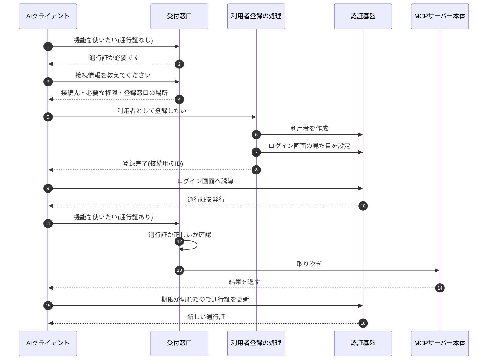
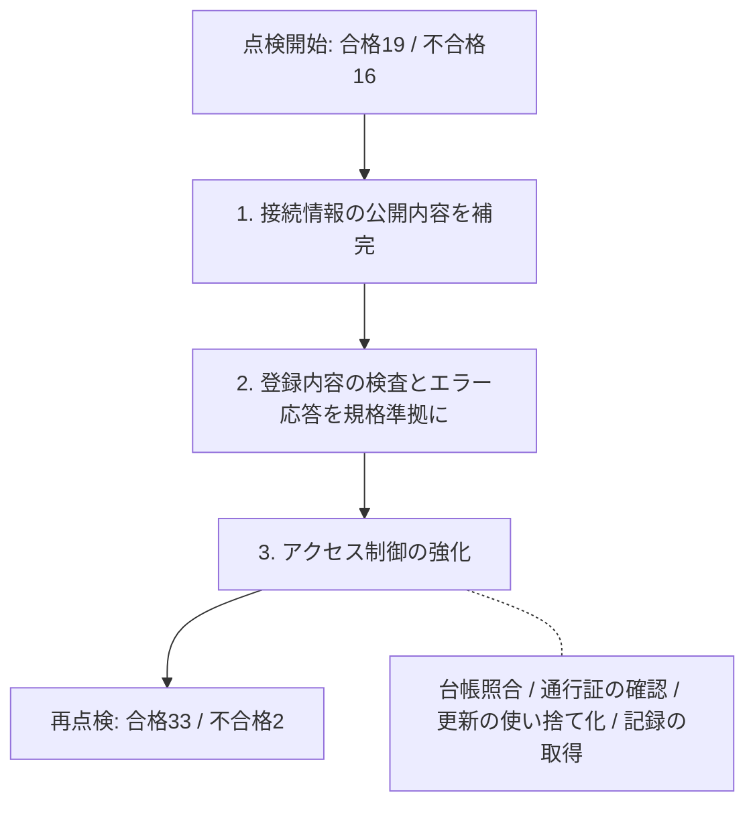
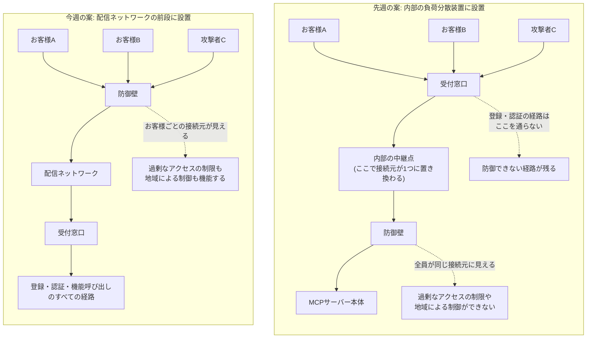
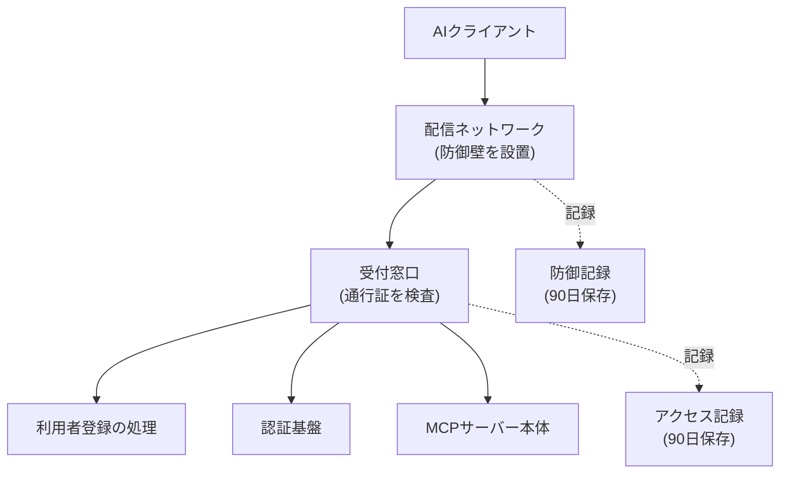
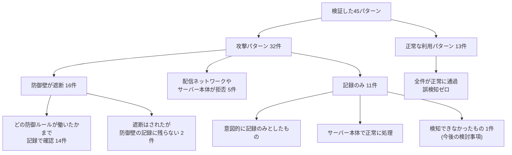

# 今週の検証レポート(クライアント向け): 利用者登録の仕組みと不正アクセス防御

> この章で分かること
> 今週は、MCPサーバーを商用サービスとして安全に運用するための2つの柱を検証しました。1つは「利用者となるAIクライアントが自動で接続情報を受け取る仕組み」が国際標準に沿っているかの点検、もう1つは「不正アクセスを入口で遮断する防御壁」の設計と実機確認です。あわせて、防御壁を置く場所として検討していた大きな構成変更について、実施しないという判断に至った経緯をご報告します。

作成日: 2026-09-14

---

## 用語解説

| 用語 | 説明 |
|---|---|
| MCPサーバー | AIアシスタントに対して、金融情報の検索などの機能を提供するサーバーです。AIが外部の機能を使うための共通規格(MCP)に沿っています |
| 利用者登録(DCR) | AIクライアント(Claude等)が、人手を介さずに自動で接続情報を受け取る仕組みです。国際標準(RFC 7591)として定められています。不特定多数のお客様が接続する外販サービスでは、手作業での事前登録は現実的でないため必要になります |
| 不正アクセス防御(WAF) | サーバーの入口に置く防御壁です。不正な命令を含むリクエストを、サーバーに届く前に遮断します |
| 認証基盤 | 利用者が誰であるかを確認し、アクセス用の通行証(トークン)を発行する仕組みです |
| 受付窓口 | 外部からのリクエストを最初に受け取り、通行証を検査してから内部へ取り次ぐ入口です |
| 配信ネットワーク | 世界各地の拠点からリクエストを受け取り、内部のサーバーへ中継する仕組みです。防御壁を設置する場所としても使われます |

---

## TL;DR

| # | 項目 | 結論 |
|---|---|---|
| 1 | 利用者登録は国際標準に沿っているか | 今週の点検開始時点では、**標準を満たしていない箇所が16件**ありました。修正を適用し、**2件まで減らしました**。残る2件は、規格上は違反ではない推奨項目と、今回の対応範囲外とした管理機能です |
| 2 | お客様が接続できない恐れがあった不具合 | **3件見つかり、すべて修正しました**。放置していれば、ログイン画面が表示されない、接続から1時間後に切断される、といった形でお客様の利用に直接影響していた可能性があります |
| 3 | 防御壁をどこに置くべきか | **配信ネットワークの前段**に置くべきと結論づけました。先週報告した「内部の負荷分散装置に設置する案」では、**すべての利用者が同一の接続元として見えてしまい**、過剰なアクセスの制限などが機能しないことが判明したためです |
| 4 | 防御壁は正常な利用を妨げないか | 妨げませんでした。32種類の攻撃パターンのうち**16件を防御壁が遮断**し、さらに5件は配信ネットワークやサーバー自身が拒否しました。**正常な利用パターン13件はすべて通過**しています。ただしこの状態に至るまでに、日本語の長文が誤って遮断される問題などの調整が必要でした |
| 5 | 大きな構成変更は必要か | **不要と判断しました**。変更の目的としていた4つのうち3つは、今週の構成で達成できています。残る1つも規格上の必須要件ではなく、必要になった場合は小規模な追加で対応できる見込みです |
| 6 | 継続的な品質管理の仕組み | 満たすべき要件を一覧化し、自動テストの結果を自動で反映する**チェックリストを新設**しました。設定変更時や定期的に再点検でき、確認漏れを防ぎます |

---

## 1. 利用者登録の仕組みの点検

### 1.1 点検の進め方

先週までに利用者登録の仕組みは実装済みでしたが、動作確認は限られた経路でしか行っていませんでした。今週は「国際標準に本当に沿っているか」を判定するため、**特定のAIクライアントの挙動に依存しない、標準に忠実な検査プログラム**を新たに作成しました。

進め方として重要な点は、**修正を加える前に一度検査を実行し、失敗した状態を記録に残した**ことです。これにより「なぜその修正が必要だったのか」を後から客観的に示せます。

検査の対象となる「お客様のAIクライアントが接続してくるまでの流れ」は次のとおりです。

**図の解説**: お客様は事前の申請なしに接続を始め、「通行証が必要」という応答をきっかけに接続情報を辿り、自分で利用者登録を行ってから通行証を受け取ります。この流れは1箇所でも標準から外れると接続が成立しません。今週修正した3件の重大な不具合は、それぞれ「ログイン画面の見た目の設定(7番目)」「接続情報に必要な権限が載っていない(4番目)」「通行証の更新の通知形式(2番目)」にあたり、いずれも**お客様が接続できない、または1時間後に切断される**箇所でした。

### 1.2 見つかった問題

自動点検では**16件の項目が標準を満たしていませんでした**。あわせて、規格と実装を突き合わせる目視の点検でも問題が見つかりました。影響の大きい順に整理します。

**お客様が接続できない恐れがあったもの**

| 内容 | 想定される影響 | 発見方法 |
|---|---|---|
| 自動登録されたクライアント用のログイン画面が準備されない | お客様が接続しようとしても**ログイン画面が表示されない** | 規格と実装の突き合わせ |
| 通行証の期限切れを、規格と異なる形式で通知していた | AIクライアントが通行証の更新を行わず、**接続から約1時間後に利用できなくなる** | 規格と実装の突き合わせ |
| アクセスに必要な権限の種類を、接続情報として公開していなかった | AIクライアントが必要な権限を要求できず、**接続後の機能呼び出しが拒否される** | 自動点検 |

**セキュリティ上の問題**

管理台帳に登録されていないクライアントを許可してしまう設定、通行証が自分宛に発行されたものかの確認漏れ、通行証更新時の使い捨て化の未実施、そして**受付窓口のアクセス記録が一切残っていない**という監査上の問題がありました。いずれも目視の点検で見つかったものです。

**規格への適合(自動点検の16件の大半)**

不正な登録内容を受け取ったときに、本来は「入力が誤っている」と返すべきところを、**「サーバー内部エラー」として返していました**(3つのケースで実際に確認)。また、受け付けるべきでない登録内容をそのまま受理していた箇所や、接続情報として公開すべき項目の欠落もありました。

### 1.3 修正と結果

**図の解説**: 修正は3段階で行いました。まず公開する接続情報の不足を補い、次に登録時の入力検査とエラー応答を規格に沿わせ、最後にアクセス制御と記録の取得を強化しました。再点検の結果、判定対象35項目のうち33項目が合格しました。残る2項目は、規格上は違反にあたらない推奨項目(§3で詳述)と、今回の対応範囲外とした管理機能です。

技術的な成果として、当初は「大きな構成変更をしなければ解決できない」と見込んでいた通行証の期限切れ通知の問題を、**現在の構成のまま解決できた**ことを申し添えます。

### 1.4 次回の確認事項

Claudeから実際に自動登録を行う一連の確認は、ブラウザ操作を伴うため今週は未実施です。今回の修正が実際の接続で効いているかは、この確認をもって最終的に確定します。

---

## 2. 不正アクセス防御の設計と実機確認

### 2.1 先週の報告を修正する発見

先週は内部の負荷分散装置に防御壁を設置し、代表的な攻撃が遮断されることを確認して「この方式で対応可能」とご報告しました。今週、同じ構成で防御壁の記録を詳細に観測したところ、**この方式は恒久的な設計としては不十分**であることが判明しました。

| 観点 | 内部の負荷分散装置に設置 | 配信ネットワークの前段に設置 |
|---|---|---|
| 防御壁から見える接続元 | **すべての利用者が同一の内部アドレスに見える** | **実際の利用者ごとのアドレスが見える** |
| 過剰なアクセスの制限、国・地域による制御 | 機能しない | 機能する |
| 防御できる範囲 | 機能呼び出しの経路のみ | **登録・認証を含むすべての経路** |
| 検査できるデータ量 | 8KBまで(固定) | 16KBまで(64KBへ拡張可能) |

なぜ接続元が分からなくなるのかを図で示します。

**図の解説**: 先週の案では、リクエストが防御壁に届く前に社内ネットワークの中継点を経由するため、そこで接続元の情報が中継点自身のものに置き換わってしまいます。結果として防御壁からはすべての利用者が同一人物に見え、「特定の利用者だけアクセスが多すぎる」といった判断ができません。さらに登録・認証の経路はそもそもこの防御壁を通らないため、無防備なまま残ります。今週の案ではすべてのリクエストが最初に防御壁を通るため、どちらの問題も解消します。

不正な命令の検査に限れば先週の結論は正しいのですが、過剰なアクセスの制限まで含めた恒久設計としては成立しません。**この点を早期に発見できたことが、今週の最大の成果です。**

### 2.2 構築した構成

**図の解説**: AIクライアントからのすべてのリクエストが、まず配信ネットワークに設置した防御壁を通過します。登録・認証・機能呼び出しのいずれの経路も同じ入口を通るため、従来は防御できなかった経路も検査対象になりました。防御壁とその後段の受付窓口は、それぞれ記録を90日間保存します。

### 2.3 防御の実機確認

まず**すべての防御ルールを「記録のみ」の状態で運用して観測**し、正常な利用を妨げないことを確認してから遮断を有効にしました。検証した45パターンの内訳と結果は次のとおりです。

| 区分 | 件数 | 結果 |
|---|---|---|
| 攻撃パターン(防御壁が遮断) | 16 | 遮断。うち14件はどの防御ルールが働いたかまで記録で確認 |
| 攻撃パターン(配信ネットワークやサーバーが拒否) | 5 | 防御壁に届く前、または本体側で拒否 |
| 攻撃パターン(記録のみ) | 11 | 意図的に記録のみとしたもの、本体側で正常に処理されるもの |
| 正常な利用パターン | 13 | **すべて通過(誤検知ゼロ)** |

**図の解説**: 攻撃32件のうち16件を防御壁が直接遮断し、うち14件は「どのルールが働いたか」まで記録で裏付けが取れました。2件は遮断されるものの防御壁の記録に残らないため、別の記録で確認する必要があります。「記録のみ」の11件には、誤って正常な利用を妨げないよう意図的に記録だけにしたもの、サーバー本体で正しく処理されるもの、そして**検知できなかった1件**(§2.4)が含まれます。最も重要なのは、日本語の長文や記号を多く含む検索など、誤って遮断されやすいパターンを意図的に含めた正常系13件が、すべて問題なく通過したことです。

遮断できた攻撃の種類は、不正なスクリプトの埋め込み、データベースへの不正な命令、既知の重大な脆弱性を狙う攻撃、サーバー内部のファイルや認証情報を盗み出そうとする試み、不正な通信ツールからのアクセス、極端に大きなデータの送信、一度に大量の命令をまとめて送る手法、認証窓口への連続攻撃などです。

**遮断を有効にする前に必要だった調整**は、そのまま本番運用の教訓になります。

| 調整 | 理由 |
|---|---|
| 検査するデータ量の上限を引き上げ | **日本語は英語の3倍の容量を使う**ため、日本語の長文を含む正常な検索が上限を超え、誤って遮断されていました |
| 3つの防御ルールを「記録のみ」に変更 | 長文の検索語、記事のURLを含む正常な検索、利用ソフト名を送らないクライアントが、いずれも遮断されるためです |
| クラウド経由のアクセスを遮断しない設定 | AIクライアントはクラウド上から接続するため、この防御を有効にすると**正規のお客様を遮断してしまいます** |

これらの例外はすべて、理由と再判断の期限を記した台帳に記録しています。**いきなり遮断を有効にしていれば、正常な利用を妨げていた**項目です。

### 2.4 今後の検討が必要な発見

1つ、防御壁で検知できない攻撃手法が見つかりました。特定の符号化を施した不正なデータを送信内容に埋め込むと、標準の防御ルールでは検知されません。追加の防御ルールを設けるか、影響の小ささを踏まえて許容するかを、本番適用前に判断します。

---

## 3. 大きな構成変更の要否: 実施しないと判断

今週の最重点として、防御壁を設置するために受付窓口の方式を大きく変更すべきかを判断しました。

### 3.1 変更の目的と現在の状況

| # | 変更の目的 | 状況 |
|---|---|---|
| 1 | すべての経路を防御対象にする | 今週の構成で**達成済み** |
| 2 | 実際の利用者ごとのアドレスで制御する | 今週の構成で**達成済み** |
| 3 | 接続に必要な情報を、規格が推奨する形で通知する | 今週の構成では**実現できないことが確定** |
| 4 | お客様ごとの利用量制限、閉域網への対応 | 防御壁の機能で部分的に代替。閉域網は将来課題 |

### 3.2 判断の根拠

3番目の項目について、現在の構成で実現できないかを実機で検証した結果、**技術的な制約により実現できない**ことが確定しました。

ただし重要な点として、**この項目は規格上の必須要件ではありません**。最新の規格では2つの方式のいずれかを満たせばよいとされており、今週もう一方の方式を追加実装したため、**規格には適合しています**。AIクライアント側も、もう一方の方式を正式な代替手段として文書化しています。

一方で、この項目を実装すれば接続の確実性は高まります。したがって「必須ではないが、信頼性を高める推奨項目」と位置づけ、**大きな構成変更(5〜7人日)は実施しない**と判断しました。必要になった場合は、より小規模な方法(1〜2人日)で追加できる見込みです。閉域網やお客様ごとの利用量制限が要件として確定した段階で、改めて評価します。

---

## 4. 継続的な品質管理の仕組み

「単発の確認で終わらせず、抜け漏れを継続的に点検したい」とのご要望を踏まえ、チェックリストを新設しました。

満たすべき要件それぞれに固定の番号を与え、自動テストの結果と1対1で対応させています。テストを実行すると結果が記録として保存され、チェックリストの「状態」「最終実施日」「証跡」の3項目が自動で更新されます。設定変更時、毎月、四半期ごと、そして規格の新版が出たときに再点検する運用とします。

今週時点の状態は次のとおりです。

| 区分 | 合格 | 不合格 | 確認中 | 未着手 |
|---|---|---|---|---|
| 不正アクセス防御 | 10 | 1 | 3 | 12 |
| 利用者登録の仕組み | 24 | 2 | 5 | 13 |
| アクセス制御 | 2 | 0 | 0 | 4 |
| 運用面 | 2 | 1 | 2 | 5 |

---

## 5. 商用サービスとしての運用調査

クラウド事業者が提供する同種のマネージドサービスや公式の参照構成を調査し、商用運用に必要な要件を整理しました。主な持ち帰りは次の3点です。

- クラウド事業者自身のマネージドサービスは、**接続に必要な情報の通知を標準装備**しています。§3で「推奨項目」と位置づけた機能にあたり、商用サービスとしても将来的に揃えるべき項目と判断しました。
- クラウド事業者の公式参照構成は、**今週構築した構成とほぼ同じ形**でした。防御壁に過剰アクセスの制限を含める点、サーバーを外部から直接到達できない位置に置く点も一致しています。
- AIクライアントの提供元は、**接続数が多いサービスでは自動登録以外の方式を推奨**しています。自動登録は接続のたびに登録が増えるためです。今週実装した登録数の上限と整理の仕組みはこの対策にあたり、一般公開する段階での方式選択を早めに判断する必要があります。

金融機関向けの安全対策基準については、クラウド事業者が最新版に対応した参照資料を公開していることを確認しました。条文単位の対応づけは次回以降に行います。

---

## 6. 今後の対応事項

| # | 対応事項 | 内容 |
|---|---|---|
| 1 | AIクライアントからの自動登録の実地確認 | ブラウザ操作を伴うため、実施者の確保が必要です。今週の修正が実際の接続で効いているかを最終確認します |
| 2 | 防御記録の改ざん防止保存と監視の整備 | 金融機関向けの要件として、記録を後から変更できない形で長期保存し、異常時に通知する仕組みを整えます |
| 3 | 正式なドメイン名の導入 | 現在は検証用のアドレスで確認しています。正式なドメインが決まり次第、接続情報を揃え、あわせて内部への直接アクセスを遮断します |
| 4 | 本番環境向け設定の準備 | 本番環境は書き込みを行わない方針のため、設定の記述と検証までを行い、適用可否は別途ご判断いただきます |
| 5 | 検知できない攻撃手法(§2.4)の扱いの決定 | 追加の防御ルールを設けるか、影響の小ささを踏まえて許容するかを判断します |
