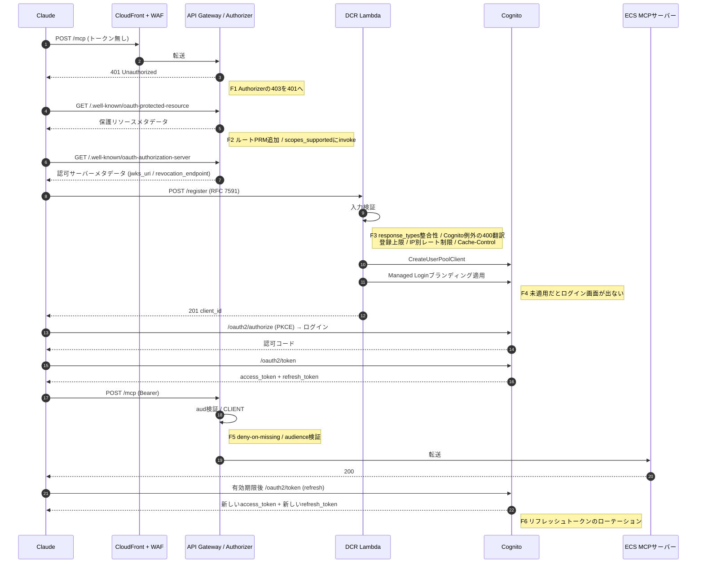
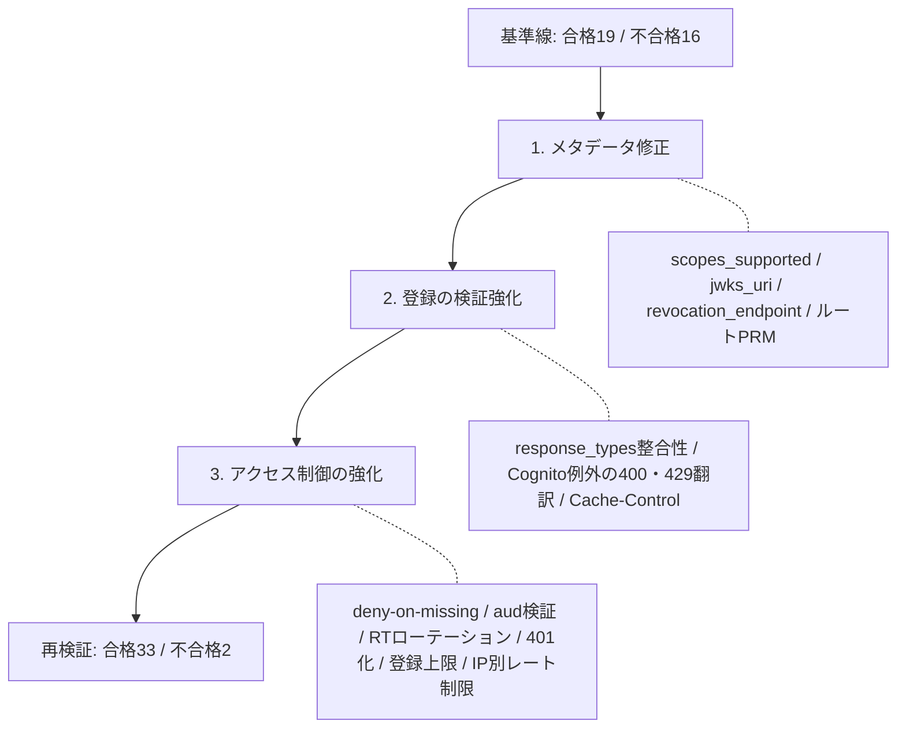
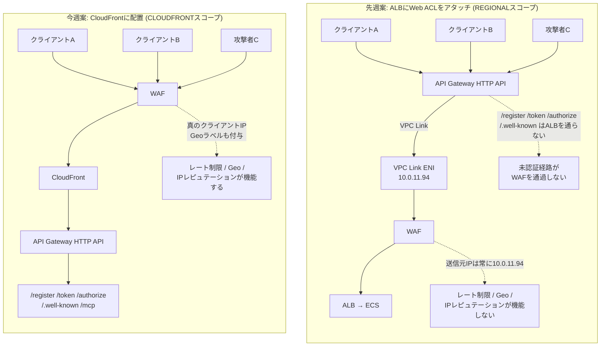
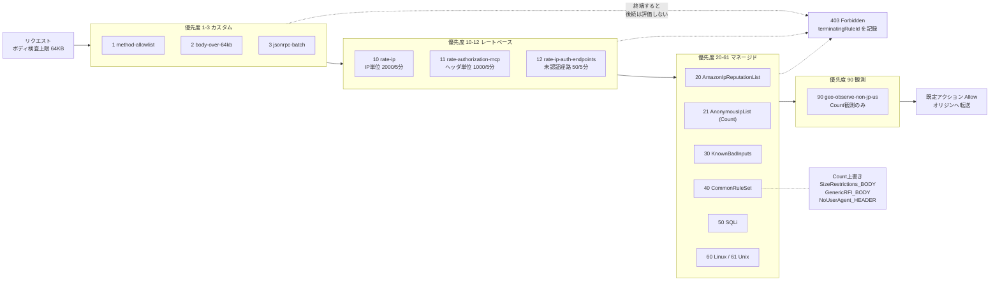
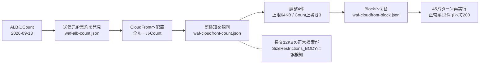
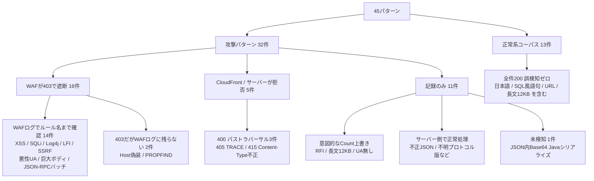
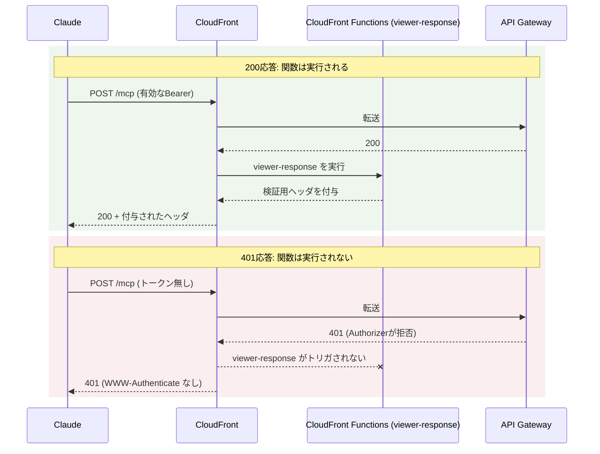
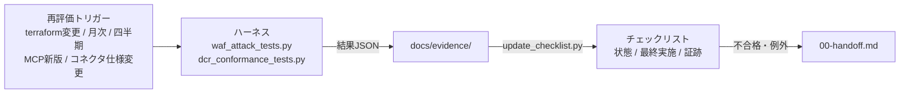

# 今週の検証レポート(Week 5): DCRのRFC準拠性とWAFの本番運用化

> この章で分かること
> 今週はECS(API Gateway)構成を本番運用に載せるための2本柱、DCR(動的クライアント登録)とWAFを検証した。DCRは修正前の基準線を取ってからRFC 7591・8414・9728・MCP認可仕様への準拠性を測り、不合格16件を2件まで減らした。WAFはCloudFrontの前段配置を実機構築してBlockモードで45パターンを実行し、全ルート保護と真のクライアントIPでの評価を確認した。あわせて、今週の最重点だった「REST API移行の採否」を判断し、移行しない結論に至った経緯をまとめる。

作成日: 2026-09-14 | 検証方法: 実機検証(playgroundアカウント883660531246)および公式仕様・AWS公式ドキュメントの机上調査。本番相当アカウント(620369151795)への書き込みなし。

**前提**: 本番アーキテクチャはECS + API Gateway(pattern4)で確定しており、AgentCore Runtimeは検証対象外([00-handoff.md §16.1](./00-handoff.md))。本レポートのすべての検証はECS構成のみを対象とする。

---

## 用語解説

| 用語 | 説明 |
|---|---|
| DCR(動的クライアント登録) | Dynamic Client Registration。RFC 7591。AIクライアントが人手を介さず自動でOAuthクライアントを登録する仕組み。RFC 7592は登録済みクライアントの管理(更新・削除)エンドポイントを定める |
| RFC 8414 / RFC 9728 | それぞれ認可サーバーメタデータ(`.well-known/oauth-authorization-server`)、保護リソースメタデータ(`.well-known/oauth-protected-resource`)を定めるOAuth拡張仕様。クライアントがトークン発行元や必要スコープを自動発見するために使う |
| `scopes_supported` | 認可サーバーメタデータのフィールド。認可サーバーが発行できるスコープの一覧を広告する。ここに`invoke`が無いとクライアントが必要なスコープを要求できない |
| `WWW-Authenticate` | 401応答に付与するヘッダ。`resource_metadata`(RFC 9728のURLを指す)や`scope`を含められ、クライアントに次に何をすべきかを伝える。MCP仕様ではwell-known URI提供との択一MUST |
| WAF(Web Application Firewall) | リクエストの内容を検査し、攻撃パターンに一致すれば遮断するサービス。AWS WAFv2にはALB等に付ける**REGIONALスコープ**とCloudFrontに付ける**CLOUDFRONTスコープ**(us-east-1固定)がある |
| Web ACL | WAFのルールをまとめた設定単位。優先度順に評価され、いずれかのルールで終端(Block/Allow確定)すると後続は評価されない |
| CommonRuleSet / KnownBadInputsRuleSet / SQLiRuleSet | AWSマネージドルールグループ。それぞれXSS等の汎用攻撃、Log4Shell等の既知の攻撃シグネチャ、SQLインジェクションを検知する |
| `terminatingRuleId` | WAFログのフィールド。どのルールがリクエストを最終的に処理(Block/Allow確定)したかを示す。攻撃を遮断したルールを特定する主な手がかり |
| VPC Link / ENI | API GatewayがVPC内のALB等にリクエストを転送する際に経由する接続(VPC Link)と、その実体であるネットワークインターフェース(ENI)。ALBの前にWAFを置くと、WAFが見る送信元IPはこのENIのプライベートIPに集約される |
| ALB(Application Load Balancer) | VPC内でリクエストをECS等に振り分けるロードバランサ |
| Cognito | AWSのマネージドID基盤。ユーザープール(認証)とApp Client(OAuthクライアント登録)を提供する |
| Managed Login | Cognitoが提供するホスト型ログイン画面(Hosted UI)のブランディング機能。DCRで作成したApp Clientには自動適用されない場合があり、未適用だとログイン画面が表示されない |
| `ExplicitAuthFlows` / `ALLOW_REFRESH_TOKEN_AUTH` | Cognito App Clientの認証フロー許可設定。リフレッシュトークンローテーションと`ALLOW_REFRESH_TOKEN_AUTH`は併用不可のため、認可コードフロー経由のリフレッシュでは`ExplicitAuthFlows`自体を外す必要がある |
| CloudFront Functions / Lambda@Edge | CloudFrontのエッジで実行するコード。前者は軽量だがオリジンのエラー応答時は実行されない制約があり、後者はオリジンのエラー応答でも実行できる(origin-response) |
| Lambda Authorizer | API GatewayでBearerトークンを検証するLambda関数(本レポートではREQUEST型)。拒否時の応答コード(401/403)をコードで制御できる |
| CIMD | Client ID Metadata Document。DCRの代替として、URL形式のクライアント識別情報を使う登録不要の接続方式([21-internal-commercial-remote-mcp-operations-research.md](./21-internal-commercial-remote-mcp-operations-research.md)) |
| FISC | 金融機関等コンピュータシステムの安全対策基準。日本の金融機関向けセキュリティ基準 |

---

## TL;DR

| # | 論点 | 結論 |
|---|---|---|
| 1 | DCRは「本来のDCR対応」と言えるか | **修正前は言えなかった**。準拠性テストで不合格16件。特にCognitoの400が`server_error`の500に化ける、`response_types`の整合性を検証していない、`scopes_supported`に必須スコープが無い、リフレッシュトークンを回さない、といった欠陥があった。最小スコープの修正を適用し**合格19→33、不合格16→2**まで改善した(§1) |
| 2 | Claudeが接続できない可能性があった欠陥 | 3件見つかった。(a) DCRで作ったクライアントにManaged Loginのブランディングが割り当てられず**ログイン画面が出ない恐れ**、(b) 期限切れトークンに403を返しており**Claudeがリフレッシュしない**、(c) Authorizerが要求するスコープをメタデータで広告していない。いずれも修正済み(§1.2) |
| 3 | WAFはどこに置くべきか | **CloudFrontの前段**。先週の「ALBにアタッチすれば対応可能」という結論は**恒久設計としては不十分**だった。ALB配下ではWAFが見る送信元IPがVPC Link ENIの単一プライベートIPに集約され、レート制限・Geo・IPレピュテーションが機能しない。CloudFront構成では真のクライアントIPで評価でき、未認証経路(`/register`・`/token`)も保護できる(§2.1、§2.2) |
| 4 | WAFのBlockモードは正常系を壊さないか | 壊さなかった。攻撃パターン32件のうち**16件をWAFが403で遮断**(うち14件はWAFログでルール名まで確認)、5件をCloudFrontまたはサーバーが400/405/415で拒否した。**正常系コーパス13件は全件通過(誤検知ゼロ)**。ただしそこに至るまでに、ボディ検査上限の引き上げと2つのルールのCount上書きが必要だった(§2.3) |
| 5 | REST API v1へ移行すべきか | **移行しない**。移行の動機4つのうち3つはCloudFront + WAFで達成済み。残る`WWW-Authenticate`付与はCloudFront Functionsでは実現できないことが確定したが、MCP 2026-07-28ではwell-known提供との択一MUSTのため仕様違反ではない。必要ならLambda@Edge(1〜2日)で追加でき、REST移行(5〜7日)を正当化できない(§3) |
| 6 | 継続的な運用チェックの仕組み | WAF・DCR・Authorizer・運用を固定IDで管理する[20-internal-production-readiness-checklist.md](./20-internal-production-readiness-checklist.md)を新設した。自動テストの結果IDと1対1で対応させ、状態列だけを更新して再評価できる。今週の実行結果はすべて`docs/evidence/`のJSONに保存し、証跡列から参照している(§4) |
| 7 | 来週へのアクションプラン | Claude Code / Claude.aiからの自己登録E2E、WAFログの改ざん防止保全と監視、カスタムドメイン導入が主要項目(§6) |

---

## 1. DCR(動的クライアント登録)のRFC準拠性検証

### 1.1 検証の考え方: 修正前の基準線を先に取る

先週までのDCR実装は、[10-internal-dcr-implementation.md](./10-internal-dcr-implementation.md)のとおり`client_credentials`経路でしか動作確認していなかった。今週は「本来のDCR対応と言えるか」を判定するため、Claudeの内部挙動に依存しない**標準準拠の独立クライアント**を新規に作成した(`scripts/dcr_conformance_tests.py`)。

このスクリプトはRFC 7591(登録)・RFC 7592(管理)・RFC 8414(認可サーバーメタデータ)・RFC 9728(保護リソースメタデータ)・MCP認可仕様の各要件を、[20-internal-production-readiness-checklist.md](./20-internal-production-readiness-checklist.md)の固定ID(`7591-01`等)に対応させて検査し、結果をJSONで出力する。

重要な進め方として、**修正を加える前に一度実行して失敗を証跡化した**。これにより「なぜその修正が必要か」を後から説明できる一次資料になる。

検証対象となるDCR経由の接続フロー全体と、今週適用した修正(F1〜F6)の位置は次のとおりである。

**図の解説**: Claudeは事前登録なしに接続を開始し、401を起点にメタデータを辿り、`/register`で自らクライアントを作ってから認可コードフローに入る。この一連の流れのどこか一箇所でも仕様から外れると接続は成立しない。今週の修正はF1(401化)・F2(メタデータ補完)・F3(登録の入力検証とエラー翻訳)・F4(ブランディング自動適用)・F5(Authorizerのアクセス制御)・F6(リフレッシュトークンのローテーション)の6箇所に分布しており、このうちF1・F2・F4は**欠けているとClaudeが接続できない、または1時間後に切断される**箇所である。

### 1.2 基準線で判明した欠陥

自動テストで不合格になったのは16件(`9728-03/04/05/06`、`8414-03/04/08/10`、`7591-05/06/07/09a/09b/09d/10`、`7592-01`)で、いずれもメタデータの欠落と登録エンドポイントの仕様適合に関するものである。セキュリティ項目と、Claudeの接続を壊しうる項目の一部は、**規格・AWS公式ドキュメントとコードを突き合わせる目視の点検**で別途見つかった。両方をまとめて分類すると次のようになる。

| 分類 | 内容 |
|---|---|
| 相互運用性(Claudeが接続できない恐れ) | DCRで作成したクライアントにManaged Loginのブランディングが割り当てられず**ログイン画面が表示されない恐れ**(Cognito API仕様: `CreateUserPoolClient`で作ったクライアントはスタイル適用まで Hosted UI を利用できない)。期限切れトークンに**403**を返しており、401でしかリフレッシュしないClaudeが接続を落とす。Authorizerが必須とする`invoke`スコープをメタデータの`scopes_supported`で広告していない |
| セキュリティ | `CLIENT#`レコードが存在しないクライアントを**許可**していた(ブラックリスト設計)。トークンのaudienceを検証していない。公開クライアントのリフレッシュトークンを回していない。API Gatewayのアクセスログが無く監査証跡がゼロ |
| 仕様適合 | **Cognitoの400エラーが`server_error`の500に化ける**(フラグメント付き`redirect_uri`、101件の`redirect_uris`、`client_credentials` + `none`の3ケースで実測)。`response_types: ["token"]`をそのまま受理していた。`Cache-Control: no-store`が無い。`client_secret_expires_at`をsecret未発行でも返していた。RFC 7592の管理エンドポイントが存在しない |

### 1.3 適用した修正と結果

**図の解説**: 修正は3段階で適用した。メタデータの不足を埋め、登録エンドポイントの入力検証とエラー翻訳を強化し、最後にAuthorizerとアクセス制御を固めた。再検証の結果、合否判定のある35項目のうち33件が合格した。残る不合格2件は`WWW-Authenticate`ヘッダ(§3で扱う)とRFC 7592の管理エンドポイント(来週以降)である。

特筆すべき成果が1つある。HTTP APIのLambda Authorizerは拒否時に403を返す仕様で、これがClaudeのトークンリフレッシュを妨げる問題だった。当初はREST API移行でしか解決できないと見込んでいたが、**Authorizerで例外を投げる方式にするとAPI Gatewayが401を返す**ことを実機で確認し、HTTP APIのまま解消できた。

実装上の詰まりも記録しておく。リフレッシュトークンのローテーションを有効にすると、Cognitoが`ExplicitAuthFlows`の`ALLOW_REFRESH_TOKEN_AUTH`との併用を拒否する。認可コードフローのリフレッシュは`/oauth2/token`経由で行われるため、`ExplicitAuthFlows`を外して解消した。

### 1.4 未実施

Claude Code / Claude.aiからの**実際の自己登録E2Eは今週も未実施**である。Cognito Managed Loginがブラウザ操作を前提とするため、人手での実施が必要になる。上記の修正がClaudeの実接続で効いているか(特にブランディングとスコープ選択)は、この確認をもって初めて確定する。

---

## 2. WAF対応: CloudFront前段配置の実機検証

### 2.1 先週の結論を修正すべき発見

先週([18-internal-weekly-verification-report-week4.md §2](./18-internal-weekly-verification-report-week4.md))はALBに一時的なWeb ACLをアタッチし、XSSとSQLiが遮断されることを確認して「ALBにアタッチすれば対応可能」と結論づけた。今週、同じALB構成にCountモードのWeb ACLを付けてWAFログを詳細に観測したところ、**この結論は恒久設計としては不十分**であることが分かった。

| 観点 | ALBにアタッチ | CloudFrontに配置 |
|---|---|---|
| WAFが見る送信元IP | **VPC Link ENIのプライベートIP(10.0.11.94)に集約**。真のIPは`forwarded`ヘッダにしか無い | **真のクライアントIP**。Geoラベル(`awswaf:clientip:geo:country:JP`)も正しく付与される |
| IPベースのレート制限・Geo・IPレピュテーション | 全クライアントを同一IPとして扱うため機能しない | 機能する |
| 保護できるルート | `/mcp`のみ(`/register`・`/token`・`/authorize`・`/.well-known`はALBを通らない) | **全ルート** |
| ボディ検査上限 | 8KB固定 | 既定16KB、64KBまで引き上げ可能 |

ボディ検査(XSS・SQLi)に限れば先週の結論は正しい。しかしIP系ルールを含む恒久設計としてはALBアタッチでは成立しない。なぜIPが集約されるかを図で示す。

**図の解説**: ALB案ではリクエストがAPI GatewayのVPC Linkを経由してVPCに入るため、WAFに届く時点で送信元はVPC Link ENIの単一プライベートIPに置き換わっている。真のIPは`forwarded`ヘッダの中にしか残らず、WAFのIP系ルールは全クライアントを同一送信元として扱う。加えて、`/register`・`/token`・`/authorize`・`/.well-known`はALBを経由しないため、そもそもWAFの評価対象にならない。CloudFront案では全リクエストがWAFを最初に通過するため、真のクライアントIPで評価でき、未認証で到達できる経路も保護対象に入る。実測でも、WAFログの`clientIp`は検証端末のグローバルIPv6アドレスとして記録され、`country: JP`が正しく付与されている([2026-09-14-waf-cloudfront-block.json](./evidence/2026-09-14-waf-cloudfront-block.json))。

### 2.2 構築した構成

**図の解説**: 現行のAPI Gateway HTTP APIをオリジンとするCloudFrontディストリビューションを前段に置き、CLOUDFRONTスコープのWeb ACL(us-east-1)をアタッチした。全ルートがこの経路を通るため、未認証で到達できる`/register`・`/token`・`/authorize`・`/.well-known`も検査対象になる。CloudFrontはオリジンへ秘密ヘッダ`X-Origin-Verify`を付与し、Lambda Authorizerがその有無を記録する(強制はカスタムドメイン移行と同時に行うため現在は観測のみ)。ALBは残したままで、WAFはアタッチしていない。API GatewayのLambda Authorizerには今週、audience検証・deny-on-missing・401化を追加した。

WAFのルール構成は、マネージド7グループ(CommonRuleSet、SQLi、KnownBadInputs、Linux、Unix、AmazonIpReputationList、AnonymousIpList)に加えて、カスタム3ルール(許可メソッド外、ボディ64KB超、JSON-RPCバッチ)とレートベース3ルール(IP単位、`Authorization`ヘッダ単位、未認証エンドポイント限定)、Geo観測ルールで構成した。評価はWeb ACL内の優先度順に行われ、いずれかのルールで終端すると後続は評価されない。

**図の解説**: カスタムルールとレートベースルールを低い優先度(先に評価)に置き、マネージドルールグループをその後に並べた。この順序には意図があり、ボディサイズやメソッドのような安価な判定を先に終端させることで、後続のシグネチャ検査に到達するリクエストを減らしている。Count設定の3箇所(AnonymousIpList全体、CommonRuleSet内の3ルール、Geo観測ルール)は遮断せずラベルとログだけを残すため、評価は必ず次の優先度へ進む。既定アクションはAllowで、どのルールにも終端されなかったリクエストのみオリジンへ到達する。

### 2.3 Blockモードの結果と、そこに至るまでの調整

全ルールをCountモードで観測してから、誤検知が無いことを確認してBlockへ切り替えた。この切り替え手順そのものが検証の要点である。

**図の解説**: 先週のALB構成にCountモードのWeb ACLを付けたところで送信元IPの集約が判明し、CloudFront前段へ配置し直した。CloudFrontでも即座にBlockにはせず、全ルールをCountで運用して正常系コーパスの発火を観測している。この段階で日本語長文を含む正常な検索が`SizeRestrictions_BODY`に発火することが分かり、4件の調整を経てからBlockへ切り替えた。各段階の結果は`docs/evidence/`のJSONに残している。

45パターンの内訳と結果は次のとおり。

**図の解説**: 攻撃32件のうちWAFが直接遮断したのは16件で、そのうち14件は`terminatingRuleId`まで突合できた。残る2件(Host偽装、PROPFIND)も403にはなるがWAFログに記録が残らず、検知の証跡はCloudFrontアクセスログ側で取る必要がある。「記録のみ」11件には、誤検知回避のために意図してCountにしたもの、サーバー側で正常に処理されるもの、そして**検知できなかった1件**(§2.4の`WAF-12`)が含まれる。最も重要なのは正常系13件が全件200で通過している点で、日本語長文・SQL風語句・URLを含む引数といった誤検知しやすいパターンを意図的に含めた上での結果である。

| 区分 | 件数 | 結果 |
|---|---|---|
| 攻撃パターン(WAFが遮断) | 16 | 403。うち14件はWAFログで`terminatingRuleId`まで確認 |
| 攻撃パターン(CloudFrontまたはサーバーが拒否) | 5 | URIトラバーサル3件が400、TRACEが405、`Content-Type`不正が415 |
| 攻撃パターン(記録のみ) | 11 | 意図的なCount上書き、サーバー側で処理されるもの、なりすましヘッダ検証(後述) |
| 正常系コーパス | 13 | **全件200(誤検知ゼロ)** |

遮断の証跡はWAFログと突合して取得している。各リクエストに`X-Waf-Test-Id`ヘッダを付与し、`scripts/waf_log_correlate.py`でWAFログの`terminatingRuleId`・ラベル・`clientIp`を紐づけた。

| 攻撃パターン | 遮断したルール |
|---|---|
| XSS(ボディ・クエリ) | `CommonRuleSet: CrossSiteScripting_BODY` / `_QUERYARGUMENTS` |
| SQLi(`/mcp`・`/register`の両方) | `SQLiRuleSet: SQLi_BODY` |
| Log4j / JNDI(ボディ・ヘッダ・クエリ) | `KnownBadInputsRuleSet: Log4JRCE_BODY` / `_HEADER` / `_QUERYSTRING` |
| ローカルファイル参照・EC2メタデータSSRF | `CommonRuleSet: GenericLFI_BODY` / `EC2MetaDataSSRF_BODY` |
| 悪性User-Agent・Host偽装・PROPFIND | `CommonRuleSet: UserAgent_BadBots_HEADER`、`KnownBadInputsRuleSet: Host_localhost_HEADER` / `PROPFIND_METHOD` |
| 巨大ボディ(70KB・200KB) | カスタムルール`body-over-64kb` |
| JSON-RPCバッチ(50件) | カスタムルール`jsonrpc-batch` |
| `/token`への連打 | レートベースルール`rate-ip-auth-endpoints` |

Blockへ切り替える前に、次の調整が必要だった。これらは**Count運用を挟まなければ本番で正常利用を遮断していた**項目である。

| 調整 | 理由 |
|---|---|
| ボディ検査上限を16KB→64KBへ引き上げ | 日本語はUTF-8で1文字3バイトのため、12KB相当の長文引数が既定の16KBを超え、サイズ制約ルールに誤検知した。ALB(8KB固定)ではさらに顕著 |
| `CommonRuleSet: SizeRestrictions_BODY`をCountへ上書き | 同上。8KB超で発火するため長文引数を遮断する。遮断はカスタムルール(64KB超)が担う |
| `CommonRuleSet: GenericRFI_BODY`をCountへ上書き | ニュース検索・銘柄検索の引数に正当なURLが含まれうるため |
| `CommonRuleSet: NoUserAgent_HEADER`をCountへ上書き | MCPクライアントの実装によってはUser-Agentを送らないため。実測でもUser-Agent無しのリクエスト(A11a)は200で通過する |
| `AnonymousIpList: HostingProviderIPList`を恒久Countに設定 | Claude.ai等の正規クライアントはクラウド(Anthropic egress `160.79.104.0/21`)から発信するため、Blockにすると正規利用を遮断する |

これらの例外は[20-internal-production-readiness-checklist.md §4](./20-internal-production-readiness-checklist.md)の例外台帳に、理由と再判断の期限つきで記録した。

### 2.4 その他の発見

| # | 発見 | 対応 |
|---|---|---|
| 1 | **JSON文字列値に埋めたBase64のJavaシリアライズ列は`KnownBadInputsRuleSet`で検知されない**。BlockもCountもされず、ラベルすら付かない | JSONボディ内のBase64ペイロードは検知対象外とみなす。カスタムルールの費用対効果を本番適用前に判断する(チェックリスト`WAF-12`を不合格で登録) |
| 2 | CloudFrontはURIのパストラバーサルとTRACEメソッドを**WAF評価前に自身で400/405拒否**する | 防御は成立するがWAFログには残らない。検知の証跡はCloudFrontアクセスログ側で取る必要がある |
| 3 | レートベースルールは閾値到達の反映に遅延があり、短時間のバーストでは発火しない | 機構の検証は閾値を一時的に10/60秒へ下げて実施し、`/token`への40リクエスト全件が遮断されることを確認した(検証後に実運用値へ復帰済み) |
| 4 | `/register`の連打は60回中55回が429。内訳はLambda内のIP別カウンタ(5/分)とAPI Gatewayのルートスロットル | WAFのレートベースルールに到達する前に多層で止まっている。WAF側は保険として維持する |

---

## 3. REST API v1移行の採否: 移行しないと判断

今週の最重点として、「WAFをAPI Gatewayに直接アタッチするためにREST API v1へ移行すべきか」を判断した。

### 3.1 移行の動機と現在の状況

| # | 移行の動機 | 状況 |
|---|---|---|
| 1 | WAFを全ルートに効かせる | CloudFront + WAFで**達成済み**(§2.3) |
| 2 | 真のクライアントIPでIP系ルールを効かせる | CloudFront + WAFで**達成済み**(§2.1) |
| 3 | Gateway Responsesで401に`WWW-Authenticate`を付与する | **代替手段が無いことが確定**(§3.2) |
| 4 | Usage Planでテナント別スロットリング、閉域網(PRIVATEエンドポイント) | WAFのレートベースルール(`Authorization`集約キー)で部分的に代替。閉域網は将来課題 |

### 3.2 `WWW-Authenticate`付与の検証結果

CloudFront Functions(viewer-response)で401応答にヘッダを付与できるかを実測した。

| 対象 | 関数の実行 |
|---|---|
| 200応答 | **実行される**(検証用ヘッダが付与された) |
| 401応答 | **実行されない**(ヘッダが一切付与されない) |

関数単体のテスト実行では401のイベントに対して正しくヘッダを付与するため、コードの問題ではなく、**オリジンがエラーを返した応答ではviewer-response関数がトリガされない**というCloudFront側の制約である。

**図の解説**: 同じ関数・同じ設定のまま、オリジンの応答コードだけが異なる2ケースを実測した。200応答では関数が実行されて検証用ヘッダが付くのに対し、401応答では関数が一切実行されず、ヘッダも付かない。関数単体のテスト実行では401イベントに対して正しく動作するため、これはコードではなくCloudFrontの実行モデル側の制約である。したがって`WWW-Authenticate`をエッジで付与する手段としてCloudFront Functionsは使えず、オリジンのエラー応答でも実行されるLambda@Edge(origin-response)が次の候補になる。

### 3.3 判断

`WWW-Authenticate`を出す残りの選択肢は、REST API移行(5〜7日)、Lambda@Edge origin-response(1〜2日、オリジンのエラー応答でも実行される)、JWT検証のオリジン移設(2〜3日)の3つになる。

ここで重要なのは、**`WWW-Authenticate`の欠落は仕様違反ではない**という点である。MCP 2026-07-28では保護リソースメタデータの提供は「`WWW-Authenticate`**または**well-known URI」の択一MUSTであり、今週ルートのメタデータも追加したため、Claudeが行う2段階のプローブ(パス付き→ルート)の両方に応答できる。Anthropicもwell-knownプローブをフォールバックとして文書化している。

一方でAnthropicは`WWW-Authenticate`を「最も確実な経路」とし、`scope`パラメータでクライアントが要求するスコープを制御できる唯一の手段でもある。AgentCore Gatewayもこれを標準装備している([21-internal-commercial-remote-mcp-operations-research.md §2.2](./21-internal-commercial-remote-mcp-operations-research.md))。

したがって`WWW-Authenticate`は「相互運用性の信頼度を上げる推奨項目」と位置づけ、**REST API移行は行わない**。必要になった場合はLambda@Edgeを第一候補とする。REST移行は、閉域網やテナント別クォータが要件として確定した時点で再評価する。

---

## 4. 本番運用チェックリストの体系化

§16.10でユーザーから「単発の実機確認で終わらせず、抜け漏れの有無を継続的な観点として持つ」との指示があったため、[20-internal-production-readiness-checklist.md](./20-internal-production-readiness-checklist.md)を新設した。

**図の解説**: 各要件に固定ID(`WAF-01`、`7591-09`、`AUTHZ-01`、`OPS-01`等)を与え、自動テストの結果IDと1対1で対応させた。テストを実行すると証跡JSONが`docs/evidence/`に残り、転記スクリプトがチェックリストの状態・最終実施・証跡の3列だけを書き換える。要件・根拠・検証方法の列は仕様変更としてのみ更新する。不合格と例外は引き継ぎメモにも転記する。

今週時点の状態は次のとおり。DCR関連の「合格24」は準拠性テストの合格33とは母数が異なる(チェックリストにはコードレビューで確認する行や、E2E実施後でないと判定できない行も含むため)。

| 区分 | 合格 | 不合格 | 検証中・要確認 | 未着手 |
|---|---|---|---|---|
| WAF(`WAF-NN`) | 10 | 1 | 3 | 12 |
| DCR(仕様番号) | 24 | 2 | 5 | 13 |
| Authorizer(`AUTHZ-NN`) | 2 | 0 | 0 | 4 |
| 運用(`OPS-NN`) | 2 | 1 | 2 | 5 |

---

## 5. 商用リモートMCPサーバー運用の調査

AgentCore GatewayなどAWSのAIサービスを**ベストプラクティスの参考事例としてのみ**参照し、商用運用に必要な要件を整理した([21-internal-commercial-remote-mcp-operations-research.md](./21-internal-commercial-remote-mcp-operations-research.md))。AgentCore Runtimeを含むホスティング方式の再検討ではない。

主な持ち帰りは次の3点。

- **AgentCore GatewayはMCP入口で`WWW-Authenticate`(`resource_metadata`と`scope`)を標準装備している**。401(トークン無効)と403(`error="insufficient_scope"`、スコープ不足)を使い分ける。AWS自身のマネージドMCP入口が標準にしている以上、商用サービスとしても揃えるべき項目と判断し、チェックリスト`OPS-01`・`OPS-02`として登録した。
- **AWSの参照アーキテクチャ「Guidance for Deploying MCP Servers on AWS」はCloudFront(WAF付き)→ ALB → ECS Fargate + Cognito**であり、今週構築した構成と同型だった。WAFにレート制限を含める点、MCPサーバーをプライベートサブネットに置く点も一致する。
- **Anthropicは高トラフィックのコネクタではDCRよりCIMDまたは事前登録credentialsを推奨している**。DCRは接続ごとに新規クライアントを登録するため、認可サーバー上にクライアントが際限なく増える。今週実装した登録数上限と掃除方針はこのリスクへの対処であり、商用ディレクトリ公開時の方式選択を早めに判断する必要がある。

FISC安全対策基準については、AWSが第14版対応の参照資料を公開していることを確認した。条文番号レベルの紐付けは同資料の精読が必要で今週は未実施である。

---

## 6. 来週へのアクションプラン

| # | アクション | 担当・確認事項 |
|---|---|---|
| 1 | **Claude Code / Claude.aiからの自己登録E2E**(§1.4) | ブラウザ操作が必要なため実施者の確保が要る。Managed Loginブランディングの自動適用が効いているか、well-knownプローブだけで接続が成立するかを確認する。成立すれば`WWW-Authenticate`(§3)の優先度はさらに下がる |
| 2 | WAFログの改ざん防止保全(S3 Object Lock)と監視(アラーム・ダッシュボード) | [05-internal-security-compliance-verification.md §5](./05-internal-security-compliance-verification.md)で「ログの改ざん防止・長期保存は未構成」と記録した課題の解消。FISC統制との対応づけもここで行う |
| 3 | カスタムドメインの導入 | 現在はCloudFront既定ドメインで検証しており、メタデータが広告する`resource`はAPI GatewayのURLのまま不一致。ドメイン確定後に揃え、あわせて秘密ヘッダの強制(オリジン直アクセスの遮断)を有効にする |
| 4 | 本番`terraform/`への移植コード準備(未適用) | CloudFront・WAF・DCR Lambda一式。本番は書き込み禁止のため`terraform validate`までとし、適用可否は別途判断する |
| 5 | `WAF-12`(JSON内Base64 Javaシリアライズ列)の扱いを決定 | カスタムルールを追加するか、リスクを受容して例外台帳に残すかを判断する |
| 6 | 未マージブランチのマージ順序を決定 | `docs/README.md`の目次更新(15〜22番)はこれを決めてからまとめて行う([00-handoff.md §16.7](./00-handoff.md)) |

---

Sources:
- [RFC 7591: OAuth 2.0 Dynamic Client Registration Protocol](https://www.rfc-editor.org/rfc/rfc7591)
- [RFC 8414: OAuth 2.0 Authorization Server Metadata](https://www.rfc-editor.org/rfc/rfc8414)
- [RFC 9728: OAuth 2.0 Protected Resource Metadata](https://www.rfc-editor.org/rfc/rfc9728)
- [MCP Specification 2026-07-28: Security Best Practices](https://modelcontextprotocol.io/specification/2026-07-28/basic/security_best_practices)
- [Anthropic: Authentication for connectors](https://claude.com/docs/connectors/building/authentication)
- [Amazon Bedrock AgentCore: Set up inbound authorization for your gateway](https://docs.aws.amazon.com/bedrock-agentcore/latest/devguide/gateway-inbound-auth.html)
- [AWS Solutions: Guidance for Deploying Model Context Protocol Servers on AWS](https://docs.aws.amazon.com/solutions/deploying-model-context-protocol-servers-on-aws/)
- [AWS WAF: Considerations for managing body inspection](https://docs.aws.amazon.com/waf/latest/developerguide/web-acl-setting-body-inspection-limit.html)
- [Amazon Cognito API: CreateUserPoolClient](https://docs.aws.amazon.com/cognito-user-identity-pools/latest/APIReference/API_CreateUserPoolClient.html)
