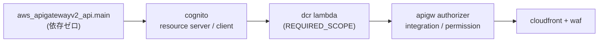

# 今週の作業プラン(Week 6): Terraformの変数化とモジュール化

> この章で分かること
> [00-handoff.md §18.8](./00-handoff.md)で指示されたフェーズ2(Terraformの変数化・モジュール化)について、着手前に既存Terraformコード3ディレクトリ・ecspresso設定・アプリコード・playgroundのstateを調査した結果と、それを踏まえた実施計画をまとめる。調査の過程で、**引き継ぎメモが「モジュール化の最大の難所」としていたCognito ⇄ API Gatewayの循環参照が存在しないこと**、代わりに別の箇所に本物のモジュール循環があること、納品ブロッカーの記述に3件の事実誤認があることが判明したため、あわせて記録し訂正する。

作成日: 2026-09-15 | 実施方法: Explore/Planサブエージェントによる既存コード・state・ドキュメントの調査(机上、AWSへの書き込みなし)

**大前提**: ホスティング方式は**ECS Fargate**である。[00-handoff.md:796](./00-handoff.md)が「決定事項1で『ホストはEC2』と記述されたがECSと解釈した。次回セッションで認識が異なる場合は指摘を求めること」として確認を求めていた件は、**今セッション冒頭でユーザーに確認し、ECS Fargateで正しいことが確定した**。§18.2の注記は解決済みとして扱う。

**スコープ**: 本セッションは**変数化とモジュール骨格の作成まで**とする。AWSへの`plan`/`apply`は行わない。ECSサービスのecspresso→Terraform移行(ブロッカー2)とKMS暗号文の再暗号化(ブロッカー4)は**設計文書の作成のみ**とし、実装は次セッション以降に送る。

---

## TL;DR

| # | 論点 | 結論 |
|---|---|---|
| 1 | モジュール化の最大の難所とされた循環参照 | **存在しない**。実際の依存は `apigw-api → cognito → dcr-lambda → apigw-authorizer → cloudfront` の一方向DAGで、だからこそ現行のフラット構成が問題なく`apply`できている。引き継ぎメモが引用する`apigateway.tf:91`の`audience`行はplayground世代には存在せず、それは1世代古い`terraform/apigateway.tf:96`の行だった。「カスタムドメインを先に固定する」という前提条件も不要(§1) |
| 2 | 本物のモジュール循環 | 別の箇所に**1件ある**。`random_password.origin_verify`が`dcr`と`edge-waf`の両方から参照され、`edge-waf → dcr → api-gateway → edge-waf` を作る。環境ルートへ引き上げて解消する。再生成すると稼働中のCloudFront配下で`X-Origin-Verify`がローテートされるため、`moved`ブロックを書かないことが重要(§1.3) |
| 3 | `resource_server_identifier`の変数化 | **必要だが、循環回避のためではない**。identifierが`apply`前に確定しないこと、およびAPI再作成時にresource serverとスコープが連鎖再作成され**発行済みDCRクライアントのスコープ付与が全滅する**ことを防ぐため。tfvarsには現行の実値をstateからコピーする(手打ち禁止)(§1.2) |
| 4 | モジュール構成 | 引き継ぎメモの7モジュールに**`api-gateway`を加えた8モジュール**とする。API Gateway(213行)が7モジュールのどれにも属さず、しかも依存グラフの中心。`mcp-server-ecs`に混ぜるとAgentCoreバリアントが構築不能になる(§2) |
| 5 | `mcp-server-agentcore` | **移行元コードが存在しない**。両ディレクトリの`.tf`にAgentCoreリソースは1件もなく、コメント言及3件のみ。AWS CLIで作成されたままTerraform化されたことがない。今回は**スタブに留める**(§2.1) |
| 6 | 納品ブロッカーの記述訂正 | 3件。ブロッカー5「59リソース」は**実測75**。ブロッカー6「テーブル名直書き」は**すでにほぼ解消済み**(`TABLE_NAME`環境変数化済み)。ブロッカー1の統合方向は正しいが、`secrets`だけは`terraform/`側のパターンが汎用で採用すべき(§0) |
| 7 | state移行の方法 | `terraform state mv`ではなく**`moved`ブロック**。75アドレスを機械生成し、`plan`が`0 to add, 0 to change, 0 to destroy`になることを受け入れ基準とする。CloudFrontディストリビューションに`-/+`が出たら即中断(§4) |

---

## 0. 調査で判明した、納品ブロッカー記述の誤り

[00-handoff.md §18.4](./00-handoff.md)の9件は本セッションで[fde/DELIVERY-BLOCKERS.md](./fde/DELIVERY-BLOCKERS.md)へ台帳化した。その過程で3件の記述誤りを確認した。

| ブロッカー | メモの記述 | 実際 | 根拠 |
|---|---|---|---|
| 5 | 「**59リソース**の唯一のstateがディスク上にある」 | **75リソース**(managed 75 / instances 82、ほかdata source 12) | `terraform-playground-pattern4/terraform.tfstate`を直接パースして計数。`for_each`で2インスタンスを持つリソースが7つある(`aws_eip.nat`、`aws_instance.nat`、`aws_route_table.private`、`aws_route_table_association.private`/`.public`、`aws_subnet.private`/`.public`) |
| 6 | 「アプリコードがDynamoDBテーブル名とリージョンを直書き(`server/src/db.ts:20`、`cli/src/db.ts:4`)」 | **ほぼ解消済み**。両ファイルとも `process.env.TABLE_NAME ?? "quick-mcp-poc-users"` になっており、Week5の[19-internal-weekly-verification-plan-week5.md §2.1 F12](./19-internal-weekly-verification-plan-week5.md)の対応が入っている | `server/src/db.ts:21`、`cli/src/db.ts:5`。残るリージョン直書きは`DYNAMODB_ENDPOINT_URL`分岐内のLocalStack専用箇所のみで無害 |
| 1 | 「統合方向は playground → terraform」 | 方向は正しいが**1箇所だけ例外**。`terraform/ssm.tf:20-72`の`for_each`マップ + `aws_kms_secrets`パターンはplayground(`ssm.tf:9-44`、個別宣言)より汎用で、`payload != ""`ガード(`terraform/ssm.tf:57,65`)がKMS再暗号化の二段階適用をそのまま支える | `secrets`モジュールのみ`terraform/`を正とする |

ブロッカー6の残作業は「`??`フォールバックの除去」と「`ecspresso/app/ecs-task-def.json:26-31`への`TABLE_NAME`追加」の2点のみであり、フェーズ2の主要作業ではない。

なお**ブロッカー5の緊急度は据え置き**とする。75リソース唯一のstateがローカルにある状況は変わらず、しかもこのファイルにはSSMのプレースホルダ値と`random_password.origin_verify`の生成結果が含まれる。`.gitignore:3`(`*.tfstate`)で追跡対象外であることは確認済み。

---

## 1. 循環参照の再調査

### 1.1 引き継ぎメモの記述が成立しない理由

[00-handoff.md §18.8-1](./00-handoff.md)は、モジュール化の難所として次のように記述している。

> モジュール化の難所: **Cognito ⇄ API Gatewayの循環参照**(`cognito.tf:43`のresource server identifierがAPI GW endpointを参照し、`apigateway.tf:91`のaudienceがCognitoを参照)。カスタムドメインを先に固定してidentifierを変数化する設計が要る

実際の依存辺を`terraform-playground-pattern4/`で確認した。

| 参照元 | 参照先 | 該当 |
|---|---|---|
| `aws_apigatewayv2_api.main` | **なし** | `apigateway.tf:37`。依存ゼロ |
| `aws_cognito_resource_server.mcp` | API GW | `cognito.tf:53` `identifier = "${aws_apigatewayv2_api.main.api_endpoint}/mcp"` |
| `aws_cognito_user_pool_client.mcp` | API GW | `cognito.tf:37` `allowed_oauth_scopes` |

**API Gateway側からCognitoを指す辺が無い。** メモが引用する`apigateway.tf:91`の`audience`行はplayground世代には存在しない。playgroundはJWT AuthorizerをLambda REQUEST型に置き換えており(`apigateway.tf:94-103`)、`audience`設定そのものが消えている。メモが見ていたのは1世代古い`terraform/apigateway.tf:96`の行で、しかもそれが参照するのは resource server ではなく**アプリクライアントID**である。



**図の解説**: 実際の依存グラフ。左から右への一方向で、後戻りする辺が存在しない。API Gateway本体(`aws_apigatewayv2_api`)は何も参照せずまず作られ、その`api_endpoint`をCognitoが受け取り、Cognitoのスコープ定義をDCR Lambdaが受け取り、そのLambdaのARNをAuthorizerとIntegrationが受け取る。現行のフラット構成が問題なく`apply`できているのはこのためである。循環があればTerraformは`Cycle:`エラーで`plan`すら通らない。

さらに`terraform/apigateway.tf:91-95`には、**resource server identifierを`audience`に設定して全トークンが壊れた記録がコメントとして残っている**。これは本番の401バグ([00-handoff.md §14.2](./00-handoff.md))そのものであり、世代マージの際に絶対に引き継ぐべき知見である(§5 F1)。

### 1.2 それでも`resource_server_identifier`は変数化する

循環回避のためではなく、**別の2つの理由**による。

1. **`apply`前に値が確定しない**。identifierがAPI GatewayのURLから導出されるため、新規環境では「APIを作るまでidentifierが分からない」。`quick`環境の構築で実害が出る。
2. **API再作成が資産を巻き込む**。execute-api IDが変わるとidentifierが変わり、`aws_cognito_resource_server`とそのスコープが連鎖再作成される。その結果、**発行済みDCRクライアントに付与されたスコープがすべて失われる**。[19-internal-weekly-verification-plan-week5.md §1.1 D5](./19-internal-weekly-verification-plan-week5.md)が「REST移行もCloudFront前置も登録済みDCRクライアントを全無効化する」と指摘した問題の、Terraform側の写像にあたる。

Cognitoのresource server `identifier`は**不透明文字列**であり、URLとして解決されることはない。スコープ名(`${identifier}/invoke`、`cognito.tf:55`・`lambda.tf:71`)とメタデータ文書(`openapi.yaml:31,34,59,62`)にechoされるだけである。したがって**カスタムドメインの先行固定は不要**で、カスタムドメイン移行は後日tfvars 1行の変更として独立に実施できる。

```hcl
# infra/modules/auth/main.tf
resource "aws_cognito_resource_server" "mcp" {
  user_pool_id = aws_cognito_user_pool.main.id
  identifier   = var.resource_server_identifier   # 旧: "${aws_apigatewayv2_api.main.api_endpoint}/mcp"
  name         = var.resource_server_name
  scope {
    scope_name        = "invoke"
    scope_description = "Invoke MCP tools"
  }
}
```

`allowed_oauth_scopes`(`cognito.tf:37`)も `"${var.resource_server_identifier}/invoke"` に変更し、`auth`モジュールから`aws_apigatewayv2_api`参照を完全に消す。`api-gateway`側もこの値を環境ルートの変数から受け取るため、両モジュール間の辺が消滅する。

**tfvarsには現行の実値を入れる。手打ち禁止。** `terraform output cognito_resource_server_identifier`(`outputs.tf:46-48`)またはstateから読み取ってコピーすること。1文字違えばresource serverがdestroy/createされ、上記2の被害がそのまま発生する。

### 1.3 本物のモジュール循環は別にある

`random_password.origin_verify`(`cloudfront_waf.tf:48`)が2つのモジュールから参照される。

| 参照元 | 該当 | 用途 |
|---|---|---|
| `dcr`(Lambda Authorizer) | `lambda.tf:78` | `X-Origin-Verify`ヘッダの検証値 |
| `edge-waf`(CloudFront) | `cloudfront_waf.tf:459` | オリジンへ付与する値 |

このリソースを`edge-waf`に置くと `edge-waf → dcr → api-gateway → edge-waf` の循環ができる。**環境ルートへ引き上げ**、両モジュールに入力として渡す。

ルートでのアドレスが`random_password.origin_verify`のまま変わらないため`moved`ブロックは不要で、これが重要である。誤ってルートから消すとTerraformはdestroyを計画し、再作成でシークレットがローテートされる。稼働中のCloudFrontとLambda Authorizerの間に**値の不一致窓**が開き、[19-internal-weekly-verification-plan-week5.md §1.3](./19-internal-weekly-verification-plan-week5.md)のバイパス対策が一時的に全リクエストを弾く。

もう1件、`aws_lambda_permission`2件(`lambda.tf:89-95`、`:176-182`)が`aws_apigatewayv2_api.main.execution_arn`を参照する一方、`apigateway.tf:80,97`がLambdaの`invoke_arn`を参照している。Terraform 0.13以降はモジュールの変数・出力を個別のグラフノードとして扱うため実際には解決するが、レビュー不能な相互参照になる。**両permissionを`api-gateway`へ移す**。APIが**与える**権限であり置き場所として正しく、移動後`dcr → api-gateway`が一方向になる。

### 1.4 循環を作り込まないための規約

**`module`ブロックに`depends_on` / `count` / `for_each`を付けない。** いずれもモジュール全体を単一のグラフノードに潰し、存在しなかったはずの循環を発生させる。任意化はモジュール内リソースの`count`で行う(`enable_local_pool`、`edge-waf`の`enabled`)。

---

## 2. モジュール構成

`terraform-playground-pattern4/`を**正**としてコピーし変数化する(例外は§0のとおり`secrets`のみ)。元ディレクトリは**削除せず残置**し、ロールバック参照とする。

```
network → mcp-server-ecs → auth → dcr → api-gateway → edge-waf
             ↑              ↑      ↑         ↑
          secrets ──────────┴──────┴─────────┘
```

| モジュール | 移行元 | 主な入力 | 主な出力 |
|---|---|---|---|
| `network` | `vpc.tf`全体(176行) | `vpc_cidr`, `public_subnets`/`private_subnets`マップ, `nat_instance_type`, `nat_strategy` | `vpc_id`, `private_subnet_ids`, `private_subnet_cidrs` |
| `secrets` | `terraform/ssm.tf:20-72`のパターン + playgroundの値 | `kms_alias_name`, `ssm_path_prefix`, `plain_parameters`, `encrypted_parameters`, `plaintext_parameters` | `kms_key_arn`, `ssm_path_prefix` |
| `mcp-server-ecs` | `ecs.tf` + `alb.tf` | `container_port`, `health_check`, `alb_ingress_cidrs`, `dynamodb_table_arns`, `ssm_kms_key_arn` | `cluster_name`, `ecs_security_group_id`, 各IAMロールARN, `target_group_arn`, `alb_listener_arn` |
| `auth` | `cognito.tf` + `cognito_branding.tf` + `terraform/cognito.tf:59-116` | `domain_prefix`, `callback_urls`, **`resource_server_identifier`**, `enable_local_pool` | `user_pool_id`, `issuer_url`, `invoke_scope` |
| `dcr` | `lambda.tf`から`aws_lambda_permission`2件を除く | `dcr_table_arn`, `lambda_source_dir`, `origin_verify_secret`, 認可/登録の設定オブジェクト | 各Lambdaの`invoke_arn`, `function_name` |
| `api-gateway`(新規) | `apigateway.tf` + `openapi.yaml` + 上記permission 2件 | `enable_dcr`, `register_throttle`, `authorizer_ttl_seconds`, ALB/Cognito/Lambda由来の値 | `api_id`, `api_endpoint`, `api_execution_arn` |
| `edge-waf` | `cloudfront_waf.tf:27-492` | `enabled`, `waf_mode`, `managed_rule_groups`, `body_size_limit_bytes`, `custom_domain` | `web_acl_arn`, `cloudfront_domain` |
| `mcp-server-agentcore` | **移行元なし**(§2.1) | — | — |

設計判断:

- **ALBは`network`ではなく`mcp-server-ecs`に置く**。ターゲットグループとリスナーはECSの受け口であり、`network`にコンテナポートを知らせたくない。
- **`api-gateway`を8つ目として独立させる**。引き継ぎメモの7モジュールでは213行のAPI Gatewayが行き場を失う。`mcp-server-ecs`に混ぜると、将来AgentCoreバリアントを同じ`api-gateway`の背後に置けなくなる。
- **`edge-waf`はproviderエイリアスを受け取る**。`required_providers`に`configuration_aliases = [aws.use1]`を宣言し、環境ルートから`providers = { aws = aws, aws.use1 = aws.use1 }`で渡す。providerブロック(`cloudfront_waf.tf:15-25`)はモジュール内に置けない。
- **`random_password.origin_verify`は環境ルート**(§1.3)。

### 2.1 `mcp-server-agentcore`に移行元コードが存在しない

`terraform/`・`terraform-playground-pattern4/`の全`.tf`を検索したところ、**AgentCore関連のリソース定義は1件も無かった**。ヒットするのは次の3件のコメントと、プロファイル名`quick-agentcore-poc-playground`の部分一致のみである。

| 該当 | 内容 |
|---|---|
| `ecs.tf:86` | 実際に読まれるのはAgentCore Runtime検証で作成済みのテーブルである旨の注記 |
| `cognito.tf:38` | `scripts/invoke_agentcore_mcp_jwt.py`等を参照せよという注記 |
| `ssm.tf:3` | AgentCore Runtime側の検証と同様である旨の注記 |

AgentCore Runtimeは`scripts/invoke_agentcore_mcp*.py`からAWS CLIで作成されており、**Terraform化されたことがない**。[fde/ARCHITECTURE-VERSIONS.md](./fde/ARCHITECTURE-VERSIONS.md)の「タグ付けできるコード状態が存在しない」という記述と整合する。参考実装として`docs/terraform-examples/agentcore-vpc-mode/main.tf`(263行、リポジトリ内で唯一`variable`ブロックを持つコード)があるが、これはVPCモード検証用の別物である。

したがって`mcp-server-agentcore`は**移行ではなく新規作成**であり、今回は`variables.tf` / `outputs.tf` / `README.md`のスタブに留める。想定インタフェース(`agentcore_runtime_arn`、`invoke_endpoint`)を宣言し、**「空なのは作業喪失ではなく未着手」であることを明記する**。`quick-mcp-agentcore-1.0-<日付>`の発番は実装時に行う。

---

## 3. 変数化(ブロッカー3の本体)

現状、`terraform/`・`terraform-playground-pattern4/`とも`variable`ブロックは**0個**、`.tfvars`も**0個**である。

### 3.1 ルート変数

| 変数 | 置換対象 | playground | primenumber |
|---|---|---|---|
| `aws_region` | `provider.tf:20`、`apigateway.tf:5,38,46,52,58`、`outputs.tf:43`、`lambda.tf:9`、`ecs.tf:88` ほか約20箇所 | `ap-northeast-1` | 同左 |
| `aws_profile` | **`provider.tf:21`**、**`cloudfront_waf.tf:18`** | `quick-agentcore-poc-playground` | `null` |
| `account_id` | **`lambda.tf:9`**、**`ecs.tf:88`**(`883660531246`直書き) | `data.aws_caller_identity`由来、変数の既定は`null` | 同左 |
| `name_prefix` | 約40行の`quick-mcp-poc` | `quick-mcp-poc` | 同左 |
| `resource_suffix` | `cognito.tf:6,24,62`、`ssm.tf:10,14,19`、`dynamodb.tf:2,14` | `-pattern4-verify` | `""` |
| `app_tag` | `provider.tf:26`、`cloudfront_waf.tf:22` | `quick-mcp-poc-pattern4-verification` | `quick-mcp-poc` |

`account_id`は原則`data.aws_caller_identity.current`(`ssm.tf:7`で既に宣言済み)から取り、変数は「別アカウントのテーブルを指す必要が生じた場合」の逃げ道として`null`既定で置く。

#### `resource_suffix`はグローバルに適用してはならない(実装時に判明)

playgroundのソースを全文検索した結果、`-pattern4-verify`が付いているのは**`cognito.tf` / `ssm.tf` / `dynamodb.tf`の3ファイルのみ**だった。`vpc.tf`・`ecs.tf`・`alb.tf`・`ecr.tf`・`apigateway.tf`・`lambda.tf`・`cloudfront_waf.tf`のリソース名は接尾辞なしの`quick-mcp-poc-*`である(`quick-mcp-poc-vpc`、`quick-mcp-poc-cluster`、`quick-mcp-poc-alb`、`quick-mcp-poc-tg`、`quick-mcp-poc-ecs-task-execution-role`等)。

| モジュール | `resource_suffix`に渡す値(playground) |
|---|---|
| `auth`、`secrets` | `-pattern4-verify` |
| `network`、`mcp-server-ecs`、`dcr`、`api-gateway`、`edge-waf` | **`""`** |

**これを間違えると実害が出る。** 全モジュールに一律で`-pattern4-verify`を渡すと、IAMロール名・セキュリティグループ名・ターゲットグループ名が変わる。これらは**改名がdestroy/createになる**リソースであり、§4の受け入れ基準(`0 to change, 0 to destroy`)を大きく外れる。

#### タグは`default_tags`のまま残す

`App = "quick-mcp-poc-pattern4-verification"`は**providerの`default_tags`**(`provider.tf:22-28`)で付与されており、各リソースの`tags`属性には入っていない。モジュールには`tags = {}`を渡し、Appタグは環境ルートのprovider側で`default_tags`として維持する。モジュールへ非空の`tags`を渡すとstate上の全リソースにタグ追加のdiffが出る。

[fde/ARCHITECTURE-VERSIONS.md](./fde/ARCHITECTURE-VERSIONS.md)が計画している`McpBaseVersion`タグの付与は、この`default_tags`へ追加する形で行う。**ただしそれは`moved`の適用が`0 to change`で完了した後の別変更とする。**

### 3.2 特に注意を要するモジュール変数

| 変数 | 置換対象 | 注意点 |
|---|---|---|
| `domain_prefix` | `cognito.tf:62` / `terraform/cognito.tf:48,107` | **ブロッカー7**。Cognitoドメインプレフィックスはリージョン内でグローバル一意。playgroundが`-pattern4-verify`を名乗っているのは`quick-mcp-poc-auth`が既に取られていたため(ファイル冒頭コメント) |
| `encrypted_parameters` | **`terraform/ssm.tf:35,39`** | **ブロッカー4**の受け皿。暗号文を**そのまま**`primenumber.tfvars`へ移す(差分ゼロ)。`quick`用の再暗号化は設計のみ(§5 F3) |
| `alb_ingress_cidrs` | `alb.tf:9`(`10.0.0.0/16`直書き) | `[var.vpc_cidr]`にする |
| `dynamodb_table_arns` | `ecs.tf:84` と `ecs.tf:88` | リスト化。playgroundのみ2要素(Terraform管理テーブルと、実際に読まれるAgentCore検証用テーブルの両方をIAMで許可している回避策) |
| `enable_dcr` / `edge-waf.enabled` | `apigateway.tf:94-103` / `cloudfront_waf.tf`全体 | `primenumber`は当初`false`で旧世代と差分ゼロにし、世代マージを意図的な別変更として切り出す(§5 F1) |
| `body_size_limit_bytes` / `body_inspection_limit` | `cloudfront_waf.tf:138` / `:72` | `validation`ブロックで連動させる。`cloudfront_waf.tf:66`に記録されたUTF-8日本語長文の偽陽性([19-internal-weekly-verification-plan-week5.md §1.9 新規発見2](./19-internal-weekly-verification-plan-week5.md))は、この2つが片方だけ動くと再発する |

### 3.3 ルート`outputs`は互換契約

`ecspresso/app/ecs-task-def.json`と`ecs-service-def.json`が、tfstateプラグイン経由で次の出力を**名前で**読んでいる。

`ecr_repository_url` / `ecs_cloudwatch_log_group_name` / `ecs_task_execution_role_arn` / `ecs_app_task_role_arn` / `ecs_security_group_id` / `ecs_private_subnet_ids` / `alb_target_group_arn` / `ssm_prefix`

`terraform-playground-pattern4/outputs.tf:1-56`の**全名称を各環境ルートにそのまま再現する**。改名するとTerraformエラーではなく、難解なecspressoテンプレートエラーとしてデプロイ時に初めて露見する。

---

## 4. state移行(`moved.tf`を書くが実行しない)

`terraform state mv`ではなく**`moved`ブロック**を使う。diffでレビューでき、冪等で、リモートstateに対してもロック操作が不要で、何より`plan`が適用前に検証してくれる。

```
terraform state list | grep -v '^data\.'   # → 75アドレス
```

を機械的に変換して生成する。`for_each`リソースはリソース単位で移動する(`aws_subnet.public["az-a"]`ではなく`aws_subnet.public`)。

| アドレス | 危険 | 対処 |
|---|---|---|
| `aws_cognito_resource_server.mcp` | tfvarsのidentifierがズレると再作成 → 全DCRクライアントのスコープ喪失 | stateから実値をコピー(§1.2) |
| `aws_wafv2_web_acl.edge` ほかus-east-1系3件 | providerエイリアス不一致で再作成 → 稼働中ディストリビューションから外れる | `providers = { aws.use1 = aws.use1 }`を明示。エイリアス名も`aws.use1`のまま変えない |
| `aws_cloudfront_distribution.edge` | 再作成で約20分の停止 + ドメイン変更 → 登録済みDCRクライアント全無効化 | `-/+`が出たら**即中断** |
| `random_password.origin_verify` | ルートから消すとdestroy → シークレットのローテート | ルートに残し、`moved`を書かない(§1.3) |
| `aws_api_gateway_deployment.metadata` | `openapi.yaml`がモジュール配下へ移り`path.module`が変わるため`sha1`トリガ(`apigateway.tf:36`)が動く | 内容がバイト等価か確認。**この1件だけはchangeが出て正常** |

**受け入れ基準は`plan`が `0 to add, 0 to change, 0 to destroy`**(+ `moved`行、+ 上記メタデータ1件)。changeやdestroyが出たら`plan`ではなくtfvarsの転記ミスを疑うこと。

---

## 5. 設計文書のみ(本セッションでは実装しない)

[fde/](./fde/)配下に記録する。

| # | 項目 | 要点 |
|---|---|---|
| F1 | 世代マージ playground → primenumber(**ブロッカー1**) | `terraform/`はpre-DCR世代。`enable_dcr` / `edge-waf.enabled`で差分ゼロから開始し、意図的に切り替える。**`terraform/apigateway.tf:91-95`のコメント(resource server identifierをaudienceにして全トークンが壊れた記録)を必ず引き継ぐ** |
| F2 | ecspresso → Terraform(**ブロッカー2**) | `aws_ecs_service`を`cluster/service`、`aws_ecs_task_definition`を`family:revision`でimport。CDがイメージを回すなら`lifecycle { ignore_changes = [task_definition, desired_count] }`が必須。同時に`TABLE_NAME`を`environment`へ追加(ブロッカー6の残作業)。**対案「ecspressoを維持し`ecspresso.yml:10`を環境別にするだけ」も併記** — PoCではおそらくこちらが正解 |
| F3 | KMS再暗号化(**ブロッカー4**) | 鍵が同じ`apply`で作られる鶏卵問題があり、初回は`encrypted_parameters = {}`、二度目に投入する二段階適用になる(`terraform/ssm.tf:57,65`のガードが対応済み)。**推奨は代案**: 暗号文のコミットをやめ`aws ssm put-parameter`を帯域外で行い`data.aws_ssm_parameter`で読む。クロスアカウント問題が恒久的に消える |
| F4 | Cognitoドメイン一意性とカスタムドメイン(**ブロッカー7**) | `ENFORCE_ORIGIN_VERIFY`(`lambda.tf:79`)を`true`にできない理由(`cloudfront_waf.tf:6-9`)とその解除条件 |
| F5 | `WWW-Authenticate` / RFC 9728ディスカバリ | `cloudfront_waf.tf:494-512`のコメント(CloudFront Functionsのviewer-responseはオリジン4xxで発火しないため実装不可、代替3案)を**逐語で**文書へ移す。今回の再構成で消えるファイルにしか存在しない知見 |
| F6 | AgentCoreバリアント | Terraform実装が存在しないこと(§2.1)、想定インタフェース、タグ発番条件 |

CI/CD方針([00-handoff.md §18.5](./00-handoff.md))は`fde/CICD-DESIGN.md`としてフェーズ4で扱う。

---

## 6. バックエンド方針

backendブロックは変数を取れないため、部分設定 + `backend.hcl`とする。

```hcl
terraform { backend "s3" {} }
```

```hcl
# infra/environments/playground/backend.hcl
bucket       = "tfstate-quick-mcp-poc-playground-883660531246"
key          = "playground/terraform.tfstate"
region       = "ap-northeast-1"
profile      = "quick-agentcore-poc-playground"
encrypt      = true
use_lockfile = true
```

`terraform init -backend-config=backend.hcl` の付け忘れで黙ってローカルstateに再初期化される事故を防ぐため、`Makefile`の薄いラッパを置く。

| 環境 | 現状 | 方針 |
|---|---|---|
| playground(883660531246) | **backendブロックが無い**(`provider.tf:1-18`)。75リソース唯一のstateがディスク上 = **ブロッカー5** | バージョニング + SSE + パブリックアクセスブロックのバケットを作り`-migrate-state`。ロックはDynamoDBテーブルではなくS3ネイティブ(`terraform/provider.tf:9`と揃える) |
| primenumber(620369151795) | バケット`terraform.tfstate.professional-services-quick-poc`が既存(`terraform/provider.tf:5-9`) | **`key = "terraform.tfstate"`を変更しない**。変更は本番stateの移行になるうえ、`ecspresso/app/ecspresso.yml:10`がこのURLを直指ししているため壊れる |
| quick(納品先) | 未作成 | 新規バケット、`key = "quick/terraform.tfstate"`。`terraform/scripts/create-tfstate-bucket.sh`(現在`quick-poc-admin`固定、`:5-6`)を引数化する |

ecspresso設定も環境別に分割する。なお**playgroundにはecspresso設定が存在しない**。stateがローカルファイルでtfstateプラグインが読めないためであり、これはブロッカー5とブロッカー2が連動している証左である。

---

## 7. 実施順序と成功判定基準

AWSへの書き込みは行わない。

| # | 手順 | 判定 | 結果 |
|---|---|---|---|
| P0 | `.gitignore`で`terraform-playground-pattern4/terraform.tfstate`が追跡対象外であることを確認 | 追跡対象外 | **完了**(`.gitignore:3`) |
| P1 | `infra/modules/`8モジュールを作成し変数化 | `terraform fmt -recursive -check infra/`が通る | **完了** |
| P2 | `infra/environments/{playground,primenumber,quick}/`を作成 | 3環境とも`terraform init -backend=false` + `terraform validate`が通る | **完了**(3環境とも Success) |
| P3 | 依存グラフの非循環を確認 | `terraform graph`が出力でき、`module`ブロックに`depends_on`/`count`/`for_each`が無い(§1.4) | **完了**(109辺、`Cycle:`エラー無し) |
| P4 | `moved.tf`を生成 | state の managed リソース数と`moved`ブロック数 + 据え置きが一致 | **完了**(73 + 据え置き2 = 75) |
| P5 | ルート`outputs`の互換確認 | `terraform-playground-pattern4/outputs.tf`の全名称が各環境ルートに存在(§3.3) | **完了**(ecspresso が読む8件を含め全14件) |
| P6 | ドキュメント更新 | リポジトリ全体でリンク切れゼロ | **完了** |
| — | **`plan`は次セッション** | `0 to add, 0 to change, 0 to destroy`(§4) | 未実施 |

`terraform validate`の実行には Terraform 1.15.8 を使用した。`graph`は backend を要するため、スクラッチパッドに複製してローカル backend で実行した。

### 7.1 実装で構成を変えた点

計画時から3点変えている。いずれも実装中に判明した事実による。

| # | 変更 | 理由 |
|---|---|---|
| 1 | `secrets`モジュールを**`parameters`に改名** | サンドボックスの権限規則が`./secrets`を認証情報ディレクトリとみなして読み書きを遮断する。Terraform モジュール名としては`parameters`の方が実態(SSM Parameter Store + KMS)にも合う |
| 2 | 3環境で`main.tf` / `variables.tf` / `outputs.tf`を**同一ファイルにし、差分を`tfvars`だけに閉じ込めた** | DB-01(`terraform/`が1世代古い)の原因は、環境ごとに別々の`.tf`を持っていたこと。構成ファイルを共有すれば同じドリフトが**構造的に起きえなくなる**。世代差は`enable_dcr` / `enable_edge_waf` / `enable_local_pool`の3トグルで表現する |
| 3 | `api-gateway`に加え、ECR を`mcp-server-ecs`へ、DynamoDB テーブルを**環境ルート**へ配置 | 計画の8モジュールは`ecr.tf`と`dynamodb.tf`を取りこぼしていた。DynamoDB は環境ごとに存在有無と管理主体が異なる(本番は41ユーザーの実データで Terraform 管理外)ためモジュール化しない |

### 7.2 `tfvars`の扱い

`.gitignore:6`が`*.tfvars`を除外している(認証情報が入りうるため)既存方針に従い、**`terraform.tfvars.example`として versioned**した。使うときは`cp terraform.tfvars.example terraform.tfvars`する。

playground の`ssm_plaintext_parameters`はプレースホルダ値であり実 credential ではないため、example をそのままコピーして使える。**移行に必須の`resource_server_identifier`の実値もここに入っている**ので、次セッションはこのファイルから始められる。

---

## 8. 本セッションでも解消できない、人の判断待ち項目

コード作業では解消できない。[00-handoff.md §18.9](./00-handoff.md)から継続。

- **A1 本番401バグの共有(数週間滞留中)**。`fix/production-audience-config-proposal`は`main`にマージ済みだが、**本番担当者への共有が未実施**。Week5でCognitoがRFC 8707の`resource`パラメータに対応済みと判明したため、「修正案」と「`resource`指定を前提にする案」の両論を提示するのが正確([19-internal-weekly-verification-plan-week5.md §2.5](./19-internal-weekly-verification-plan-week5.md))。なお§1.1のとおり、`terraform/apigateway.tf:91-95`には当時の失敗がコメントとして残っており、世代マージの際にこの知見を失わないこと。
- **A2 Claude Code / Claude.aiからの自己登録E2E**。ブラウザ操作が必要で未実施。DCR修正が実接続で効いているかは未確定のまま。
- **フェーズ3(playground整理)の削除候補**。playgroundはtrocco・PetStore等と**共用**のため`quick-mcp-poc*`に限定する。**削除は必ず事前確認を取る**。
- B1〜B5、C1〜C3([00-handoff.md §18.9](./00-handoff.md))。
