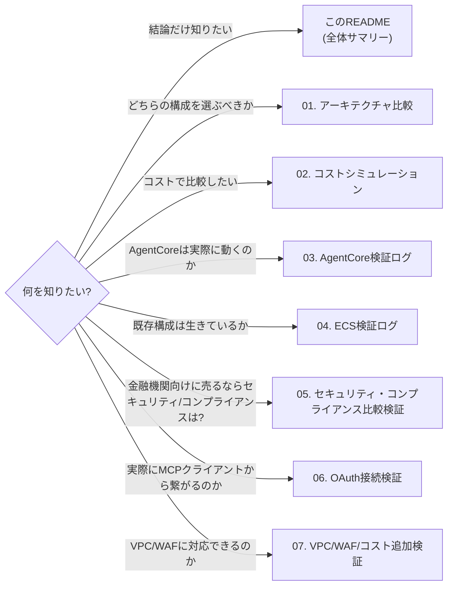

# quick-mcp-poc: AgentCore Runtime移行検証 技術ドキュメント

来週水曜のクライアント報告に向けて実施した、Amazon Bedrock AgentCore Runtimeへのデプロイ検証、および既存のAPI Gateway + ECS構成との比較検証のまとめ。

## この技術文書の読み方

読者の目的別に、読む順番を変えることを想定している。



## ドキュメント一覧

| # | ドキュメント | 内容 | 主な読者 |
|---|---|---|---|
| 0 | [00-handoff.md](./00-handoff.md) | セッション引き継ぎメモ(現状・未着手事項・再開手順) | 作業を再開するエンジニア(人・AI問わず) |
| — | [RESUME_PROMPT.md](./RESUME_PROMPT.md) | 新規セッション開始時にコピペする再開プロンプト | セッションを再開する人 |
| 1 | [01-architecture-comparison.md](./01-architecture-comparison.md) | 構成図・Mermaidシーケンス図・プロコン比較 | 意思決定者、アーキテクト |
| 2 | [02-cost-simulation.md](./02-cost-simulation.md) | 月額コスト試算・損益分岐点 | 意思決定者、予算担当 |
| 3 | [03-agentcore-runtime-verification.md](./03-agentcore-runtime-verification.md) | パターン3(AgentCore Runtime)のデプロイ・疎通検証の詳細ログ | エンジニア(再現・引き継ぎ用) |
| 4 | [04-ecs-apigateway-verification.md](./04-ecs-apigateway-verification.md) | パターン4(API Gateway + ECS)の稼働確認ログ | エンジニア(再現・引き継ぎ用) |
| 5 | [05-security-compliance-verification.md](./05-security-compliance-verification.md) | 金融グレード有償リモートMCPサービスとしてのセキュリティ・コンプライアンス比較検証(マルチテナント分離・閉域網・監査ログ・コンプライアンス認定・FISC対応) | 意思決定者、顧客の情シス/監査部門への説明担当 |
| 6 | [06-agentcore-oauth-claude-code-verification.md](./06-agentcore-oauth-claude-code-verification.md) | ECS+API Gateway→AgentCore Runtime移行の詳細比較、Claude Code経由のOAuthリモートMCP接続検証(構成図・シーケンス図・認証フロー差分・接続手順・ハマりどころ) | エンジニア(再現・引き継ぎ用)、アーキテクト |
| 6c | [06-agentcore-oauth-claude-code-verification-client.md](./06-agentcore-oauth-claude-code-verification-client.md) | 06番のクライアント向け版(用語解説付き、対外報告用)。同内容のPDF版あり | クライアント(QUICK様) |
| 7 | [07-vpc-waf-cost-verification.md](./07-vpc-waf-cost-verification.md) | AgentCore RuntimeのVPCモード実機切り替え検証、WAF代替構成(CloudFront)検証、コスト再検討、DCR/CIMD机上調査、汎用MCPクライアント疎通・コールドスタート測定 | エンジニア(再現・引き継ぎ用)、アーキテクト |
| 7c | [07-vpc-waf-cost-verification-client.md](./07-vpc-waf-cost-verification-client.md) | 07番のクライアント向け版(用語解説付き、対外報告用) | クライアント(QUICK様) |
| 8 | [08-weekly-verification-plan.md](./08-weekly-verification-plan.md) | 今週の追加検証3点(DCR実装・応答時間チューニング・コストシミュレーター)の実装前プラン。セキュリティ懸念の新規発見、DCR見積もり改訂、応答時間チューニングのスコープ変更を含む | エンジニア(再現・引き継ぎ用) |
| 9 | [09-cross-tenant-impersonation-finding.md](./09-cross-tenant-impersonation-finding.md) | AgentCore Runtime経路で発見・即日修正したクロステナントなりすまし脆弱性の詳細レポート。ECS経路との構造比較図、攻撃シナリオ図、実機での確証手順、修正の技術的根拠を図解付きでまとめる | エンジニア、アーキテクト、セキュリティレビュー担当 |
| 10 | [10-dcr-implementation.md](./10-dcr-implementation.md) | DCR(動的クライアント登録)の実装レポート。Lambda Authorizerへの置き換えが必要だった理由、なぜAgentCore Runtimeではなくpattern4(ECS)で実装したか、実装で踏んだ詰まりどころ(-target部分適用でのIAM権限漏れ等)、実機での動作確認結果(登録・認可・失効)をまとめる | エンジニア(再現・引き継ぎ用) |
| 11 | [11-cognito-to-auth0-migration-estimate.md](./11-cognito-to-auth0-migration-estimate.md) | Cognito→Auth0移行の机上見積もり。AgentCore RuntimeホスティングのままDCRを実現する経路として検討。追加コスト($800/月〜)、エンジニアリング工数(7〜10人日)、本番41ユーザーの移行リスク、データレジデンシー等のコンプライアンス懸念をまとめる | 意思決定者、アーキテクト |
| 12 | [12-mcp-protocol-v2-upgrade-impact.md](./12-mcp-protocol-v2-upgrade-impact.md) | MCPプロトコルv1(2025-11-25)→v2(2026-07-28)移行の影響調査。SDKのバージョンアップで旧バージョンのMCPクライアントとの互換性を保てるか、AgentCore Runtimeへの影響をまとめる | エンジニア、アーキテクト |
| 13 | [13-weekly-verification-report.md](./13-weekly-verification-report.md) | 今週(2026-08-31〜09-02)の追加検証レポート。クロステナントなりすまし脆弱性の発見・修正、DCR実装・セキュリティレビュー、コストシミュレーター、Cognito→Auth0移行検討、MCPプロトコルv2影響調査を一本化してまとめる | 意思決定者、エンジニア |
| 14 | [14-step1-spec-confirmation-answers.md](./14-step1-spec-confirmation-answers.md) | Step1仕様確認シートへの回答。AgentCore Runtime移行に関する7件の質問(OAuthエンドポイント・呼び出しプロトコル・Shim・リクエストヘッダー・セッション隔離・Inbound・想定MCPクライアント)に本プロジェクトの実機検証結果を根拠に回答 | 仕様確認シート提起者、アーキテクト |
| 15 | [15-ecs-production-readiness-gaps.md](./15-ecs-production-readiness-gaps.md) | ECS(WAF・DCR)アーキテクチャの本番採用に向けた課題点整理。DCRの自己登録〜失効フローの実演、AgentCore Runtime側`allowedScopes`単独運用とECS側REST APIネイティブCOGNITO_USER_POOLSオーソライザーという2つの安価なDCR代替仮説の実機検証、WAFルールセットの不足(SQLi未対応)の新規発見をまとめる | エンジニア(再現・引き継ぎ用) |
| 16 | [16-weekly-verification-report-week3.md](./16-weekly-verification-report-week3.md) | 今週(2026-09-03)の検証レポート。セッションID再利用による応答時間チューニング(実機で効果の持続時間の上限を特定)、ECS本番化課題整理、MCPプロトコルv2スパイクの結果を一本化してまとめる | 意思決定者、エンジニア |
| 16c | [16-weekly-verification-report-week3-client.md](./16-weekly-verification-report-week3-client.md) | 16番のクライアント向け版(用語解説付き、対外報告用) | クライアント(QUICK様) |
| 17 | [17-environment-resource-map.md](./17-environment-resource-map.md) | quick-mcp-poc検証で使っているAWSリソース・環境の整理。AgentCore Runtime(3つ)・ECS・Lambda(3つ)・Cognito・DynamoDBの棚卸しと、疎通検証Webアプリ(web-demo)の各デモセクションがどのリソースを呼んでいるかの対応表、構成図をまとめる | エンジニア(再開時の状況把握用) |
| 18 | [18-weekly-verification-report-week4.md](./18-weekly-verification-report-week4.md) | Week4(2026-09-08〜10)の検証レポート。DCR対応、ECS構成へのWAF適用検証、MCPプロトコルv2 SDKのECS側確認 | 意思決定者、エンジニア |
| 18c | [18-weekly-verification-report-week4-client.md](./18-weekly-verification-report-week4-client.md) | 18番のクライアント向け版(用語解説付き、対外報告用) | クライアント(QUICK様) |
| 19 | [19-weekly-verification-plan-week5.md](./19-weekly-verification-plan-week5.md) | Week5の検証プラン。WAFの恒久設計(CloudFront前段配置)、DCRのRFC 7591準拠性検証、REST API移行の採否判断。実施結果も追記済み | エンジニア(再現・引き継ぎ用) |
| 20 | [20-production-readiness-checklist.md](./20-production-readiness-checklist.md) | 本番運用チェックリスト。WAF・DCR・Authorizer・運用を固定IDで管理し、自動テストの結果と1対1で対応させる。継続更新用 | エンジニア、セキュリティレビュー担当 |
| 21 | [21-commercial-remote-mcp-operations-research.md](./21-commercial-remote-mcp-operations-research.md) | 商用リモートMCPサーバー運用の机上調査。AgentCore Gateway・AWS参照アーキテクチャ・MCP仕様・Anthropicコネクタ仕様を参考事例として整理し、運用要件(OPS-01〜10)を提案 | アーキテクト、意思決定者 |
| 22 | [22-weekly-verification-report-week5.md](./22-weekly-verification-report-week5.md) | Week5(2026-09-13〜14)の検証レポート。DCR準拠性(不合格16→2)、CloudFront + WAFのBlockモード検証、REST API移行を見送った判断 | 意思決定者、エンジニア |
| 22c | [22-weekly-verification-report-week5-client.md](./22-weekly-verification-report-week5-client.md) | 22番のクライアント向け版(用語解説付き、対外報告用) | クライアント(QUICK様) |
| 23 | [23-weekly-verification-plan-week6.md](./23-weekly-verification-plan-week6.md) | Week6の作業プラン。Terraformの変数化とモジュール化(フェーズ2)。引き継ぎメモが「最大の難所」としたCognito ⇄ API Gatewayの循環参照が存在しないことの確認と、本物のモジュール循環の所在、納品ブロッカー記述の訂正3件を含む | エンジニア(再現・引き継ぎ用)、アーキテクト |
| — | [fde/](./fde/) | FDE(Forward Deployed Engineer)成果物。[ARCHITECTURE-VERSIONS.md](./fde/ARCHITECTURE-VERSIONS.md)(バージョン台帳)、[DELIVERY-BLOCKERS.md](./fde/DELIVERY-BLOCKERS.md)(納品ブロッカー台帳、DB-01〜09) | primenumber社内、納品準備の担当者 |
| — | [agentcore-iam/](./agentcore-iam/) | AgentCore Runtime実行ロール用のIAMポリシー一式 | 本番アカウント適用時の管理者 |
| — | [images/](./images/) | 構成図のPNGおよび生成元YAML([awsdac](https://github.com/awslabs/diagram-as-code)形式) | 図を再生成・改変したい人 |

## 全体サマリー

### やったこと

1. 検証環境(Homebrew, AWS CLI, Docker, Node.js等)をゼロから構築
2. 既存PoCコード(TypeScript製MCPサーバー)を調査し、AgentCore Runtimeの要件(ポート8000固定、`/mcp`パス、ステートレスStreamable HTTP、linux/arm64)との差分を洗い出し
3. 最小限の改修(ポート変更のみ)でAgentCore Runtimeにデプロイし、認可フロー(DynamoDB参照)を含めてMCPプロトコル(`tools/list`)の疎通を確認
4. 既存のAPI Gateway + ECS構成(本番相当、既に構築済み)の稼働状況を確認
5. 両パターンのアーキテクチャ比較(構成図・シーケンス図・プロコン)とコストシミュレーションを作成

### 主なはまりどころ

| # | 事象 | 原因 | 対応 |
|---|---|---|---|
| 1 | 開発機にツールがほぼ何も入っていなかった | 新規環境 | Xcode CLT→Homebrew→各種ツールの順に導入。sudo/GUI操作が必要な工程はユーザーに別ターミナルでの実行を依頼 |
| 2 | `pnpm install`がesbuildのビルドスクリプトで失敗 | 非対話環境で`pnpm approve-builds`の対話プロンプトが完了できない | `pnpm-workspace.yaml`に`allowBuilds`設定を追加(Dockerfileにも反映) |
| 3 | 想定アカウントでIAMロール作成が拒否された | `AWSPowerUserAccess`にIAM作成権限が無い | ユーザーが管理者権限を持つ別アカウント(`systemN_playground`)で検証を実施する方針に切り替え |
| 4 | DynamoDBに実クライアントデータ(41ユーザー)が存在していた | 既存本番相当環境のテーブルを調査中に発覚 | 書き込みは一切行わず、別アカウントに検証専用のテーブルを新規作成する方針に変更 |
| 5 | AgentCore Runtimeへの初回リクエストが403 | アプリコードのDynamoDBテーブル名がハードコードされており、検証用テーブル名と不一致 | テーブル名をコードに合わせて作成し直すことで解決(アプリコード変更なし) |
| 6 | `x-cognito-sub`のようなカスタムヘッダーをAWS CLIから直接付与できない | `invoke-agent-runtime`に汎用ヘッダー指定オプションが無い | boto3の`before-sign`イベントフックで対応する検証スクリプトを作成 |

### 認証まわりの設計判断

既存構成(パターン4)は API Gateway の JWT Authorizer が Cognito トークンを検証し、検証済みの`sub`を`x-cognito-sub`ヘッダーとしてアプリに渡す設計。AgentCore Runtime(パターン3)への移行にあたっては、スケジュール優先で「IAM認証 + カスタムヘッダーの自己申告」という簡略構成を採用して疎通確認のみを行った。本番展開時は Custom JWT Authorizer の導入(Cognitoとの統合)を検討する必要がある。詳細は[01-architecture-comparison.md](./01-architecture-comparison.md)の「本番採用時の注意」を参照。

### クライアント報告での使い分け

- **技術的な疎通性を示す**: [03-agentcore-runtime-verification.md](./03-agentcore-runtime-verification.md)
- **既存構成との比較・意思決定材料**: [01-architecture-comparison.md](./01-architecture-comparison.md) + [02-cost-simulation.md](./02-cost-simulation.md)
- **既存構成が生きていることの証跡**: [04-ecs-apigateway-verification.md](./04-ecs-apigateway-verification.md)
- **金融機関向け外販サービスとしてのセキュリティ・コンプライアンス説明**: [05-security-compliance-verification.md](./05-security-compliance-verification.md)
- **実際にMCPクライアントから繋がることを示す・移行の技術詳細**: [06-agentcore-oauth-claude-code-verification.md](./06-agentcore-oauth-claude-code-verification.md)(クライアント向け版: [06-agentcore-oauth-claude-code-verification-client.md](./06-agentcore-oauth-claude-code-verification-client.md))
- **VPC配置・WAF導入可否・コストの疑問に実機で答える**: [07-vpc-waf-cost-verification.md](./07-vpc-waf-cost-verification.md)(クライアント向け版: [07-vpc-waf-cost-verification-client.md](./07-vpc-waf-cost-verification-client.md))

## 図の再生成方法

構成図は[`awsdac`](https://github.com/awslabs/diagram-as-code)で生成している(`brew install awsdac`)。MCPサーバーとしてもClaude Codeに登録済み(`awsdac-mcp-server`、次回セッションから利用可能)。YAML仕様を編集して再生成する場合:

```bash
awsdac docs/images/pattern3-architecture.yaml -o docs/images/pattern3-architecture.png -f
awsdac docs/images/pattern4-architecture.yaml -o docs/images/pattern4-architecture.png -f
```

シーケンス図は[Mermaid](https://mermaid.js.org/)記法で各Markdownファイルに直接埋め込んでおり、GitHub上でそのまま描画される。編集時は[Mermaid Live Editor](https://mermaid.live/)でプレビューできる。
