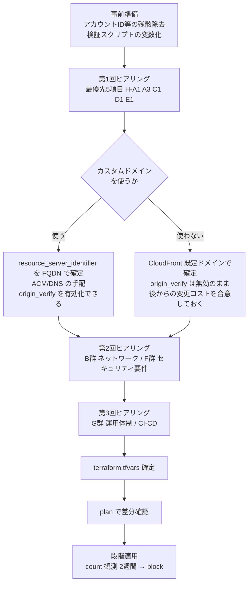

# 納品ヒアリングシートと環境差分一覧

> この章で分かること
> 検証は primenumber の内部AWS環境(playground)で行ってきたが、納品物はQUICK様のAWS環境で動く必要がある。本書は(1)QUICK様に確認しないと決められない事項、(2)こちら側で整理・決定できる事項、(3)開発環境と顧客環境で具体的に何が変わるかの3つを分離して一覧化する。ヒアリングの議題表としてそのまま使えることを狙う。

作成日: 2026-09-15 | 対象: primenumber内部資料(FDE成果物) | 関連: [DELIVERY-BLOCKERS.md](./DELIVERY-BLOCKERS.md)、[infra/environments/quick/terraform.tfvars.example](../../infra/environments/quick/terraform.tfvars.example)

---

## TL;DR

| # | 論点 | 結論 |
|---|---|---|
| 1 | ヒアリングなしで納品できるか | できない。**apply を止める確認事項が7分類・24項目**ある。うち**5項目は他の決定の前提**になるため最優先(§1.1) |
| 2 | 最も早く決めないといけないもの | **カスタムドメインの有無**。`resource_server_identifier`を決め、これは**後から変えると発行済みクライアントのスコープが失われる**。ドメインの有無でWAFの原点保護(`dcr_enforce_origin_verify`)とCognitoドメイン制約の扱いも連動して変わる(§1.2) |
| 3 | 変更が必要な箇所の総数 | `terraform.tfvars`の**CHANGEME 6箇所**は最低限。実際にはネットワーク・保持期間・WAFモードなど**28項目**が顧客環境で見直し対象になる(§3) |
| 4 | 検証環境の値をそのまま持ち込んではいけないもの | KMS暗号文、VPC CIDR、Cognitoドメインプレフィックス、QUICK APIのURL、コールバックURLの5つ。それぞれ**持ち込むと apply 失敗またはサイレントな障害**になる(§3.1) |
| 5 | ヒアリング不要でこちらが整理すべきもの | アカウントIDのコメント残骸除去、検証スクリプトの変数化、納品対象外ディレクトリの分離。**ヒアリング前に完了させておくべき**(§4) |
| 6 | 決められないまま残る論点 | ECSサービスの管理主体(Terraform / ecspresso)と、CI/CDの実行基盤。どちらも**QUICK様の既存運用に依存する**ため、ヒアリング項目G群の回答待ち(§1.7) |

---

## 1. ヒアリング事項

各項目に固定IDを与える。`H-<分類><連番>`。回答が得られたら本書に追記し、`infra/environments/quick/terraform.tfvars`へ反映する。

### 1.1 最優先の5項目

他の項目の前提になるため、最初のヒアリングで必ず確定させる。

| ID | 確認事項 | 決まらないと何が止まるか |
|---|---|---|
| H-A1 | 納品先のAWSアカウントIDとリージョン | `backend.hcl`・`terraform.tfvars`が書けず、**apply以前にinitできない** |
| H-A3 | Terraform実行に使う認証方式と、実行ロールの権限範囲 | IAMロール作成権限が無いと apply が途中で失敗する。検証環境では実際にこれで詰まっている([DB-08](./DELIVERY-BLOCKERS.md#db-08-本番相当環境へ一度もデプロイしていない)) |
| H-C1 | カスタムドメインを使うか、使うなら名前は何か | `resource_server_identifier`が決まらない。**後から変更すると発行済みクライアントのスコープが失われる**([tfvars.example:106-118](../../infra/environments/quick/terraform.tfvars.example)) |
| H-D1 | 納品先が接続するQUICK APIのベースURLと認証情報 | アプリが起動しても**全ツールが失敗する**。検証では開発向けエンドポイントを使っている |
| H-E1 | エンドユーザーは誰か(QUICK社内か、QUICK様のさらに先の顧客か) | 利用者登録の方式(DCR / 事前登録)の選択が決まらない。Anthropicは**接続数が多い場合はDCRを推奨していない**([22 §5](../22-internal-weekly-verification-report-week5.md)) |

### 1.2 A群: AWSアカウントと実行基盤

| ID | 確認事項 | 補足 |
|---|---|---|
| H-A1 | アカウントID / リージョン | `ap-northeast-1`を想定している。別リージョンの場合、WAFは`us-east-1`固定のため構成は変わらないが、レイテンシ検証をやり直す |
| H-A2 | tfstate用S3バケットは誰がいつ作るか | Terraformの管理外に置く必要がある(鶏卵問題)。バケット名・バージョニング・SSE・パブリックアクセスブロックの要件を確認する。ロックはS3ネイティブ(`use_lockfile`)を使う |
| H-A3 | Terraform実行の認証方式(SSO / IAMユーザー / OIDC)と権限 | IAMロール・KMSキー・CloudFront・WAFの作成権限が必要。`AWSPowerUserAccess`相当では**IAM作成ができず足りない** |
| H-A4 | 既存のAWS Organizations / SCPによる制限の有無 | リージョン制限、特定サービスの禁止(CloudFront等)があると構成の見直しが必要 |
| H-A5 | 環境は何面用意するか(本番のみ / 検証+本番) | 2面なら`resource_suffix`とCognitoドメインプレフィックスを面ごとに分ける必要がある |

### 1.3 B群: ネットワーク

| ID | 確認事項 | 補足 |
|---|---|---|
| H-B1 | VPCは新規作成でよいか、既存VPCへ相乗りか | 現構成は**VPC新規作成前提**。既存VPCに載せる場合はモジュールの入力を変える改修が要る |
| H-B2 | 使用可能なCIDRレンジ | 現在の`10.0.0.0/16`は検証環境と同一。社内の他システムと重複すると将来のピアリングができない([tfvars.example:29-31](../../infra/environments/quick/terraform.tfvars.example)) |
| H-B3 | NATはインスタンス(`t3.nano`)でよいか、NAT Gatewayが必要か | 検証はコスト優先で`t3.nano`のNATインスタンス。**単一障害点**になるため、可用性要件があればNAT Gatewayへ変更する |
| H-B4 | 閉域網(PrivateLink / VPCエンドポイント経由)での提供要件はあるか | 要件化されるとAPI GatewayのPRIVATEエンドポイントが必要になり、**現在見送ったREST API移行の判断が覆る**([22 §3.3](../22-internal-weekly-verification-report-week5.md)) |
| H-B5 | 送信元IPの制限要件(社内からのみ等) | WAFのIPセットルールを追加する。現構成は全世界許可でGeoは観測のみ |

### 1.4 C群: ドメインと証明書

| ID | 確認事項 | 補足 |
|---|---|---|
| H-C1 | カスタムドメインを使うか。使う場合のFQDN | **最重要**。使わない場合はCloudFrontの既定ドメインになり、以下C2〜C4がすべて制約を受ける |
| H-C2 | ACM証明書の発行主体とDNSの管理者 | CloudFront用は**us-east-1での発行が必須**。DNS検証レコードを誰が入れるかを決める |
| H-C3 | Cognitoのドメインプレフィックス | **リージョン内でグローバル一意**。検証で一度実害が出ている([DB-07](./DELIVERY-BLOCKERS.md#db-07-cognitoドメインプレフィックスのグローバル一意性)) |
| H-C4 | オリジンへの直アクセスを遮断してよいか | カスタムドメインがあれば`dcr_enforce_origin_verify = true`にでき、execute-api直叩きを閉じられる。**これが唯一の手段** |

### 1.5 D群: QUICK API接続

| ID | 確認事項 | 補足 |
|---|---|---|
| H-D1 | 納品先が使うQUICK APIのベースURL | 検証は開発向けエンドポイント(`qr1.devmarket.myquick.net`)を使用。本番系のURLとネットワーク到達性を確認する |
| H-D2 | API認証情報(user / pass)の受け渡し方法 | **暗号文をリポジトリに入れる方式は採らない**。SSMへ帯域外で`put-parameter`する運用を推奨([DB-04](./DELIVERY-BLOCKERS.md#db-04-kms暗号文が特定アカウントの鍵に紐づく)) |
| H-D3 | APIのレート制限・同時接続数の上限 | MCPサーバー側のスロットリング値を合わせる必要がある |
| H-D4 | 提供するツールの範囲 | 検証では7ツール。暗号通貨・地震のデモ用ツールは納品対象から外す想定でよいかを確認する |

### 1.6 E群: 利用者と認証

| ID | 確認事項 | 補足 |
|---|---|---|
| H-E1 | エンドユーザーは誰か | 利用者登録の方式選択の前提。§1.1参照 |
| H-E2 | 想定クライアント数・同時接続数 | `dcr_max_clients = 200`、レート制限値の妥当性を決める |
| H-E3 | 接続を許可するAIクライアント | 現在のコールバックURLは`claude.ai`固定。他クライアント(ChatGPT等)を許可するならホスト許可リストを広げる |
| H-E4 | 既存IdP(Entra ID / Okta等)とのフェデレーション要件 | あればCognitoのIdP連携設定が追加になる。現構成はCognito単独のユーザー管理 |
| H-E5 | ユーザーの招待・棚卸しの運用主体 | 運用CLI(`cli/`)をそのまま渡すか、管理画面が要るかが変わる |

### 1.7 F群: セキュリティと運用要件

| ID | 確認事項 | 補足 |
|---|---|---|
| H-F1 | WAFをcountで開始しblockへ倒す運用に合意できるか | **いきなりblockにすると正常利用を遮断する**。検証では4件の調整が必要だった([22 §2.3](../22-internal-weekly-verification-report-week5.md))。2週間の観測期間を推奨 |
| H-F2 | ログの保持期間 | 現在90日。FISC・社内規程でより長い要件があれば変更する |
| H-F3 | ログの改ざん防止保存(S3 Object Lock)の要否 | 金融機関向け要件として想定。未構成の既知課題 |
| H-F4 | 監視・アラートの通知先と既存基盤 | CloudWatch Alarms + SNSを想定。既存の監視基盤があればそこへ寄せる |
| H-F5 | FISC安全対策基準への条文単位の対応が求められるか | 求められる場合、条文対応表の作成工数を別途見積もる |
| H-F6 | 脆弱性対応・パッチ適用の責任分界 | コンテナイメージの更新を誰がいつ行うか |

### 1.8 G群: デプロイと運用体制

| ID | 確認事項 | 補足 |
|---|---|---|
| H-G1 | CI/CDの基盤(GitHub Actions / CodePipeline / 手動) | **未検証の白地**。OIDC経由のAssumeRoleを推奨するがGitHub組織の設定権限が要る |
| H-G2 | コンテナイメージのビルドとECRへのpushの主体 | primenumber側でビルドして渡すか、QUICK様側でビルドするか |
| H-G3 | ECSサービスの管理主体 | Terraformに取り込むか、ecspressoを維持するか。**QUICK様の既存運用に依存する**([DB-02](./DELIVERY-BLOCKERS.md#db-02-ecsサービスがterraform管理外)) |
| H-G4 | `terraform apply`を誰が実行するか | 納品後の変更管理フローを決める |
| H-G5 | 障害時の一次対応と連絡体制 | 運用引き継ぎの範囲を確定する |

---

## 2. ヒアリングの進め方

**図の解説**: ヒアリングは3回に分ける。第1回で最優先5項目を押さえ、特にカスタムドメインの有無で以降の設計が分岐する。ドメインを使う場合はACM証明書とDNSレコードの手配というQUICK様側の作業が発生するため、早く確定するほど全体が前に進む。ドメインを使わない場合も、後から変更すると発行済みクライアントのスコープが失われる点を**合意事項として記録に残してから**進める。第2回・第3回は並行実施でも構わないが、`terraform.tfvars`の確定にはすべての回答が必要になる。

---

## 3. 開発環境と顧客環境で変更する部分

### 3.1 そのまま持ち込むと壊れるもの

最優先で扱う。いずれも「動かない」か「サイレントに問題が起きる」。

| # | 対象 | 検証環境の値 | 持ち込むとどうなるか | 対応 |
|---|---|---|---|---|
| 1 | KMS暗号文 | primenumberのKMSキーで暗号化済み | **apply が必ず失敗する**(別アカウントでは復号不能) | 暗号文方式をやめ、SSMへ帯域外投入(H-D2) |
| 2 | VPC CIDR | `10.0.0.0/16` | 即座には壊れないが、**社内の他システムと重複すると将来ピアリングできない** | H-B2で確認して変更 |
| 3 | Cognitoドメインプレフィックス | `quick-mcp-poc-pattern4-verify` | **リージョン内で一意のため作成に失敗する** | H-C3で未使用の値を決める |
| 4 | QUICK APIベースURL | 開発向けエンドポイント | apply は成功するが**全ツールが実行時に失敗する** | H-D1で確認して変更 |
| 5 | コールバックURL | `claude.ai` + `localhost:3000` | `localhost`が残ると**本番環境に開発用の戻り先が残る** | 納品時に`localhost`を除去 |

### 3.2 `terraform.tfvars`で変更する項目

`infra/environments/quick/terraform.tfvars`の設定値。CHANGEMEが入っている6箇所に加え、**要確認**の列が付くものは値の妥当性をヒアリングで判断する。

| 分類 | 変数 | 検証環境の値 | 顧客環境での扱い | 関連ID |
|---|---|---|---|---|
| アカウント | `aws_profile` | playground用プロファイル | **CHANGEME** | H-A3 |
| アカウント | `aws_region` | `ap-northeast-1` | 要確認 | H-A1 |
| backend | `bucket` / `profile` | ローカルstate(backend無し) | **CHANGEME**、事前にバケット作成 | H-A2 |
| 命名 | `name_prefix` | `quick-mcp-poc` | そのままでよいか要確認 | H-A5 |
| 命名 | `resource_suffix` | `""` | 2面構成なら面ごとに設定 | H-A5 |
| ネットワーク | `vpc_cidr` / `public_subnets` / `private_subnets` | `10.0.0.0/16`系 | **要変更の可能性が高い** | H-B2 |
| ネットワーク | `nat_instance_type` | `t3.nano` | 可用性要件次第でNAT GW化 | H-B3 |
| ネットワーク | `nat_ami_id` | `null`(最新AMI) | **構築後に稼働中AMIで固定**してドリフトを止める | - |
| シークレット | `ssm_plain_parameters./quick-api/base` | 開発向けURL | **CHANGEME** | H-D1 |
| シークレット | `ssm_encrypted_parameters` | - | **空のままにする**(帯域外投入) | H-D2 |
| Cognito | `cognito_domain_prefix` | `quick-mcp-poc-pattern4-verify` | **CHANGEME**(グローバル一意) | H-C3 |
| Cognito | `resource_server_identifier` | API GatewayのURL | **CHANGEME**。後から変更不可と考える | H-C1 |
| Cognito | `cognito_callback_urls` | claude.ai + localhost | `localhost`を除去。他クライアント許可なら追加 | H-E3 |
| DCR | `dcr_max_clients` | `200` | 想定接続数で見直し | H-E2 |
| DCR | `dcr_enforce_origin_verify` | `false` | **カスタムドメインがあれば`true`へ** | H-C4 |
| DCR | `dcr_allowed_redirect_hosts` | `claude.ai,claude.com` | 許可クライアント次第 | H-E3 |
| API GW | `service_documentation_url` | - | **CHANGEME** | - |
| API GW | `register_throttle` | burst 5 / rate 2 | 想定接続数で見直し | H-E2 |
| WAF | `waf_mode` | `block` | **`count`で開始**し観測後にblockへ | H-F1 |
| WAF | `waf_managed_rule_groups` | 全て`block` | 同上、全て`count`で開始 | H-F1 |
| WAF | `waf_geo_observe_countries` | `["JP","US"]` | 利用地域に合わせる | H-B5 |
| WAF | `cloudfront_price_class` | `PriceClass_200` | 利用地域とコストで判断 | H-B5 |
| ログ | `log_retention_days` | `90` | 規程に合わせる | H-F2 |

### 3.3 コード側で変更が必要なもの

`tfvars`では吸収できず、コードやデプロイ設定に手を入れる必要があるもの。

| # | 対象 | 内容 | 関連 |
|---|---|---|---|
| 1 | `ecspresso/app/ecspresso.yml` | primenumberのtfstate S3 URLを直読みしている。環境別に分けるかTerraformへ取り込む | [DB-02](./DELIVERY-BLOCKERS.md#db-02-ecsサービスがterraform管理外) |
| 2 | `ecspresso/app/ecs-task-def.json` | `TABLE_NAME`環境変数が未設定。既定値依存になっている | [DB-06](./DELIVERY-BLOCKERS.md#db-06-アプリコードのテーブル名直書き) |
| 3 | `server/src/db.ts` / `cli/src/db.ts` | `??`によるテーブル名の既定値フォールバックを除去する | 同上 |
| 4 | `server/src/tools/` | デモ用ツール(暗号通貨・地震)を納品対象から外すか判断する | H-D4 |
| 5 | ECRリポジトリとイメージ | 顧客アカウントのECRへpushする経路を作る | H-G2 |
| 6 | CI/CD定義 | 未整備。OIDC + AssumeRoleを推奨 | H-G1 |

---

## 4. ヒアリング前にこちらで済ませること

回答を待つ必要がなく、かつ**ヒアリング時点で片付いていないと話が濁る**もの。

| # | 作業 | 理由 |
|---|---|---|
| 1 | `.tf`のコメント内に残るアカウントIDの除去 | 動作には影響しないが、納品物に他社アカウントIDが残るのは不適切 |
| 2 | 検証スクリプト(`scripts/`)のエンドポイント・Pool IDの変数化 | 再現性のある検証資産として価値が高いが、現状はplayground固定で納品しても動かない |
| 3 | 納品対象と内部資料の物理的な分離 | `terraform/`・`terraform-playground-pattern4/`・`web-demo/`・`docs/fde/`は内部に留める。**誤って旧世代構成を使われる事故を防ぐ** |
| 4 | ルートREADMEの刷新 | 現在の手順は旧`terraform/`前提で陳腐化しており、`infra/`に触れていない |
| 5 | `infra/modules/secrets/`の削除 | 未追跡のまま残っている。方針上も暗号文方式は採らない |

---

## 5. 決められないまま残る論点

ヒアリングの回答を得ても、なお判断が要るもの。レビューで方向性を確認したい。

| # | 論点 | 選択肢 | 現時点の傾向 |
|---|---|---|---|
| 1 | ECSサービスの管理主体 | (a) Terraformへ取り込む (b) ecspresso維持 | PoCの延長としては(b)。ただし納品先に2つのツールを渡すことになる |
| 2 | 利用者登録の方式 | (a) DCR (b) 事前登録credentials | H-E1の回答次第。接続数が多いなら(b)へ倒す |
| 3 | 検証スクリプトを納品するか | (a) 納品して再現性を渡す (b) 内部に留める | (a)を推奨するが変数化の工数が要る |
| 4 | 本番相当環境(primenumber)の扱い | (a) 現行世代へ更新 (b) 役目を終えたものとして縮小 | 納品先が3つ目の未検証環境になる問題と表裏 |

---

## 6. 更新ルール

1. ヒアリングで回答を得たら、該当IDの行に**回答と回答日**を追記する。推測で埋めない。
2. 回答を`infra/environments/quick/terraform.tfvars`へ反映したら、反映済みである旨を記録する。
3. 新たな確認事項が出たら分類内で追番を発行する。既存IDの意味は変えない。
4. 「別のAWSアカウントで動かせるか」に属する構造的な問題は、本書ではなく[DELIVERY-BLOCKERS.md](./DELIVERY-BLOCKERS.md)へ登録する。
